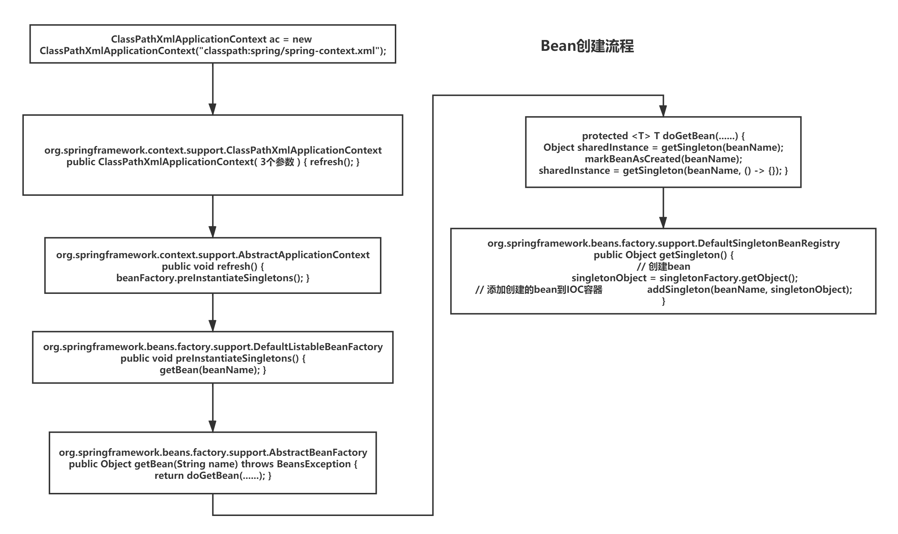
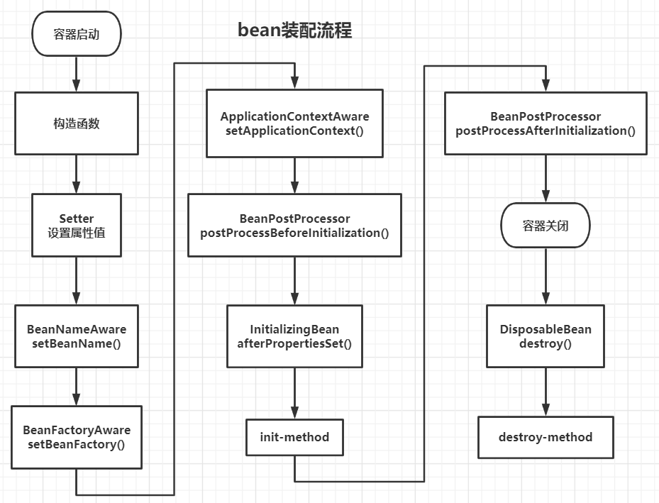

# Spring


## IOC

**IOC的底层实际上是很多个不同的 map，BeanFacroty 负责创建 bean，之后存到相应的 map 中，下次再需要某个 bean 时，直接从 map 中获取即可。**

例如，单例非懒加载的 bean 在第一次创建完成之后都存储在同一个类型为 CurrentHashMap 的 map 中交由 spring 管理，之后每次需要只要从 map 中获取即可。

默认加在 IOC 容器的组件，容器启动的时候就会调用无参构造器创建对象，再进行初始化赋值等操作。


### XML配置

#### context:annotation-config

**< context:annotation-config> 是用于激活那些已经在spring容器里注册过的bean上面的注解**。并且使用<context:annotation- config/>即隐式地向 Spring容器注册`AutowiredAnnotationBeanPostProcessor`、`RequiredAnnotationBeanPostProcessor`、`CommonAnnotationBeanPostProcessor`以及`PersistenceAnnotationBeanPostProcessor`、`ConfigurationClassPostProcessor`这5个BeanPostProcessor。注册这5个BeanPostProcessor的作用，就是**为了让你的系统能够识别相应的注解**（@Required、@Autowired、@PostConstruct,、@PreDestroy and @Resource）。BeanPostProcessor就是处理注解的处理器。

**< context:annotation-config >仅能够在已经在已经注册过的bean上面起作用。对于没有在spring容器中注册的bean，它并不能执行任何操作。** 


#### context:component-scan

**< context:annotation-config >的简化配置**

除了**具有< context:annotation-config >的功能**之外，< context:component-scan >还可以在指定的package下扫描以及注册java bean 。还**具有自动将带有@component，@service，@Repository等注解的对象注册到spring容器中的功能。**

**因此当使用 context:component-scan 后，就可以将 context:annotation-config移除。**


### 注解配置

**在配置类上标注@Configuration注解即可**

```java
/*
* 配置类 == 以前的xml配置
* */
//告诉spring这是一个配置类
@Configuration
/*配置包扫描 == component-scan
Filter[] includeFilters 扫描时只要扫描哪些被包含在内的组件
excludeFilters = Filter[] 扫描的时候要排除哪些注解组件，配置内容和xml文件一致
@ComponentScan(value = "com.demo.spring",excludeFilters = {
        @ComponentScan.Filter(type = FilterType.ANNOTATION,classes = {
                Controller.class, Service.class
        })
})*/
@ComponentScan(basePackages = "com.demo.spring")
public class MainConfig {
    
   /*
    * 给容器中注册组件：
    *   1）、包扫描+组件标注解【自己写的类】
    *   2）、@Bean【导入第三方包里的组件】
    *   3）、@Import【快速给容器中注册组件】
    *       1）、@Import({要导入到容器中的组件})；@Import({Color.class})容器中就会自动注册这个					组件，id默认是全类名
    *       2）、实现ImportSelector接口，返回需要导入的组件的全类名数组；
    *       3）、实现ImportBeanDefinitionRegistrar接口，手动注册bean
    *   4）、使用Spring提供的FactoryBean
    *       1）、默认获取到的是FactoryBean调用getObject创建的对像
    *               获取FactoryBean创建的bean对象
                    Object o = applicationContext.getBean("colorFactoryBean");
    *       2）、要获取FactoryBean本身需要给id前面加一个&colorFactoryBean
    */

    @Bean
    public ColorFactoryBean colorFactoryBean(){
        return new ColorFactoryBean();
    }
    
}
```


### Bean注册

1. **xml**

   ```java
   <bean id="person" class="com.demo.spring.entity.Person" scope="" init-method="" destroy-method="">
       <property name="" value="" />
   </bean>
   ```
   **特点**

   - IOC 会根据 xml 中 bean 配置的顺序创建 bean，bean 销毁的顺序和创建的顺序相反。

     可以通过调整bean之间的依赖来控制bean创建的顺序。

     > ```xml
     > depends-on="ccc,bbb"：表示aaa创建依赖ccc和bbb
     > 创建顺序为ccc  ->  bbb ->  aaa
     > <bean id="aaa" depends-on="ccc,bbb"></bean>
     > <bean id="bbb"></bean>
     > <bean id="ccc"></bean>
     > ```

   - 默认为单例，跟随着容器启动而创建并保存到IOC容器中。可以修改scope属性为单例或原型（多实例）。原型对象不随着容器的启动创建，直到获取对象的时候才会创建。任何时候获取到的单例对象都是同一个，任何时候获取多实例对象都会创建新对象。

   - bean的赋值

     - Setter设置

       ```xml
       <!-- property name="userDao" 其中的属性名由getter/setter方法决定，即去掉get/set后的属性名 -->
       <property name="userDao" ref="userDao" />
       <!--
           关于property标签的赋值
           设置null值
            <property name="register">
               <null></null>
           </property>
           为关联对象赋值
             ①引用
            <bean id="xxx" class="xxx">
               <property />...
               <property />...
            </bean>
           <property name="register" ref="xxx"></property>
             ②在property内嵌套bean标签赋值
             <property>
             内部bean的id只能用作标识不能被引用，不能根据此id通过getBean创建对象
               <bean id="xxx" />
             </property>
       
             级联赋值：为引用对象的属性赋值
             User中关联Car对象
             注意：级联赋值后原来的bean属性可能也会被修改
             <property name="car.name" value="xxx"></property>
       -->
       <!--关于bean的赋值
           为List<Object>赋值 ==》 为List赋值
           <property>
               <list>
                   <bean />
                   <ref />
               </list
           </property>
       
           为Map赋值
            <property>
               <map>
                   基本属性
                   <entry key="" value=""></entry>
                   对象
                   <entry key="">
                       <bean>
                           <property />
                       </bean>
                   </entry>
               </map>
           </property>
       
           为properties赋值
           <property>
               <props>
               也是key=value类型数据，k=v都是String
                   <prop key="" >value</prop>
               </props>
           </property>
       
       -->
       
       <!--
           通过继承实现bean配置信息可重用，与Java中的继承类似
           <bean id="parentId" class=""></bean>
           <bean id="childId" parent="parentId" class="此处class可以省略"></bean>
       -->
       
       <!--
           通过abstract创建一个模板（抽象）bean，不能通过getBean()获取实例，只能被继承
           与Java中的abstract类似
           <bean id="beanId" class="" abstract="true"></bean>
       -->
       ```

     - 构造函数设置

       ```xml
       <bean id="userService2" class="com.demo.spring.service.impl.UserServiceImpl2">
           <!--调用有参构造器创建对象并赋值
               若有多个参数则要用到多条<constructor-arg />标签
               同时在赋值的时候可以省略属性名（但是必须按照构造方法中参数的顺序赋值）
               若要赋值顺序不一致，则要将<constructor-arg />标签中index的值设为与构造方法中参数位置对应的数值
               除了index还可以设置type参数，对应类型的参数才会被赋值
           -->
           <!--通过构造方法注入userDao-->
           <constructor-arg name="userDao" ref="userDao" type="" index="" />
           <!--name的值需要和构造方法中形参名一致-->
           <constructor-arg name="isRegister" value="true" />
       </bean>
       ```
   
2. **使用注解**

   @Component、@Configuration或者@Bean

   ```java
   @Component
   public class Dog {
   
       public Dog() {
           System.out.println("Dog...Construct");
       }
   
       // JSR205引入，对象创建并赋值之后调用，相当于init-method
       @PostConstruct
       public void init(){
           System.out.println("Dog...init");
       }
   
       // JSR205引入，对象移除之前调用，相当于destroy-method
       @PreDestroy
       public void destroy(){
           System.out.println("Dog...destroy");
       }
   }
   ```

   

   ```java
   /**
    * @Description 生命周期配置类
    * @Author Gnl
    * @Time 2020/3/21 12:16
    */
   
   /*配置包扫描 == component-scan
   Filter[] includeFilters 扫描时只要扫描哪些被包含在内的组件
   excludeFilters = Filter[] 扫描的时候要排除哪些注解组件，配置内容和xml文件一致
   @ComponentScan(value = "com.demo.spring",excludeFilters = {
           @ComponentScan.Filter(type = FilterType.ANNOTATION,classes = {
                   Controller.class, Service.class
           })
   })*/
   @ComponentScans({
           @ComponentScan("com.demo.spring.bean"),
           @ComponentScan("com.demo.spring.utils")
   })
   //使用@PropertySource读取外部配置文件中的k-v保存到运行环境变量中；
   // 加载完外部配置文件后在pojo类中使用@Value("${k}")取值
   @PropertySource(value = {"classpath:person.properties"})
   //@Profile(value = {"dev"})  写在配置类上，只有指定环境的时候整个配置类中的配置才会生效
   // -Dspring.profiles.active=test
   @Configuration
   public class LifeCycleConfig {
   
       /*
       * bean的生命周期
       	创建 -- 初始化 -- 销毁
       * 1）、指定初始化和销毁方法 @Bean(initMethod = "",destroyMethod = "")
       		也可使用@PostConstruct和@PreDestroy，若两种方式都存在，只会执行一次初始化			  方法和销毁方法
       *   构造（对象创建）
       *       单实例：在容器启动的时候创建对象
       *       多实例：在每次获取实例的时候都重新创建对象
       *   初始化：
       *       对象创建完成，并赋值好，调用初始化方法。
       *   销毁：
       *       单例：容器关闭的时候销毁
       *       原型：容器不会管理这个原型bean，容器关闭的时候不会调用销毁方法
       *
       *  2）、通过让bean实现InitializingBean接口（实现初始化逻辑）
       *                 实现DisposableBean接口（实现销毁逻辑）
       *
       *  3）、可以使用JSR250
       *           @PostConstruct : 在bean完成创建并且属性赋值完成；来执行初始化方法。
       *           @PreDestroy：在容器销毁bean之前通知我们进行清理工作
       *
       *  4）、实现BeanPostProcessor : bean的后置处理器
       *           在bean初始化前后进行一些处理工作
       *           postProcessBeforeInitialization：在初始化工作之前
       *           postProcessAfterInitialization：在初始化工作之后
       使用InitializingBean和@PostConstruct和@PreDestroy需要修改代码，不适用与第三方引用	 	包
       * */
       /*
        * 标上Profile注解，只有在指定的环境下才注册比被标识的bean，
        *       默认环境为default
        * */
       @Profile(value = {"dev"})
       @Conditional({WinCondition.class})
       /*
       @Conditional()
           可以标在类上和方法上
           类上：满足当前条件，这个类中配置的所有bean注册才能生效
          方法上：满足当前条件，这个方法上的@Bean才生效
           按照条件给容器中注册bean
           value必须是实现了Condition的类
       */
       //给容器中注册一个bean；类型为返回值类型，id默认就是方法名
       //默认注册的组件为单例模式
       //@Lazy懒加载
       //@Scope("singleton")修改生命周期
       	//singleton : 跟随容器的启动创建
           //prototype： 不跟随容器的启动创建，获取的时候才创建,每次获取都创建一个新的对象
           //session： 同一个请求创建一个实例
           //request： 同一个session创建一个实例
       //@Bean(initMethod = "init",destroyMethod = "destroy")
       public Car car(){
           return new Car();
       }
   
   }
   ```

   ```java
   public class WinCondition implements Condition {
   
       /*
       * ConditionContext context 判断条件能使用的上下文
       * AnnotatedTypeMetadata：注释信息
       * */
   
       @Override
       public boolean matches(ConditionContext context, AnnotatedTypeMetadata metadata) {
           String osName = context.getEnvironment().getProperty("os.name");
           // 获取到bean定义的注册类
           BeanDefinitionRegistry registry = context.getRegistry();
           //可以判断容器中bean注册的情况，也可以给容器中注册bean
           boolean person = registry.containsBeanDefinition("person");
           // person为true即为已经注册
           if (osName.toLowerCase().contains("windows")){
               return true;
           }
           return false;
       }
   }
   ```

3. **@Import**，快速给容器中注册组件。

   **使用**

   1. 创建MyImportSelector类

      - 实现ImportSelectorXXX接口，返回需要导入的组件的全类名数组
      - 实现ImportBeanDefinitionRegistrar接口，手动注册bean

   2. @Import({要导入到容器中的组件})；

      @Import({Color.class})容器中就会自动注册这个组件，id默认是全类名

   ```java
   public class MyImportSelector implements ImportSelector {
   
       /*
        * @Description:  返回值就是要注册到容器中的组件的全类名
        * @Author: Gnl
        * @Time: 2020/3/20 19:40
        * @param AnnotationMetadata importingClassMetadata ： 当前标注@Import注解类的所有注解信息
        * @return: java.lang.String[]
        *
        */
       @Override
       public String[] selectImports(AnnotationMetadata importingClassMetadata) {
   //        MergedAnnotations annotations = importingClassMetadata.getAnnotations();
   //        for (MergedAnnotation<Annotation> annotation : annotations) {
   //            System.out.println(annotation);
   //        }
           String [] strings = {"com.demo.spring.bean.Green","com.demo.spring.bean.Red"};
           //方法不要返回null值，否则会空指针异常
           return strings;
       }
   }
   ```

   ```java
   public class MyImportBeanDefinitionRegistrar implements ImportBeanDefinitionRegistrar {
       
       /*
        * @Description
        * @Author: Gnl
        * @Time: 2020/3/20 19:41
        * @param importingClassMetadata 当前类的注解信息
        * @param registry ： BeanDefinition 注册类
        *      把所有需要添加到容器中的bean：
        *          调用BeanDefinitionRegistry.registerBeanDefinition手动注册进来
        * @return: void 
        *
        */
       @Override
       public void registerBeanDefinitions(AnnotationMetadata importingClassMetadata, BeanDefinitionRegistry registry) {
   
           boolean red = registry.containsBeanDefinition("com.demo.spring.bean.Red");
           boolean green = registry.containsBeanDefinition("com.demo.spring.bean.Green");
           // 若容器中已经注册了com.demo.spring.bean.Red和com.demo.spring.bean.Green，则手动注册一个id叫rainBow的bean
           if (red && green) {
               // 指定bean的信息；bean的类型
               RootBeanDefinition beanDefinition = new RootBeanDefinition(RainBow.class);
               // 指定bean名
               registry.registerBeanDefinition("rainBow",beanDefinition);
           }
       }
   }
   ```

4. **静态工厂**。工厂本身不用创建对象，通过调用工厂的静态方法，对象 = 工厂.工厂方法名。

   ```java
   public class StaticFactory {
       public static UserService createUserService() {
           UserDao userDao = new UserDaoImpl();
           UserServiceImpl userService = new UserServiceImpl();
           userService.setUserDao(userDao);
           return userService;
       }
   }
   ```

   ```xml
   <!--静态工厂
       class指定为静态工厂的全类名
       factory-method指定哪个方法是工厂方法
   -->
   <bean id="staticFactory" class="com.demo.spring.util.StaticFactory" factory-method="createUserService">
       <!--若factory-method中指定的方法需要传参，使用<constructor-arg />设置参数-->
   </bean>
   ```

5. **实例工厂**。工厂本身需要创建对象

   ```java
   public class InstanceFactory {
       public UserService createUserService(){
           UserDaoImpl userDao = new UserDaoImpl();
           UserServiceImpl userService = new UserServiceImpl();
           userService.setUserDao(userDao);
           return userService;
       }
   }
   ```

   ```xml
   <!--实例工厂-->
   <!--首先创建一个实例工厂的对象-->
   <bean id="instanceFactory" class="com.demo.spring.util.InstanceFactory"></bean>
   <!--
       配置要创建的对象使用哪个工厂创建
           factory-bean指定使用的工厂实例
           factory-method指定使用的工厂方法
   -->
   <bean id="factoryUserService" factory-bean="instanceFactory" factory-method="createUserService"></bean>
   ```

6. **FactoryBean**

   IOC 容器启动的时候不会创建实例，不管是单例还是原型模式都只是在使用的时候才创建

   - 默认获取到的是FactoryBean调用getObject创建的对像

     获取FactoryBean创建的bean对象

     ```java
     Object o = applicationContext.getBean("colorFactoryBean");
     ```
     
   - 要获取FactoryBean本身需要给id前面加一个"&"，即`&colorFactoryBean`
     
     ```java
     Object factoryBean = applicationContext.getBean("&colorFactoryBean");
     ```
     

   ```java
   public class MyFactoryBean implements FactoryBean {
   
       @Override
       public Object getObject() throws Exception {
           System.out.println("使用MyFactoryBean来创建Bean");
           UserServiceImpl userService = new UserServiceImpl();
           userService.setUserDao(new UserDaoImpl());
           return userService;
       }
   
       @Override
       public Class<?> getObjectType() {
           return UserService.class;
       }
   }
   ```

   ```xml
       <!--FactoryBean-->
       <!--默认单例
           IOC容器启动的时候不会创建实例
           不管是单例还是原型模式都只是在使用的时候才创建
       -->
       <bean id="myFactoryService" class="com.demo.spring.util.MyFactoryBean"></bean>
   ```

   


### Bean创建流程


**代码验证**

```java
ClassPathXmlApplicationContext ac = new ClassPathXmlApplicationContext("classpath:spring/spring-context.xml");

//**********************************************************************************

// org.springframework.context.support.ClassPathXmlApplicationContext.java
public ClassPathXmlApplicationContext(String configLocation) throws BeansException {
		this(new String[] {configLocation}, true, null);
	}

//**********************************************************************************
public ClassPathXmlApplicationContext(
    String[] configLocations, boolean refresh, @Nullable ApplicationContext parent)
    throws BeansException {

    super(parent);
    setConfigLocations(configLocations);
    if (refresh) {
        refresh();
    }
}

//**********************************************************************************

// org.springframework.context.support.AbstractApplicationContext.java
public void refresh() throws BeansException, IllegalStateException {
    // 此处同步锁保证多线程情况下 IOC 容器指只会被创建一次
    synchronized (this.startupShutdownMonitor) {
        // Prepare this context for refreshing.
        prepareRefresh();

        // 获取BeanFactory，spring解析xml文件，将xml文件中bean的配置信息保存起来
        // Tell the subclass to refresh the internal bean factory.
        ConfigurableListableBeanFactory beanFactory = obtainFreshBeanFactory();

        // 准备BeanFactory
        // Prepare the bean factory for use in this context.
        prepareBeanFactory(beanFactory);

        try {
            // Allows post-processing of the bean factory in context subclasses.
            postProcessBeanFactory(beanFactory);

            // 调用在上下文中注册为bean的工厂处理器
            // Invoke factory processors registered as beans in the context.
            invokeBeanFactoryPostProcessors(beanFactory);

            // 注册spring自家的BeanPostProcessor（Bean后置处理器）
            // Register bean processors that intercept bean creation.
            registerBeanPostProcessors(beanFactory);

            // 支持国际化功能
            // Initialize message source for this context.
            initMessageSource();

            // Initialize event multicaster for this context.
            initApplicationEventMulticaster();

            // 在特定上下文子类中初始化其他特殊bean
            // Initialize other special beans in specific context subclasses.
            onRefresh();

            // Check for listener beans and register them.
            registerListeners();

            // 完成beanFacroty的初始化
            // 初始化所有非懒加载的单实例bean
            // Instantiate all remaining (non-lazy-init) singletons.
            finishBeanFactoryInitialization(beanFactory);

            // Last step: publish corresponding event.
            finishRefresh();
        }

        catch (BeansException ex) {
            if (logger.isWarnEnabled()) {
                logger.warn("Exception encountered during context initialization - " +
                            "cancelling refresh attempt: " + ex);
            }

            // Destroy already created singletons to avoid dangling resources.
            destroyBeans();

            // Reset 'active' flag.
            cancelRefresh(ex);

            // Propagate exception to caller.
            throw ex;
        }

        finally {
            // Reset common introspection caches in Spring's core, since we
            // might not ever need metadata for singleton beans anymore...
            resetCommonCaches();
        }
    }
}

//**********************************************************************************

// org.springframework.context.support.AbstractApplicationContext.java
/**
 * 完成此上下文的bean工厂的初始化，初始化所有剩余的单例bean
 * Finish the initialization of this context's bean factory,
 * initializing all remaining singleton beans.
 */
protected void finishBeanFactoryInitialization(ConfigurableListableBeanFactory beanFactory) {
    // 为此上下文初始化转换服务
    // Initialize conversion service for this context.
    if (beanFactory.containsBean(CONVERSION_SERVICE_BEAN_NAME) &&
        beanFactory.isTypeMatch(CONVERSION_SERVICE_BEAN_NAME, ConversionService.class)) {
        beanFactory.setConversionService(
            beanFactory.getBean(CONVERSION_SERVICE_BEAN_NAME, ConversionService.class));
    }

    // 如果之前没有任何bean后处理器（例如PropertyPlaceholderConfigurer bean）之前进行过注册，	 // 请注册一个默认的嵌入式值解析器，主要用于注释属性值的解析。
    // Register a default embedded value resolver if no bean post-processor
    // (such as a PropertyPlaceholderConfigurer bean) registered any before:
    // at this point, primarily for resolution in annotation attribute values.
    if (!beanFactory.hasEmbeddedValueResolver()) {
        beanFactory.addEmbeddedValueResolver(strVal -> getEnvironment().resolvePlaceholders(strVal));
    }

    // 尽早初始化LoadTimeWeaverAware Bean，以便尽早注册其转换器。
    // Initialize LoadTimeWeaverAware beans early to allow for registering their transformers early.
    String[] weaverAwareNames = beanFactory.getBeanNamesForType(LoadTimeWeaverAware.class, false, false);
    for (String weaverAwareName : weaverAwareNames) {
        getBean(weaverAwareName);
    }

    // 停止使用临时ClassLoader进行类型匹配
    // Stop using the temporary ClassLoader for type matching.
    beanFactory.setTempClassLoader(null);

    // 冻结bean配置，不允许再对其进行修改
    // 允许缓存所有bean定义元数据，不希望有进一步的更改
    // Allow for caching all bean definition metadata, not expecting further changes.
    beanFactory.freezeConfiguration();

    // 初始化所有非懒加载的单实例bean
    // Instantiate all remaining (non-lazy-init) singletons.
    beanFactory.preInstantiateSingletons();
}

//**********************************************************************************

// org.springframework.beans.factory.support.DefaultListableBeanFactory.java
@Override
public void preInstantiateSingletons() throws BeansException {
    if (logger.isTraceEnabled()) {
        logger.trace("Pre-instantiating singletons in " + this);
    }

    // 遍历beanDefinitionNames拿到所有要创建的bean名
    // Iterate over a copy to allow for init methods which in turn register new bean definitions.
    // While this may not be part of the regular factory bootstrap, it does otherwise work fine.
    List<String> beanNames = new ArrayList<>(this.beanDefinitionNames);

    // 开始按照xml中配置的顺序初始化所有非懒加载的单实例bean
    // Trigger initialization of all non-lazy singleton beans...
    for (String beanName : beanNames) {
        // 根据bean的id获取xml中bean的定义信息
        RootBeanDefinition bd = getMergedLocalBeanDefinition(beanName);
        // 判断bean是否是抽象，非懒加载的单例bean
        if (!bd.isAbstract() && bd.isSingleton() && !bd.isLazyInit()) {
            // 判断是否是工厂bean
            if (isFactoryBean(beanName)) {
                Object bean = getBean(FACTORY_BEAN_PREFIX + beanName);
                if (bean instanceof FactoryBean) {
                    final FactoryBean<?> factory = (FactoryBean<?>) bean;
                    boolean isEagerInit;
                    if (System.getSecurityManager() != null && factory instanceof SmartFactoryBean) {
                        isEagerInit = AccessController.doPrivileged((PrivilegedAction<Boolean>)
                                                                    ((SmartFactoryBean<?>) factory)::isEagerInit,
                                                                    getAccessControlContext());
                    }
                    else {
                        isEagerInit = (factory instanceof SmartFactoryBean &&
                                       ((SmartFactoryBean<?>) factory).isEagerInit());
                    }
                    if (isEagerInit) {
                        getBean(beanName);
                    }
                }
            }
            else {
                // 获取bean
                getBean(beanName);
            }
        }
    }

    // Trigger post-initialization callback for all applicable beans...
    for (String beanName : beanNames) {
        Object singletonInstance = getSingleton(beanName);
        if (singletonInstance instanceof SmartInitializingSingleton) {
            final SmartInitializingSingleton smartSingleton = (SmartInitializingSingleton) singletonInstance;
            if (System.getSecurityManager() != null) {
                AccessController.doPrivileged((PrivilegedAction<Object>) () -> {
                    smartSingleton.afterSingletonsInstantiated();
                    return null;
                }, getAccessControlContext());
            }
            else {
                smartSingleton.afterSingletonsInstantiated();
            }
        }
    }
}

//**********************************************************************************

// org.springframework.beans.factory.support.AbstractBeanFactory.java
@Override
public Object getBean(String name) throws BeansException {
    // 所有的getBean()方法都是调用doGetBean()
    return doGetBean(name, null, null, false);
}

// org.springframework.beans.factory.support.AbstractBeanFactory.java
/**
 * 返回可以与指定bean共享或独立的实例
 * Return an instance, which may be shared or independent, of the specified bean.
 */
@SuppressWarnings("unchecked")
protected <T> T doGetBean(final String name, @Nullable final Class<T> requiredType,
                          @Nullable final Object[] args, boolean typeCheckOnly) throws BeansException {

    final String beanName = transformedBeanName(name);
    Object bean;

    // 先在注册过的单实例bean缓存中检查是否有已经手动注册过的单例bean
    // Eagerly check singleton cache for manually registered singletons.
    Object sharedInstance = getSingleton(beanName);
    if (sharedInstance != null && args == null) {
        if (logger.isTraceEnabled()) {
            if (isSingletonCurrentlyInCreation(beanName)) {
                logger.trace("Returning eagerly cached instance of singleton bean '" + beanName +
                             "' that is not fully initialized yet - a consequence of a circular reference");
            }
            else {
                logger.trace("Returning cached instance of singleton bean '" + beanName + "'");
            }
        }
        bean = getObjectForBeanInstance(sharedInstance, name, beanName, null);
    }

    else {
        // 如果已经在创建这个bean实例，则失败，抛出异常
        // Fail if we're already creating this bean instance:
        // We're assumably within a circular reference.
        if (isPrototypeCurrentlyInCreation(beanName)) {
            throw new BeanCurrentlyInCreationException(beanName);
        }

        // Check if bean definition exists in this factory.
        BeanFactory parentBeanFactory = getParentBeanFactory();
        if (parentBeanFactory != null && !containsBeanDefinition(beanName)) {
            // Not found -> check parent.
            String nameToLookup = originalBeanName(name);
            if (parentBeanFactory instanceof AbstractBeanFactory) {
                return ((AbstractBeanFactory) parentBeanFactory).doGetBean(
                    nameToLookup, requiredType, args, typeCheckOnly);
            }
            else if (args != null) {
                // Delegation to parent with explicit args.
                return (T) parentBeanFactory.getBean(nameToLookup, args);
            }
            else if (requiredType != null) {
                // No args -> delegate to standard getBean method.
                return parentBeanFactory.getBean(nameToLookup, requiredType);
            }
            else {
                return (T) parentBeanFactory.getBean(nameToLookup);
            }
        }

        if (!typeCheckOnly) {
            // 将bean标记为已创建，保证多线程下的单实例
            markBeanAsCreated(beanName);
        }

        try {
            final RootBeanDefinition mbd = getMergedLocalBeanDefinition(beanName);
            checkMergedBeanDefinition(mbd, beanName, args);

            // 确保当前bean依赖的bean的初始化
            // Guarantee initialization of beans that the current bean depends on.
            String[] dependsOn = mbd.getDependsOn();
            // 如果当前的bean依赖其他bean，则先初始化依赖的bean（depends-on属性）
            if (dependsOn != null) {
                for (String dep : dependsOn) {
                    // 判断当前的bean和所依赖的bean之间是否形成了循环依赖，是则报异常
                    if (isDependent(beanName, dep)) {
                        throw new BeanCreationException(mbd.getResourceDescription(), beanName,
                                                        "Circular depends-on relationship between '" + beanName + "' and '" + dep + "'");
                    }
                    registerDependentBean(dep, beanName);
                    try {
                        getBean(dep);
                    }
                    catch (NoSuchBeanDefinitionException ex) {
                        throw new BeanCreationException(mbd.getResourceDescription(), beanName,
                                                        "'" + beanName + "' depends on missing bean '" + dep + "'", ex);
                    }
                }
            }

            // 如果bean是单例的，则创建bean实例
            // Create bean instance.
            if (mbd.isSingleton()) {
                sharedInstance = getSingleton(beanName, () -> {
                    try {
                        return createBean(beanName, mbd, args);
                    }
                    catch (BeansException ex) {
                        // Explicitly remove instance from singleton cache: It might have been put there
                        // eagerly by the creation process, to allow for circular reference resolution.
                        // Also remove any beans that received a temporary reference to the bean.
                        destroySingleton(beanName);
                        throw ex;
                    }
                });
                bean = getObjectForBeanInstance(sharedInstance, name, beanName, mbd);
            }

            else if (mbd.isPrototype()) {
                // It's a prototype -> create a new instance.
                Object prototypeInstance = null;
                try {
                    beforePrototypeCreation(beanName);
                    prototypeInstance = createBean(beanName, mbd, args);
                }
                finally {
                    afterPrototypeCreation(beanName);
                }
                bean = getObjectForBeanInstance(prototypeInstance, name, beanName, mbd);
            }

            else {
                String scopeName = mbd.getScope();
                final Scope scope = this.scopes.get(scopeName);
                if (scope == null) {
                    throw new IllegalStateException("No Scope registered for scope name '" + scopeName + "'");
                }
                try {
                    Object scopedInstance = scope.get(beanName, () -> {
                        beforePrototypeCreation(beanName);
                        try {
                            return createBean(beanName, mbd, args);
                        }
                        finally {
                            afterPrototypeCreation(beanName);
                        }
                    });
                    bean = getObjectForBeanInstance(scopedInstance, name, beanName, mbd);
                }
                catch (IllegalStateException ex) {
                    throw new BeanCreationException(beanName,
                                                    "Scope '" + scopeName + "' is not active for the current thread; consider " +
                                                    "defining a scoped proxy for this bean if you intend to refer to it from a singleton",
                                                    ex);
                }
            }
        }
        catch (BeansException ex) {
            cleanupAfterBeanCreationFailure(beanName);
            throw ex;
        }
    }

    // Check if required type matches the type of the actual bean instance.
    if (requiredType != null && !requiredType.isInstance(bean)) {
        try {
            T convertedBean = getTypeConverter().convertIfNecessary(bean, requiredType);
            if (convertedBean == null) {
                throw new BeanNotOfRequiredTypeException(name, requiredType, bean.getClass());
            }
            return convertedBean;
        }
        catch (TypeMismatchException ex) {
            if (logger.isTraceEnabled()) {
                logger.trace("Failed to convert bean '" + name + "' to required type '" +
                             ClassUtils.getQualifiedName(requiredType) + "'", ex);
            }
            throw new BeanNotOfRequiredTypeException(name, requiredType, bean.getClass());
        }
    }
    return (T) bean;
}

//**********************************************************************************

// org.springframework.beans.factory.support.DefaultSingletonBeanRegistry
/**
 * 返回以给定名称注册的（原始）单例对象，如果尚未注册，则创建并注册一个新对象。
 * Return the (raw) singleton object registered under the given name,
 * creating and registering a new one if none registered yet.
 */
public Object getSingleton(String beanName, ObjectFactory<?> singletonFactory) {
    Assert.notNull(beanName, "Bean name must not be null");
    synchronized (this.singletonObjects) {
        // 将bean从singletonObjects中get出来
        // singletonObjects：IOC容器之一。仅用来保存单实例bean。
        // 用来缓存单例对象，将单例对象保存到一个map中，key==beanName，value==beanInstance
		// private final Map<String, Object> singletonObjects = new ConcurrentHashMap<>(256);
        Object singletonObject = this.singletonObjects.get(beanName);
        if (singletonObject == null) {
            if (this.singletonsCurrentlyInDestruction) {
                throw new BeanCreationNotAllowedException(beanName,
                                                          "Singleton bean creation not allowed while singletons of this factory are in destruction " +
                                                          "(Do not request a bean from a BeanFactory in a destroy method implementation!)");
            }
            if (logger.isDebugEnabled()) {
                logger.debug("Creating shared instance of singleton bean '" + beanName + "'");
            }
            beforeSingletonCreation(beanName);
            boolean newSingleton = false;
            boolean recordSuppressedExceptions = (this.suppressedExceptions == null);
            if (recordSuppressedExceptions) {
                this.suppressedExceptions = new LinkedHashSet<>();
            }
            try {
                // 创建bean
                singletonObject = singletonFactory.getObject();
                newSingleton = true;
            }
            catch (IllegalStateException ex) {
                // Has the singleton object implicitly appeared in the meantime ->
                // if yes, proceed with it since the exception indicates that state.
                singletonObject = this.singletonObjects.get(beanName);
                if (singletonObject == null) {
                    throw ex;
                }
            }
            catch (BeanCreationException ex) {
                if (recordSuppressedExceptions) {
                    for (Exception suppressedException : this.suppressedExceptions) {
                        ex.addRelatedCause(suppressedException);
                    }
                }
                throw ex;
            }
            finally {
                if (recordSuppressedExceptions) {
                    this.suppressedExceptions = null;
                }
                afterSingletonCreation(beanName);
            }
            if (newSingleton) {
                // 添加创建的bean
                addSingleton(beanName, singletonObject);
            }
        }
        return singletonObject;
    }
}

//**********************************************************************************

// org.springframework.beans.factory.support.DefaultSingletonBeanRegistry
/**
 * 将给定的单例对象添加到该工厂的单例缓存中
 * 即将创建好的单例bean添加到singletonObject这个map中，以后从容器中获取bean只要从这个map中获取即可。
 * Add the given singleton object to the singleton cache of this factory.
 * <p>To be called for eager registration of singletons.
 */
protected void addSingleton(String beanName, Object singletonObject) {
    synchronized (this.singletonObjects) {
        this.singletonObjects.put(beanName, singletonObject);
        this.singletonFactories.remove(beanName);
        this.earlySingletonObjects.remove(beanName);
        this.registeredSingletons.add(beanName);
    }
}
```




### Bean装配


#### 定义初始化和销毁逻辑


##### bean的初始化和销毁方法

```xml
<!-- xml配置 -->
<bean id="" class="" init-method="" destroy-method="" ></bean>
```

```java
@Bean(initMethod = "",destroyMethod = "")
或
@PostConstruct和@PreDestroy
```


##### InitializingBean&DisposableBean

```java
public class Person implements InitializingBean, DisposableBean {

    private String name;
    private int age;

    public Person() {
        System.out.println("person...NoArgsConstructor");
    }

    public void setAge(int age) {
        System.out.println("person...setAge");
        this.age = age;
    }

    @PostConstruct
    public void initMethod(){
        System.out.println("person...initMethod");
    }

    @PreDestroy
    public void destroyMethod(){
        System.out.println("person...destroyMethod");
    }

    @Override
    public void afterPropertiesSet() throws Exception {
        System.out.println("person...InitializingBean...afterPropertiesSet");
    }

    @Override
    public void destroy() throws Exception {
        System.out.println("person...DisposableBean...destroy");
    }
}
```


##### BeanPostProcessor

```java
/**
 * 为了了让Bean后置处理器工作，需要将它加入到容器中
 *
 * @author gnl
 * @since 2020-05-05 16:09
 */
 
@Component
public class MyBeanPostProcessor implements BeanPostProcessor {

    @Override
    public Object postProcessBeforeInitialization(Object bean, String beanName) throws BeansException {
        System.out.println(beanName+"...BeanPostProcessor...postProcessBeforeInitialization");
        return bean;
    }

    @Override
    public Object postProcessAfterInitialization(Object bean, String beanName) throws BeansException {
        System.out.println(beanName+"...BeanPostProcessor...postProcessAfterInitialization");
        return bean;
    }

}
```

**源码解析**

```java
populateBean(beanName, mbd, instanceWrapper); //设置当前bean属性值
protected void populateBean(){
    // ......
    
    if (!mbd.isSynthetic() && hasInstantiationAwareBeanPostProcessors()) {
			for (BeanPostProcessor bp : getBeanPostProcessors()) {
				if (bp instanceof InstantiationAwareBeanPostProcessor) {
					InstantiationAwareBeanPostProcessor ibp = (InstantiationAwareBeanPostProcessor) bp;
					if (!ibp.postProcessAfterInstantiation(bw.getWrappedInstance(), beanName)) {
						return;
					}
				}
			}
		}
    // ......
}

// 赋值完成后开始初始化
exposedObject = initializeBean(beanName, exposedObject, mbd);
protected Object initializeBean(){
    wrappedBean = applyBeanPostProcessorsBeforeInitialization(wrappedBean, beanName);
    invokeInitMethods(beanName, wrappedBean, mbd); // 执行初始化方法
    wrappedBean = applyBeanPostProcessorsAfterInitialization(wrappedBean, beanName);
}

public Object applyBeanPostProcessorsBeforeInitialization(Object existingBean, String beanName)
    throws BeansException {

    Object result = existingBean;
    // 循环遍历得到容器中所有的bean后置处理器，挨个执行postProcessBeforeInitialization
    for (BeanPostProcessor processor : getBeanPostProcessors()) {
        Object current = processor.postProcessBeforeInitialization(result, beanName);
        // 一旦返回null，跳出循环，后面的bean后置处理器都不会执行
        if (current == null) {
            return result;
        }
        result = current;
    }
    return result;
}

public Object applyBeanPostProcessorsAfterInitialization(Object existingBean, String beanName)
    throws BeansException {

    Object result = existingBean;
    // 循环遍历得到容器中所有的bean后置处理器，挨个执行postProcessAfterInitialization
    for (BeanPostProcessor processor : getBeanPostProcessors()) {
        Object current = processor.postProcessAfterInitialization(result, beanName);
        if (current == null) {
            return result;
        }
        result = current;
    }
    return result;
}
```


#### 装配流程

**代码验证**

spring-context.xml

```xml
<?xml version="1.0" encoding="UTF-8"?>
<beans xmlns="http://www.springframework.org/schema/beans"
       xmlns:xsi="http://www.w3.org/2001/XMLSchema-instance"
       xmlns:context="http://www.springframework.org/schema/context"
       xsi:schemaLocation="http://www.springframework.org/schema/beans http://www.springframework.org/schema/beans/spring-beans.xsd http://www.springframework.org/schema/context https://www.springframework.org/schema/context/spring-context.xsd">

    <context:component-scan base-package="com.demo.spring" />

    <bean id="person" class="com.demo.spring.entity.Person" init-method="initMethod" destroy-method="destroyMethod">
        <property name="name" value="z3" />
        <property name="age" value="20" />
    </bean>

    <bean id="postProcessor" class="com.demo.spring.util.MyBeanPostProcessor"></bean>

<!--    <bean id="myFactoryBean" class="com.demo.spring.util.MyFactoryBean" ></bean>-->

</beans>
```

com.demo.spring.entity.Person.java

```java
package com.demo.spring.entity;

import lombok.AllArgsConstructor;
import lombok.Data;
import lombok.experimental.Accessors;
import org.springframework.beans.BeansException;
import org.springframework.beans.factory.*;
import org.springframework.context.ApplicationContext;
import org.springframework.context.ApplicationContextAware;

/**
 * TODO
 *
 * @author gnl
 * @since 2020-05-04 18:57
 */

@Data
@AllArgsConstructor
@Accessors
public class Person implements BeanNameAware, BeanFactoryAware, ApplicationContextAware, InitializingBean, DisposableBean {

    private String name;
    private int age;

    public Person() {
        System.out.println("person...NoArgsConstructor");
    }

    public void setAge(int age) {
        System.out.println("person...setAge");
        this.age = age;
    }

    /**
     * 设置bean在ioc容器中的名字
     * @author gnl
     * @param name 即为xml中配置的id的值，若使用注解的方式注入，默认即为@Bean的方法名
     * @return void
     */
    @Override
    public void setBeanName(String name) {
        System.out.println("person...BeanNameAware...setBeanName..."+name);
    }

    @Override
    public void setBeanFactory(BeanFactory beanFactory) throws BeansException {
        System.out.println("person...BeanFactoryAware...setBeanFactory..."+beanFactory);
    }

    @Override
    public void setApplicationContext(ApplicationContext applicationContext) throws BeansException {
        System.out.println("person...ApplicationContextAware...setApplicationContext..."+applicationContext);
    }

    public void initMethod(){
        System.out.println("person...initMethod");
    }

    public void destroyMethod(){
        System.out.println("person...destroyMethod");
    }

    @Override
    public void afterPropertiesSet() throws Exception {
        System.out.println("person...InitializingBean...afterPropertiesSet");
    }

    @Override
    public void destroy() throws Exception {
        System.out.println("person...DisposableBean...destroy");
    }
}
```

MyBeanPostProcessor.java

```java
package com.demo.spring.util;

import org.springframework.beans.BeansException;
import org.springframework.beans.factory.config.BeanPostProcessor;

/**
 * 为了了让Bean后置处理器工作，需要将它加入到容器中
 *
 * @author gnl
 * @since 2020-05-05 16:09
 */

public class MyBeanPostProcessor implements BeanPostProcessor {

    @Override
    public Object postProcessBeforeInitialization(Object bean, String beanName) throws BeansException {
        System.out.println(beanName+"...BeanPostProcessor...postProcessBeforeInitialization");
        return bean;
    }

    @Override
    public Object postProcessAfterInitialization(Object bean, String beanName) throws BeansException {
        System.out.println(beanName+"...BeanPostProcessor...postProcessAfterInitialization");
        return bean;
    }

}
```

MainApplication.java

```java
package com.demo.spring;

import com.demo.spring.entity.Person;
import org.springframework.context.support.ClassPathXmlApplicationContext;

/**
 * TODO
 *
 * @author gnl
 * @since 2020-05-04 20:04
 */

public class MainApplication {
    public static void main(String[] args) {

        ClassPathXmlApplicationContext ac = new ClassPathXmlApplicationContext("classpath:spring/spring-context.xml");
        System.out.println("ac..getBean");
        Person person = ac.getBean(Person.class);
        System.out.println("================================================");
        System.out.println(person);

        System.out.println("================================================");
        System.out.println("ac...关闭");
        ac.close();
    }
}
```

**输出结果**

bean为单例时

```powershell
person...NoArgsConstructor
person...setAge
person...BeanNameAware...setBeanName...person
person...BeanFactoryAware...setBeanFactory
person...ApplicationContextAware...setApplicationContext
person...BeanPostProcessor...postProcessBeforeInitialization
person...InitializingBean...afterPropertiesSet
person...initMethod
person...BeanPostProcessor...postProcessAfterInitialization
ac..getBean
================================================
Person(name=z3, age=20)
================================================
ac...关闭
person...DisposableBean...destroy
person...destroyMethod
```

若bean为单例懒加载或原型

```powershell
ac..getBean
person...NoArgsConstructor
person...setAge
person...BeanNameAware...setBeanName...person
person...BeanFactoryAware...setBeanFactory
person...ApplicationContextAware...setApplicationContext
person...BeanPostProcessor...postProcessBeforeInitialization
person...InitializingBean...afterPropertiesSet
person...initMethod
person...BeanPostProcessor...postProcessAfterInitialization
================================================
Person(name=z3, age=20)
================================================
ac...关闭
person...DisposableBean...destroy
person...destroyMethod
```


**容器启动**

1. **构造方法**

2. **设置属性值**

3. 如果实现了BeanNameAware接口，调用**setBeanName**设置Bean的ID或者Name

4. 如果实现BeanFactoryAware接口，调用**setBeanFactory** 设置BeanFactory

5. 如果实现ApplicationContextAware，调用**setApplicationContext**，为组件注入IOC容器

6. 调用BeanPostProcessor的postProcess**BeforeInitialization**方法，在任何初始化方法之前调用

7. 调用InitializingBean的**afterPropertiesSet()**方法，定义初始化逻辑

8. 调用定制**init-method**方法

 9. 调用BeanPostProcessor的postProcess**AfterInitialization**方法，在任何初始化方法之后调用

**容器关闭**

  10. 调用DisposableBean的**destroy()**，定义销毁逻辑
 11. 调用定制的**destroy-method**方法





## DI

依赖注入


**@Autowired 自动装配**，Spring 会到容器中找到这个属性对应的组件，自动为属性赋值。

可以标在构造函数，方法，参数，属性上，都是从IOC容器中获取相应的组件值注入。

> @Resource 的作用相当于 @Autowired，只不过 @Autowired 按 byType 自动注入，而 @Resource 默认按  byName 自动注入罢了

```java
@Autowired
private BookService bookService;
    1）、先按照类型去容器中找相应组件, 
		bookService = applicationContext.getBean(BookService.class);
    2)、没找到则抛异常
    3）、找到多个？
        按照变量名作为id继续匹配，
		bookService = applicationContext.getBean("bookService",BookService.class);
        可以使用@Qualifier修改id

@Autowired、@Resource、@Inject这三个注解都能实现自动注入
	@Autowired：最强大，Spring自己的注解
	@Resource：j2ee、Java的标准、扩展性强
	@Inject：EJB
            
    // 方法上有@Autowired的话
    /*
     * 1）、spring容器创建当前对象的时候就会调用方法，完成赋值。
     * 2）、这个方法上的每一个参数都会从ioc中获取并自动注入
     * 3）、方法自动装配顺序与上面一致
     */
    @Autowired
    public void ha(BookDao bookDao){
        System.out.println(bookDao);
    }

	// 标在造器方法上，构造方法中需要用的组件都会从容器中获取。
	// 如果类中只有一个有参构造器，@Autowired可以省略，参数位置的组件还是可以从容器中获取。
	@Autowired
	public Person(Car car) {
        this.car = car;
        System.out.println(car);
    }
```


**自定义组件使用Spring底层组件**，例如`ApplicationContextAware`，`BeanFactory`

自定义组件只需要实现`XXXAware`接口，在创建对象的时候，会调用接口规定的方法注入相关组件。

把spring底层的组件注入到自定义的bean中。

`XXXAware`底层的实现都是`XXXProcessor`：`ApplicationContextAware` => `ApplicationContextAwareProcessor`

```java
@Data
@Accessors
@Component
public class User implements ApplicationContextAware, BeanNameAware, EmbeddedValueResolverAware {

    private String name;
    private int age;

    private ApplicationContext applicationContext;

    public User() {
        System.out.println("user...NoArgsConstructor");
    }

    public User(String name, int age) {
        this.name = name;
        this.age = age;
        System.out.println("user...AllArgsConstructor");
    }

    @PostConstruct
    public void init(){
        System.out.println("user...init-method");
    }

    @PreDestroy
    public void destroy(){
        System.out.println("user...destroy-method");
    }

    @Override
    public void setApplicationContext(ApplicationContext applicationContext) throws BeansException {
        this.applicationContext = applicationContext;
        System.out.println("user...applicationContext: " + applicationContext);
    }

    @Override
    public void setBeanName(String name) {
        System.out.println("user...beanName: "+ name);
    }

    @Override
    public void setEmbeddedValueResolver(StringValueResolver resolver) {
        String value = resolver.resolveStringValue("${os.name}...#{20*10}");
        System.out.println("字符串解析的值: "+value);
    }
}
```


## AOP


**SpringAOP实现**

常见的有：**SpringAOP、AspectJ**


### 注解配置结合aop

spring-context.xml

```xml

<!-- 配置和注解结合版aop -->
<!-- 开启aop基于注解的功能 -->
<aop:aspectj-autoproxy></aop:aspectj-autoproxy>


<!-- ========================================================================== -->

配置和注解对比
注解：快速方便
配置：功能完善
应用场景：重要的用配置，不重要的用注解
```


#### 基于xml配置aop

```xml
<!-- 基于xml配置的aop -->
<aop:config>

    <!-- <aop:aspect ref="logUtils">相当于@Aspect -->
    <aop:aspect ref="logUtils">

        <aop:pointcut id="myPointCut" expression="execution(* com.demo.spring.utils.*.*(..))"/>

        <aop:before method="logStart" pointcut-ref="myPointCut" />

        <aop:after-returning method="logReturn" pointcut-ref="myPointCut" returning="result" />

        <aop:after-throwing method="logException" pointcut-ref="myPointCut" throwing="e" />
    </aop:aspect>

</aop:config>

<aop:config>

    <aop:pointcut id="myPointCut" expression="execution(* com.demo.spring.service.impl.*.*(..))"/>

    <aop:aspect ref="aopLog" order="2">

        <aop:before method="logBefore" pointcut-ref="myPointCut" />

        <aop:after method="logAfter" pointcut-ref="myPointCut" />

    </aop:aspect>

    <!-- order调整优先级，数值越小优先级越高 -->
    <aop:aspect ref="aopLog" order="1">

        <aop:before method="logBefore2" pointcut-ref="myPointCut" />

        <aop:after method="logAfter2" pointcut-ref="myPointCut" />

    </aop:aspect>

</aop:config>
```


aop类

```java
/*
* 1、将此方法加入到ioc容器中
* 2、告诉spring这是一个切面类
* 3、告诉spring这个类中的方法何时何地运行
*       使用注解：5个通知注解
*               Before              前置通知
*               AfterReturning      返回通知
*               AfterThrowing       异常通知
*               After               后置通知
*               Around              环绕通知（最强大）
*   普通通知方法的执行顺序
*       前置--后置--正常返回
*       前置--后置--异常返回
*   环绕通知执行顺序
*       前置--正常返回--后置
*       前置--异常返回--后置
*
* 若同时存在环绕通知和普通通知
*   环绕前置--普通前置--环绕正常/异常返回--环绕后置--普通后置--普通正常返回
* 若有多个切面通知同时作用，默认按照通知所在类的类名首字母排序执行，先执行后结束，后执行先结束。
* 若想改变切面通知的执行顺序可以使用@Order(数值，数值越大优先级越高)
* 4、加入切入点表达式
* 5、xml中开启基于注解的aop功能
*
* Spring对通知方法的要求不严格，可以是任意修饰符，任意返回值的。
*  唯一要求是通知方法的参数不能乱写
	通知方法是Spring利用反射调用的，每次方法调用得确定这个方法的参数表的值。
* */

// 告诉spring这是一个切面类
@Aspect
@Component
public class LogUtils {

    /*
    * 切入点表达式写法
    *   固定格式：execution(访问权限符 返回值类型 方法全类名(参数表))
    *   通配符
    *       * ：
    *           1、匹配一个或多个字符
    *                   ("execution(public int com.demo.spring.caclculator.My*.*(int,int))")
    *           2、匹配任意一个参数
    *                   ("execution(public int com.demo.spring.caclculator.MyCalculatorImpl.*(int,*))")
    *           3、只能匹配一层路径
    *                   ("execution(public int com.demo.spring.*.MyCalculatorImpl.*(int,*))")
    *                   只能扫描spring下一层中的包
    *           4、权限修饰符不能用*来代替，可以省略不写则代表任意权限修饰符
    *       .. ：
    *           1、匹配任意多个参数
    *                   ("execution(public int com.demo.spring.caclculator.MyCalculatorImpl.*(..))")
    *
    *
    * */

    /*
     * 在通知方法运行时拿到运行方法的详细信息
     *       JoinPoint joinPoint
     **/

    @Pointcut("execution(* com.demo.spring.caclculator.MyCalculatorImpl.*(int,int))")
    public void MyPointCut(){}


    // 要给出切入点表达式
    /*
     * MyPointCut() 抽取可重用切面表达式
     **/
    @Before("MyPointCut()")
    public static void logStart(JoinPoint joinPoint){
        //获取方法参数
        Object[] args = joinPoint.getArgs();
        System.out.println(Arrays.asList(args));
        //获取方法签名（方法名）
        Signature signature = joinPoint.getSignature();
        System.out.println(signature.getName());
        System.out.println("start...");
    }

    // 目标方法正常返回之后运行
    /*
    * returning = "result"
    * 告诉spring，result用来接收返回值
    * execution(public int com.demo.spring.caclculator.MyCalculatorImpl.*(int,int)) 只对有两个参数且类型为int的方法起作用
    * double result 只能接收 double 类型的返回值
    * */
    @AfterReturning(value = "execution(public int com.demo.spring.caclculator.MyCalculatorImpl.*(int,int))",returning = "result")
    public static void logReturn(JoinPoint joinPoint,Object result){
        System.out.println("return..."+result);
    }

    // 目标方法抛出异常之后运行
    /*
    * throwing = "e" 告诉spring用参数e来接收异常
    * Exception e 指定通知方法可以接收哪种异常
    *   NullPointException e 只能接空指针异常，若出现其他异常不会调用此方法
    * */
    @AfterThrowing(value = "execution(public int com.demo.spring.caclculator.MyCalculatorImpl.*(int,int))",throwing = "e")
    public static void logException(JoinPoint joinPoint,Exception e){
        System.out.println("exception..."+e);
    }

    @After("execution(public int com.demo.spring.caclculator.MyCalculatorImpl.*(int,int))")
    public static void logEnd(){
        System.out.println("end...");
    }

    /*
    * 环绕通知
    * 环绕只影响当前切面
    * */
    @Around("MyPointCut()")
    public Object myAround(ProceedingJoinPoint proceedingJoinPoint){
        System.out.println("...===around===...");
        Object[] args = proceedingJoinPoint.getArgs();
        Object retVal = null;
        try {
            // 就是利用反射调用目标方法，相当于method.invoke(obj,args)
            System.out.println("around...before"+Arrays.asList(args));
            retVal = proceedingJoinPoint.proceed(args);
            System.out.println("around...afterReturn..."+retVal);
        } catch (Throwable throwable) {
            throwable.printStackTrace();
            System.out.println("around...exception");
        } finally {
            System.out.println("around...after");
        }
        System.out.println("...===around===...");
        return retVal;
    }
}
```


#### 纯注解驱动aop

配置类

```java
// 开启基于注解的aop模式
@EnableAspectJAutoProxy
@ComponentScan("com.demo.spring")
@Configuration
public class MainConfig {
}
```

切面类

```java
@Aspect
@Component
public class LogAop {

    @Pointcut("execution(* com.demo.spring.util.*.*(..))")
    public void myPointCut(){}

    @Before(value = "myPointCut()")
    public void logBefore(){
        System.out.println("LogAop...logBefore");
    }

    @After(value = "myPointCut()")
    public void logAfter(){
        System.out.println("LogAop...logAfter");
    }

}
```

被切面类

```java
// 必须要加入容器中
@Component
public class Calculator {

    public int add(int x, int y){
        return x+y;
    }

}
```


### SpringAOP原理

看给容器中注册了什么组件，这个组件什么时候工作，有什么功能

`@EnableAspectJAutoProxy`是什么？

```java
// 给容器中导入AspectJAutoProxyRegistrar
@Import(AspectJAutoProxyRegistrar.class)
public @interface EnableAspectJAutoProxy {
	boolean proxyTargetClass() default false;

	boolean exposeProxy() default false;

}

// 利用AspectJAutoProxyRegistrar自定义给容器中注册bean
class AspectJAutoProxyRegistrar implements ImportBeanDefinitionRegistrar {}

// 给容器中注册一个AnnotationAwareAspectJAutoProxyCreator
```


### 代理机制

**SpringAOP使用两种代理机制**

1. JDK动态代理。在目标类有接口的情况下使用。
2. CGLib动态代理。在目标类无接口的情况下使用。


### 切面织入方法

1. **编译器**织入，**静态织入**，即编译出来的`class`文件字节码就已经被织入了。

2. **类装载期**织入

3. **动态代理**织入，在运行期间为目标类增强生成子类的方式，SpringAOP采用。

   **动态织入又分为动静两种**

   1. 静则是织入过程只在第一次调用target时执行
   2. 动则指每次调用target都执行。


### SpringAOP和AspectJ的区别

1. 能力不同

   - Spring AOP 旨在提供一个跨 Spring IOC 的简单 AOP 实现，它不打算成为一个完整的AOP解决方案。**SpringAOP只能应用于由Spring容器管理的bean。**
   - AspectJ 是原始的AOP技术，目的是提供完整的AOP解决方案。它相对与SpringAOP来说更健壮，也比SpringAOP复杂得多。**AspectJ可以应用在所有的pojo对象。**

2. 织入时期不同

   - SpringAOP采用的是动态织入、运行时织入
   - AspectJ采用的是静态织入。加载时织入，即编译出来的class文件字节码就已经被织入了。

3. 应用场景

   - **框架**：如果应用程序没有使用 Spring 框架，那么我们就别无选择, 只能放弃使用 spring AOP 的想法, 因为它无法管理任何超出 spring 容器范围的东西。但是, 如果我们的应用程序是完全使用 spring 框架创建的, 那么我们可以使用 spring AOP, 因为它是简单的学习和应用
   - **灵活性**：由于有限的 joinpoint 支持, Spring aop 不是一个完整的 aop 解决方案, 但它解决了程序员面临的最常见的问题。尽管如果我们想深入挖掘和开发 AOP 以达到其最大能力, 并希望得到广泛的可用 joinpoints 的支持, 那么最好选择 AspectJ
   - **性能**： 如果我们使用的是有限的切面, 那么就会有细微的性能差异。但有时, 应用程序有成千上万个切面的情况。我们不想在这样的情况下使用运行时编织, 所以最好选择 AspectJ。AspectJ 已知的速度比 Spring AOP 快8到35倍
   - **两者的最佳之处**： 这两个框架都是完全兼容的。我们总是可以利用 Spring AOP； 只要有可能, 仍然可以在不支持前者的地方使用 AspectJ 获得支持

4. 总结

   | SpringAOP                                                    | AspectJ                                                      |
   | ------------------------------------------------------------ | ------------------------------------------------------------ |
   | 在纯 Java 中实现                                             | 使用 Java 编程语言的扩展实现                                 |
   | 不需要单独的编译过程                                         | 除非设置 LTW，否则需要 AspectJ 编译器 (ajc)                  |
   | 只能使用运行时织入                                           | 运行时织入不可用。支持编译时、编译后和加载时织入             |
   | 功能不强-仅支持方法级编织                                    | 更强大 - 可以编织字段、方法、构造函数、静态初始值设定项、最终类/方法等 |
   | 只能在由 Spring 容器管理的 bean 上实现                       | 可以在所有域对象上实现                                       |
   | 仅支持方法执行切入点                                         | 支持所有切入点                                               |
   | 代理是由目标对象创建的, 并且切面应用在这些代理上             | 在执行应用程序之前 (在运行时) 前, 各方面直接在代码中进行织入 |
   | 编译时织入比运行时织入快得多。Spring AOP 是基于代理的框架, 因此在应用程序启动时会创建代理。另外, 每个方面还有一些方法调用, 这会对性能产生负面影响 | AspectJ 在应用程序执行之前将这些方面编织到主代码中, 因此没有额外的运行时开销, 与 Spring AOP 不同。基于这些原因, 基准表明 AspectJ 的速度几乎比 Spring AOP 快8到35倍 |
   | 易于学习和应用                                               | 相对于 Spring AOP 来说更复杂                                 |

   