# SpringCloud


[SpringCloud 和 SpringBoot 版本对应查询](https://start.spring.io/actuator/info)


<br>

## 项目初始化

### 创建项目

1、创建父工程，父工程仅含有一个 `pom.xml` 文件

2、父工程添加依赖，注意 Spring Boot 和 Spring Cloud 的版本对应关系

```xml
  <!--
    dependencyManagement 一般用在父工程，用于锁定版本，并且若是子模块需要相同的依赖，子模块中不需要再标明 version 和 groupId
    dependencyManagement 只是声明依赖，并不引入实现，子项目需要显式引入需要的依赖
  -->
<dependencyManagement>
    <dependencies>
        <dependency>
            <groupId>org.springframework.boot</groupId>
            <artifactId>spring-boot-dependencies</artifactId>
            <version>2.3.10.RELEASE</version>
            <type>pom</type>
            <scope>import</scope>
        </dependency>

        <dependency>
            <groupId>org.springframework.cloud</groupId>
            <artifactId>spring-cloud-dependencies</artifactId>
            <version>Hoxton.SR11</version>
            <type>pom</type>
            <scope>import</scope>
        </dependency>

        <dependency>
            <groupId>com.alibaba.cloud</groupId>
            <artifactId>spring-cloud-alibaba-dependencies</artifactId>
            <version>2.1.0.RELEASE</version>
            <type>pom</type>
            <scope>import</scope>
        </dependency>

    </dependencies>
</dependencyManagement>

<reporting>
    <plugins>
        <plugin>
            <!-- 热部署支持 -->
            <groupId>org.springframework.boot</groupId>
            <artifactId>spring-boot-maven-plugin</artifactId>
            <configuration>
                <fork>true</fork>
                <addResources>true</addResources>
            </configuration>
        </plugin>
    </plugins>
</reporting>
```

3、添加子模块，在子模块内编写业务代码

4、开启热部署

1. Compiler 勾选 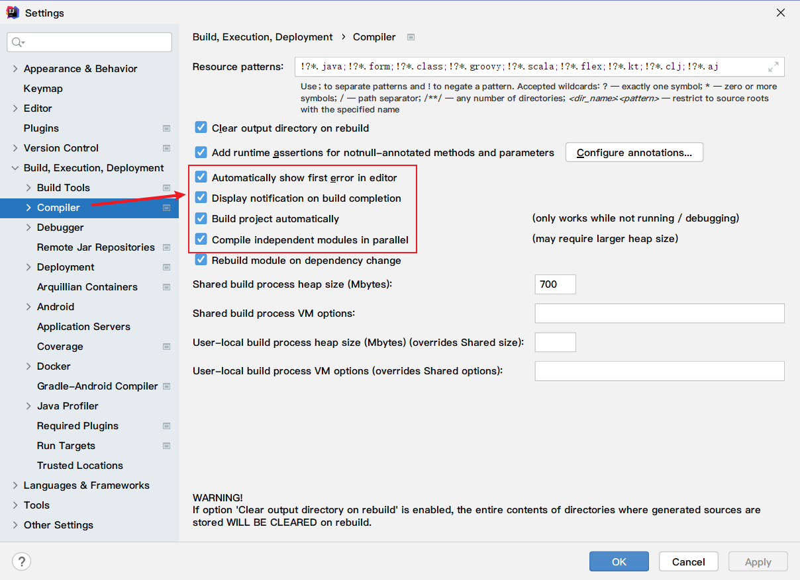
2. `ctrl+shift+alt+/`，打开 `Registry`，勾选 `compiler.automake.allow.when.app.running` 和 `actionSystem.assertFocusAccessFromEdt`
3. 重启Idea


5、抽取各个模块中的公共部分，建立公共模块 `commons-api`，创建完成之后执行 `mvn clean && install` 安装到 maven 仓库，其他模块再引入即可


8、其他微服务模块入驻注册中心

```xml
<!-- pom.xml 注意 eureka 版本和 spring boot 版本对应 -->
<dependency>
    <groupId>org.springframework.cloud</groupId>
    <artifactId>spring-cloud-starter-netflix-eureka-client</artifactId>
</dependency>
```

```yml
# application.yml
eureka:
  instance:
    # eureka 中 status 栏显示的实例名称
    instance-id: payment8001
    # 显示每个服务的 ip 地址
    prefer-ip-address: true
    # 向注册中心发送心跳的时间间隔，单位是s，默认是30s
    lease-renewal-interval-in-seconds: 1
    # eureka 服务端在收到最后一次心跳后等待的时间上限，单位s，默认90s，超时就将该服务剔除
    lease-expiration-duration-in-seconds: 2
  client:
    register-with-eureka: true
    fetch-registry: true
    service-url:
      defaultZone: http://localhost:7001/eureka
```

```java
// Payment.java

// @EnableEurekaClient 开启 eureka 客户端
@EnableEurekaClient
@MapperScan(value = {"com.demo.cloud.dao"})
@SpringBootApplication
public class Payment {
    public static void main(String[] args) {
        SpringApplication.run(Payment8001.class, args);
    }
}
```

9、开启服务发现

```java
// @EnableDiscoveryClient 开启服务发现
@EnableDiscoveryClient
@EnableEurekaClient
@MapperScan(value = {"com.demo.cloud.dao"})
@SpringBootApplication
public class Payment8001 {
    public static void main(String[] args) {
        SpringApplication.run(Payment8001.class, args);
    }
}
```

10、服务调用

```java
@Configuration
public class OrderConfig {

    // 利用 RestTemplate 进行服务调用
    @LoadBalanced
    @Bean
    public RestTemplate restTemplate() {
        return new RestTemplate();
    }

}
```

```java
public class OrderController {

    // 通过 RestTemplate 调用 payment 服务
    // private static final String PAYMENT_URL = "http://localhost:8001";

    /**
     * 将服务注册到注册中心之后，将调用改成服务在注册中心注册的名字
     * 若是有多个微服务注册同一个名称，则需要在 restTemplate 上添加 @LoadBalance 注解
     */
    private static final String PAYMENT_URL = "http://CLOUD-PAYMENT-SERVICE";

    @Autowired
    private RestTemplate restTemplate;

    @GetMapping("/create")
    public CommonResult<Payment> create(Payment payment) {

        return restTemplate.postForObject(PAYMENT_URL + "/api/payment/create", payment, CommonResult.class);

    }
```

```java
@GetMapping("/get/{id}")
public CommonResult<Payment> get(@PathVariable(value = "id") Long id) {
    /**
     * getForObject 返回对象为响应体中数据转为对象，基本上可以理解为 json
     * getForEntity 返回对象为 ResponseEntity 对象，包含响应头，状态码，响应体等
     */
    return restTemplate.getForObject(PAYMENT_URL + "/api/payment/get/" + id, CommonResult.class);
}

@GetMapping("/get/entity/{id}")
public CommonResult<Payment> getEntity(@PathVariable(value = "id") Long id) {

    ResponseEntity<CommonResult> entity = restTemplate.getForEntity(PAYMENT_URL + "/api/payment/get/" + id, CommonResult.class);

    if (entity.getStatusCode().is2xxSuccessful()) {
        return entity.getBody();
    } else {
        return new CommonResult<>(404, "操作失败");
    }
}
```

11、修改各个服务的 actuator 信息

<br>

## 注册中心

<br>

### Eureka

> 目前推荐使用 Nacos 或者 Consul

#### Eureka 集群

> 集群最小实例数推荐至少 3 个，此处只开两个服务做演示


**修改系统 `hosts` 文件**

```
127.0.0.1 eureka7001.com
127.0.0.1 eureka7002.com
127.0.0.1 eureka7003.com
```


<br>

**创建注册中心**

**启动类**

```java
// @EnableEurekaServer 开启 eureka 服务
@EnableEurekaServer
@SpringBootApplication
public class EurekaServer {
    public static void main(String[] args) {
        SpringApplication.run(Eureka7001.class, args);
    }
}
```

**禁用 eureka 自我保护**

```yml
eureka:
  instance:
    # 当前 eureka 服务的实例名
    hostname: eureka7001.com
  server:
    # 禁用 eureka 自我保护模式
    enable-self-preservation: false
    # 探测心跳间隔时间 2s，默认 90s
    eviction-interval-timer-in-ms: 2000
```

**配置文件**

1. eureka7001
   
   ```yaml
   server:
     port: 7001
   
   spring:
     application:
       name: cloud-eureka-server7001
   
   eureka:
     instance:
       # 当前eureka 服务的实例名
       hostname: eureka7001.com
     client:
       # 是否向eureka 注册当前服务
       register-with-eureka: false
       # 是否从eureka 上拉取其他服务的信息
       fetch-registry: false
       service-url:
         # eureka 服务交互地址
         defaultZone: http://eureka7002.com:7002/eureka/
   ```

2. eureka7002
   
   ```yml
   server:
     port: 7002
   
   spring:
     application:
       name: cloud-eureka-server7002
   
   eureka:
     instance:
       # 当前eureka 服务的实例名
       hostname: eureka7002.com
     client:
       # 是否向eureka 注册当前服务
       register-with-eureka: false
       # 是否从eureka 上拉取其他服务的信息
       fetch-registry: false
       service-url:
         # eureka 集群相互注册，相互守望
         defaultZone: http://eureka7001.com:7001/eureka/
   ```


**启动注册中心**

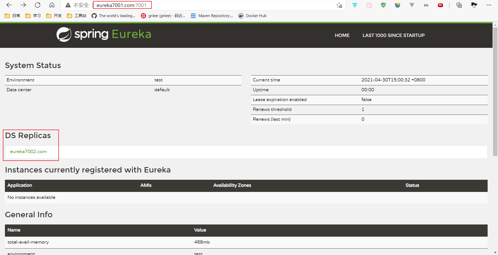

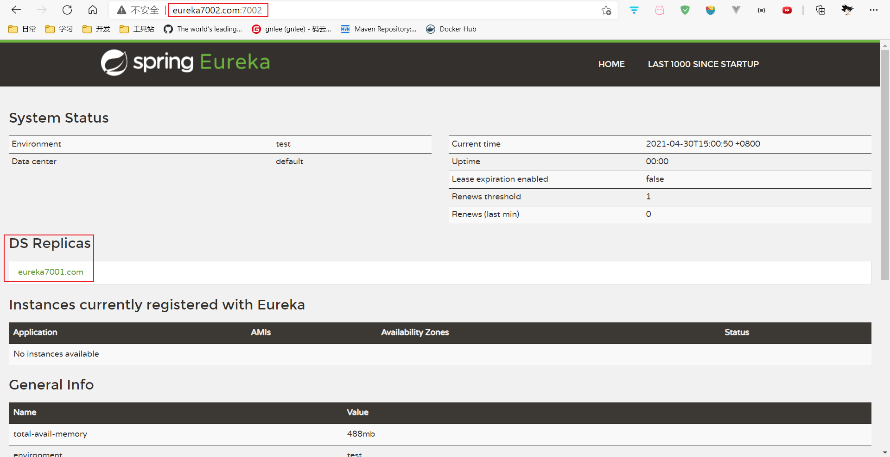


**服务模块配置**

```yml
eureka:
  client:
    register-with-eureka: true
    fetch-registry: true
    service-url:
      # 配置注册中心集群
      defaultZone: http://eureka7001.com:7001/eureka,http://eureka7002.com:7002/eureka
```


<br>

#### 服务集群

```java

```

**接口提供方**

```yml
# application.yml

server:
  port: XXX

spring:
  application:
    name: cloud-payment-service

eureka:
  client:
    register-with-eureka: true
    fetch-registry: true
    service-url:
      defaultZone: http://eureka7001.com:7001/eureka,http://eureka7002.com:7002/eureka
```

**接口调用方**

```yml
# application.yml
eureka:
  client:
    register-with-eureka: true
    fetch-registry: true
    service-url:
      defaultZone: http://eureka7001.com:7001/eureka,http://eureka7002.com:7002/eureka
```

```java
// XXXController.java
/**
 * 将服务注册到注册中心之后，将调用改成服务在注册中心注册的名字
 * 需要注意的是，若是有多个微服务注册同一个名称，则需要在restTemplate上添加@LoadBalance 注解
 */
private static final String PAYMENT_URL = "http://CLOUD-PAYMENT-SERVICE";
```

```java
// XXXConfig.java
@Configuration
public class OrderConfig {
    @LoadBalanced
    @Bean
    public RestTemplate restTemplate() {
        return new RestTemplate();
    }
}
```


<br>

### Zookeeper

> 目前推荐使用 Nacos 或者 Consul

**Zookeeper 命令行操作**

```shell
zkServer.sh start
zkServer.sh status
zkServer.sh stop

zkCli.sh

ls /
create /node value
get /node
set /node updateValue
```

**创建微服务**

```xml
<!-- 整合 zookeeper 客户端 -->
<dependency>
    <groupId>org.springframework.cloud</groupId>
    <artifactId>spring-cloud-starter-zookeeper-discovery</artifactId>
</dependency>
```

```yml
server:
  port: 8004

spring:
  application:
    name: cloud-payment-service
  cloud:
    zookeeper:
      connect-string: localhost:2181
```

```java
// @EnableDiscoveryClient 开启服务发现客户端
@EnableDiscoveryClient
@SpringBootApplication
public class Payment8004 {
    public static void main(String[] args) {
        SpringApplication.run(Payment8004.class, args);
    }
}
```

启动微服务，注册到 zookeeper

查看 zookeeper 节点，创建的是临时节点，若是超过时间无心跳，就会将节点删除

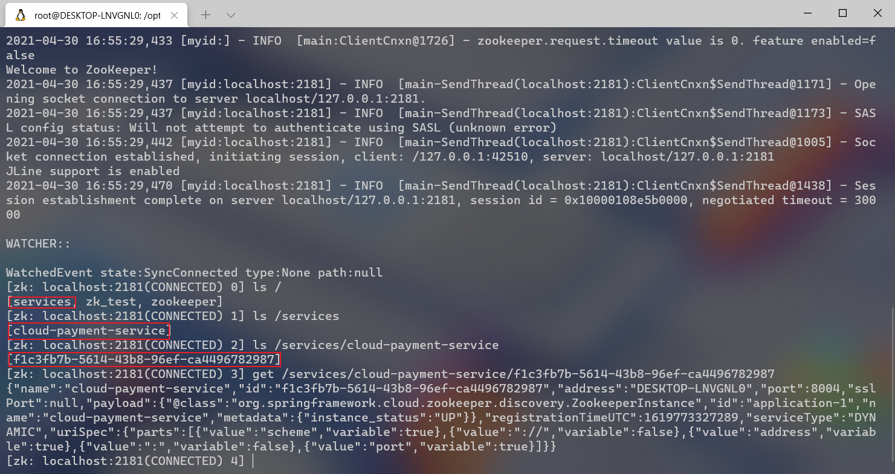

创建服务调用者

```xml
<!-- 整合zookeeper客户端 -->
<dependency>
    <groupId>org.springframework.cloud</groupId>
    <artifactId>spring-cloud-starter-zookeeper-discovery</artifactId>
</dependency>
```

```yml
server:
  port: 80

spring:
  application:
    name: cloud-order-service
  cloud:
    zookeeper:
      connect-string: localhost:2181
```

```java
@CrossOrigin
@RequestMapping("/api/consumer/order")
@RestController
@Slf4j
public class OrderController {

    private static final String PAYMENT_URL = "http://cloud-payment-service";

    @Autowired
    private RestTemplate restTemplate;

    @GetMapping("/zk")
    public String create() {
        return restTemplate.getForObject(PAYMENT_URL + "/api/payment/zk/", String.class);
    }

}
```

```java
@EnableDiscoveryClient
@SpringBootApplication
public class Order80ZK {
    public static void main(String[] args) {
        SpringApplication.run(Order80ZK.class, args);
    }
}
```


<br>

### Consul


[Consul Downloads](https://www.consul.io/downloads)


**Consol 与 Nacos 对比**

详见 Nacos 部分内容


#### 注册中心 

1. 启动consul
   
   ```shell
   consul agent -dev
   ```

2. 打开 Web 界面，`http://localhost:8500`
   
   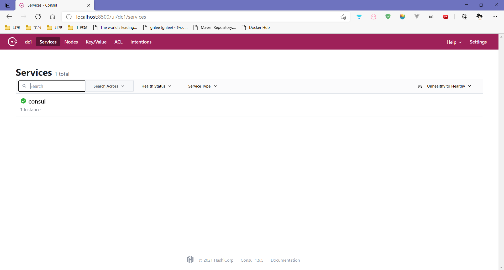

3. 父工程
   
   ```xml
   <properties>
       <maven.compiler.source>8</maven.compiler.source>
       <maven.compiler.target>8</maven.compiler.target>
   
       <spring.boot.version>2.2.8.RELEASE</spring.boot.version>
       <spring.cloud.version>Hoxton.SR12</spring.cloud.version>
       <spring.cloud.openfeign.version>2.2.8.RELEASE</spring.cloud.openfeign.version>
       <junit.version>4.13.2</junit.version>
       <lombok.version>1.18.22</lombok.version>
   </properties>
   
   <dependencyManagement>
       <dependencies>
           <dependency>
               <groupId>org.springframework.boot</groupId>
               <artifactId>spring-boot-dependencies</artifactId>
               <version>${spring.boot.version}</version>
               <type>pom</type>
               <scope>import</scope>
           </dependency>
   
           <dependency>
               <groupId>org.springframework.cloud</groupId>
               <artifactId>spring-cloud-dependencies</artifactId>
               <version>${spring.cloud.version}</version>
               <type>pom</type>
               <scope>import</scope>
           </dependency>
   
           <dependency>
               <groupId>org.springframework.cloud</groupId>
               <artifactId>spring-cloud-openfeign-dependencies</artifactId>
               <version>${spring.cloud.openfeign.version}</version>
           </dependency>
   
           <dependency>
               <groupId>junit</groupId>
               <artifactId>junit</artifactId>
               <version>${junit.version}</version>
           </dependency>
   
           <dependency>
               <groupId>org.projectlombok</groupId>
               <artifactId>lombok</artifactId>
               <version>${lombok.version}</version>
               <optional>true</optional>
           </dependency>
       </dependencies>
   </dependencyManagement>
   ```
   
3. 服务提供者
   
   ```xml
   <dependencies>
       <dependency>
           <groupId>org.springframework.boot</groupId>
           <artifactId>spring-boot-starter-actuator</artifactId>
       </dependency>
       <dependency>
           <groupId>org.springframework.boot</groupId>
           <artifactId>spring-boot-starter-web</artifactId>
       </dependency>
   
       <dependency>
           <groupId>com.fasterxml.jackson.core</groupId>
           <artifactId>jackson-core</artifactId>
       </dependency>
       <dependency>
           <groupId>com.fasterxml.jackson.core</groupId>
           <artifactId>jackson-databind</artifactId>
       </dependency>
   
   	<!-- 整合 consul -->    
       <dependency>
           <groupId>org.springframework.cloud</groupId>
           <artifactId>spring-cloud-starter-consul-discovery</artifactId>
       </dependency>
   </dependencies>
   ```
   
   ```yml
   server:
     port: 8006
   
   spring:
     application:
       name: cloud-payment-service
     cloud:
       consul:
         # 注册中心地址
         host: localhost
         port: 8500
         discovery:
           # 注册的服务名
           service-name: ${spring.application.name}
   ```
   
   ```java
   @EnableDiscoveryClient
   @SpringBootApplication
   public class Payment8006 {
       public static void main(String[] args) {
           SpringApplication.run(Payment8006.class, args);
       }
   }
   ```
   
4. 启动服务
   
   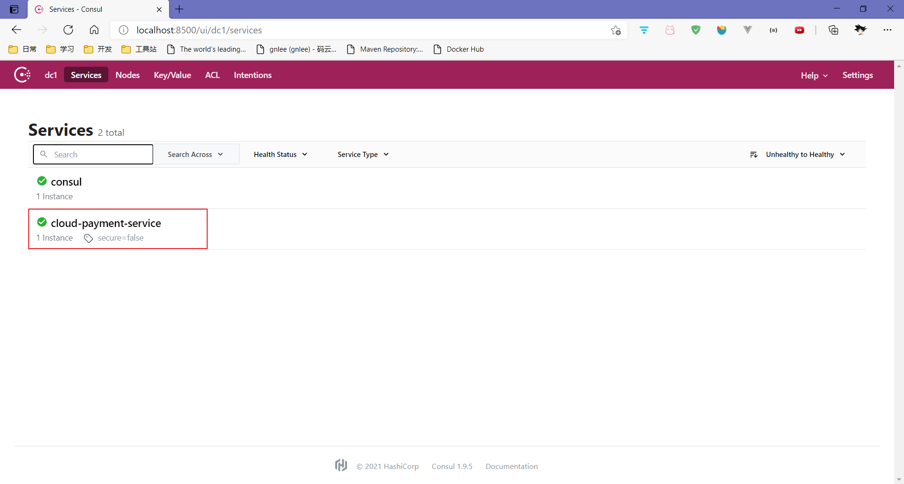

5. 服务调用者
   
   ```xml
   <dependencies>
       <dependency>
           <groupId>org.springframework.boot</groupId>
           <artifactId>spring-boot-starter-actuator</artifactId>
       </dependency>
   
       <dependency>
           <groupId>org.springframework.boot</groupId>
           <artifactId>spring-boot-starter-web</artifactId>
       </dependency>
   
       <dependency>
           <groupId>com.fasterxml.jackson.core</groupId>
           <artifactId>jackson-core</artifactId>
       </dependency>
   
       <dependency>
           <groupId>com.fasterxml.jackson.core</groupId>
           <artifactId>jackson-databind</artifactId>
       </dependency>
   
       <dependency>
           <groupId>org.springframework.cloud</groupId>
           <artifactId>spring-cloud-starter-consul-discovery</artifactId>
       </dependency>
       
   </dependencies>
   ```
   
   ```yml
   server:
     port: 80
   
   spring:
     application:
       name: cloud-order-service
     cloud:
       consul:
         host: localhost
         port: 8500
         discovery:
           service-name: ${spring.application.name}
   ```
   
   ```java
   @Configuration
   public class MainConfig {
       // 注意不要忘了加 @LoadBalanced 注解
       @LoadBalanced
       @Bean
       public RestTemplate restTemplate() {
           return new RestTemplate();
       }
   }
   
   @RequestMapping("/api/consumer/order")
   @RestController
   public class OrderController {
   
       private static final String PAYMENT_URL = "http://cloud-payment-service";
   
       @Autowired
       private RestTemplate restTemplate;
   
       @GetMapping("/consul")
       public String create() {
           return restTemplate.getForObject(PAYMENT_URL + "/api/payment/consul/", String.class);
       }
   }
   ```

<br>

#### 配置中心

1、引入依赖

```xml
<dependency>
    <groupId>org.springframework.cloud</groupId>
    <artifactId>spring-cloud-starter-consul-discovery</artifactId>
</dependency>

<!-- consul config 依赖-->
<dependency>
    <groupId>org.springframework.cloud</groupId>
    <artifactId>spring-cloud-starter-consul-config</artifactId>
</dependency>
```

2、配置文件 `bootstrap.yml`

```yaml
server:
  port: 3344

spring:
  application:
    name: consul-config-client
  profiles:
    active: dev
  cloud:
    consul:
      host: localhost
      port: 8500
      discovery:
        service-name: ${spring.application.name}
      config:
        enabled: true # 开启配置中心
        prefix: config # 设置配置文件所在目录位置
        profile-separator: ':' # 设置配置文件命名分隔符
        format: yaml # 设置配置文件格式
        data-key: data # 设置存储在consul中的key的名字（由于consul是k-v存储，配置存储在对应的k-v中）

```

3、创建配置文件

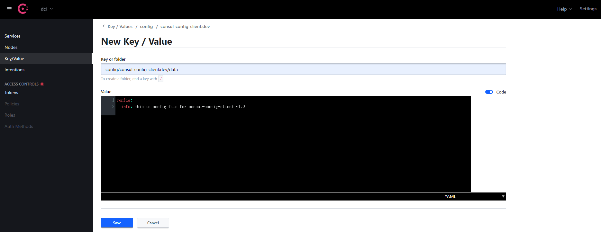

4、代码

```java
// MainApplication
@EnableDiscoveryClient
@SpringBootApplication
public class Config3344MainApp {
    public static void main(String[] args) {
        SpringApplication.run(Config3344MainApp.class, args);
    }
}

// Controller
@RefreshScope
@RestController
@RequestMapping("/config")
public class ConfigController {

    @Value("${config.info}")
    private String configInfo;

    @GetMapping("/info")
    public String getConfigInfo() {
        return configInfo;
    }

}
```


<br>

## Ribbon 负载均衡


> Nginx 属于服务外部负载均衡，Ribbon 属于服务内负载均衡。Ribbon 已进入维护期

**配置**

导入依赖

```xml
<dependency>
    <groupId>org.springframework.cloud</groupId>
    <artifactId>spring-cloud-starter-netflix-ribbon</artifactId>
</dependency>
```

若是导入了eureka-client，会自动导入ribbon，无需再次导入

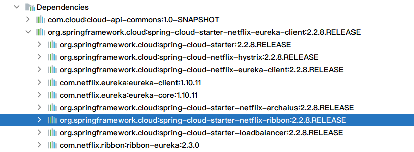

**自定义负载均衡算法**

> 默认负载均衡算法是轮询算法

```java
package com.demo.ribbon;

import com.netflix.loadbalancer.IRule;
import com.netflix.loadbalancer.RandomRule;
import org.springframework.context.annotation.Bean;
import org.springframework.context.annotation.Configuration;

/**
 * CustomRule 自定义Ribbon负载均衡算法
 * 需要注意的是，此类所在的包 不能处于 标注有@SpringBootApplication或@ComponentScan 类 所在的包及子包 下
 *
 * @author gnl
 */

@Configuration
public class CustomRule {

    @Bean
    public IRule myRule() {

        // 修改负载均衡算法为随机
        return new RandomRule();

    }

}
```

```java
// @RibbonClient 开启Ribbon客户端
// name 负载均衡调用的服务名
// configuration 自定义的负载均衡策略配置
@RibbonClient(name = "CLOUD-PAYMENT-SERVICE", configuration = {CustomRule.class})
@EnableEurekaClient
@SpringBootApplication
public class Order80 {
    public static void main(String[] args) {
        SpringApplication.run(Order80.class, args);
    }
}
```

<br>

## Spring Cloud Commons

>Spring Cloud Commons 可以看成是一个将 Spring Cloud 通用接口抽象出来的模块，外部实现可以实现相应的接口，来完成不同的功能。
>
>比如说 Circuit Breaker 模块，Spring Cloud 定义好其抽象接口后暴露出去，由外部模块自定义实现。如果需要使用 Circuit Breaker 功能，可以使用其不同实现如 Resilience4J/Spring Retry 等。 
>
>再比如 LoadBalance 模块，除了使用 sprin-cloud-starter-loadbalance 之外，还可以在客户端/消费者端实现自定义的负载均衡算法。

### SpringCloud LoadBalance

> [spring-cloud-commons#loadnalance](https://docs.spring.io/spring-cloud-commons/docs/current/reference/html/#spring-cloud-loadbalancer)

### Spring Cloud Circuit Breaker

> [spring-cloud-commons#circuit-breaker](https://docs.spring.io/spring-cloud-commons/docs/current/reference/html/#spring-cloud-circuit-breaker)


<br>

## OpenFeign 服务调用


### API 服务

**依赖**

```xml
<dependency>
    <groupId>org.springframework.cloud</groupId>
    <artifactId>spring-cloud-starter-openfeign</artifactId>
</dependency>
```

**接口定义**

```java
// value/url 要和注册在 nacos 上的服务名大小写一致
@FeignClient(value = "nacos-openfeign-provider", path = "/provider")
public interface ProviderClient {
    @GetMapping("/test")
    String test();

    @GetMapping("/ret/{param}")
    Return ret(@PathVariable("param") String param);
}
```

<br>

### 服务提供者

**依赖**

```xml
<dependency>
    <groupId>org.springframework.cloud</groupId>
    <artifactId>spring-cloud-starter-openfeign</artifactId>
</dependency>

<dependency>
    <groupId>com.demo</groupId>
    <artifactId>nacos-openfeign-api</artifactId>
    <version>1.0-SNAPSHOT</version>
</dependency>
```

**启动类**

```java
@EnableFeignClients
@EnableDiscoveryClient
@SpringBootApplication
public class FeignProvider8001 {
    public static void main(String[] args) {
        SpringApplication.run(FeignProvider8001.class, args);
    }
}
```

**Controller 实现**

```java
@RestController
@RequestMapping("/provider")
public class ProviderController {
    @GetMapping("/test")
    String test() {
        return "provider test";
    }

    @GetMapping("/ret/{param}")
    Return ret(@PathVariable String param) {
        return new Return().setData(param);
    }
}
```

<br>

### 服务消费者

**依赖**

```xml
<dependency>
    <groupId>org.springframework.cloud</groupId>
    <artifactId>spring-cloud-starter-openfeign</artifactId>
</dependency>
<!-- 消费者端 open-feign 和 loadbalance 应该总是成对出现 -->
<dependency>
    <groupId>org.springframework.cloud</groupId>
    <artifactId>spring-cloud-starter-loadbalancer</artifactId>
</dependency>

<dependency>
    <groupId>com.demo</groupId>
    <artifactId>nacos-openfeign-api</artifactId>
    <version>1.0-SNAPSHOT</version>
</dependency>
```

**配置**

```yml
# 设置 Feign 接口调用的超时时间
ribbon:
  # 建立连接所需要的时间，单位 ms
  ReadTimeout: 5000
  # 请求超时时间，单位ms，默认 1s
  ConnectTimeout: 5000
```

**启动类**

```java
@EnableFeignClients
@EnableDiscoveryClient
@SpringBootApplication
public class FeignConsumer9001 {
    public static void main(String[] args) {
        SpringApplication.run(FeignConsumer9001.class, args);
    }
}
```

**Controller 实现**

```java
@RestController
@RequestMapping("/consumer")
public class ConsumerController {

    @Resource
    private ProviderClient providerClient;

    @GetMapping("/test")
    public String test() {
        return providerClient.test();
    }

    @GetMapping("/ret/{param}")
    public Return ret(@PathVariable String param) {
        return providerClient.ret(param);
    }

}
```


<br>

**Feign 日志增强**

配置文件

```yml
logging:
  level:
    # feign日志以什么级别，监控哪个接口
    com.demo.cloud.service.PaymentFeignService: debug
```

配置类

```java
// 设置feign接口调用输出的日志级别

@Configuration
public class FeignConfig {
    @Bean
    Logger.Level feignLoggerLevel() {
        return Logger.Level.FULL;
    }
}
```

日志输出

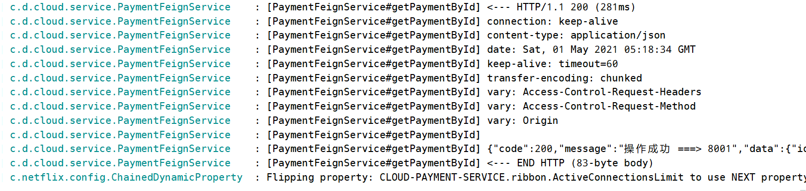

<br>

### Feign 和 Dubbo

* **协议支持方面**

  Dubbo 基于 RPC（Remote Produce Call）远程过程调用，类似的还有 RMI（Remote Methods Invoke）远程方法调用。自定义数据格式，基于 TCP 通信，速度快，效率高。

  Feign 基于 HTTP REST，基于 TCP，规定了数据传输的格式，缺点是消息封装臃肿。

  RPC 和 HTTP 底层通讯都是基于 socket（套接字），都可以实现远程调用，都可以实现服务调用服务

* 整体上看，dubbo 整体框架涉及的内容很多，从服务治理，接口调用到流量控制等，基本上可以看做另一个 Spring Cloud 框架。open-feign 则更轻量，更多的只专注在 http 远程调用。


<br>

## Hystrix 服务容错

> 已进入维护期

### 服务降级

> 某个方法出错后，进行服务降级，处理错误信息

**服务提供方**

1. 导入依赖
   
   ```xml
   <dependency>
       <groupId>org.springframework.cloud</groupId>
       <artifactId>spring-cloud-starter-netflix-hystrix</artifactId>
   </dependency>
   ```

2. 给需要进行降级处理的方法添加注解
   
   ```java
   // fallbackMethod 出错后调用的方法
   @HystrixCommand(fallbackMethod = "accessTimeoutHandler", commandProperties = {
       @HystrixProperty(name = "execution.isolation.thread.timeoutInMilliseconds", value = "2000")
   })
   @Override
   public String accessTimeout(Long id) {
   
       int i = 10/0;
   
       return Thread.currentThread().getName() +"\t" + "accessTimeout ===> " + id;
   }
   
   // 异常方法修饰符、返回值、参数都和正常方法一致
   public String accessTimeoutHandler(Long id) {
   
       return Thread.currentThread().getName() +"\t" + "accessTimeoutHandler 出错啦 ===> " + id;
   
   }
   ```

3. 主启动类添加注解
   
   ```java
   // @EnableCircuitBreaker 开启服务降级/熔断
   @EnableCircuitBreaker
   @EnableDiscoveryClient
   @EnableEurekaClient
   @SpringBootApplication
   public class Payment8001Hystrix {
       public static void main(String[] args) {
           SpringApplication.run(Payment8001Hystrix.class, args);
       }
   }
   ```

**服务调用方**

1. 导入依赖
   
   ```xml
   <dependency>
       <groupId>org.springframework.cloud</groupId>
       <artifactId>spring-cloud-starter-netflix-hystrix</artifactId>
   </dependency>
   <dependency>
       <groupId>org.springframework.cloud</groupId>
       <artifactId>spring-cloud-starter-openfeign</artifactId>
   </dependency>
   ```

2. 修改配置文件
   
   ```yml
   feign:
     # 开启hystrix
     hystrix:
       enabled: true
   ```

3. 给需要处理的方法添加注解
   
   ```java
   // OrderController.java
   
   @HystrixCommand(fallbackMethod = "accessTimeoutHandler", commandProperties = {
       @HystrixProperty(name = "execution.isolation.thread.timeoutInMilliseconds", value = "1500")
   })
   @GetMapping("/timeout/{id}")
   public String accessTimeout(@PathVariable(value = "id") Long id) {
       return feignService.accessTimeout(id);
   }
   
   public String accessTimeoutHandler(Long id) {
       return Thread.currentThread().getName() +"\t" + "order-hystrix-80-accessTimeoutHandler 出错啦";
   }
   ```

4. 主启动类添加注解
   
   ```java
   // @EnableHystrix 开启Hystrix
   
   @EnableHystrix
   @EnableFeignClients
   @EnableEurekaClient
   @SpringBootApplication
   public class Order80Hystrix {
       public static void main(String[] args) {
           SpringApplication.run(Order80Hystrix.class, args);
       }
   }
   ```

**配置Hystrix全局异常处理**

服务提供方

```java
@DefaultProperties(defaultFallback = "paymentGlobalFallbackHandler")
@Service
public class PaymentServiceImpl implements PaymentService {

    /**
     * @HystrixCommand 没有特别指明使用哪个方法处理异常，就会使用统一的异常处理方法
     *
     * @author gnl
     */
    @HystrixCommand
    @Override
    public String accessOK(Long id) {
        return Thread.currentThread().getName() +"\t" + "accessOK ===> " + id;
    }

    public String paymentGlobalFallbackHandler() {
        return "出错咯，这里是全局服务降级方法 paymentGlobalFallbackHandler";
    }
```

服务调用方

```yml
feign:
  # 开启hystrix
  hystrix:
    enabled: true
```

```java
// fallback 指定用来处理需要服务降级的方法
@FeignClient(value = "CLOUD-PAYMENT-SERVICE", fallback = PaymentFallbackService.class)
@RequestMapping("/api/payment")
@Service
public interface PaymentFeignService {

    /**
     * getPaymentById
     *
     * @param id
     * @return com.demo.cloud.entity.CommonResult<com.demo.cloud.entity.Payment>
     * @author gnl
     */
    @GetMapping("/get/{id}")
    CommonResult<Payment> getPaymentById(@PathVariable(value = "id") Long id);

    /**
     * feignTimeoutTest
     *
     * @return java.lang.String
     * @author gnl
     */
    @GetMapping("/timeout")
    String feignTimeout();

    @GetMapping("/ok/{id}")
    String accessOK(Long id);

    @GetMapping("/timeout/{id}")
    String accessTimeout(Long id);
}
```

```java
@Component
public class PaymentFallbackService implements PaymentFeignService {

    @Override
    public CommonResult<Payment> getPaymentById(Long id) {
        return new CommonResult<>(404, "失败咯，这里是全局服务降级类");
    }

    @Override
    public String feignTimeout() {
        return "失败咯，这里是全局服务降级类";
    }

    @Override
    public String accessOK(Long id) {
        return "失败咯，这里是全局服务降级类";
    }

    @Override
    public String accessTimeout(Long id) {
        return "失败咯，这里是全局服务降级类";
    }
}
```

### 服务熔断

> 发送错误的请求到达一定量之后开启服务熔断，服务熔断期间就算是发送正确的请求，也会返回失败信息，直到经过熔断窗口期指定的时间后，服务才开始恢复正常，能正常访问

### 服务限流

> Sentinel实现

### 服务监控

**监控端**

1. 导入依赖
   
   ```xml
   <dependency>
       <groupId>org.springframework.cloud</groupId>
       <artifactId>spring-cloud-starter-netflix-hystrix-dashboard</artifactId>
   </dependency>
   ```

2. 主启动类
   
   ```java
   @EnableHystrixDashboard
   @SpringBootApplication
   public class Dashboard9001 {
       public static void main(String[] args) {
           SpringApplication.run(Dashboard9001.class, args);
       }
   }
   ```

3. 浏览器访问`http://localhost:port/hystrix`

4. 输入监控地址`http://localhost:port/hystrix.stream`

**被监控服务**

1. 导入依赖
   
   ```xml
   <dependency>
       <groupId>org.springframework.cloud</groupId>
       <artifactId>spring-cloud-starter-netflix-hystrix</artifactId>
   </dependency>
   ```

2. 主启动类
   
   ```java
   @EnableCircuitBreaker
   @EnableDiscoveryClient
   @EnableEurekaClient
   @SpringBootApplication
   public class Payment8001Hystrix {
       public static void main(String[] args) {
           SpringApplication.run(Payment8001Hystrix.class, args);
       }
   
       /**
        * 此配置仅为Hystrix的服务监控配置，与Hystrix的服务容错无关
        *
        * @author gnl
        */
       @Bean
       public ServletRegistrationBean getRegistrationBean() {
           HystrixMetricsStreamServlet servlet = new HystrixMetricsStreamServlet();
           ServletRegistrationBean<HystrixMetricsStreamServlet> registrationBean = new ServletRegistrationBean<>(servlet);
           registrationBean.setLoadOnStartup(1);
           registrationBean.addUrlMappings("/hystrix.stream");
           registrationBean.setName("HystrixMetricsStreamServlet");
           return registrationBean;
       }
   }
   ```


<br>

## Gateway 路由网关

**使用**

1. 导入依赖，注意 Spring Boot 和 Spring Cloud 版本需要对应
   
   ```xml
   <properties>
     <spring.boot.version>2.3.2.RELEASE</spring.boot.version>
     <spring.cloud.version>Hoxton.SR11</spring.cloud.version>
     <spring.cloud.openfeign.version>2.2.8.RELEASE</spring.cloud.openfeign.version>
     <spring.cloud.alibaba.version>2.2.6.RELEASE</spring.cloud.alibaba.version>
     <junit.version>4.13.2</junit.version>
     <lombok.version>1.18.22</lombok.version>
   </properties>
   
   <!-- 引入gateway依赖，不需要starter-web和actuator -->
   <dependency>
       <groupId>org.springframework.cloud</groupId>
       <artifactId>spring-cloud-starter-gateway</artifactId>
   </dependency>
   ```
   
2. 配置文件
   
   ```yaml
   server:
     port: 9527
   
   spring:
     application:
       name: cloud-gateway9527
     cloud:
       gateway:
         routes:
           - id: payment_route_get # 路由的ID，没有固定规则，但要求统一
             uri: http://localhost:8001 # 提供服务的路由地址
             predicates:
               - Path=/api/payment/get/** # 进行路径匹配的断言，即访问网关的路径
   
           - id: payment_route_create # 路由的ID，没有固定规则，但要求统一
             uri: http://localhost:8001 # 提供服务的路由地址
             predicates:
               - Path=/api/payment/create # 进行路径匹配的断言
   
   eureka:
     instance:
       instance-id: gateway
       prefer-ip-address: true
     client:
       register-with-eureka: true
       fetch-registry: true
       service-url:
         defaultZone: http://eureka7001.com:7001/eureka/
   ```

3. 主启动类
   
   ```java
   @EnableEurekaClient
   @SpringBootApplication
   public class Gateway9527 {
       public static void main(String[] args) {
           SpringApplication.run(Gateway9527.class, args);
       }
   ```

4. 启动网关服务，访问`http://localhost:9527/api/payment/get/9`，等效于访问`http://localhost:8001/api/payment/get/9`

### Route 路由

> 路由是构建网关的基本模块，它由ID，目标URI，一系列的断言和过滤器组成，如果断言为true，则匹配该路由

**使用**

1. 配置文件配置
   
   ```yaml
   spring:
     application:
       name: cloud-gateway9527
     cloud:
       gateway:
         routes:
           - id: payment_route_get # 路由的ID，没有固定规则，但要求统一
             uri: http://localhost:8001 # 提供服务的路由地址
             predicates:
               - Path=/api/payment/get/** # 进行路径匹配的断言
   
           - id: payment_route_create # 路由的ID，没有固定规则，但要求统一
             uri: http://localhost:8001 # 提供服务的路由地址
             predicates:
               - Path=/api/payment/create # 进行路径匹配的断言
   ```

2. 代码中配置
   
   ```java
   @Configuration
   public class GatewayConfig {
   
       @Bean
       public RouteLocator routeLocator(RouteLocatorBuilder builder) {
           RouteLocatorBuilder.Builder routes = builder.routes();
   
           /**
            * 配置一个ID为route_path_name的路由规则
            * 当访问地址http://localhost:9527/guonei时，会跳转到http://news.baidu.com/guonei
            *
            */
           routes.route("route_path_guonei",
                   r -> r.path("/guonei").uri("http://news.baidu.com/guonei"))
                   .build();
   
           return routes.build();
   
       }
   
   }
   ```

**使用动态路由**

```yaml
spring:
  application:
    name: cloud-gateway
  cloud:
    gateway:
      discovery:
        locator:
          # 开启从注册中心动态创建路由的功能，利用微服务名进行路由
          enabled: true
      routes:
        - id: payment_route_get # 路由的ID，没有固定规则，但要求统一
          uri: lb://cloud-payment-service # 注意uri协议是lb，表示启用Gateway的负载均衡功能
          predicates:
            - Path=/api/payment/get/** # 进行路径匹配的断言

        - id: payment_route_create # 路由的ID，没有固定规则，但要求统一
          uri: lb://cloud-payment-service
          predicates:
            - Path=/api/payment/create # 进行路径匹配的断言
```

### Predicate 断言

> 如果请求与断言相匹配，则进行路由

```yaml
spring:
  application:
    name: cloud-gateway9527
  cloud:
    gateway:
      routes:
        - id: payment_route_get # 路由的ID，没有固定规则，但要求统一
          uri: http://localhost:8001 # 提供服务的路由地址
          predicates:
            - Path=/api/payment/get/** # 请求的路径与当前路径匹配才进行路由
            - After=2021-05-03T11:12:29.897+08:00[Asia/Shanghai] # 在某个时间（ZonedDateTime.now()获取时间格式）之后，才进行路由
            - Cookie=chocolate, ch.p # 带上cookie，且名为chocolate，值为ch.p才允许访问
            - Header=X-Request-Id, \d+ # 请求头需要有X-Request-Id，并且值为整数（正则表达式\d+表示整数）
            - Host=**.somehost.org,**.anotherhost.org # host主机名匹配才进行路由
            - Method=GET,POST # 仅匹配GET和POST请求
            - Query=green # 请求路径含有参数名为green才进行路由
```

参考：[Spring Cloud Gateway Predicate](https://docs.spring.io/spring-cloud-gateway/docs/2.2.8.RELEASE/reference/html/#configuring-route-predicate-factories-and-gateway-filter-factories)

### Filter 过滤器

> 使用过滤器，可以在请求被路由之前或者之后对请求进行修改

**生命周期**

1. pre
2. post

**过滤器种类**

1. GatewayFilter
2. GlobalFilter

**使用**

```yaml
spring:
  application:
    name: cloud-gateway
  cloud:
    gateway:
      discovery:
        locator:
          # 开启从注册中心动态创建路由的功能，利用微服务名进行路由
          enabled: true
      routes:
        - id: payment_route_get # 路由的ID，没有固定规则，但要求统一
          uri: lb://cloud-payment-service # 注意uri协议是lb，表示启用Gateway的负载均衡功能
          filters:
            - AddRequestHeader=X-Request-red, blue # 请求头中含有X-Request-red，且值为blue
            - AddRequestParameter=red, blue # 请求参数
            - AddResponseHeader=X-Response-Red, Blue # 响应头
```

参考：[Spring Cloud Gateway Filter](https://docs.spring.io/spring-cloud-gateway/docs/2.2.8.RELEASE/reference/html/#gatewayfilter-factories)

**自定义全局Filter**

```java
/**
 * CustomGlobalFilter 自定义全局过滤器
 *
 * @author gnl
 */

@Slf4j
@Component
public class CustomGlobalFilter implements GlobalFilter, Ordered {
    @Override
    public Mono<Void> filter(ServerWebExchange exchange, GatewayFilterChain chain) {
        log.info("***** into global filter ===> " + new Date());
        String uname = exchange.getRequest().getQueryParams().getFirst("uname");

        if(null == uname) {
            // 失败返回

            log.info("*** uname is null");
            exchange.getResponse().setStatusCode(HttpStatus.NOT_ACCEPTABLE);
            return exchange.getResponse().setComplete();
        }

        // 成功，传给下一个过滤器
        return chain.filter(exchange);
    }

    @Override
    public int getOrder() {
        return 0;
    }
}
```


<br>

## SpringCloud Config 配置中心

**配置中心**

1. gitee 或者 github 上新建好公共仓库，将本地配置文件上传

2. 导入依赖
   
   ```xml
   <dependency>
       <groupId>org.springframework.cloud</groupId>
       <artifactId>spring-cloud-config-server</artifactId>
   </dependency>
   ```

3. 配置
   
   ```yaml
   server:
     port: 3344
   
   spring:
     application:
       name: cloud-config-center
     cloud:
       config:
         server:
           git:
             # git仓库地址
             uri: https://gitee.com/gnlee/springcloud-config.git
             # 仓库名
             search-paths: springcloud-config
         # 读取的分支
         label: master
   
   eureka:
     instance:
       instance-id: cloud-config-center3344
       prefer-ip-address: true
       lease-renewal-interval-in-seconds: 1
       lease-expiration-duration-in-seconds: 2
     client:
       register-with-eureka: true
       fetch-registry: true
       service-url:
         defaultZone: http://eureka7001.com:7001/eureka/
   ```

4. 主启动类
   
   ```java
   /**
    * ConfigCenter3344
    *
    * @author gnl
    */
   
   // @EnableConfigServer 开启配置中心
   @EnableConfigServer
   @EnableEurekaClient
   @SpringBootApplication
   public class ConfigCenter3344 {
       public static void main(String[] args) {
           SpringApplication.run(ConfigCenter3344.class, args);
       }
   }
   ```

5. 访问`http://localhost:3344/master/dev-config.yml`，即可获取配置文件内容


**客户端配置**

1. 导入依赖
   
   ```xml
   <dependency>
       <groupId>org.springframework.cloud</groupId>
       <artifactId>spring-cloud-starter-config</artifactId>
   </dependency>
   ```

2. 创建`bootstrap.yml`配置文件
   
   ```yaml
   server:
     port: 3355
   
   spring:
     application:
       name: cloud-config-client
     cloud:
       config:
         # 读取的分支
         label: master
         # 配置文件名
         name: config
         # 配置文件后缀
         profile: dev
         # 配置中心地址
         uri: http://config3344.com:3344/
   
   eureka:
     instance:
       instance-id: cloud-config-client3355
       prefer-ip-address: true
     client:
       register-with-eureka: true
       fetch-registry: true
       service-url:
         defaultZone: http://eureka7001.com:7001/eureka/
   ```

3. 主启动类
   
   ```java
   @EnableEurekaClient
   @SpringBootApplication
   public class ConfigClient3355 {
       public static void main(String[] args) {
           SpringApplication.run(ConfigClient3355.class, args);
       }
   }
   ```

4. 业务类
   
   ```java
   @RestController
   public class ClientController {
   
       /**
        * 需要注意的是，访问的git上的配置文件必须要有config.info这一项，否则服务无法启动
        */
       @Value("${config.info}")
       private String configInfo;
   
       @GetMapping("/info")
       public String getConfigInfo() {
           return configInfo;
       }
   }
   ```


**手动刷新配置**

1. 引入依赖
   
   ```xml
   <dependency>
       <groupId>org.springframework.boot</groupId>
       <artifactId>spring-boot-starter-actuator</artifactId>
   </dependency>
   ```

2. 修改配置文件
   
   ```yaml
   # bootstrap.yml 暴露监控端点
   management:
     endpoints:
       web:
         exposure:
           include: "*"
   ```

3. 修改业务类，新增`@RefreshScope`注解
   
   ```java
   // @RefreshScope 用于刷新远程配置
   @RefreshScope
   @RestController
   public class ClientController {
   
       /**
        * 需要注意的是，访问的git上的配置文件必须要有config.info这一项，否则服务无法启动
        */
       @Value("${config.info}")
       private String configInfo;
   
       @GetMapping("/info")
       public String getConfigInfo() {
           return configInfo;
       }
   
   }
   ```

4. 发送Post请求，刷新配置客户端，Postman发送请求`http://localhost:3355/actuator/refresh`，或者使用命令行`curl -X POST http://localhost:3355/actuator/refresh`


<br>

## SpringCloud Bus 消息总线

> 可以通知更新配置中心，也可单独通知更新客户端配置


### 配置动态刷新 全局广播

> 更新所有客户端配置

**步骤**

1. 启动 rabbitmq
   
   ```shell
   docker run -itd --name rabbitmq -e RABBITMQ_DEFAULT_USER=admin -e RABBITMQ_DEFAULT_PASS=admin -p 15672:15672 -p 5672:5672 rabbitmq:3.8-rc-management
   ```
   
   <mark>其实是让客户端订阅位于 RabbitMQ 上的一个 topic，每次刷新发布 topic 消息，订阅者收到消息就会刷新配置文件内容<mark/>

2. 配置中心添加依赖
   
   ```xml
   <!-- 添加服务总线RabbitMQ支持 -->
   <dependency>
       <groupId>org.springframework.cloud</groupId>
       <artifactId>spring-cloud-starter-bus-amqp</artifactId>
   </dependency>
   ```

3. 修改配置中心的配置文件
   
   ```yaml
   spring:
     # 配置rabbitmq
     rabbitmq:
       host: localhost
       port: 5672
       username: admin
       password: admin
   
   # 暴露监控端点
   management:
     endpoints:
       web:
         exposure:
           include: "bus-refresh"
   ```

4. 配置客户端添加依赖
   
   ```xml
   <!-- 添加服务总线RabbitMQ支持 -->
   <dependency>
       <groupId>org.springframework.cloud</groupId>
       <artifactId>spring-cloud-starter-bus-amqp</artifactId>
   </dependency>
   ```

5. 修改配置客户端配置文件
   
   ```yaml
   spring:
     # 配置rabbitmq
     rabbitmq:
       host: localhost
       port: 5672
       username: admin
       password: admin
   
   # 暴露监控端点
   management:
     endpoints:
       web:
         exposure:
           include: "bus-refresh"
   ```

6. 发送请求`curl -X POST "http://localhost:3344/actuator/bus-refresh"`，刷新所有客户端的配置

### 配置动态刷新 定点通知

> 单独刷新某个客户端配置

**使用**

1. 发送请求`http://localhost:port/actuator/bus-refresh/{destination}`，`destination`为`spring.application.name:server.port`
2. 如单独刷新config3355服务的配置，发送请求`http://localhost:3344/actuator/bus-refresh/cloud-config-client:3355`


<br>

## SpringCloud Stream 消息驱动

> 一个构建消息驱动微服务的框架。`Spring Cloud Stream`专门用于事件驱动的微服务系统，使用消息中间件来收发信息。使用`Spring Cloud Stream`可专注于业务开发，而不用花太多心思在应用与 MQ 之间的交互上。而且，在切换 MQ 后，也无须做太多的代码改动。

**角色**

- Binder，绑定器
- Bindings，消息传递和应用之间的桥梁，指定（绑定）消息生产者/消费者
- Message，一种规范化的数据结构，生产者和消费者基于这个数据结构通过外部消息系统与目标绑定器和其他应用程序通信
- Channel，通道，类似于队列在消息通讯系统中实现存储和转发的媒介
- Source 和 Sink，生产者和消费者


**组成**

| 组成            | 说明                                                         |
| --------------- | ------------------------------------------------------------ |
| Middleware      | 中间件，目前支持 RabbitMQ 和 Kafka                           |
| Binder          | Binder 是应用于消息中间件之间的封装，目前实现了 RabbitMQ 和 Kafka 的 Binder。通过 Binder 可以很方便的连接到不同的中间件 |
| @Input          | 注解标识输入通道，通过该输入通道接收到的消息进入应用程序     |
| @Output         | 注解标识输出通道，发布的消息将通过该通道离开应用程序         |
| @StreamListener | 监听队列，用于消费者队列消息的接收                           |
| @EnableBinding  | 指信道 Channel 和 Exchange 绑定在一起                        |


**消息生产者**

1. 导入配置
   
   ```xml
   <dependency>
       <groupId>org.springframework.cloud</groupId>
       <artifactId>spring-cloud-starter-stream-rabbit</artifactId>
   </dependency>
   ```

2. 配置文件
   
   ```yaml
   server:
     port: 8801
   
   spring:
     application:
       name: cloud-stream-rabbitmq-provider
     cloud:
       stream:
         binders:
           # 配置要绑定的rabbitmq的服务信息
           # defaultRabbit 定义的名称，用于与binding整合
           defaultRabbit:
             # 消息组件的类型
             type: rabbit
             # 设置rabbitmq相关的环境信息
             environment:
               spring:
                 rabbitmq:
                   host: localhost
                   port: 5672
                   username: admin
                   password: admin
         # 服务的整合处理
         bindings:
           output:
             # 要使用的Exchange名
             destination: customExchange
             # 消息的类型，可以设置为application/json和text/plain
             content-type: application/json
             # 设置要绑定的消息服务的具体设置
             binder: defaultRabbit
   
   eureka:
     instance:
       instance-id: cloud-stream-rabbitmq-provider8801
       prefer-ip-address: true
       lease-renewal-interval-in-seconds: 1
       lease-expiration-duration-in-seconds: 2
     client:
       register-with-eureka: true
       fetch-registry: true
       service-url:
         defaultZone: http://eureka7001.com:7001/eureka/
   ```

3. 主启动类
   
   ```java
   @SpringBootApplication
   public class StreamProvider8801 {
       public static void main(String[] args) {
           SpringApplication.run(StreamProvider8801.class, args);
       }
   }
   ```

4. 业务类
   
   ```java
   public interface MessageProvider {
       String send();
   }
   ```
   
   ```java
   // @EnableBinding(Source.class) 开启绑定功能，定义消息的发送源头
   @EnableBinding(Source.class)
   @Slf4j
   public class MessageProviderImpl implements MessageProvider {
   
       // 消息发送管道
       @Resource
       private MessageChannel output;
   
       @Override
       public String send() {
   
           String id = UUID.randomUUID().toString();
           output.send(MessageBuilder.withPayload(id).build());
   
           log.info("=====> random: " + id);
   
           return id;
       }
   }
   ```
   
   ```java
   @RestController
   public class ProviderController {
       @Resource
       private MessageProvider messageProvider;
   
       @GetMapping("/send")
       public String sendMessage() {
           return messageProvider.send();
       }
   
   }
   ```

5. 启动，就会看到RabbitMQ上多出一个`customExchange`，执行`send()`方法发送消息


**消费者**

1. 导入依赖
   
   ```xml
   <dependency>
       <groupId>org.springframework.cloud</groupId>
       <artifactId>spring-cloud-starter-stream-rabbit</artifactId>
   </dependency>
   ```

2. 配置文件
   
   ```yaml
   server:
     port: 8802
   
   spring:
     application:
       name: cloud-stream-rabbitmq-consumer
     cloud:
       stream:
         binders:
           # 配置要绑定的rabbitmq的服务信息
           # defaultRabbit 定义的名称，用于与binding整合
           defaultRabbit:
             # 消息组件的类型
             type: rabbit
             # 设置rabbitmq相关的环境信息
             environment:
               spring:
                 rabbitmq:
                   host: localhost
                   port: 5672
                   username: admin
                   password: admin
         # 服务的整合处理
         bindings:
           input:
             # 要使用的Exchange名
             destination: customExchange
             # 消息的类型，可以设置为application/json和text/plain
             content-type: application/json
             # 设置要绑定的消息服务的具体设置
             binder: defaultRabbit
   
   eureka:
     instance:
       instance-id: cloud-stream-rabbitmq-consumer8802
       prefer-ip-address: true
       lease-renewal-interval-in-seconds: 1
       lease-expiration-duration-in-seconds: 2
     client:
       register-with-eureka: true
       fetch-registry: true
       service-url:
         defaultZone: http://eureka7001.com:7001/eureka/
   ```

3. 主启动类
   
   ```java
   @SpringBootApplication
   public class StreamConsumer8802 {
       public static void main(String[] args) {
           SpringApplication.run(StreamConsumer8802.class, args);
       }
   }
   ```

4. 业务类
   
   ```java
   @EnableBinding(Sink.class)
   @RestController
   public class ConsumerController {
       @Value("${server.port}")
       private String serverPort;
   
       @StreamListener(Sink.INPUT)
       public void input(Message<String> message) {
   
           System.out.println("消费者收到消息 ===> " + message.getPayload() + "\t " + serverPort);
   
       }
   
   }
   ```

5. 启动，生产者发送消息，消费者收到消息，若是有多个消费者服务，会同时收到消息


**分组消费**

> 不同的组可以重复消费，同一个组中只有一个消费者可以消费。分组消费可以解决重复消费和持久化的问题。

配置文件

```yaml
spring:
  application:
    name: cloud-stream-rabbitmq-consumer
  cloud:
    stream:
      binders:
        defaultRabbit:
          type: rabbit
          environment:
            spring:
              rabbitmq:
                host: localhost
                port: 5672
                username: admin
                password: admin
      bindings:
        input:
          destination: customExchange
          content-type: application/json
          binder: defaultRabbit
          # 将消费者分组
          group: custom_A
```


<br>

##  SpringCloud Sleuth 分布式请求链路跟踪

> 服务链路跟踪

**使用**

1. 下载`Zipkin`的jar包，`java -jar zipkin.jar`启动

2. 访问`http://localhost:9411/zipkin`

3. 微服务导入依赖
   
   ```xml
   <!-- 包含Sleuth和Zipkin -->
   <dependency>
       <groupId>org.springframework.cloud</groupId>
       <artifactId>spring-cloud-starter-zipkin</artifactId>
   </dependency>
   ```

4. 修改配置文件
   
   ```yaml
   spring:
     zipkin:
       base-url: http://localhost:9411
     sleuth:
       sampler:
         # 采样率值介于0-1，1表示全部采集
         probability: 1
   ```

5. 服务提供方和服务调用方配置相同，使用服务的调用方调用服务提供方暴露的方法，即可在Zipkin控制台上监控到调用的链路信息


<br>

# SpringCloud Alibaba

> [spring-cloud-alibaba official doc](https://spring-cloud-alibaba-group.github.io/github-pages/2021/en-us/index.html)

<br>

## Nacos 服务注册和配置中心

> Dynamic Naming and Configuration Service 首字母简称，集服务注册与发现、配置中心和负载均衡于一体。支持 A（高可用）P（分区容错性）和 C（一致性）P 切换。

<br>

**Nacos 与 Consul 对比**

|                   | Nacos（中文文档、社区活跃）                                  | Consul                                                       |
| ----------------- | ------------------------------------------------------------ | ------------------------------------------------------------ |
| 注册中心/配置中心 | 支持                                                         | 支持                                                         |
| CAP 原则          | 遵循 CP 原则（一致性 + 分区容错） 和 AP 原则（可用性+分区容错） | 遵循 CP 原则（一致性 + 分区容错） 服务注册稍慢，由于其一致性导致了在 Leader 挂掉时重新选举期间整个 consul 不可用 |
| 集成支持          | 支持 Dubbo 、SpringCloud、K8S 集成                           | 支持 SpringCloud、K8S 集成                                   |
| 访问协议          | HTTP/动态 DNS/UDP                                            | HTTP/DNS                                                     |
| 雪崩保护          | 支持雪崩保护                                                 | 不支持雪崩保护                                               |
| 跨注册中心同步    | 支持                                                         | 支持                                                         |
| 健康检查          | TCP/HTTP/MYSQL/Client Beat                                   | TCP/HTTP/gRPC/Cmd                                            |
| 负载均衡策略      | 权重/metadata/Selector                                       | Fabio                                                        |
| 自动注销实例      | 支持                                                         | 支持                                                         |
| 多数据中心        | 支持                                                         | 支持                                                         |

<br>

**开始**

[Nacos 下载与启动](https://nacos.io/zh-cn/docs/quick-start.html)

[Nacos Spring Cloud Demo](https://nacos.io/zh-cn/docs/quick-start-spring-cloud.html)

<br>

### 注册中心*

**注册于调用流程**


0、注册中心启动。
1、服务提供者启动，并向注册中心注册自己提供的服务。
2、服务消费者启动，并向注册中心订阅自己所需的服务。
3、注册中心返回服务提供者地址列表给消费者，如果有变更，注册中心将基于长连接推送变更数据给消费者。
4、服务消费者，从提供者地址列表中，基于软负载均衡算法，选一台提供者进行调用，如果调用失败，再选另一台调用。
5、服务消费者和提供者，在内存中累计调用次数和调用时间，定时每分钟发送一次统计数据到监控中心。

<br>

**父工程**

```xml
<dependencyManagement>
    <dependencies>
        <dependency>
            <groupId>org.springframework.boot</groupId>
            <artifactId>spring-boot-dependencies</artifactId>
            <version>${latest.version}</version>
            <type>pom</type>
            <scope>import</scope>
        </dependency>

        <dependency>
            <groupId>org.springframework.cloud</groupId>
            <artifactId>spring-cloud-dependencies</artifactId>
            <version>${latest.version}</version>
            <type>pom</type>
            <scope>import</scope>
        </dependency>

        <dependency>
            <groupId>com.alibaba.cloud</groupId>
            <artifactId>spring-cloud-alibaba-dependencies</artifactId>
            <version>${latest.version}</version>
            <type>pom</type>
            <scope>import</scope>
        </dependency>
    </dependencies>
</dependencyManagement>
```

<br>

#### 服务提供者

**依赖**

```xml
<dependency>
    <groupId>com.alibaba.cloud</groupId>
    <artifactId>spring-cloud-starter-alibaba-nacos-discovery</artifactId>
</dependency>

<dependency>
    <groupId>org.springframework.boot</groupId>
    <artifactId>spring-boot-starter-actuator</artifactId>
</dependency>
```

**配置**

```yml
spring:
  application:
    name: nacos-payment-provider
  cloud:
    nacos:
      discovery:
      	# 配置nacos地址
        server-addr: localhost:8848

management:
  endpoints:
    web:
      exposure:
        include: '*'
```

**代码**

```java
@EnableDiscoveryClient
@SpringBootApplication
public class NacosApplication9001 {
    public static void main(String[] args) {
        SpringApplication.run(NacosApplication9001.class, args);
    }
}
```

```java
@RestController
@RequestMapping("/payment")
public class PaymentController {

    @Value("${server.port}")
    private String serverPost;

    @GetMapping("/nacos/{id}")
    public String getPayment(@PathVariable("id") Integer id) {
        return "nacos registry center, server port: " + serverPost + ", id : " + id;
    }

}
```

<br>

#### 服务消费者

**依赖**

```xml
<dependency>
    <groupId>com.alibaba.cloud</groupId>
    <artifactId>spring-cloud-starter-alibaba-nacos-discovery</artifactId>
</dependency>
```

**配置**

```yml
spring:
  application:
    name: nacos-consumer-order
  cloud:
    nacos:
      discovery:
        # 配置nacos地址
        server-addr: localhost:8848

server-url:
  # 对应服务提供者的 application name
  nacos-user-service: http://nacos-provider-payment
```

**代码**

```java
@SpringBootApplication
@EnableDiscoveryClient
public class NacosConsumer80 {
    public static void main(String[] args) {
        SpringApplication.run(NacosConsumer80.class, args);
    }

    @LoadBalanced // 负载均衡配置，若是调用的服务提供者有多个，次注解为必须
    @Bean
    public RestTemplate restTemplate() {
        return new RestTemplate();
    }

}
```

```java
@RestController
@RequestMapping("/order")
public class OrderController {
    @Resource
    private RestTemplate restTemplate;
    @Value("${server-url.nacos-user-service}")
    private String serverUrl;

    @GetMapping("/nacos/get/{id}")
    public String paymentInfo(@PathVariable("id") Integer id) {
        return restTemplate.getForObject(serverUrl + "/payment/nacos/" + id, String.class);
    }
}
```

<br>

**控制台访问**

1. 访问 `localhost:8848/nacos`，用户名和密码都是 `nacos`
2. 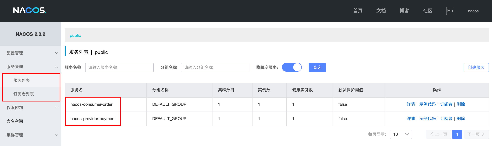


<br>

### 配置中心*

> Nacos 和 SpringCloud Config 一样，在项目初始化时，要保证从配置中心进行配置拉取，拉取配置之后才能保证项目的正常启动。同样的，`bootstrap.yml` 的优先级高于 `application.yml`

#### 创建和启动

依赖

```xml
<dependency>
  <groupId>com.alibaba.cloud</groupId>
  <artifactId>spring-cloud-starter-alibaba-nacos-config</artifactId>
</dependency>
```

配置

```yaml
# bootstrap.yml
server:
  port: 3377

# 先创建 or 找到合适的命名空间，再在对应的命名空间中创建配置文件
spring:
  application:
    name: nacos-config-client
  profiles:
    active: dev
  cloud:
    nacos:
      config:
        server-addr: localhost:8848 # nacos 配置中心地址
        file-extension: yaml # 指定配置文件的为 yaml 格式
        # 指定命名空间。注意：指定的是命名空间的唯一 Id，不是命名空间的名称
        namespace: c148bed6-dd5a-4ce3-850a-0d7885128d23
        group: DEV_GROUP # 指定分组
      discovery:
        server-addr: localhost:8848 # nacos 注册中心地址

# 从 nacos 拉取的对应的配置文件名
# ${spring.application.name}-${spring.profiles.active}-${spring.cloud.nacos.config.file-extension}
```

代码

```java
@EnableDiscoveryClient
@SpringBootApplicationpublic
class NacosConfigClient3377 {
    public static void main(String[] args) {
        SpringApplication.run(NacosConfigClient3377.class, args);
    }
}
```

```java
@RequestMapping("/nacos")
@RestController
@RefreshScope // @RefreshScope 开启 Nacos 配置文件动态刷新
public class ConfigClientController {
    @Value("${config.info}")
    private String configInfo;

    @GetMapping("/config/info")
    public String getConfigInfo() {
        return configInfo;
    }
}
```

创建配置

1. 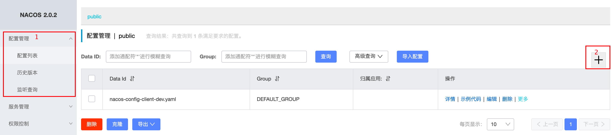
2. 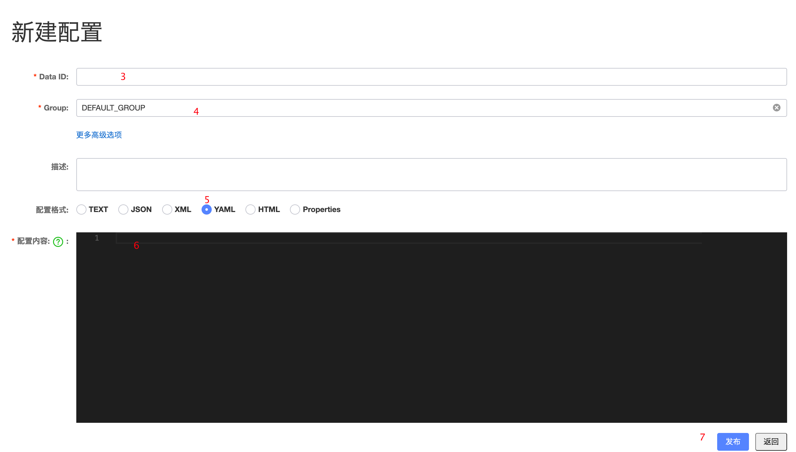

> 创建完对应配置后才能启动服务

#### 命名空间、分组和 Data ID

> 存在原因：1、实际开发环境中会有多个环境；2、在一个微服务项目中会有多个子项目。


**Namespace、Group和Data ID的关系**

- 类似 Java 中的包名类名
- 默认情况下，NameSpace=public，Group=Default_Group，默认Cluster是Default

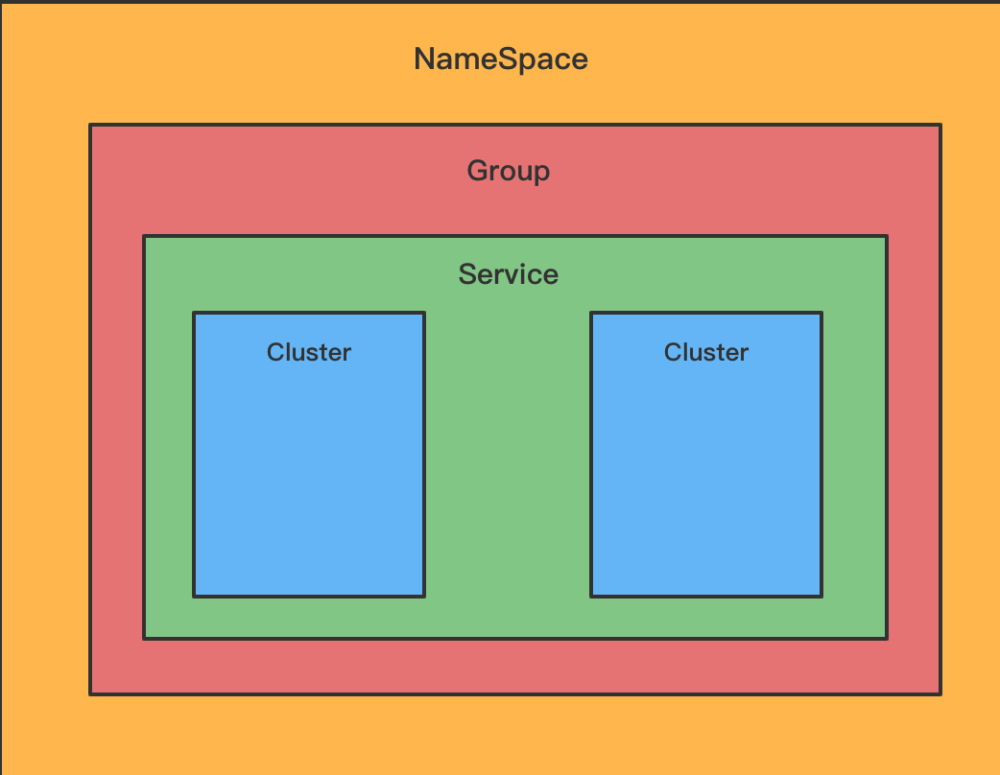


<br>

### 集成 Dubbo

**依赖**

```xml
<dependency>
    <groupId>org.apache.dubbo</groupId>
    <artifactId>dubbo-spring-boot-starter</artifactId>
</dependency>
```

**配置**

```yaml
dubbo:
  application:
    name: ${spring.application.name}
  protocol:
    name: dubbo
    port: -1
  registry:
    address: nacos://localhost:8848
    # Dubbo 3 版本以后，增加了是否注册消费者的参数 默认为 false
    # address: nacos://localhost:8848?register-consumer-url=true
```

**开启注解**

```java
@SpringBootApplication
@EnableDubbo
public class Provider8801Main {
    public static void main(String[] args) {
        SpringApplication.run(Provider8801Main.class, args);
    }
}
```

**API 模块**

```java
public interface ProviderApi {
    String str(String msg);
}
```

**服务提供者**

```java
@DubboService
public class ProviderApiImpl implements ProviderApi {
    @Override
    public String str(String msg) {
        return "dubbo provider" + msg;
    }
}
```

**服务消费者**

```java
@RestController
@RequestMapping("/consumer")
public class ConsumerController {

    @DubboReference
    private ProviderApi providerApi;

    @GetMapping("/str")
    public String str(@RequestParam String msg) {
        return providerApi.str(msg);
    }
}
```

<br>

**控制台**

服务名前缀为 `providers:` 的信息为服务提供者的元信息，`consumers:` 则代表服务消费者的元信息。

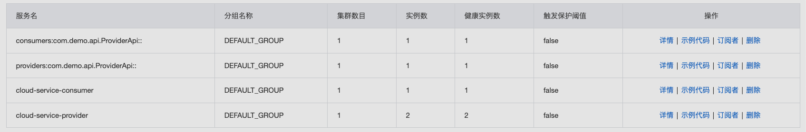

<br>

### Nacos 集群部署和持久化配置*

#### 集群

**Nacos 支持三种部署模式**

- 单机模式，用户测试和单机试用
- 集群模式，用于生产环境，保证高可用
- 多集群模式，用于多数据中心场景


**基本架构**

- Nginx x 1
- Nacos x 3
- MysQL x 1


#### 持久化

> Nacos 默认使用嵌入式数据库（Derby）实现配置文件的数据存储，如果启动 Nacos 集群，数据存储是存在一致性的问题的。解决：<mark>Nacos 集群使用集中式存储的方式来存储 Nacos 创建的配置文件，目前只支持 MySQL</mark>

**1、创建数据库**

`nacos-mysql.sql` 文件位于 `nacos-server/config` 目录

```sql
/******************************************/
/*   数据库全名 = nacos_config   */
/*   表名称 = config_info   */
/******************************************/
CREATE TABLE `config_info` (  
  `id` bigint(20) NOT NULL AUTO_INCREMENT COMMENT 'id',  
  `data_id` varchar(255) NOT NULL COMMENT 'data_id',  
  `group_id` varchar(255) DEFAULT NULL,  
  `content` longtext NOT NULL COMMENT 'content',  
  `md5` varchar(32) DEFAULT NULL COMMENT 'md5',  
  `gmt_create` datetime NOT NULL DEFAULT CURRENT_TIMESTAMP COMMENT '创建时间',  
  `gmt_modified` datetime NOT NULL DEFAULT CURRENT_TIMESTAMP COMMENT '修改时间',  
  `src_user` text COMMENT 'source user',  
  `src_ip` varchar(50) DEFAULT NULL COMMENT 'source ip',  
  `app_name` varchar(128) DEFAULT NULL,  
  `tenant_id` varchar(128) DEFAULT '' COMMENT '租户字段',  
  `c_desc` varchar(256) DEFAULT NULL,  
  `c_use` varchar(64) DEFAULT NULL,  
  `effect` varchar(64) DEFAULT NULL,  
  `type` varchar(64) DEFAULT NULL,  
  `c_schema` text,  PRIMARY KEY (`id`),  
  UNIQUE KEY `uk_configinfo_datagrouptenant` (`data_id`,`group_id`,`tenant_id`)
) ENGINE=InnoDB DEFAULT CHARSET=utf8 COLLATE=utf8_bin COMMENT='config_info';

/******************************************/
/*   数据库全名 = nacos_config   */
/*   表名称 = config_info_aggr   */
/******************************************/
CREATE TABLE `config_info_aggr` (  
  `id` bigint(20) NOT NULL AUTO_INCREMENT COMMENT 'id',  
  `data_id` varchar(255) NOT NULL COMMENT 'data_id',  
  `group_id` varchar(255) NOT NULL COMMENT 'group_id',  
  `datum_id` varchar(255) NOT NULL COMMENT 'datum_id',  
  `content` longtext NOT NULL COMMENT '内容',  
  `gmt_modified` datetime NOT NULL COMMENT '修改时间',  
  `app_name` varchar(128) DEFAULT NULL,  
  `tenant_id` varchar(128) DEFAULT '' COMMENT '租户字段',  
  PRIMARY KEY (`id`),  
  UNIQUE KEY `uk_configinfoaggr_datagrouptenantdatum` (`data_id`,`group_id`,`tenant_id`,`datum_id`)
) ENGINE=InnoDB DEFAULT CHARSET=utf8 COLLATE=utf8_bin COMMENT='增加租户字段';

/******************************************/
/*   数据库全名 = nacos_config   */
/*   表名称 = config_info_beta   */
/******************************************/
CREATE TABLE `config_info_beta` (  
  `id` bigint(20) NOT NULL AUTO_INCREMENT COMMENT 'id',  
  `data_id` varchar(255) NOT NULL COMMENT 'data_id',  
  `group_id` varchar(128) NOT NULL COMMENT 'group_id',  
  `app_name` varchar(128) DEFAULT NULL COMMENT 'app_name',  
  `content` longtext NOT NULL COMMENT 'content',  
  `beta_ips` varchar(1024) DEFAULT NULL COMMENT 'betaIps',  
  `md5` varchar(32) DEFAULT NULL COMMENT 'md5',  
  `gmt_create` datetime NOT NULL DEFAULT CURRENT_TIMESTAMP COMMENT '创建时间',  
  `gmt_modified` datetime NOT NULL DEFAULT CURRENT_TIMESTAMP COMMENT '修改时间',  
  `src_user` text COMMENT 'source user',  
  `src_ip` varchar(50) DEFAULT NULL COMMENT 'source ip',  
  `tenant_id` varchar(128) DEFAULT '' COMMENT '租户字段',  
  PRIMARY KEY (`id`),  
  UNIQUE KEY `uk_configinfobeta_datagrouptenant` (`data_id`,`group_id`,`tenant_id`)
) ENGINE=InnoDB DEFAULT CHARSET=utf8 COLLATE=utf8_bin COMMENT='config_info_beta';

/******************************************/
/*   数据库全名 = nacos_config   */
/*   表名称 = config_info_tag   */
/******************************************/
CREATE TABLE `config_info_tag` (  
  `id` bigint(20) NOT NULL AUTO_INCREMENT COMMENT 'id',  
  `data_id` varchar(255) NOT NULL COMMENT 'data_id',  
  `group_id` varchar(128) NOT NULL COMMENT 'group_id',  
  `tenant_id` varchar(128) DEFAULT '' COMMENT 'tenant_id',  
  `tag_id` varchar(128) NOT NULL COMMENT 'tag_id',  
  `app_name` varchar(128) DEFAULT NULL COMMENT 'app_name',  
  `content` longtext NOT NULL COMMENT 'content',  
  `md5` varchar(32) DEFAULT NULL COMMENT 'md5',  
  `gmt_create` datetime NOT NULL DEFAULT CURRENT_TIMESTAMP COMMENT '创建时间',  
  `gmt_modified` datetime NOT NULL DEFAULT CURRENT_TIMESTAMP COMMENT '修改时间',  
  `src_user` text COMMENT 'source user',  
  `src_ip` varchar(50) DEFAULT NULL COMMENT 'source ip',  
  PRIMARY KEY (`id`),  
  UNIQUE KEY `uk_configinfotag_datagrouptenanttag` (`data_id`,`group_id`,`tenant_id`,`tag_id`)
) ENGINE=InnoDB DEFAULT CHARSET=utf8 COLLATE=utf8_bin COMMENT='config_info_tag';

/******************************************/
/*   数据库全名 = nacos_config   */
/*   表名称 = config_tags_relation   */
/******************************************/
CREATE TABLE `config_tags_relation` (  
  `id` bigint(20) NOT NULL COMMENT 'id',  
  `tag_name` varchar(128) NOT NULL COMMENT 'tag_name',  
  `tag_type` varchar(64) DEFAULT NULL COMMENT 'tag_type',  
  `data_id` varchar(255) NOT NULL COMMENT 'data_id',  
  `group_id` varchar(128) NOT NULL COMMENT 'group_id',  
  `tenant_id` varchar(128) DEFAULT '' COMMENT 'tenant_id',  
  `nid` bigint(20) NOT NULL AUTO_INCREMENT,  
  PRIMARY KEY (`nid`),  
  UNIQUE KEY `uk_configtagrelation_configidtag` (`id`,`tag_name`,`tag_type`),  
  KEY `idx_tenant_id` (`tenant_id`)
) ENGINE=InnoDB DEFAULT CHARSET=utf8 COLLATE=utf8_bin COMMENT='config_tag_relation';

/******************************************/
/*   数据库全名 = nacos_config   */
/*   表名称 = group_capacity   */
/******************************************/
CREATE TABLE `group_capacity` (  
  `id` bigint(20) unsigned NOT NULL AUTO_INCREMENT COMMENT '主键ID',  
  `group_id` varchar(128) NOT NULL DEFAULT '' COMMENT 'Group ID，空字符表示整个集群',  
  `quota` int(10) unsigned NOT NULL DEFAULT '0' COMMENT '配额，0表示使用默认值',  
  `usage` int(10) unsigned NOT NULL DEFAULT '0' COMMENT '使用量',  
  `max_size` int(10) unsigned NOT NULL DEFAULT '0' COMMENT '单个配置大小上限，单位为字节，0表示使用默认值',  
  `max_aggr_count` int(10) unsigned NOT NULL DEFAULT '0' COMMENT '聚合子配置最大个数，，0表示使用默认值',  
  `max_aggr_size` int(10) unsigned NOT NULL DEFAULT '0' COMMENT '单个聚合数据的子配置大小上限，单位为字节，0表示使用默认值',  
  `max_history_count` int(10) unsigned NOT NULL DEFAULT '0' COMMENT '最大变更历史数量',  
  `gmt_create` datetime NOT NULL DEFAULT CURRENT_TIMESTAMP COMMENT '创建时间',  
  `gmt_modified` datetime NOT NULL DEFAULT CURRENT_TIMESTAMP COMMENT '修改时间',  
  PRIMARY KEY (`id`),  
  UNIQUE KEY `uk_group_id` (`group_id`)
) ENGINE=InnoDB DEFAULT CHARSET=utf8 COLLATE=utf8_bin COMMENT='集群、各Group容量信息表';

/******************************************/
/*   数据库全名 = nacos_config   */
/*   表名称 = his_config_info   */
/******************************************/
CREATE TABLE `his_config_info` (  
  `id` bigint(64) unsigned NOT NULL,  
  `nid` bigint(20) unsigned NOT NULL AUTO_INCREMENT,  
  `data_id` varchar(255) NOT NULL,  
  `group_id` varchar(128) NOT NULL,  
  `app_name` varchar(128) DEFAULT NULL COMMENT 'app_name',  
  `content` longtext NOT NULL,  
  `md5` varchar(32) DEFAULT NULL,  
  `gmt_create` datetime NOT NULL DEFAULT CURRENT_TIMESTAMP,  
  `gmt_modified` datetime NOT NULL DEFAULT CURRENT_TIMESTAMP,  
  `src_user` text,  
  `src_ip` varchar(50) DEFAULT NULL,  
  `op_type` char(10) DEFAULT NULL,  
  `tenant_id` varchar(128) DEFAULT '' COMMENT '租户字段',  
  PRIMARY KEY (`nid`),  
  KEY `idx_gmt_create` (`gmt_create`),  
  KEY `idx_gmt_modified` (`gmt_modified`),  
  KEY `idx_did` (`data_id`)
) ENGINE=InnoDB DEFAULT CHARSET=utf8 COLLATE=utf8_bin COMMENT='多租户改造';

/******************************************/
/*   数据库全名 = nacos_config   */
/*   表名称 = tenant_capacity   */
/******************************************/
CREATE TABLE `tenant_capacity` (  
  `id` bigint(20) unsigned NOT NULL AUTO_INCREMENT COMMENT '主键ID',  
  `tenant_id` varchar(128) NOT NULL DEFAULT '' COMMENT 'Tenant ID',  
  `quota` int(10) unsigned NOT NULL DEFAULT '0' COMMENT '配额，0表示使用默认值',  
  `usage` int(10) unsigned NOT NULL DEFAULT '0' COMMENT '使用量',  
  `max_size` int(10) unsigned NOT NULL DEFAULT '0' COMMENT '单个配置大小上限，单位为字节，0表示使用默认值',  
  `max_aggr_count` int(10) unsigned NOT NULL DEFAULT '0' COMMENT '聚合子配置最大个数',  
  `max_aggr_size` int(10) unsigned NOT NULL DEFAULT '0' COMMENT '单个聚合数据的子配置大小上限，单位为字节，0表示使用默认值',  
  `max_history_count` int(10) unsigned NOT NULL DEFAULT '0' COMMENT '最大变更历史数量',  
  `gmt_create` datetime NOT NULL DEFAULT CURRENT_TIMESTAMP COMMENT '创建时间',  
  `gmt_modified` datetime NOT NULL DEFAULT CURRENT_TIMESTAMP COMMENT '修改时间',  
  PRIMARY KEY (`id`),  
  UNIQUE KEY `uk_tenant_id` (`tenant_id`)
) ENGINE=InnoDB DEFAULT CHARSET=utf8 COLLATE=utf8_bin COMMENT='租户容量信息表';

CREATE TABLE `tenant_info` (  
  `id` bigint(20) NOT NULL AUTO_INCREMENT COMMENT 'id',  
  `kp` varchar(128) NOT NULL COMMENT 'kp',  
  `tenant_id` varchar(128) default '' COMMENT 'tenant_id',  
  `tenant_name` varchar(128) default '' COMMENT 'tenant_name',  
  `tenant_desc` varchar(256) DEFAULT NULL COMMENT 'tenant_desc',  
  `create_source` varchar(32) DEFAULT NULL COMMENT 'create_source',  
  `gmt_create` bigint(20) NOT NULL COMMENT '创建时间',  
  `gmt_modified` bigint(20) NOT NULL COMMENT '修改时间',  
  PRIMARY KEY (`id`),  
  UNIQUE KEY `uk_tenant_info_kptenantid` (`kp`,`tenant_id`),  
  KEY `idx_tenant_id` (`tenant_id`)
) ENGINE=InnoDB DEFAULT CHARSET=utf8 COLLATE=utf8_bin COMMENT='tenant_info';

CREATE TABLE `users` (    
  `username` varchar(50) NOT NULL PRIMARY KEY,    
  `password` varchar(500) NOT NULL,    
  `enabled` boolean NOT NULL
);

CREATE TABLE `roles` (    
  `username` varchar(50) NOT NULL,    
  `role` varchar(50) NOT NULL,    
  UNIQUE INDEX `idx_user_role` (`username` ASC, `role` ASC) USING BTREE
);

CREATE TABLE `permissions` (    
  `role` varchar(50) NOT NULL,    
  `resource` varchar(255) NOT NULL,    
  `action` varchar(8) NOT NULL,    
  UNIQUE INDEX `uk_role_permission` (`role`,`resource`,`action`) USING BTREE
);

INSERT INTO users (username, password, enabled) VALUES ('nacos', '$2a$10$EuWPZHzz32dJN7jexM34MOeYirDdFAZm2kuWj7VEOJhhZkDrxfvUu', TRUE);

INSERT INTO roles (username, role) VALUES ('nacos', 'ROLE_ADMIN');
```


**2、修改Nacos配置文件**

路径： `nacos/conf/application.properties`

配置文件信息，将数据库修改成MySQL

```properties
spring.datasource.platform=mysql
### Count of DB:
db.num=1
### Connect URL of DB:
db.url.0=jdbc:mysql://127.0.0.1:3306/nacos_config?characterEncoding=utf8&connectTimeout=1000&socketTimeout=3000&autoReconnect=true&useUnicode=true&useSSL=false&serverTimezone=UTC
db.user.0=root
db.password.0=root
```


<br>

## Sentinel 服务熔断与限流

> 是一个单独的组件，可以独立出来试用；界面化细粒度统一配置。

Hystrix 存在问题

1. 需要手工搭建服务监控平台
2. 没有相对完善的 Web 界面可以用来进行更加细粒度的配置、流量控制、速率控制、服务熔断、服务降级

### 流量控制

### 服务降级

### 热点监控

### 服务熔断


<br>

## Seata 处理分布式事务

[[分布式事务-2PC 和 3PC 原理 ](https://www.cnblogs.com/qdhxhz/p/11167025.html)](https://www.cnblogs.com/qdhxhz/p/11167025.html)

[分布式事务之 2PC 和 3PC](https://blog.csdn.net/xiaomisolo/article/details/106631185)

[分布式事务的 2PC，3PC 提交](https://www.cnblogs.com/zery/p/14421553.html)

[面试官：了解分布式事务？讲讲你理解的 2PC 和 3PC 原理](https://zhuanlan.zhihu.com/p/91263461)

[分布式事务：2PC、3PC、SAGA、TCC](https://zhuanlan.zhihu.com/p/142136446)


<br>

# SpringCloud Third Party

> 其他第三方 SpringCloud 组件


<br>

## Apollo 配置中心

> Apollo 是一款可靠的分布式配置管理中心，能够集中化管理应用不同环境、不同集群的配置，配置修改后能够实时推送到应用端，并且具备规范的权限、流程治理等特性，适用于微服务配置管理场景。


[Apollo 配置中心介绍](https://www.apolloconfig.com/#/zh/design/apollo-introduction)


**Apollo 与 Nacos 对比**

|        | Nacos       | Apollo        |
| ------ | ----------- | ------------- |
| 上手   | 简单        | 比 Nacos 复杂 |
| 持久化 | Derby/MySQL | MySQL Only    |


### 部署

[Apollo Quick Start](https://github.com/apolloconfig/apollo/wiki/Quick-Start)

1、克隆或者下载[项目](https://github.com/apolloconfig/apollo-build-scripts)

2、根据下载项目中的 sql 文件创建数据库

3、修改下载项目中的 `demo.sh` 中的数据库链接信息

```
# apollo config db info
apollo_config_db_url=jdbc:mysql://localhost:3306/ApolloConfigDB?characterEncoding=utf8
apollo_config_db_username=用户名
apollo_config_db_password=密码（如果没有密码，留空即可）

# apollo portal db info
apollo_portal_db_url=jdbc:mysql://localhost:3306/ApolloPortalDB?characterEncoding=utf8
apollo_portal_db_username=用户名
apollo_portal_db_password=密码（如果没有密码，留空即可）
```

4、执行 `./demo.sh start` 启动 apollo

5、打开连接 `localhost:8070`，进入控制面板，用户名 apollo，密码 admin


### 创建应用

> 此应用即自定义的微服务项目

1、引入依赖

```xml
<dependencies>
    <dependency>
        <groupId>org.springframework.boot</groupId>
        <artifactId>spring-boot-starter-actuator</artifactId>
    </dependency>
    <dependency>
        <groupId>org.springframework.boot</groupId>
        <artifactId>spring-boot-starter-web</artifactId>
    </dependency>

    <dependency>
        <groupId>com.fasterxml.jackson.core</groupId>
        <artifactId>jackson-core</artifactId>
    </dependency>
    <dependency>
        <groupId>com.fasterxml.jackson.core</groupId>
        <artifactId>jackson-databind</artifactId>
    </dependency>

    <dependency>
        <groupId>com.ctrip.framework.apollo</groupId>
        <artifactId>apollo-client</artifactId>
        <version>1.9.1</version>
    </dependency>
</dependencies>
```


2、修改配置文件

```yaml
server:
  port: 3355
spring:
  application:
    name: apollo-config-client

env: DEV

# apollo 相关配置
app:
  id: apollo-config-client
apollo:
  meta: http://localhost:8080 # apollo 注册的 Eureka 注册中心地址
  bootstrap:
    enabled: true # 启用 apollo

logging:
  level:
    com:
      boot:
        controller: debug

# 自定义信息
myname: gnl-v11111
config-info: this is config for apollo-config-client v1.0
```


3、编写测试 Controller

```java

@RestController
@RequestMapping("/apollo")
public class ApolloController {

    private static Logger logger = LoggerFactory.getLogger(ApolloController.class);
    
    @Value("${myname}")
    private String myName;


    @Value("${config-info}")
    private String configInfo;

    @GetMapping("/name")
    public String getName() {
        
        logger.info("this is info log: {}", "aaa info");
        logger.debug("this is debug log: {}", "bbb debug");
        logger.error("this is error log: {}", "ccc error");
        
        return myName;
    }

    @GetMapping("/configInfo")
    public String getConfigInfo() {
        return configInfo;
    }

}

```


4、编写启动类

```java
// 添加 @EnableApolloConfig 注解
@EnableApolloConfig
@SpringBootApplication
public class Apollo3355MainApp {
    public static void main(String[] args) {
        SpringApplication.run(Apollo3355MainApp.class, args);
    }
}
```


5、访问 `localhost:3355/apollo/name`

6、在 apollo 控制面板上修改 `myname` 的值，发布后再次访问，就会发现显示的内容即为修改过的值


### 监听配置变化

> 有些配置的值虽然已经在 apollo 中修改，但是并未立即生效，依然需要重启项目才能生效，可以通过监听配置变化来达到热更新的效果


**以日志输出级别的修改为例**

```java
// LoggerConfig 监听日志变化配置类
@Configuration
public class LoggerConfig {

    private static final Logger LOGGER = LoggerFactory.getLogger(LoggerConfig.class);
    private static final String LOGGER_TAG = "logging.level.";

    @Autowired
    private LoggingSystem loggingSystem;

    // @ApolloConfig 将 Apollo 服务端的中的配置注入这个类中
    @ApolloConfig
    private Config config;

    // @ApolloConfigChangeListener 监听配置中心配置的更新事件，若该事件发生，则执行标注有此注解的方法
    @ApolloConfigChangeListener
    private void configChangeListener(ConfigChangeEvent event) {
        refreshLoggingLevel();
    }

    @PostConstruct
    private void refreshLoggingLevel() {
        Set<String> propertyNames = config.getPropertyNames();
        for (String property : propertyNames) {
            if (StringUtils.containsIgnoreCase(property, LOGGER_TAG)) {
                String strLevel = config.getProperty(property, "info");
                LogLevel logLevel = LogLevel.valueOf(strLevel.toUpperCase());
                loggingSystem.setLogLevel(property.replace(LOGGER_TAG, ""), logLevel);
                LOGGER.info("{} : {}", property, strLevel);
            }
        }
    }
}
```

<br>

# 参考

[RPC与Http的区别](https://www.cnblogs.com/helloworldmybokeyuan/p/11626833.html)

[Nacos 服务注册与发现原理分析](https://www.jianshu.com/p/61608ff86344/)

[Spring Cloud Alibaba | 微服务分布式事务之Seata](https://www.cnblogs.com/babycomeon/p/11504210.html)

[微服务：注册中心ZooKeeper、Eureka、Consul 、Nacos对比](https://blog.csdn.net/fly910905/article/details/100023415)	

[eureka、consul、nacos三大产品对比](https://www.cnblogs.com/shumtn/p/13391470.html)

[SpringBoot 整合 apollo](https://www.cnblogs.com/huanchupkblog/p/10509427.html)