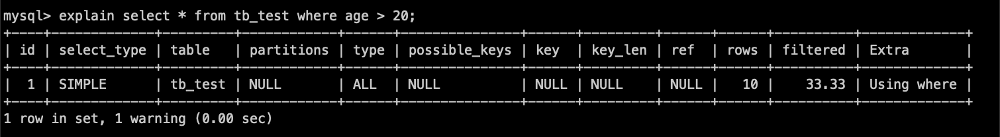

# SQL

## 执行流程

```text
客户端 SQL
   |
   v
[连接器 / 认证]
   |
   v
[解析器]
   |  （语法检查 / 语义检查）
   v
[优化器]
   |  （选择访问路径 / 索引 / 连接顺序）
   v
[执行器]
   |
   v
[存储引擎 API]
   |
   v
[数据文件 / 缓冲池 / Redo-Undo]
   |
   v
结果集
```

1、客户端通过**连接器**（JDBC、ODBC），客户端与 MySQL 服务器**建立连接**，将 **SQL 语句发送**到 MySQL 服务器；

2、MySQL **服务器验证请求**的用户名和密码是否正确，账户正确；在系统表中验证用户权限，验证通过，进行下一步，验证不通过则报错；

3、在旧版本中如果命中**查询缓存**，可以直接返回结果；未命中则继续下一步进入 SQL 查询解析器。MySQL 8.0 已移除查询缓存；

4、**查询解析器**对 SQL 语句进行解析，包括预处理和解析过程。在这个阶段会对 SQL 语句进行关键词和非关键词提取、解析，组成解析树。

关键字如：`select/update/in/or/where/group by`等，如果分析到语法错误，报错 `ERROR: You have an error in your SQL syntax`。同时也会对 SQL 语句做一些验证，如：表是否存在，字段是否存在等；

5、在查询之前，使用**查询优化器**对查询进行优化，查询优化器使用的是**选取、投影、联接**策略进行查询，如：将 SQL 语句中的查询条件调换位置，为让底层能使用索引，选择一个最优的查询路径

6、**执行器**调用存储引擎对应的 API，根据 SQL 语句对数据文件进行操作。对于事务型写操作，提交阶段会由 Server 层写入 binlog（`select` 除外）；

7、返回结果

---

## 关键字

### describe

用来获取表结构信息

```shell
mysql> DESCRIBE City;
+------------+----------+------+-----+---------+----------------+
| Field      | Type     | Null | Key | Default | Extra          |
+------------+----------+------+-----+---------+----------------+
| Id         | int(11)  | NO   | PRI | NULL    | auto_increment |
| Name       | char(35) | NO   |     |         |                |
| Country    | char(3)  | NO   | UNI |         |                |
| District   | char(20) | YES  | MUL |         |                |
| Population | int(11)  | NO   |     | 0       |                |
+------------+----------+------+-----+---------+----------------+
```

类似 `show columns`

```shell
mysql> SHOW COLUMNS FROM City;
+-------------+----------+------+-----+---------+----------------+
| Field       | Type     | Null | Key | Default | Extra          |
+-------------+----------+------+-----+---------+----------------+
| ID          | int(11)  | NO   | PRI | NULL    | auto_increment |
| Name        | char(35) | NO   |     |         |                |
| CountryCode | char(3)  | NO   | MUL |         |                |
| District    | char(20) | NO   |     |         |                |
| Population  | int(11)  | NO   |     | 0       |                |
+-------------+----------+------+-----+---------+----------------+
```

---

### explain

用于查询 SQL 语句执行计划（查看 MySQL 会如何执行某条 SQL 语句）。



当使用 explain 查询某条 SQL 语句的时候，MySQL 会展示经过 SQL 优化器优化之后该 SQL 语句的执行信息，比如：有无使用索引，使用了什么关键字（where/and）等。

| 输出列名      | 解释                                                         |
| ------------- | ------------------------------------------------------------ |
| id            | 查询执行的顺序，数字越小越先执行                             |
| select_type   | 查询的类型：SIMPLE/PRIMARY/SUBQUERY/UNION/...                |
| table         | 查询的表名                                                   |
| partitions    | 查询结果所在的分区                                           |
| type          | 表示 MySQL 查询优化器选择的访问方法或操作类型：All/index/range/ref/eq_ref/const(system)/NULL |
| possible_keys | 可能被选择使用的索引                                         |
| key           | 真正使用到的索引                                             |
| key_len       | 使用的索引长度                                               |
| ref           | The columns compared to the index                            |
| rows          | Estimate of rows to be examined                              |
| filtered      | Percentage of rows filtered by table condition               |
| Extra         | Additional information                                       |

id 表示查询执行的顺序，数字越小越先执行

select_type 表示查询的类型：

* SIMPLE，简单的 SELECT 查询，不包含子查询或联接操作
* PRIMARY，复杂的 SELECT 查询中的最外层查询
* SUBQUERY，子查询，作为其他查询的一部分
* DERIVED，派生表，通过 FROM 子句中的子查询或临时表生成的中间结果
* UNION，UNION 查询的第二个或后续的 SELECT 语句
* UNION RESULT，UNION 查询的结果集

type 表示 MySQL 查询优化器选择的访问方法或操作类型，效率由低到高：

* all，执行全表扫描，遍历整个表来获取符合条件的数据，效率最低
* index，执行全索引扫描，遍历整个索引来获取符合条件的数据
* range，使用索引范围条件进行查询，根据索引中的范围进行数据访问
* ref，在连接查询中，使用非唯一索引或唯一索引的部分前缀来访问表中的数据
* eq_ref，在连接查询中，使用等值条件（`=`）连接不同表的索引，每个匹配的索引值只对应一行数据
* const，使用常量条件进行查询，根据主键或唯一索引访问单行数据，查询效率最高

key_len 表示使用到的索引长度，需要根据数据库的字符集类型以及表中的列选择的数据类型结合起来计算。[参考](https://mp.weixin.qq.com/s/8qemhRg5MgXs1So5YCv0fQ)。

ref 表示使用非唯一索引或唯一索引的部分前缀来进行表之间的连接：

* 对于单表查询：ref 表示使用非唯一索引或唯一索引的部分前缀进行条件匹配
* 对于连接查询：ref 表示使用非唯一索引或唯一索引的部分前缀进行连接操作

当查询语句中的条件使用到非唯一索引或唯一索引的部分前缀时，MySQL 优化器会选择使用 ref 类型的访问方法来加速查询。

filtered 表示对表进行条件过滤后，预计返回结果的行数所占的百分比：

* filtered 列的值为 100% 表示查询结果不需要进一步过滤，即所有行都满足查询条件
* filtered 列的值为 0% 表示查询结果需要完全过滤，即没有行满足查询条件
* filtered 列的值介于 0% 和 100% 之间表示查询结果需要根据条件进行过滤，值越接近 100% 表示过滤的效果越好

Extra 表示额外的执行信息，如是否使用临时表、文件排序等，一般使用 group by 语句时会出现额外执行信息。

---

## SQL 规范

1、尽量避免进行全表扫描

2、不要超过三张表关联

3、表字段不宜过多，对太多字段的表进行拆分

4、尽量不使用 `select *`

5、适当建立索引，但是不能建立过多索引

6、优先使用 InnoDB；仅在明确场景下再评估其他存储引擎

7、尽量避免大段的事务操作

## [SQL 执行计划](#explain)

> SQL 优化的思路就是尽量减少 SQL 执行次数，尽量减少数据库 IO 次数。

---

## 常见问题

> `count(PrimaryKey)/count(*)/count(1)/count(ColumnName)` 区别

执行效果上

- `count(PrimaryKey)` 统计主键列，如果会忽略 NULL 值列

- `count(*)` 包括所有的列，相当于行数。在统计结果的时候，**不会忽略列值为 NULL**

- `count(1)` 包括所有列，用 1 代表占位符没有实际意义。效果和 `count(*)` 相同，在统计结果的时候，**不会忽略列值为 NULL**。

  > ```sql
  > select count(1) from t_order;
  > ```
  >
  > 统计「 t_order 表中，1 这个表达式不为 NULL 的记录」有多少个。1 这个表达式就是单纯数字，它永远都不是 NULL，所以上面这条语句，其实是在统计 t_order 表中有多少个记录。

- `count(列名)` 只包括列名那一列。在统计结果的时候，**某个字段值为 NULL 时不统计。**

  > ```sql
  > select count(name) from t_order;
  > ```
  >
  > 统计「 t_order 表中，name 字段不为 NULL 的记录」有多少个。

执行效率上（InnoDB 常见结论）

- `count(*)` 与 `count(1)` 通常等价；
- `count(主键)` 在主键为 `NOT NULL` 时通常也与前两者接近；
- `count(列名)` 需要判断列值是否为 `NULL`，通常更慢。

> [具体分析](https://www.xiaolincoding.com/mysql/index/count.html#count-%E5%AD%97%E6%AE%B5-%E6%89%A7%E8%A1%8C%E8%BF%87%E7%A8%8B%E6%98%AF%E6%80%8E%E6%A0%B7%E7%9A%84)

> `UNION`和 `UNION ALL` 的区别

* `UNION` 会去重，`UNION ALL` 不去重；
* `UNION` 因去重通常开销更高，`UNION ALL` 通常更快；

> `IN` 和 `EXISTS` 的区别？

1. 语法结构不同：`EXISTS` 是一个子查询（Subquery）关键字，用于检查一个查询结果是否存在；而 `IN` 是一个用于比较的运算符，用于检查某个值是否在一组值中。
2. 执行方式上，优化器可能会把二者都改写为半连接（semi-join）等等价计划，未必严格按字面方式执行。
3. 性能差异和数据分布、索引、SQL 改写有关，不能固定认为某一个一定更快。
4. 语义差异：`EXISTS` 通常用于检查子查询是否返回了结果，例如用于检查某个表中是否存在满足特定条件的记录。而 `IN` 则用于比较某个值是否在一组值中，例如用于查询某个表中某一列的值是否在另一个表的列中出现。

> 实践中应以 `EXPLAIN`/`EXPLAIN ANALYZE` 和真实数据测试为准，不建议只按 `IN` 或 `EXISTS` 关键字做经验性结论。

## 深度分页慢查询

> 随着数据量增大（如千万级/上亿），`limit offset, size` 很容易变慢。

**问题原因**

```sql
select * from t_order
order by id
limit 1000000, 20;
```

这类 SQL 需要先扫描并跳过前面 1000000 行，再返回 20 行。`offset` 越大，扫描和回表代价越高。

**方案 1：子查询 + JOIN（延迟关联）**

先用覆盖索引拿到一页主键，再回表取完整数据：

```sql
select t.*
from t_order t
join (
  select id
  from t_order
  order by id
  limit 1000000, 20
) s on t.id = s.id
order by t.id;
```

- 优点：相比直接 `select * limit offset,size`，通常能减少回表开销；
- 缺点：`offset` 很大时依然要“跳过前序记录”，只是成本更可控。

**方案 2：游标分页（Seek / Keyset）**

不使用大偏移量，改为“以上一页最后一条记录作为游标”：

```sql
-- 第 1 页
select *
from t_order
where id > 0
order by id
limit 20;

-- 下一页（假设上一页最后一条 id = 20020）
select *
from t_order
where id > 20020
order by id
limit 20;
```

- 优点：性能最稳定，数据越大优势越明显；
- 缺点：不适合“任意跳页”（比如直接跳到第 500 页），对传统页码分页不友好。

**如何选**

- 需要“页码跳转”（后台管理/报表）：优先“子查询 + JOIN”并限制最大页数；
- 需要“持续下拉/下一页”（Feed/时间流）：优先游标分页；
- 两者都要：前几页用 `offset`，深页切换为游标模式。

---
