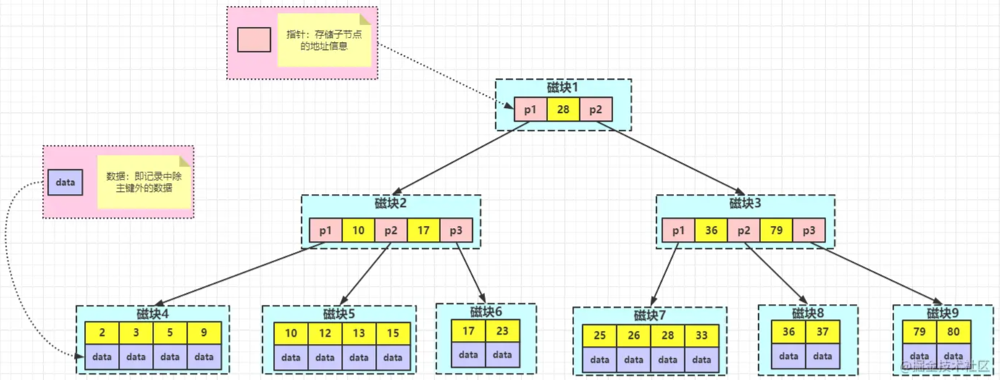
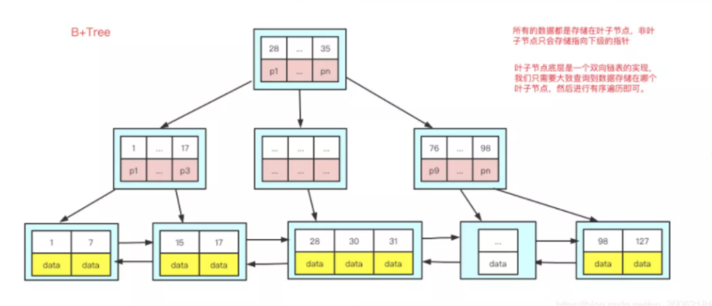
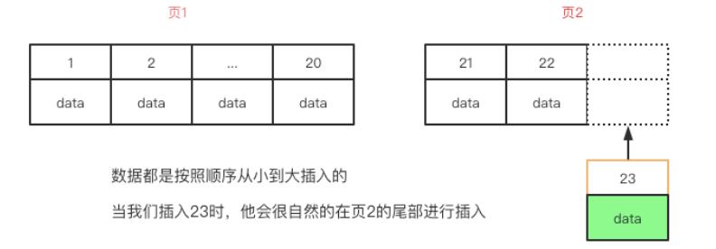
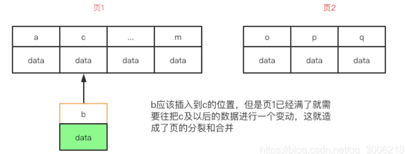
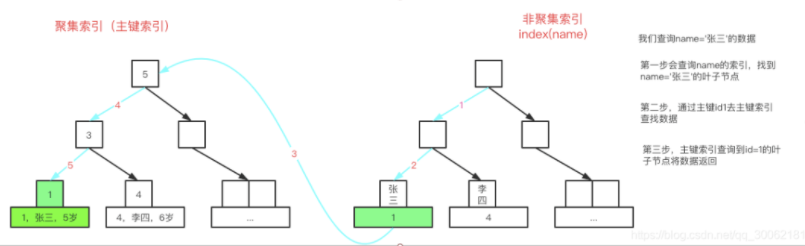
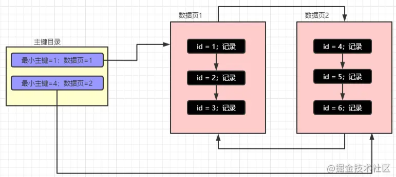
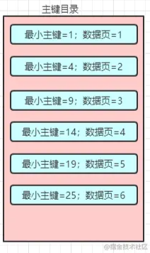
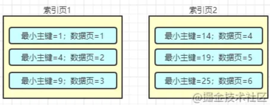
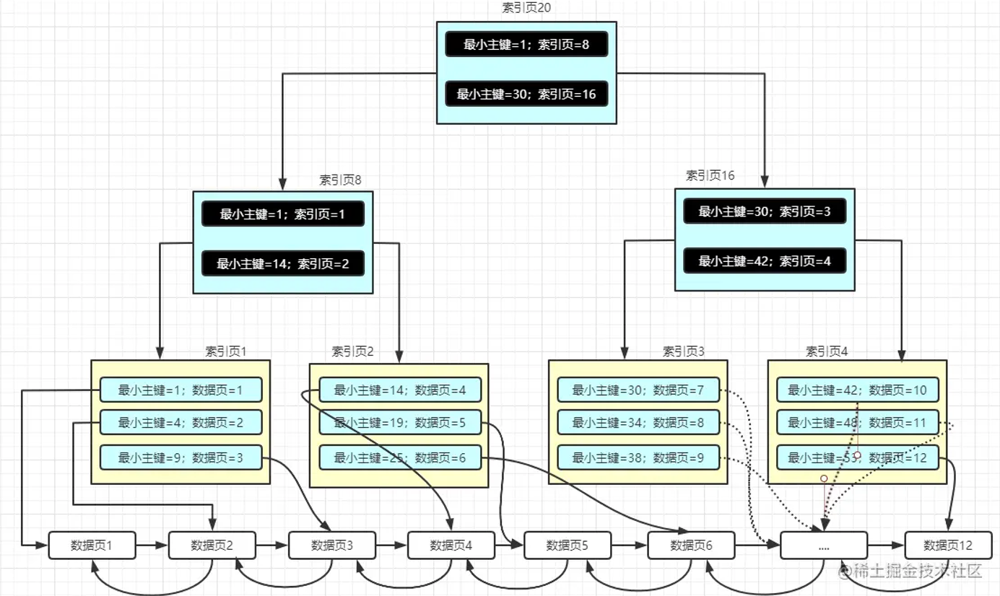

# 索引

> 索引，是关系数据库中对某一列或多个列的值进行预排序的**数据结构**，能加快对数据的访问速度。

除了数据，数据库系统还维护着特定数据结构，这些数据结构以某种方式指向数据，可以在这些数据结构上实现高级查找算法。这种数据结构就是索引，**索引的本质是一种数据结构**。

使用索引，可以让数据库系统不必扫描整个表，直接定位到符合条件的记录，加快查询速度。索引是建立在数据库表中的某些列的上面。在创建索引时，应仔细考虑在哪些列上创建索引，哪些列不创建索引。

## 关于索引

**优点**

- 索引减少了需要扫描的数据量，加快数据的查询速度；
- 索引可以将随机 IO 变成顺序 IO；
- 通过创建唯一性索引，可以保证数据库表中每一行数据的唯一性。

**缺点**

- 创建索引和维护索引要耗费时间，随着数据量的增加而增加；
- 索引需要占物理空间，除了数据表占用数据空间之外，每一个索引还要占用一定的物理空间，如果需要建立聚簇索引，占用的空间更大；
- 对表中的数据进行增、删、改的时候，索引也要动态的维护。

## 索引操作

```sql
-- 创建索引的基本语法
CREATE INDEX indexName ON table(column(length));
-- 参数 length 默认可以忽略
CREATE INDEX idx_name ON user(name);
```

---

## 索引结构

### B 树

> 所有节点中孩子节点个数的最大值称为 B 树的阶，通常用 **m** 表示。从查找效率考虑，要求 **m >= 3**。

一颗 m 阶的 B 树要么是一颗**空树**，要么是满足以下要求的 **m 叉树**：

- 每个节点最多有 **m** 个分支（子树）；
- 最少分支的节点要看是否为根节点：如果是根节点，则至少有两个分支；非根非叶节点至少有 **[m/2]** 个分支（ **[a]** 是对 **a** 向上取整）；
- **k=2**（根节点）或 **k=[m/2]** （非根节点），有 **n**（`k<=n<=m`）个分支的节点有 **n-1** 个关键字，关键字按照递增顺序排序。

**节点结构**

```text
+------------------------------------------------------------+
|   n   |   k1   |   k2   |   ...   |   k(i)   |   ...   | kn |
+------------------------------------------------------------+
|   p0  |   p1   |   p2   |   ...   |   p(i)   |   ...   | pn |
+------------------------------------------------------------+
```

- **n** 为节点中关键字的个数；
- **k<sub>i</sub>** 为节点的关键字，且满足 **k<sub>i</sub> < k<sub>i+1</sub>**；
- **p<sub>i</sub>**（`0<=i<=n`）为指向孩子节点指针，且满足 **p<sub>i</sub>**（`1<=i<=n-1`）所指节点上的关键字大于 **k<sub>i</sub>** 且小于 **k<sub>i+1</sub>**，**p<sub>0 </sub>** 所指节点上的关键字小于 **k<sub>1</sub>**，且 **p<sub>n </sub>**所指节点上的关键字大于 **k<sub>n</sub>**；
- 节点内关键字互不相等，按从小到大排序；
- 叶子节点处于同一层，可以用空指针表示查找失败到达的位置。



**B树特征**

- 在 B 树中，具有 n 个关键字的节点含有 n+1 个分支；
- 关键字集合分布在整棵树中，任何一个关键字出现且只出现在一个节点中；
- 搜索有可能在非叶子节点结束；搜索性能等价于在关键字全集内做一次二分查找；
- 自动平衡控制。

B 树的查找是多路查找，从根节点开始，对节点内的关键字（递增排序）序列进行二分查找，如果命中则结束。否则进入查询关键字所属范围的孩子节点，并重复二分查找，直到遍历到的节点为空（查找失败），或者命中。

> 平衡 m 叉查找树是指每个关键字的左子树和右子树高度差绝对值不超过 1 的查找树，其节点结构与 B 树节点结构相同。因此可认为 B 树是平衡 **m** 叉查找树，但限制更强，要求把所有叶子节点放在同一层。

---

### B+ 树

> 基于 B 树和叶子节点顺序访问指针进行实现。

**m 阶 B+ 树的细节**

- 根且非叶子节点的孩子节点数为 **[2, m]**；
- 非根非叶节点的孩子节点数为 **[m/2, m]**；
- 在 B+ 树中，具有 **n** 个关键字的节点含有 **n** 个分支；而在 B 树中，具有 **n** 个关键字的节点含有 **n+1** 个分支
- 在 B+ 树中，每个节点（非根节点）中的关键字个数 **n** 的取值范围为 `[m/2]<=n<=m`，根节点取值范围为 `2<=n<=m`；而在 B 树中，它们的取值范围分别是 `[m/2]-1<=n<=m-1`和 `1<=n<=m-1`；
- B+ 树中的**所有非叶子节点仅仅起到索引的作用**（作为叶子节点的索引），节点中的每个索引项只含有对应子树的最大关键字和指向该字数的指针；
- 在 B+ 树中**叶子节点包含全部关键字的数据**，叶子节点的指针指向**数据记录**；
- 在 B+ 树上有一个指针指向关键字最小的叶子节点，所有叶子节点连接成一个双向线性链表，而 B 树没有；
- B+ 树的搜索与 B 树也基本相同，区别是 B+ 树只有达到叶子节点才命中（B 树可以在非叶子节点命中），其性能也等价于在关键字全集做一次二分查找；
- B+ 树是自底向上插入的，优先会将数据插入到叶子节点中，然后整个树会根据底部的叶子节点进行变动。

**B+ 树特征**

- 所有关键字都出现在叶子节点组成的链表中（稠密索引），且链表中的关键字是有序的；
- 查找操作不会在非叶子节点命中； 
- 非叶子节点相当于叶子节点的索引（稀疏索引），叶子节点相当于是存储（关键字）数据的数据层；
- 每一个叶子节点都包含一个指向下一个叶子节点的指针，从而方便叶子节点的范围遍历；
- 更适合文件索引系统。



---

**B+ 树与 B 树索引对比**

1. B+ 树的磁盘**读写代价更低**

   B+ 树的数据都集中在叶子节点，分支节点只作为索引存在；B 树的分支节点既有指针也有数据。相较于 B 树，B+ 树每个非叶子节点存储的关键字数更多，因此 B+ 树的**层次低**于 B 树，也就是说 B+ 树平均的 IO 次数会小于 B 树。

2. B+ 树的查询**效率更加稳定**

   B+ 树的数据都存放在叶子节点，因此任何关键字的查找必须走一条从根节点到叶子节点的路径，**所有节点的查询路径相同**，每个数据查询效率相当。
3. B+ 树更**易于遍历**

   由于 B+ 树的数据都存储在叶子节点中，分支节点均为索引，遍历只需要扫描一遍叶子节点即可；B 树分支节点同样存储着数据，要找到具体的数据，需要进行一次中序遍历按序来搜索。B+ 树需要遍历有序链表，而 B 树需要对整颗树进行中序遍历。
4. B+ 树更**擅长范围查询**

   B+ 树叶子节点存放数据，数据是按照顺序放置的双向链表。B 树范围查询只能中序遍历。
5. B+ 树**占用内存空间小**

   B+ 树索引节点没有数据，比较小。在内存有限的情况下，相比于 B 树索引可以加载更多 B+ 树索引。

---

根据 B+ 树的性质，自增 id 遍历的效率就比 uuid 和随机 id 要高。

**推荐使用自增 id 而不是 uuid 或者身份证号等**

叶子节点链表会根据当前最后一条的位置，将最新的一条数据顺序的插入到后面



但是当插入一个 uuid 时，MySQL 不知道该插入到哪个位置，需要从头开始寻找插入的位置。当插入的页满了，就造成页的分裂和合并，极大影响效率



而且使用 uuid，由于 uuid 占用字节较长，就导致每一页存储的数据就会变少，也不利于索引的数据查询

---

### 哈希

> 哈希索引就是采用一定的哈希算法，把存储的键的哈希指算出来，**使用哈希值代替键值存储**。检索时不需要类似 B+ 树一样从根节点到叶子节点逐级查找，只需要执行一次哈希算法就可定位到相应的位置，速度非常快。
>
> Memory 存储引擎使用的就是 Hash 索引。

**特点**

- Hash 索引就是将索引字段进行 hash 存储，整个 hash 索引的结构是 Hash 表 + 链表（因为会存在 hash 冲突）；

- 哈希索引仅仅能满足 `=`、`in` 和 `<=>` 查询，不能使用范围查询（大于小于），也不支持任何范围查询；

  > `<=>` 类似 `=` 运算符，`=` 运算符中的 NULL 值没有任何意义。`=` 号运算符不能把 NULL 作为有效的结果。此时可以使用 `<=>`。

- 由于哈希索引比较的是进行哈希运算后的 Hash 值，所以 Hash 索引适合精确查找。

**哈希和 B+ 树的区别**

- 如果是等值查询，哈希索引占有绝对优势，因为只需要经过一次算法就可找到相应的键值；前提是所有的键值都是唯一的，如果键值不唯一，就需处理哈希冲突；
- 如果是范围查询，B+ 树占绝对优势，因为原先是有序的键值，经过哈希算法后，就可能变成不连续了；
- B+ 树索引的关键字检索效率比较平均，不像 B 树那样波动幅度大。在有大量重复键值情况下，哈希索引因为存在哈希碰撞，效率也是极低的；
- 哈希索引没有办法利用索引完成排序，以及 `like ` 迷糊查询（`like` 本质上是范围查询）；
- 哈希不支持多列联合索引的左右匹配规则。

---

## 索引分类

> 逻辑分类和物理分类

**逻辑分类**

* 功能划分：主键索引、唯一索引、普通索引、全文索引、空间索引
* 按列划分：单列索引，组合索引

**物理分类**

* 聚簇索引
* 非聚簇索

---

### 逻辑分类（功能划分）

* **主键索引**，一张表只能有一个主键索引，不允许重复、不允许为 NULL

```sql
ALTER TABLE TableName ADD PRIMARY KEY(column_list); 
```

* **唯一索引**，数据列不允许重复，允许为 NULL 值，一张表可有多个唯一索引，但是一个唯一索引只能包含一列，比如身份证号码、卡号等都可以作为唯一索引

```sql
CREATE UNIQUE INDEX IndexName ON `TableName`(`字段名`(length));
# 或
ALTER TABLE TableName ADD UNIQUE (column_list); 
```

* **普通索引**，一张表可以创建多个普通索引，一个普通索引可以包含多个字段，允许数据重复，允许 NULL 值插入

```sql
CREATE INDEX IndexName ON `TableName`(`FieldName`(length));
# 或
ALTER TABLE TableName ADD INDEX IndexName(`FieldName`(length));
```

* **全文索引**，查找的是文本中的关键词，主要用于全文检索。它用于替代效率较低的 `LIKE` 模糊匹配操作，而且可以通过多字段组合的全文索引一次性全模糊匹配多个字段。本质上全文索引属于**倒排索引**（term -> posting list），依赖分词器（parser）把文本拆成词项后再建立词项到文档/行的映射；InnoDB 与 MyISAM 都支持全文索引，但实现细节与维护机制存在差异。

#### 全文索引（Ngram）

> Ngram parser 主要用于 CJK（中日韩）这类无明显空格分词语言的全文检索。

Ngram 基本思想：对文本进行长度为 N 的滑动切分（gram），再基于这些词项建立倒排索引，以支持 `MATCH ... AGAINST` 查询。

常见的是 Bi-Gram（2-gram）和 Tri-Gram（3-gram）。N 越小，召回通常更高但噪声更多；N 越大，匹配更严格。

**常用参数**

`ngram_token_size`：控制 ngram parser 的分词粒度，默认通常为 `2`。

```sql
show variables like 'ngram_token_size';
```

> 该参数影响分词结果与索引规模，通常需要在建索引前确定。

**示例**

```sql
create table article (
  id bigint primary key auto_increment,
  title varchar(200),
  content text,
  fulltext key ft_content (content) with parser ngram
) engine=InnoDB default charset=utf8mb4;
```

```sql
-- 自然语言模式
select id, title
from article
where match(content) against ('数据库调优' in natural language mode);
```

```sql
-- 布尔模式
select id, title
from article
where match(content) against ('+数据库 +调优' in boolean mode);
```

**注意点**

- 全文索引更适合“关键词检索”，不等价于任意子串匹配。
- 建索引和更新索引都有成本，写多读少场景要评估收益。
- 建议结合业务语料压测 `ngram_token_size` 与查询模式。

**参考**

- [Ngram 基本思想](https://mp.weixin.qq.com/s?__biz=MzI2NDY1MTA3OQ%3D%3D&chksm=eaa82d7edddfa4682a2ff4de9465d8d6fc99a6f925c3f018c0e77b6ee8f59406c687854648cf&idx=1&mid=2247484758&scene=21&sn=1fa663c5f8b85a82ef25f8453af88394#wechat_redirect)
- https://www.yiibai.com/mysql/ngram-full-text-parser.html
- https://www.docs4dev.com/docs/zh/mysql/5.7/reference/fulltext-search-ngram.html

* **空间索引**

空间索引是对空间数据类型的字段建立的索引，MySQL 中的空间数据类型有 4 种，分别是 `GEOMETRY/POINT/LINESTRING/POLYGON`。

MySQL 使用 `SPATIAL` 关键字创建空间索引：

```sql
CREATE TABLE `gim` (
  `path` varchar(512) NOT NULL,
  `box` geometry NOT NULL,
  PRIMARY KEY (`path`),
  SPATIAL KEY `box` (`box`)
) ;
```

> **注意**
>
> * 创建空间索引的列，必须将其声明为 `NOT NULL`
> * MySQL 5.7+ 的 InnoDB 也支持空间索引（并非仅 MyISAM）

---

### 逻辑分类（按列划分）

* **单列索引**，一个索引只包含一个列，一个表可以有多个单列索引；

* **组合索引/复合索引**，一个组合索引包含多个列。

  查询的时候遵循 MySQL 组合索引的**最左前缀**原则，从左到右匹配，**查询条件要包含建立索引时最左边的字段，索引才会生效**。

```sql
-- 创建索引的基本语法
CREATE  INDEX indexName ON table(column1(length),column2(length));
-- 例子 
CREATE INDEX idx_phone_name ON user(phone, name);
```

---

### 最左匹配原则

> 也叫**最左前缀匹配原则**

首先基于建立一个联合索引：

```sql
create table tb_test (
	id int auto increment primary key not null, -- 主键
  age int,
  height float,
  weight float
)

CREATE INDEX idx_age_height_weight ON user(age, height, weight)
```

上文提到过，索引的数据结构是 B+ 树，B+ 树优化查询效率的其中一个因素就是对数据进行排序。

在 MySQL 中，联合索引的排序有一个原则：*依据联合索引的成员来进行排序*，从左往右依次比较大小。**无法进行排序比较的列，就无法走联合索引。**

在创建 `idx_age_height_weight` 时的比较流程：如果 age 相等，比较 height，如果 height 相等，比较 weight。

**从下面的例子看组合索引如何才能生效**

```sql
create index idx_phone_name on user_innodb(phone, name);

-- 1
SELECT * FROM user_innodb where name = 'zs';
-- 2
SELECT * FROM user_innodb where phone = '1234567890';
-- 3
SELECT * FROM user_innodb where phone = '1234567890' and name = 'zs';
-- 4
SELECT * FROM user_innodb where name = 'zs' and phone = '1234567890';
```

根据最左匹配原则，2、3 语句肯定能走 `idx_phone_name` 索引。*3 和 4 相比 where 条件的顺序不一样，那么 4 能不能走索引呢？*

答案是**可以的**。

因为在执行 SQL 之前，会经过 SQL 优化器。优化器会根据 SQL 来识别该用哪个索引，在这里可以理解为 3 和 4 在 MySQL 中是等价的。

**最左匹配特点**

* `=` 和 `in` 可以乱序

比如 `a=1 and b=2 and c=3` 建立（a, b, c）索引可以任意顺序，MySQL 的查询优化器会优化成索引可以识别的形式。

* 最左前缀匹配原则，MySQL 会一直向右匹配直到遇到范围查询（>、<），就停止匹配后面的列索引。

比如，建立（a, b, c, d）顺序的索引，`a=3 and b=4 and c>5 and d=6`，其中 d 是无法使用索引的，如果建立（a, b, d, c）的索引则都可以使用到，`a、b、d` 的顺序可以任意调整。

* 是否能使用“后续列索引”还受查询条件类型、索引顺序、优化器选择影响，建议以 `EXPLAIN` 结果为准。

> InnoDB 中只要有主键被定义，主键列会被作为一个聚簇索引，而其它索引都将被作为非聚簇索引，在创建表的时候已经创建了主键，所以 `idx_age_height_weight` 就是一个非聚簇索引，查询时需要**回表**<sup>后面再谈</sup>。

> 关于组合索引和最左匹配遇到 `between/like` 表现如何？可以参考[这篇文章](https://mp.weixin.qq.com/s/8qemhRg5MgXs1So5YCv0fQ)深入。

---

### 物理分类

分为：

- 聚簇索引
- 非聚簇索引

假设表：

`user(id PK, name, age)`

并且有二级索引：`idx_name(name)`。

```text
[Clustered Index / PRIMARY KEY B+Tree]

                 (root)
                   |
        +----------+----------+
        |                     |
     [page]                [page]
   key<1000              key>=1000
        |                     |
     (leaf)                (leaf)
+----------------+    +----------------+
| id=7  name=Tom |    | id=1001 name=Li|
|      age=18    |    |        age=20  |
+----------------+    +----------------+
| id=9  name=Ann |    | id=1008 name=Wu|
|      age=21    |    |        age=19  |
+----------------+    +----------------+

说明：
- 叶子节点存“整行数据”
- 数据按主键id组织
```

```text
[Secondary Index / idx_name(name) B+Tree]

                   (root)
                     |
          +----------+----------+
          |                     |
       [page]                [page]
      name<'M'              name>='M'
          |                     |
       (leaf)                (leaf)
+------------------+    +------------------+
| name='Ann', pk=9 |    | name='Tom', pk=7 |
+------------------+    +------------------+
| name='Li', pk=1001|   | name='Wu', pk=1008|
+------------------+    +------------------+

说明：
- 叶子节点不是整行
- 存的是（二级索引列, 主键）
```

再看一次查询路径：

```text
SELECT * FROM user WHERE name='Tom';

1) 走 idx_name，找到 (name='Tom', pk=7)
2) 用 pk=7 去 PRIMARY KEY 树
3) 拿到整行 (id=7, name=Tom, age=18)

=> 第2步就是“回表”
```

如果是：

```sql
SELECT id, name FROM user WHERE name='Tom';
```

很多情况下可直接从二级索引叶子拿到（覆盖索引），不需要回表。

#### **非聚簇索引**

> 辅助索引/二级索引

- B+ 树叶子节点中没包含数据表中行记录的话就是非聚簇索引，索引和数据是分开的；
- 叶子节点的数据域记录着主键的值，因此在使用辅助索引进行查找时，首先通过辅助索引找到主键值，然后到主键索引树中通过主键值找到数据行，这个过程称为**回表**；
- 一个表可以存在多个非聚簇索引。



#### 聚簇索引

- B+ 树索引中的叶子节点中包含数据表中行记录的话就是聚簇索引。叶子节点数据域记录着完整的数据记录，也将聚集索引的叶子节点称为数据页。

- 按照每张表的主键构造一颗 B+ 树，同时叶子节点存放整张表的行记录，将索引与数据存放到一起，找到索引也就找到了数据。

  > 聚簇索引将表中的数据也划分成索引的一部分，每张表只能拥有一个聚簇索引。

> 在 MySQL 中，聚簇索引是通过将表的数据行存储在索引树的叶子节点中实现的，这就意味着聚簇索引决定了表中数据行的物理存储顺序。
>
> 如果一个表有多个聚簇索引，那么就会存在数据行在多个索引树中重复存储，导致数据的冗余和不一致，增加了存储空间和维护成本，并且可能引发查询结果的不确定性和性能下降。所以*一个表只能有一个聚簇索引*。

**优点**

1、数据访问更快，因为聚簇索引将索引和数据保存在同一个 B+ 树中，找到索引就找到了数据；

2、聚簇索引对于主键的排序查找和范围查找速度非常快。

**缺点**

1、插入速度严重依赖于插入顺序，按照主键的顺序插入是最快的方式。因此对于 InnoDB 表，一般都会定义一个自增的 ID 列为主键；

> InnoDB 主键的首要目标是“稳定、短小、尽量递增”，不必强行选择“最常查询列”作为主键；常查询条件可以通过二级索引优化。

2、更新主键的代价很高，因为将会移动被更新的行。对于 InnoDB 表，一般定义主键为不可更新；

3、非聚簇索引访问数据需要进行两次查找操作（回表）：第一次找到主键值；第二次根据主键值找到行数据。

---

## 内部分页

**主键目录**

每个数据页中有一个最小的主键，每个数据页的页号和最小的主键会组成一个*主键目录*。假设现在要查找主键为 2 的数据，通过二分查找法最后确定下主键为 2 的记录在数据页 1 中，此时就会定位到数据页 1 接着再去定位主键为 2 的记录。



**索引页**

假设有 1000 万条记录、5000 万条记录呢？就算是二分法查找，其效率也依旧是很低的。为了解决这种问题 MySQL 使用一种新的存储结构**索引页**。



假设主键目录中的记录是非常非常多的，MySQL 会将里面的记录拆分到不同的索引页中。



索引页中记录的是每页数据页的页号和该数据页中最小的主键的记录，也就是说最小主键和数据页号不是单纯的维护在主键目录中了，而是演变成了索引页，索引页和数据页类似，一张不够存就分裂到下一张。

像这种**索引页+数据页**组成的组成的 B+ 树就是**聚簇索引**。



---

## 覆盖索引

**覆盖索引**（*Covering Index*），或者叫索引覆盖。覆盖索引包含了查询所需的所有列的数据，允许查询直接从索引中获取所需的数据，无需再去访问实际的数据表。

例如有表结构如下

```sql
create table tb_test(
  id int auto increment not null,
  name varchar(64),
  age int
);

create index idx_name on tb_test(name);
```

默认情况下存在自增主键 `id`，并且我们创建了非聚簇索引/二级索引 `idx_name` 当我们使用下面的语句查询时，

```sql
select id, name from tb_test where name = 'aaa';
```

显然是会走到 `idx_name` 这个索引的。

由之前的聚簇索引与非聚簇索引的关系可以知道，非聚簇索引 `idx_name` 指向聚簇索引，在这里也就是主键索引 `id`。

很巧，`id` 恰恰就是我们需要的数据。无需回表，从二级索引就直接拿到了需要的数据，这就是覆盖索引。

> **一个索引包含（覆盖）满足查询结果的数据，就叫做覆盖索引。**

**查询列被所建的索引覆盖**，查询的数据列就能够从索引中取得，不必读取数据行。MySQL 可以利用索引返回查询列中的字段数据，不必根据索引再次读取数据文件。

> 一句话区分“覆盖索引”和“回表”

覆盖索引 = 索引里“覆盖了查询所需列”
只要还要去主键树拿数据 = 回表

---

## 索引下推

索引下推（*Index Condition Pushdown*）是一种优化技术，用于在执行查询时将过滤条件尽可能地推送到存储引擎层级，减少不必要的数据读取，从而提高查询性能。

在不使用索引下推的情况下，非主键索引查询执行流程：

1. 先根据索引定位到数据；
2. 将数据行返回给 MySQL 服务器；
3. 服务器再根据查询语句中的过滤条件进行数据的筛选。

而索引下推的思想是：**尽早地将过滤条件应用到索引层级，以减少不必要的数据行的读取和传输**。

索引下推的具体过程如下：

1. 查询到达存储引擎时，存储引擎首先检查语句中是否有适用于索引的过滤条件；
2. 如果有适用于索引的过滤条件，存储引擎会尝试将这些条件传递到索引层级，在索引层筛选到符合条件的索引项；
3. 然后将对应的数据行返回给查询。

通过索引下推，可以减少磁盘读取，减少数据传输。特别是当查询条件非常选择性高时（过滤的数据量较小），索引下推可以带来显著的性能改进。

> 需要注意的是，并非所有的存储引擎都支持索引下推，具体支持程度取决于数据库管理系统和所使用的存储引擎。

> 可以借助这篇文章理解：[Mysql性能优化：什么是索引下推？](https://zhuanlan.zhihu.com/p/121084592)

---

## 存储引擎与索引

**InnoDB**，主键索引是聚簇索引，辅助索引使用的是非聚簇索引。

- InnoDB 主键不宜太大，因为辅助索引也会包含主键列。如果主键定义得较大，其他索引也会占用更多空间，因此应尽量保持主键短小。
- **InnoDB 表推荐使用自增主键**。InnoDB 中尽量不使用非单调（递增或者递减）字段作主键，因为 InnoDB 数据文件本身是一颗 B+ 树，非单调的主键在插入新记录时数据文件为了维持 B+ 树的特性而频繁的分裂调整。

**MyISAM**，非聚簇索引，MyISAM 主索引和辅助索引都是非聚簇索引。

---

## 索引创建时机

**何时创建索引**

- 主键列，强制该列的唯一性和组织表中数据的排列结构
- 经常需要查询的列
- 经常用在连接（JOIN）的列，外键字段建立索引，使用索引可以加快连接的速度
- 经常需要根据范围（<，<=，=，>，>=，BETWEEN，IN）进行搜索的列上创建索引，因为索引已经排序，其指定的范围是连续的
- 经常需要排序（order by）的列上创建索引，因为索引已经排序，查询可以利用索引的排序，加快排序查询时间
- 查询中需要统计或者分组的列
- 经常使用在 WHERE 子句中的列上面创建索引，加快条件的判断速度
- 尽量选择区分度高的列作为索引，公式：`count(distinct(column_name)) : count(*)`。可以简单地计算出这个字段的离散值，离散值越高，说明建立索引效果更明显。例如给手机号加索引，最后计算出来的离散度是 1，说明非常有必要加索引

**不需创建索引**

- 在查询中很少使用的列不应该创建索引

  若列很少使用到，有无索引，都不能提高查询速度。增加了索引反而增加维护负担和空间需求
- 只有很少数据值或者重复值多的列也不应该增加索引

  例如性别列，在查询的结果中，结果集的数据行占了表中数据行的很大比例，增加索引，并不能明显加快检索速度
- `text/blob` 等大字段不应直接创建普通索引（可按场景考虑前缀索引或全文索引）

  这些列的数据量要么相当大，要么取值很少
- 经常增删改的表，经常需要更新的列，不应该创建索引

---

## 索引失效场景

1、全表扫描的查询索引失效

2、`is null` / `is not null` 不一定导致索引失效，是否使用索引取决于数据分布、索引选择性和优化器成本评估。

3、模糊查询不能利用索引，比如 `%like` 和 `%like%`

4、`or` 条件可能导致索引利用率下降；优化器在部分场景会选择索引合并（index merge）或回退全表扫描，应以执行计划为准

5、如果是组合索引，未遵循最左匹配原则不会走索引。比如创建索引 `idx_name_age_phone`，查询语句为 `select * from table where age = 20 and phone = 12345678;`，跳过最左边的列，不走索引

6、如果全表扫描比走索引快，不会走索引

7、使用不等于条件 `!=` 或 `< >` 时，索引利用通常较差，但并非一定全表扫描，需结合执行计划判断

8、对索引列上的数据做任何操作，如计算，使用函数，类型转换（自动或者手动）等操作会导致索引失效而进行全表扫描

---
