# 持久化

**常见存储媒介**

* 磁盘：直接从磁盘读写数据的延迟较高，频繁随机 IO 会明显影响数据库性能（从磁盘上读写数据，至少需要两次 IO 请求才能完成：一次读 IO，一次写 IO）。

* 寄存器：离 CPU 最近，从寄存器中读取数据是最快的。但是寄存器只能存储非常少量的数据，它主要是用来暂存指令和地址，而非存储大量用户数据的。

* 内存：内存同样能满足快速读取和写入数据的需求，但是相对于磁盘来说，成本更贵。一般只存储一部分用户数据，而非全部数据。即使用户数据能刚好存储在内存，若是数据库出现故障或者重启，数据就会丢失。

> 如何存储数据才能不会因为异常情况而丢数据，同时又能保证数据的读写速度？MySQL 的 InnoDB 存储引擎使用**数据页**来进行数据存储。

## InnoDB 内存区域

InnoDB 内存的两个主要区域分别为 **Buffer Pool** 和 **Log Buffer**。

* Buffer Pool 是 InnoDB 的核心部分，位于主存
* Log Buffer 是用于缓存 **Redo Log**

### Buffer Pool

MySQL 中的很多的操作都是发生在内存，再从内存将文件保存到磁盘上，可使用的内存大小就决定操作效率高低。

由于缓存的数据类型和数据量非常多，Buffer Pool 存储时会按照某些结构去存储。Buffer Pool 被分成了很多页，每页可以存放很多数据，称为**数据页**。数据页是 InnoDB 中**管理数据的最小单元**。

InnoDB 使用**链表**来组织数据页和管理页数据，页与页之间形成**双向链表**，并使用 LRU（Least Recently Used）算法淘汰不经常使用的数据。

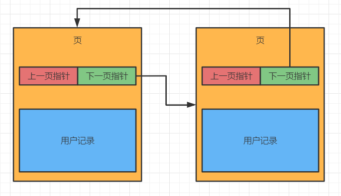

同时，页数据通过**单向链表**进行链接。因为这些数据是分散在 Buffer Pool 中的，单向链表可以将这些分散的内存连接起来。

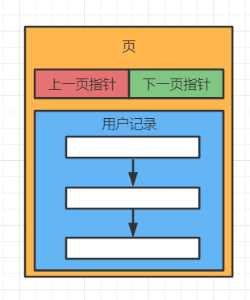

到这里可能有一个疑问，用户记录里是单链表。最坏的情况下，需要的数据可能在链表末端，此时查询数据就比较低效。为了解决这个问题，MySQL 又在页中加入 **Page Directory**。

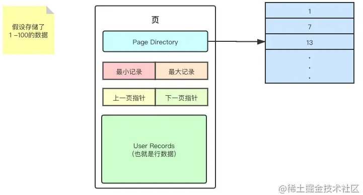

Page Directory 是个目录，里面有多个**槽位（Slot）**，每一个槽位都指向一条 **User Records**。并且每隔几条数据，就会创建一个槽位。槽位分组数量并不是固定 6 条，会根据页内记录分布动态调整。

MySQL 在新增数据时就将对应的 Slot 创建好，有了 Page Directory ，就可以对一张页的数据进行粗略的**二分查找**。

为什么是粗略？因为 Page Directory 中包含的不是完整的数据，二分查找出来的结果只能是个大概的位置，找到了这个大概的位置之后，还需要回到 User Records 中继续的进行遍历。

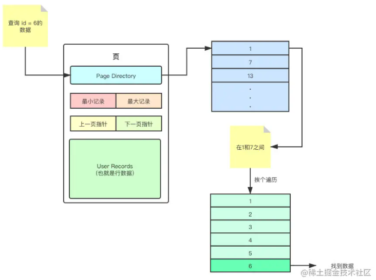

### Log Buffer

Log Buffer 用来存储即将被刷入到磁盘文件中的日志，例如 Redo Log。Log Buffer 的默认值通常为 16MB，可以通过参数 `innodb_log_buffer_size` 调整。

Log Buffer 越大，就可以存储越多的 Redo Log。这样一来在事务提交之前就不需要将 Redo Log 刷入磁盘，只需要放到 Log Buffer 中。因此较大的 Log Buffer 就可以更好的支持较大的事务运行；如果有事务会大量的更新、插入或者删除行，那么适当的增大 Log Buffer 的大小，也可以有效的减少磁盘 IO 操作。

Log Buffer 中的数据刷入到磁盘的频率可以通过参数 `innodb_flush_log_at_trx_commit` 来指定。

---

## 数据读写操作

### 写操作

进行写操作时，可以把一批数据放在一起，先将数据写到内存的某个批次中，再将该批次的数据一次性刷到磁盘上。

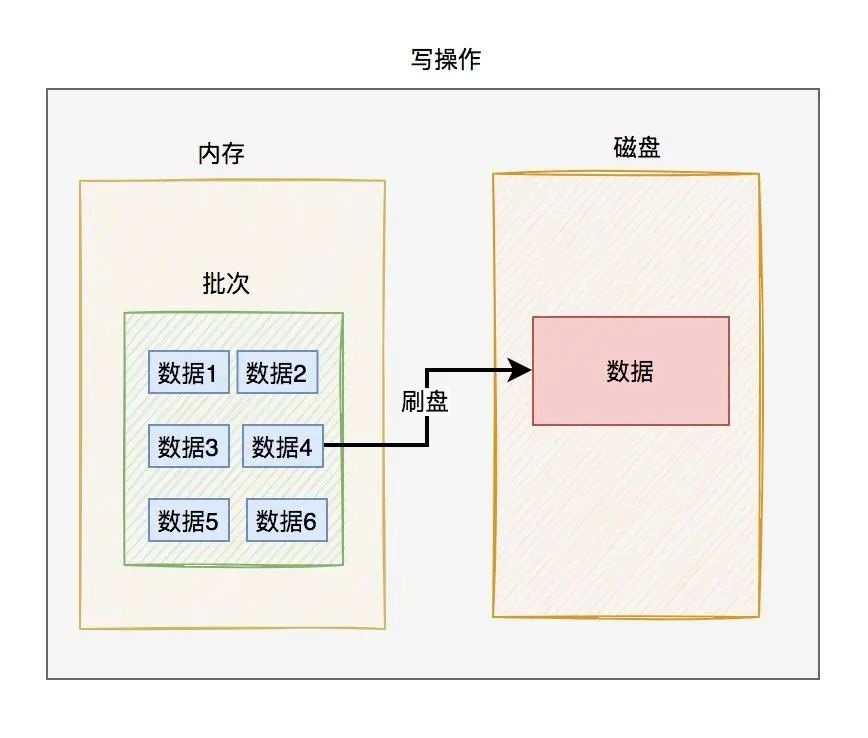

### 读操作

读操作通常会先检查 Buffer Pool，未命中时才从磁盘读取数据页到内存，然后在内存中完成后续处理。

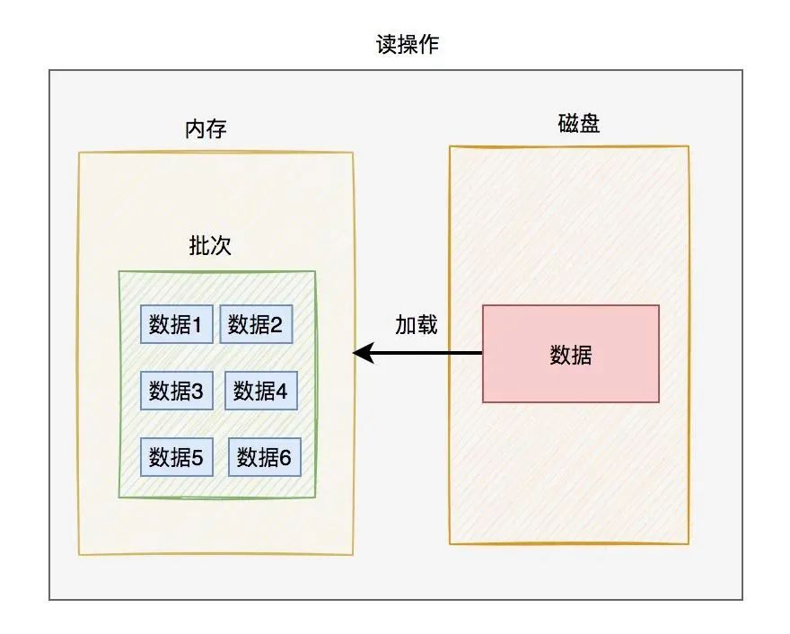

> 将内存中的数据刷到磁盘，或者将磁盘中的数据加载到内存，都是以批次为单位，这个批次就是我们常说的：数据页。InnoDB 中存在多种不同类型的页，数据页只是其中一种。

磁盘中各数据页的整体结构如下图所示：

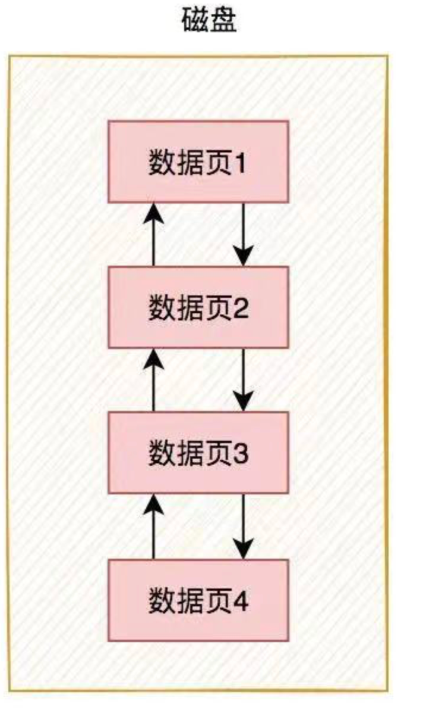

通常情况下，单个数据页默认大小是 `16KB`。也可以通过参数 `innodb_page_size` 重新设置。

---

## 数据页结构

> 关于页的解析这里有一篇[文章](https://mp.weixin.qq.com/s/ygsG_B4fQmSxNinIpAq72A)

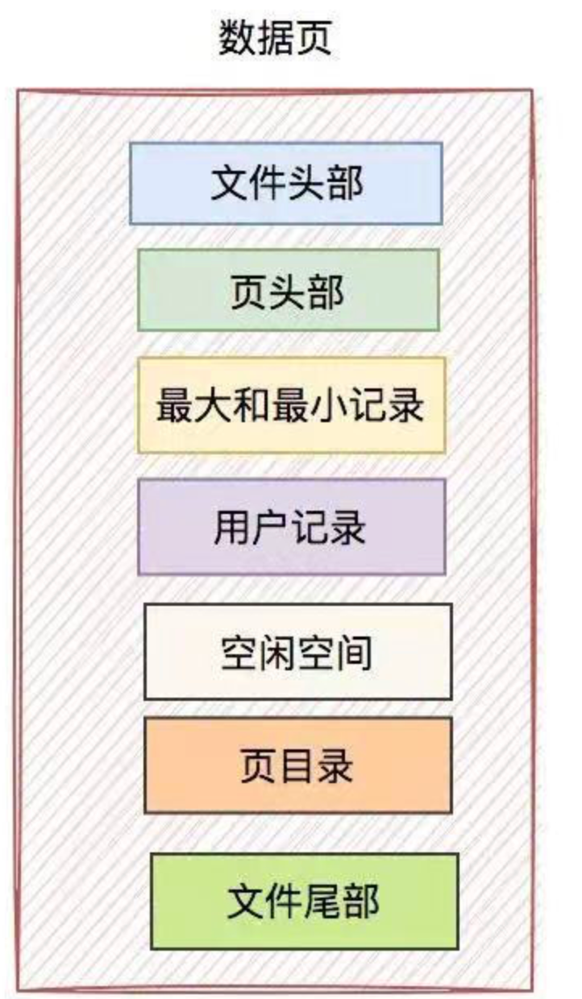

数据页主要包含：文件头部、页头部、最大和最小记录、用户记录、空闲空间、页目录、文件尾部。

### 文件头部

其中 4 个最关键的信息：页号、上一页号、下一页号、页类型。InnoDB 是通过页号、上一页号和下一页号来串联不同数据页的。

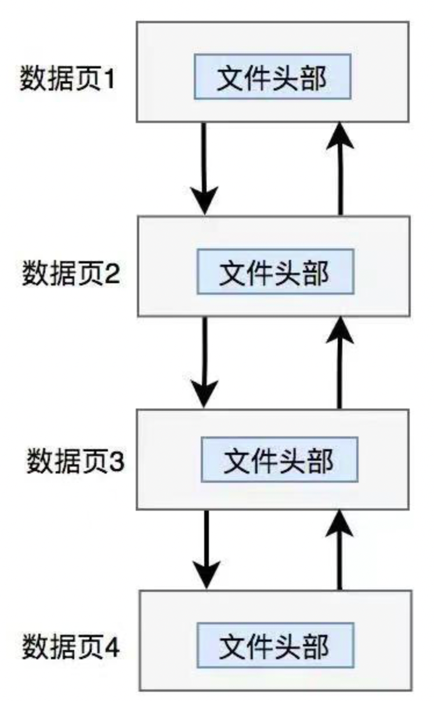

不同的数据页之间，通过上一页号和下一页号构成**双向链表**。通过文件头部包含的多个信息，MySQL 能够轻松访问不同数据页。

### 页头部

> 包含数据页的信息，比如一页数据保存多少条记录，页目录到底使用了多个槽等。同时还记录：已删除记录所占的字节数、最后插入记录的位置、最大事务 id、索引 id、索引层级

### 最大最小记录

MySQL 在保存用户记录的同时，数据库会自动创建两条额外的记录：最小记录 Infimum 和最大记录 Supremum。

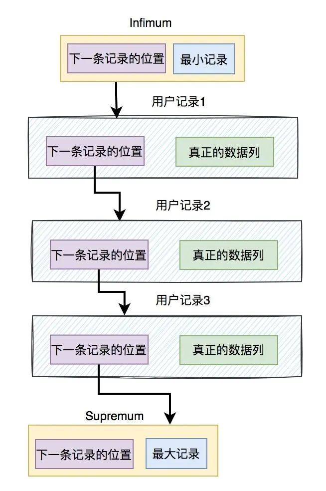

在一个数据页中，如果存在多条用户记录，从最小记录开始通过*下一条记录*相连，一直到最大记录。

有了最小/最大记录后，可以先做边界判断，再结合页目录缩小查找范围，避免在页内无序全量扫描。

如下图所示，要查询的数据 `id = 101` ，明显不在当前页。就可以通过下一页指针跳到下页进行检索。

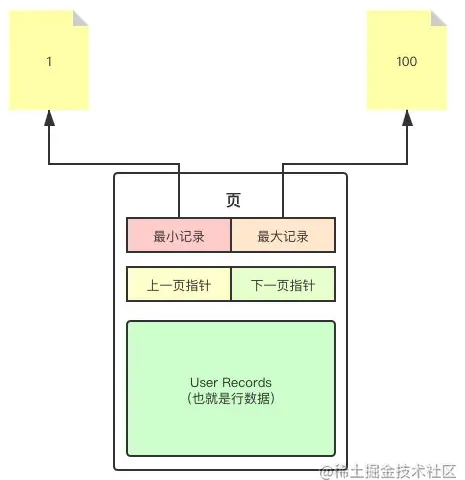

### 用户记录

对于新申请的数据页，用户记录是空的。当插入数据时，InnoDB 会将一部分*空闲空间*分配给用户记录。

InnoDB 支持的用户记录数据行格式为：

* compact 行格式
* redundant 行格式
* dynamic 行格式
* compressed 行格式

以 compact 行格式为例：

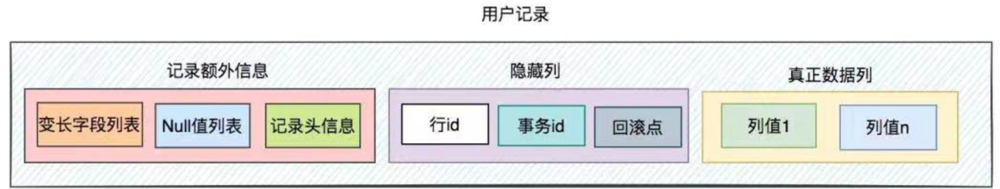

用户记录主要包含三部分内容：

1. 记录额外信息，它包含了变长字段、NULL 值列表和记录头信息
2. 隐藏列，它包含了行 id、事务 id 和回滚点
3. 真正的数据列，包含真正的用户数据，可以有很多列

**额外信息**

> 额外信息并非真正的用户数据，它是为了辅助存数据用的。

1）变长字段列表

有些数据如果直接存会有问题，比如：如果某个字段是 varchar 或 text 类型，它的长度不固定，可以根据存入数据的长度不同，而随之变化。

如果不记录数据真正的长度，InnoDB 不知道要分配多少空间。假如都按某个固定长度分配空间，但实际数据又没占多少空间，就会造成空间利用的浪费。所以需要在变长字段中记录某个变长字段占用的字节数，方便按需分配空间。

2）NULL 值列表

数据库中有些字段的值允许为 NULL，如果把每个字段的 NULL 值都保存到用户记录中，显然有些浪费存储空间。

> 有没有办法只简单标记一下，而不存储实际的 NULL 值呢？

NULL 值列表（NULL bitmap）只针对“可为 NULL 的列”。位图中的位值用于表示该列当前值是否为 NULL（而不是“该列是否允许为 NULL”），用位图可节省存储空间。

3）记录头信息

记录头信息用于描述一些特殊的属性。

它主要包含：

- deleted_flag，删除标记，用于标记该记录是否被删除了。
- min_rec_flag，最小目录标记，它是非叶子节点中的最小目录标记。
- n_owned，拥有的记录数，记录该组索引记录的条数。
- heap_no，堆上的位置，它表示当前记录在堆上的位置。
- record_type，记录类型，其中：0 表示普通记录，1 表示非叶子节点，2 表示 Infimum 记录，3 表示 Supremum 记录。
- next_record，下一条记录的位置。

**隐藏列**

数据库在保存一条用户记录时，会自动创建一些隐藏列。如下图所示：

目前 InnoDB 自动创建的隐藏列有三种：

1）db_row_id，行 id，它是一条记录的唯一标识。

如果表中有主键，聚簇索引键直接使用主键；如果没有主键，InnoDB 会选择第一个 `NOT NULL` 唯一索引作为聚簇索引键；如果两者都没有，才会自动创建隐藏列 `db_row_id`。在 InnoDB 中，`db_trx_id` 和 `db_roll_ptr` 会被创建，而 `db_row_id` 取决于表结构。

2）db_trx_id，事务 id，它是事务的唯一标识。

3）db_roll_ptr，回滚指针，用于定位 undo 记录，支持事务回滚与 MVCC 历史版本访问。

**真正数据列**

真正的数据列中存储了用户的真实数据，它可以包含很多列的数据。

**用户记录是如何相连的？**

`记录额外信息 ==> 记录头信息 ==> 下一条记录的位置`

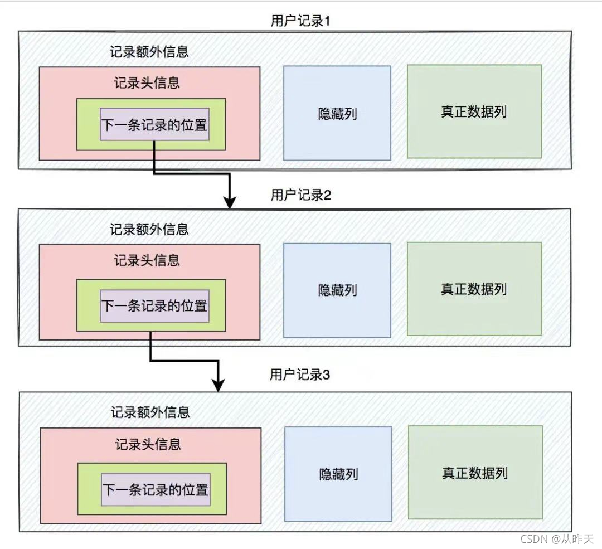

多条用户记录之间通过*下一条记录的位置*，组成了一个单向链表。

### 空闲空间

最开始的时候用户记录是空的，当插入数据的时候就会向空闲空间中申请空间，当无可用空闲空间，则需要申请新的页

### 页目录

> Page Directory

### 文件尾部

> 防止页在刷入磁盘过程中因异常导致“页写入不完整（torn page）”而引发数据不一致

数据库的数据是以数据页为单位，加载到内存中。如果数据有更新的话，需要刷新到磁盘上。如果数据在刷新到磁盘的过程中出现了异常，比如进程被关闭或者服务被重启，这时数据可能只刷新了一部分。如何判断上次刷盘的数据是完整的呢？这就需要用到*文件尾部*。它记录了页面的*校验和 (checksum)*。

在数据刷新到磁盘之前，会先计算页面的校验和。后面如果数据有更新，会计算一个新校验和。文件头部和尾部都会记录这个校验和。

由于文件头部在前面，会先被刷新到磁盘上。刷新页数据到磁盘时，假设刷新了一部分就出现异常。这时文件尾部的校验和还是一个旧值。数据库会去校验文件尾部的校验和，如果不等于文件头部的值，说明该数据页的数据是不完整的。

---
