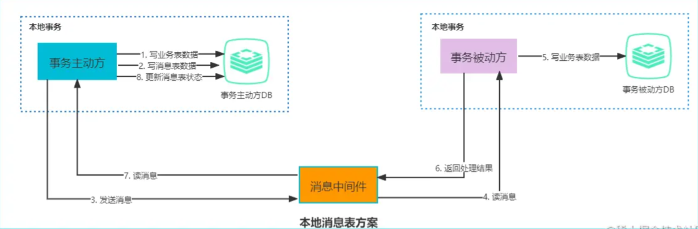

# 分布式事务

> 事务的参与者、资源服务器以及事务管理器分别位于分布式系统的不同节点上，因此称为分布式事务。事务操作分布在不同的服务器上，且属于不同的应用，分布式事务需要保证这些小操作要么全部成功，要么全部失败。本质上来说，分布式事务就是为了保证不同数据库的数据一致性。比如微服务电商交易、跨行转账等。
> 
> 分布式事务的实现方式有很多，可以采用 InnoDB 提供的 XA 事务支持，也可以采用消息队列来实现最终一致性。

## CAP 理论

不同于本地事务的 ACID 特性，分布式事务（乃至分布式系统）主要特性为 CAP：

* C（一致性）

  分布式系统中，要保证某个节点更新了数据之后，其他节点都能读取到这个最新的数据。如果有某个节点没有读取到，那就是分布式不一致。

* A（可用性）

  非故障的节点在合理的时间内返回合理的响应（不是错误和超时的响应）。可用性的关键：合理的时间；合理的响应。

  合理的时间指的是请求不能无限被阻塞，应该在合理时间返回；合理的响应指的是请求得到“符合语义”的结果（成功或明确失败），而不是超时或无响应。

* P（分区容错性）

  在一个服务集群中，有一个服务网络出现了问题，要保证该集群仍然能正常工作。

**CAP 如何选择？**

在分布式系统中，分区（服务集群）肯定存在，因此必定需要满足 P。此外，网络环境不是 100% 可靠的，此时就需要在 A 和 C 之间进行选择：

* 如果需要保证高可用，就需要适当削弱一致性；
* 如果要保证一致性，就需要适当削弱可用性。

注意，这里用的是“削弱”，而不是“放弃”，还是需要使用一些别的手段来保证 A 或者 C 的。比如，使用快速失败/响应机制来保证 A；使用日志等手段来保证 C。

CAP 三者不能同时存在，只能满足 AP 或者 CP 原则：

* 对于 CP 来说，就是追求强一致性和分区容错性；
* 对于 AP 来说，就是追求分区容错性和可用性，AP 是很多分布式系统设计时的选择。

## BASE 理论

BASE 是 *Basically Available*（基本可用）、*Soft state*（软状态）和 *Eventually consistent* （最终一致性）三个短语的缩写，是对 CAP 中 AP 的一个扩展。

* 基本可用，分布式系统在出现故障时，允许损失部分可用功能，保证核心功能可用。
* 软状态，允许系统中存在中间状态，这个状态不影响系统可用性，这里指的是 CAP 中的不一致。
* 最终一致性，最终一致是指经过一段时间后，所有节点数据都将会达到一致。

BASE 和 ACID 是相反的，它完全不同于 ACID 的强一致性模型，而是通过牺牲强一致性来获得可用性，并允许数据在一段时间内是不一致的，但最终会达到一致状态。

---

## XA 协议

XA 协议分为两部分：**事务管理器/事务协调者**和**本地资源管理器**。其中事务管理器则作为一个全局的调度者，负责协调各个本地资源的提交和回滚等操作，本地资源管理器往往由数据库实现。

## 2PC

> 两段提交（2PC）是基于 XA 协议实现的分布式事务。

> 2PC 分为两个阶段：**准备和提交**。

**准备阶段**

事务协调者给每个事务参与者发送准备命令，每个参与者收到命令之后执行相关事务操作。可以认为除了事务的提交，其他关于事务的操作都做了。每个参与者会返回响应告知协调者自己是否准备成功。

**提交阶段**：协调者根据收集的响应，如果有参与者响应准备失败，那么协调者就向所有参与者发送回滚命令，反之发送提交命令。

> 在 2PC 中事务协调者有超时机制，若是事务协调者在第一阶段未收到个别参与者的响应，等待一定时间后就会认为事务失败，会发送回滚命令。

**优点**：2PC 对业务侵⼊很小，可以像使⽤本地事务⼀样使⽤基于 XA 协议的分布式事务，能够严格保障事务 ACID 特性。

**缺点**：

* 2PC 是一个强一致性的**同步阻塞**协议，事务执⾏过程中需要将所需资源全部锁定，比较适⽤于执⾏时间确定的短事务。
* **单点故障问题**，一旦事务协调者出现故障，事务参与者会一直处于锁定资源的状态。
* 协调者故障恢复前，系统可能长时间处于不确定状态；在异常实现或人工介入不当时也可能引入数据不一致风险。

## 3PC

> **三段提交**是 2PC 的一种改进版本。2PC 当协调者崩溃时，参与者不能做出最后的选择，就会一直保持阻塞锁定资源。

为解决两阶段提交协议的阻塞问题：3PC 在协调者和参与者中都引入了超时机制，协调者出现故障后，参与者不会一直阻塞。而且在第一阶段和第二阶段中又插入了一个**预提交阶段**，保证了在最后提交阶段之前各参与节点的状态是一致的。

> 3PC 分为三个阶段：**准备、预提交和提交**

**准备阶段**：协调者会先检查参与者是否能接受事务请求进行事务操作。如果参与者全部响应成功则进入下一阶段。

**预提交阶段**：协调者向所有参与者发送预提交命令，询问是否可以进行事务的预提交操作。参与者接收到预提交请求后，如果成功的执行了事务操作，则返回成功响应，进入最终提交阶段；如果有参与者中有向协调者发送了失败响应，或因网络造成超时，协调者没有收到该参与者的响应，协调者会向所有参与者发送 `abort` 命令，参与者收到 `abort` 命令后中断事务的执行。

**提交阶段**：如果前两个阶段中所有参与者响应均为 YES，协调者向所有参与者发送提交命令正式提交事务。

> 虽然 3PC 用超时机制解决了协调者故障后参与者的阻塞问题，但也多了一次网络通信，性能上反而变得更差。

## TCC

> TCC（*Try Confirm Cancel*）又称**补偿事务**，与 2PC 相似，事务处理流程也很相似，但 2PC 是应用于在数据库层面，TCC 则可以理解为在应用层面的 2PC，需要自定义编写业务逻辑来实现。
>

**TCC 核心思想**是：针对每个操作（Try）都要注册一个与其对应的确认（Confirm）和补偿（Cancel）。

TCC 的实现分为**两个阶段**，需要在业务层面实现对应的**三个方法**（Try、Confirm、Cancel），主要用于处理跨数据库、跨服务业务操作的一致性问题。

**第一阶段**：Try，负责**资源检查和预留**，完成所有业务检查（一致性），预留必须业务资源（准隔离性）。

**第二阶段**：Confirm 或 Cancel。Confirm 执行真正的业务操作，Cancel 执行预留资源的取消，回滚到初始状态。

以下单扣库存为例，Try 阶段去占库存，Confirm 阶段则实际扣库存，如果库存扣减失败 Cancel 阶段进行回滚，释放库存。

**TCC 可能存在的问题**

**幂等问题**：因为网络调用无法保证请求一定能到达，所以通常会有重试机制，因此 Try、Confirm、Cancel 三个方法都需要幂等实现，避免重复执行产生错误。

**空回滚问题**：指的是 Try 方法由于网络问题超时了，此时事务管理器就会发出 Cancel 命令，那么需要支持在未执行 Try 的情况下能正常的 Cancel。

**悬挂问题**：指 Try 方法由于网络阻塞超时触发了事务管理器发出了 Cancel 命令，**但是执行了 Cancel 命令之后 Try 请求到了**。对于事务管理器来说这时候事务已经是结束了的，到达的 Try 操作就被**悬挂**了，所以空回滚之后还需要将操作记录，防止 Try 的再调用。

**TCC 优缺点**

TCC 一般不会像 XA 那样长时间持有数据库锁，资源阻塞问题相对更轻；一旦出现异常通过 Cancel 进行业务补偿，这也是常说的补偿性事务。

TCC **对业务的侵入性很强**，需要三个方法来支持，而且这种模式并不能很好地被复用。还要考虑到网络波动等原因，为保证请求一定送达都会有重试机制。

> TCC 适用于一些强隔离性和强一致性，并且执行时间较短的业务。

## 本地消息表

本地消息就是利用了**本地事务**，在数据库中存放一个本地事务消息表，在进行本地事务操作时加入了本地消息的插入。

* 业务执行
* 消息表插入消息

这两个操作放在同一个事务中提交。

本地事务执行成功，消息也插入成功，再调用其他服务，如果调用成功就修改本地消息的状态。

**核心思路是将分布式事务拆分成本地事务进行处理，并通过消息的方式来异步执行。**

**整体流程**

事务发起方处理业务和记录事务消息在本地事务中完成，轮询事务消息表发送事务消息，事务被动方基于消息中间件消费事务消息表中的事务。

这样可以避免以下两种情况导致的数据不一致性：

* 业务处理成功、事务消息发送失败；
* 业务处理失败、事务消息发送成功。

**流程中必要的容错处理**

* 步骤 1 出错，由于在处理的是本地事务，直接本地回滚；
* 步骤 2 或 3 出错，由于事务主动方本地保存了消息，只需要轮询失败的消息，重新通过消息中间件发送，事务被动方重新读取消息处理业务；
* 事务被动方业务处理失败，通过重试、补偿消息等机制驱动主动方执行**补偿动作**；
* 如果被动方已消费消息但后续步骤失败，应通过幂等和补偿流程修正状态，而不是回滚已提交的本地事务。

**消息事务优缺点**

事务执行不依赖 MQ 的本地事务能力，MQ 主要承担异步通知与重试驱动作用，最终通过补偿动作收敛一致性。

但消息数据与业务数据同库，占用业务系统资源。与具体的业务场景绑定，耦合性强。业务系统在使用关系型数据库的情况下，消息服务的性能会受到关系型数据库并发性能的局限。

## MySQL 分布式事务

MySQL 从 5.0.3 开始，InnoDB 存储引擎支持 XA 协议的分布式事务。在 MySQL 中，使用分布式事务涉及一个或多个资源管理器和一个事务管理器。MySQL 的 XA 事务本质上基于两阶段提交（2PC）实现。

## RocketMQ 事务消息

> 详情查看 RocketMQ 文章

---
