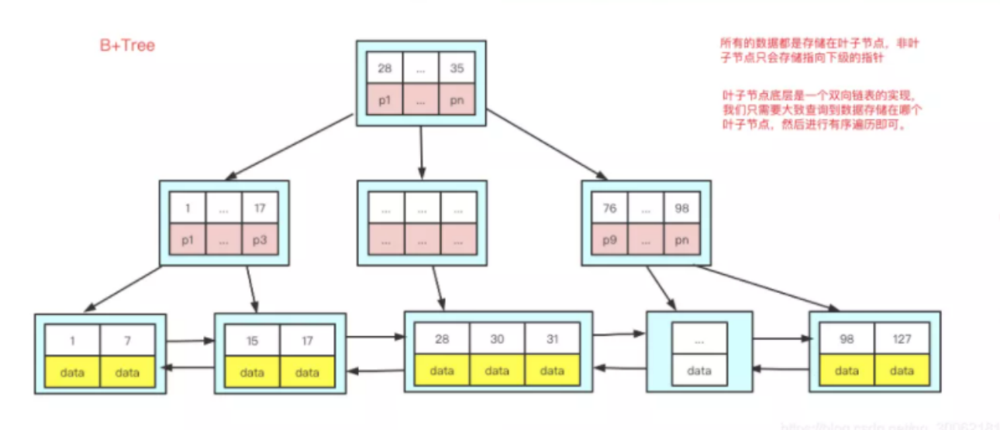
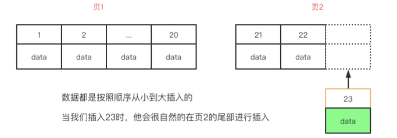
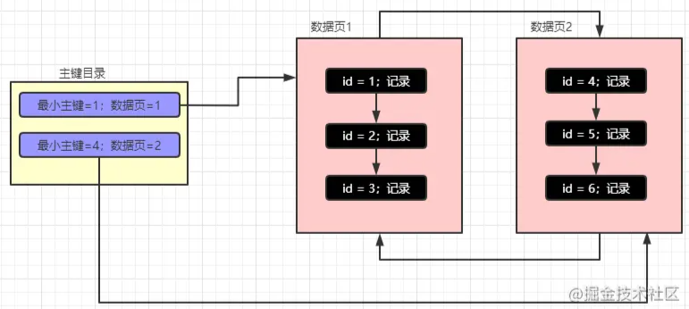
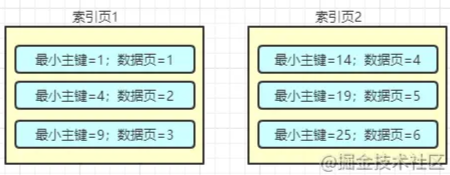
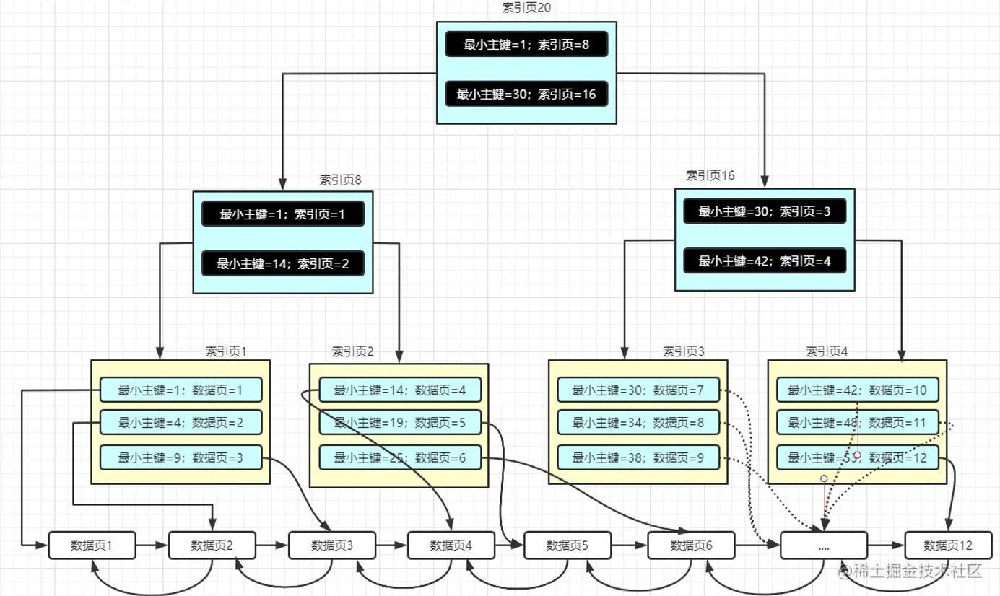
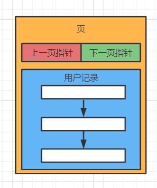
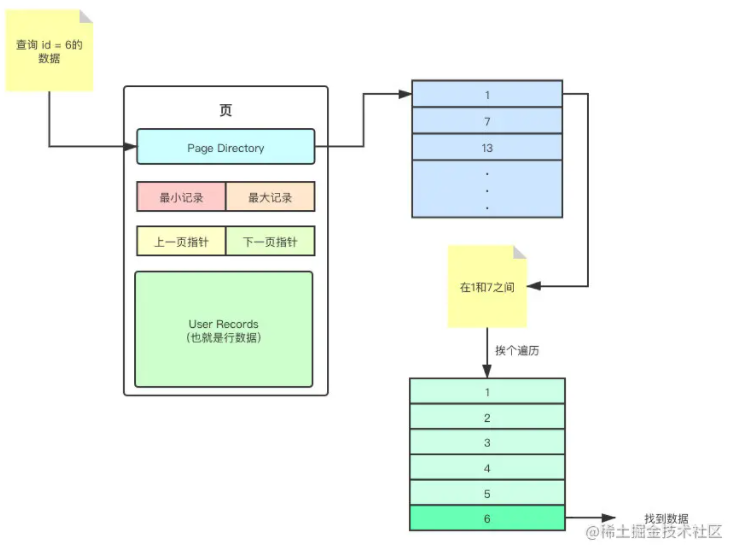

# MySQL

## 前言

### 关系型数据库

> 关系型数据库将数据存储在不同的数据表中。关系型数据库结构被组织成物理文件，以优化速度。逻辑上，关系型数据库包含数据库/表/视图/行/列。
>
> 关系型数据库可以定义不同的规则（Schema）用来管理数据库中不同数据字段，并组织不同字段之间的关系。比如说，一对一，一对多，多对多等。

**特点**

* 存储媒介：关系型数据库的数据存储在**磁盘**，比内存稳定，但是高并发下 IO 压力大，面对大量存储数据无法快速响应；

* 存储结构：关系型数据库按照**结构化存储**数据，数据表提前定义好字段，再根据表的结构存入数据。提前定义结构使得数据表乃至整个数据库的可靠性和稳定性都比较高，但后续修改表结构不方便；

* 存储规范：关系型数据库按照**数据表**的形式进行存储，但表之间存在复杂的关系，随着数据表数量的增加，数据管理会越来越复杂；

* 扩展方式：水平扩展（增加数量）和垂直扩展（按业务拆分）；

* 查询：采用结构化查询语言（SQL）进行查询，可以进行复杂的查询，也支持创建查询索引。但后续需要同时兼顾数据和索引的存储/维护，海量数据的索引存储和维护开销也是巨大的；模糊查询/全文搜索能力较弱，可以考虑使用如 Elasticsearch 等非关系型数据库来实现；

* 事务支持：关系型数据库强调 ACID 原则，强调数据的强一致性，支持事务的操作。关系型数据库可以控制事务原子性细粒度，方便回滚操作；

  但要保证事务操作的特性就需要在数据库中加各种锁，而且数据量增长之后还要面对数据库的拆分，就需要解决分布式事务。

…

### 非关系型数据库

**特点**

* 存储媒介：非关系型数据库大多数（不是所有）都是和内存打交道的，比如 Redis，数据存储在内存中，以实现数据高性能/高并发访问；

* 存储结构：NoSQL 无需为存储的数据提前建立字段，可以存储自定义的数据格式。常见的有键值/列簇/文档/图形等存储格式；
* 查询：复杂的查询不容易实现；
* 事务支持：非关系数据库对事务操作的要求没有那么严格，无法保证数据的一致性和安全性；
* 高性能：具有非常高的读写性能。得益于无关系性，数据库的结构简单。从缓存方面看，NoSQL 的 Cache 是记录级的，是一种细粒度的 Cache，性能较高；

* 高可用：NoSQL 在不太影响性能的情况，就可以方便地实现高可用的架构。

…

---

<br>

## 体系架构

由上至下分为：网络连接层，服务层，存储引擎层，系统文件层。


…

### 网络连接层

Connectors，提供给各种客户端应用程序（JDBC、ODBC）接入 MySQL 服务的接口。客户端与服务端建立连接，客户端发送 SQL 语句到服务端执行。

…

---

### 服务层

1、**管理服务和工具组件**，系统管理和控制工具，如备份恢复、安全管理、MySQL 复制、集群管理等

2、**连接池**

- 由于每次建立连接需要消耗很多时间，连接器的作用就是将这些连接缓存下来，下次可以直接用已经建立好的连接，提升服务器性能
- 主要负责连接管理、授权认证等。每个客户端连接都对应着服务器上的一个线程，服务器上维护可一个线程池，避免为每个连接都创建销毁一个线程。当客户端连接到 MySQL 服务器时，服务器对其进行认证，可以通过用户名和密码进行认证，也可以通过 SSL 证书进行认证。登录认证后，服务器还会验证的客户端角色是否有执行某个查询的操作权限

…

3、**SQL 接口**，接收客户端发送过来的 SQL 命令，并返回操作结果

- **DDL**（Data Definition Language），DDL 允许用户定义数据，也就是创建表、删除表、修改表结构这些操作。通常，DDL 由数据库管理员执行（面向 DBA）
- **DML**「Data Manipulation（操纵） Language」，DML 为用户提供添加、删除、更新数据的能力，这些是应用程序对数据库的日常操作（面向开发者）
- **DQL**（Data Query Language），DQL 允许用户查询数据，这也是通常最频繁的数据库日常操作（面向用户）

…

4、**查询解析器**

- SQL 命令传递到解析器的时候会被解析器**验证和解析**
- MySQL 是一个 DBMS（数据库管理系统），无法直接理解 SQL 语句，查询解析器负责对 SQL 语句进行验证和解析，让 DBMS 知道下一步该做什么

…

5、**查询优化器**

SQL 语句在查询之前会使用查询优化器对查询进行优化，查询优化器使用的是**选取、投影、联接**策略进行查询，以此选择一个最优的查询路径

```sql
select uid, name from user where uid = "1";
```

优化路径如下：

1. `select` 查询先根据 `where` 语句进行选取，而不是先全表查询后再进行条件过滤
2. `select` 查询先根据 uid 和 name 进行属性投影，而不是将属性全部取出来后再进行过滤
3. 将这两个查询条件联接起来，生成最终查询结果

…

6、**缓存**

- 缓存和缓冲组件，查询缓存，如果查询缓存有命中的查询结果，查询语句就可以直接在查询缓存中读取数据
- MySQL 8.0 以后，缓存被移除。因为查询缓存的失效非常频繁，如果在一个写多读少的环境中，缓存会频繁的新增和失效。对于某些更新压力大的数据库来说，查询缓存的命中率会非常低。5.6 版本默认关闭，推荐将缓存放在客户端
- MySQL 缓存机制是由一系列小缓存组成的。比如表缓存/记录缓存/key 缓存/权限缓存等

…

---

### 存储引擎层

…

MySQL 通过各种不同的技术将数据存储在文件中。每一种技术都使用不同的存储机制、索引技巧、锁方式，并且提供不同功能和能力来操作数据。这些不同的技术以及配套的相关功能在 MySQL 中被称作**存储引擎**，也称作**表类型**。

…

**细节**

- 存储引擎负责数据的存储和读取，与数据库文件打交道
- **存储引擎只有 MySQL 才有，不是所有的关系型数据库都有存储引擎这个概念**。MySQL 区别于其他数据库最重要的一个特点就是，支持插件式的**表存储引擎**。**存储引擎是基于表的**。
- MySQL 采用插件式的存储引擎，提供了多种存储引擎，每种存储引擎有不同的特点

…

**查询 MySQL 存储引擎**

```sql
show engines;
```

…

**常见存储引擎**

1、**InnoDB**，默认事务型存储引擎

- 用来处理大量的短期（Short-Lived）事务，除非有特别的原因，否则应该优先考虑 InnoDB

- 提供事务提交，回滚和崩溃回复能力

- 行级锁，并发能力强，适合高并发操作

- 支持外键，默认使用 B+ 树数据结构存储索引。使用 InnoDB 的表，其数据的物理组织形式是**聚簇表**。

- 存在缓冲管理，通过缓冲池，将索引和数据全部缓存起来，加快查询的速度。

  读数据，会首先从缓冲池中读取，若是没有则从磁盘读取再放入缓冲池；

  写数据，会首先写入缓冲池，再定期同步到磁盘上。

- 占用空间是 MyISAM 的2.5倍，处理效率相对会差一些

- InnoDB 不保存表的具体行数，执行 ` select count(*) from table` 时需要全表扫描。而 MyISAM 用一个变量保存了整个表的行数，执行上述语句时只需要读出该变量即可

…

2、**MyISAM**，拥有较高的插入/查询速度

- 提供全文索引，空间函数（GIS）等特性
- 不支持事务，推荐以 `select/insert` 为主的应用使用
- 全表锁，拥有较快的执行速度，并发性能差
- 不支持外键，使用 B+ 树数据结构存储索引
- 占用空间比 InnoDB 小

…

> MyISAM 全称 My Indexed Sequential Access Method，它的出现比 InnoDB 早，在 MySQL 5.5 之后逐步被 InnoDB 取代。

…

3、**Memory**

- 所有数据置于内存的存储引擎，速度快，拥有极高的插入/更新/查询效率。会占用与数据量成正比的内存空间，且数据在 MySQL 重启时会丢失
- 全表锁
- 默认使用 Hash 索引，检索效率非常高，主要用于内容变化不频繁且数据量较小的表

…

4、Archive

- Archive 档案存储引擎只支持 `insert/select` 操作，在 MySQL 5.1 之前不支持
- 适合日志和数据采集类应用
- 占用空间小，Archive 表比 MyISAM 表小约 75%，比 InnoDB 表小约 83%

…

5、CSV

- CSV 引擎可以将普通的 CSV 文件作为 MySQL 表来处理，但不支持索引
- CSV 存储的数据可以在操作系统里用文本编辑器或 Excel 打开
- CSV 引擎可以作为一种数据交换机制

…

6、Merge，一组 MyISAM 表的组合，在超大规模数据存储时很有用

…

**InnoDB 与 MyISAM 对比**

|          | InnoDB                | MyISAM |
| -------- | --------------------- | ------ |
| 事务支持 | 支持                  | 不支持 |
| 锁范围   | 行级锁                | 表级锁 |
| 自增主键 | 支持                  | 支持   |
| 外键     | 支持                  | 不支持 |
| 索引结构 | B+ 树                 | B+ 树  |
| 空间占用 | 约为 MyISAM 的 2.5 倍 | -      |

…

---

**不同索引自增主键的区别**

> 一张表里面有 ID 自增主键，当 insert 了 17 条记录之后，删除了第 15，16，17 条记录，把 MySQL 重启，再 insert 一条记录，这条记录的 ID 是 18 还是 15 ？

如果表的存储引擎类型是 MyISAM，是 18。因为 MyISAM 表会把自增主键的最大 ID 记录到数据文件中，重启 MySQL 自增主键的最大 ID 也不会丢失；

如果表的存储引擎类型是 InnoDB，是 15。因为 InnoDB 表只是把自增主键的最大 ID 记录到内存中，所以重启数据库或对表进行 `OPTION` 操作，都会导致最大 ID 丢失。

…

**不同索引 count 的区别**

> 哪个存储引擎执行 `select count(*)` 更快?

MyISAM 更快，因为 MyISAM 内部维护了一个计数器，可以直接调用。在 MyISAM 存储引擎中，把表的总行数存储在磁盘上，当执行 `select count(*)` 时，直接返回。

InnoDB 没有将总行数存储在磁盘上，当执行 `select count(*)` 时，先把数据读出来，一行一行的累加，最后返回总数量。数据量越大，InnoDB 执行该语句就越耗时。这跟 InnoDB 的事务特性有关，**由于多版本并发控制（MVCC）的原因，InnoDB 表应该返回多少行也是不确定的**。

…

---

### 系统文件层

系统文件层主要是将数据库的数据存储在文件系统中，并完成与存储引擎的交互。其存储的文件主要有：日志文件、数据文件、配置文件、MySQL 的进程 pid 文件和 socket 文件等。

…

#### 日志文件

1、错误日志（Error log），默认开启，`show variables like '%log_error%;'`

2、通用查询日志（General query log），记录一般查询语句，`show variables like '%general%';`

3、二进制日志（Binary log），[MySQL Binlog 介绍](https://blog.csdn.net/wwwdc1012/article/details/88373440)

记录了对 MySQL 数据库执行的更改操作，并且记录了语句的发生时间、执行时长；但是它不记录 `select、show` 等不修改数据库的 SQL，主要用于数据库恢复和主从复制。

```shell
# 是否开启
show variables like '%log_bin%';
# 参数查看
show variables like '%binlog%'; 
# 查看日志文件
show binary logs;
```

4、慢查询日志（Slow query log）

记录所有执行时间超时 `long_query_time` 的查询 SQL，默认是 10 秒。

```shell
# 是否开启
show variables like '%slow_query%';
# 时长
show variables like '%long_query_time%';
```

5、中继日志，中继日志也是二进制日志，用来给 slave 库做恢复

6、事务日志，redo log 和 undo log

…

默认情况下除了错误日志，其他日志都是关闭状态。

| 日志类型                                | 日志信息                                      |
| --------------------------------------- | --------------------------------------------- |
| 错误日志                                | 记录 MySQL 服务启动、运行或停止时的日志       |
| 通用查询日志                            | 记录与客户端建立连接和进行语句收发记录        |
| 二进制日志                              | 记录数据修改记录或主从复制数据记录            |
| 中继日志                                | 从主从复制的主机接收到的数据修改记录          |
| 慢查询日志                              | 记录查询时间超过 `long_query_time` 时间的记录 |
| DDL log (metadata log) 数据查询语句日志 | 记录 DDL 语句元数据操作的信息                 |
| 事务日志                                | redo/undo log                                 |

…

> [MySQL 日志与备份](https://juejin.cn/post/7072904284643262501)

…

#### 配置文件

用于存放 MySQL 所有的配置信息文件，比如 `my.cnf`、`my.ini`等。

…

#### 数据文件

不同的存储引擎，存储在文件系统中的数据文件格式不同：

1、MyISAM

- `*.frm`，与表相关的元数据信息都存放在 frm 文件中，包括表结构的定义信息等
- `*.MYD`，MyISAM Data，存储 MyISAM 表的数据，每一张 MyISAM 表对应一个 MYD 文件
- `*.MYI`，MyISAM Index，存储 MyISAM 表的索引相关信息，每一张 MyISAM 表对应一个 MYI 文件

…

2、InnoDB

- `*.frm`，与表相关的元数据信息都存放在 frm 文件中，包括表结构的定义信息等
- `*.ibd`，InnoDB Data，存储表数据和索引
- `*.ibdata`，与 `*.ibd` 相同

…

InnoDB 的数据存储方式能够通过配置来决定是使用**共享表空间**存放存储数据，还是**独享表空间**存放存储数据。

* 独享表空间存储方式使用 ibd，并且每个表为一个 ibd 文件。
* 共享表空间存储方式采用 ibdata 文件，即所有的表共同使用一个 ibdata 文件。

决定使用哪种表的存储方式可以通过 MySQL 的配置文件中的 `innodb_file_per_table` 来指定。InnoDB 默认使用的是独享表的存储方式，好处是当数据库产生大量文件碎片的时候，整理磁盘碎片对线上运行环境的影响较小。

…

**pid 文件**

pid 文件是 mysqld 应用程序在 Unix/Linux 环境下的一个进程文件，和许多其他 Unix/Linux 服务端程序一样，它存放着自己的进程 id。

…

**socket 文件**

socket 文件也是在 Unix/Linux 环境下才有的，用户在 Unix/Linux 环境下客户端连接可以不通过TCP/IP 网络而直接使用 Unix Socket 来连接 MySQL。

…

---

<br>

## MySQL 操作

```shell
mysqld & # 启动 MySQL 进程

mysqld_safe & # 安全启动 MySQL 进程

mysql -uroot -p # MySQL 客户端进行命令行操作

# mysqladmin 管理 MySQL 进程操作，查看 MySQL 状态，重启/关闭 MySQL 等
mysqladmin -uroot shutdown # 关闭 MySQL 服务
```

…

---

<br>

## 数据类型

### CHAR/VARCHAR

`CHAR` 和 `VARCHAR` 类似，但是在下面两个点有差别：

* **存储和读取**数据的表现上有所不同。
* 支持**存储的最大长度和字符串末尾空格的处理方式**有差异。

…

**定义阶段**

CHAR 和 VARCHAR 在定义的时候都需要指定所存储的字符串的最大长度。

…

**长度前缀**

与 CHAR 不同，VARCHAR 存储内容为 1 字节或 2 字节的**长度前缀**加上数据。长度前缀表示所存储值的字节数。如果数值不超过 255 字节，一列使用 1 长度字节，如果数值超过 255 字节，则使用 2 个长度字节。

…

**字符长度**

CHAR 的长度是固定的，支持的范围为 0 到 255；VARCHAR 是可变长度的字符串类型，它的长度范围为 0 到 65535。VARCHAR 的有效最大长度取决于行的最大值（65535 bytes， 由所有的数据列共享）和使用的字符集类型。

…

**长度补全**

存储的 CHAR 数据长度未达到创建表时的指定长度，会在末尾添加上一定长度的空格补全长度。当读取 CHAR 类型的数据时，除非开启 [PAD_CHAR_TO_FULL_LENGTH](https://dev.mysql.com/doc/refman/8.0/en/sql-mode.html#sqlmode_pad_char_to_full_length) 模式，否则末尾的空格会被移除。

VARCHAR 列数据在存储时，若是数据长度未达到指定的长度，不会对其内容进行填充。在存储和读取的时候，VARCHAR 会按照标准的 SQL 执行模式，保留尾随空格。

…

**长度溢出**

CHAR 类型不管 SQL 模式是否严格，如果插入的数据超过指定长度，其尾随空格会以静默的方式截断；VARCHAR 类型不管 SQL 模式是否严格，如果插入的数据超过指定长度，其尾随空格会在插入前被截断，然后生成警告。

…

**字符截断**

如果没有开启 SQL 严格模式，当 CHAR/VARCHAR 列存储的数据达到最大长度，超出的字符会被截断，并且会抛出警告；如果开启了 SQL 严格模式，当 CHAR/VARCHAR 列存储的数据达到最大长度，对于非空格字符的截断，可能会抛出错误。

…

下列表格展示了 CHAR 和 VARCHAR 列在存储指定长度为 4 的值时的不同表现（假设列数据使用的字符集是单字节字符集，比如说 latin1）

| Value      | CHAR(4)  | Storage Required | VARCHAR(4) | Storage Required |
| ---------- | -------- | ---------------- | ---------- | ---------------- |
| ''         | `'    '` | 4 bytes          | ''         | 1 byte           |
| 'ab'       | `'ab  '` | 4 bytes          | 'ab'       | 3 bytes          |
| 'abcd'     | 'abcd'   | 4 bytes          | 'abcd'     | 5 bytes          |
| 'abcdefgh' | 'abcd'   | 4 bytes          | 'abcd'     | 5 bytes          |

> 需要注意，需要开启非严格 SQL 模式，上表中的最后一行数据才能被保存，否则超过长度的数据将不会被保存，并且还会报错。

…

> 一个给定的值被保存到 CHAR(4) 和 VARCHAR(4) 列中，读取到的数据不一定总是相同的，因为 CHAR 列在读取数据的时候会将尾随空格去除。

```bash
mysql> CREATE TABLE vc (v VARCHAR(4), c CHAR(4));
Query OK, 0 rows affected (0.01 sec)

mysql> INSERT INTO vc VALUES ('ab  ', 'ab  ');
Query OK, 1 row affected (0.00 sec)

mysql> SELECT CONCAT('(', v, ')'), CONCAT('(', c, ')') FROM vc;
+---------------------+---------------------+
| CONCAT('(', v, ')') | CONCAT('(', c, ')') |
+---------------------+---------------------+
| (ab  )              | (ab)                |
+---------------------+---------------------+
1 row in set (0.06 sec)
```

可以看到，读取到的 varchar 数据并没有去掉尾随空格，而 char 类型的数据去掉了尾随空格。

..

> **InnoDB 对 CHAR 的优化**
>
> InnoDB 会将长度大于或等于 768 字节的固定长度字段编码为可变长度字段，让数据可以在页外存储。如果字符集的最大字节长度大于 3，一个 CHAR(255) 列可以超过 768 字节，比如 utf8mb4。

…

> **CHAR/VARCHAR & TEXT**
>
> `CHAR`, `VARCHAR`, 和 `TEXT` 数据会根据分配给该列的字符集规则进行排序和比较。

…


---

<br>

## SQL

### 执行流程


1、客户端通过**连接器**（JDBC、ODBC），客户端与 MySQL 服务器**建立连接**，将 **SQL 语句发送**到 MySQL 服务器；

2、MySQL **服务器验证请求**的用户名和密码是否正确，账户正确；在系统表中验证用户权限，验证通过，进行下一步，验证不通过则报错；

3、命中**缓存**，从缓存中取结果返回；未命中缓存，继续下一步，进入 SQL 查询解析器；

4、**查询解析器**对 SQL 语句进行解析，包括预处理和解析过程。在这个阶段会对 SQL 语句进行关键词和非关键词提取、解析，组成解析树。

关键字如：`select/update/in/or/where/group by`等，如果分析到语法错误，报错 `ERROR: You have an error in your SQL syntax`。同时也会对 SQL 语句做一些验证，如：表是否存在，字段是否存在等；

5、在查询之前，使用**查询优化器**对查询进行优化，查询优化器使用的是**选取、投影、联接**策略进行查询，如：将 SQL 语句中的查询条件调换位置，为让底层能使用索引，选择一个最优的查询路径

6、**执行器**，调用存储引擎对应的 API，根据 SQL 语句对数据文件进行操作，执行完成之后，将具体操作保存到 bin log 中（`select` 操作除外）。

7、返回结果

…

---

### 关键字

#### describe

用来获取表结构信息

```shell
mysql> DESCRIBE City;
+------------+----------+------+-----+---------+----------------+
| Field      | Type     | Null | Key | Default | Extra          |
+------------+----------+------+-----+---------+----------------+
| Id         | int(11)  | NO   | PRI | NULL    | auto_increment |
| Name       | char(35) | NO   |     |         |                |
| Country    | char(3)  | NO   | UNI |         |                |
| District   | char(20) | YES  | MUL |         |                |
| Population | int(11)  | NO   |     | 0       |                |
+------------+----------+------+-----+---------+----------------+
```

类似 `show columns`

```shell
mysql> SHOW COLUMNS FROM City;
+-------------+----------+------+-----+---------+----------------+
| Field       | Type     | Null | Key | Default | Extra          |
+-------------+----------+------+-----+---------+----------------+
| ID          | int(11)  | NO   | PRI | NULL    | auto_increment |
| Name        | char(35) | NO   |     |         |                |
| CountryCode | char(3)  | NO   | MUL |         |                |
| District    | char(20) | NO   |     |         |                |
| Population  | int(11)  | NO   |     | 0       |                |
+-------------+----------+------+-----+---------+----------------+
```

…

---

#### explain

用于查询 SQL 语句执行计划（查看 MySQL 会如何执行某条 SQL 语句）。


当使用 explain 查询某条 SQL 语句的时候，MySQL 会展示经过 SQL 优化器优化之后该 SQL 语句的执行信息，比如：有无使用索引，使用了什么关键字（where/and）等。

| 输出列名      | 解释                                                         |
| ------------- | ------------------------------------------------------------ |
| id            | 查询执行的顺序，数字越小越先执行                             |
| select_type   | 查询的类型：SIMPLE/PRIMARY/SUBQUERY/UNION/...                |
| table         | 查询的表名                                                   |
| partitions    | 查询结果所在的分区                                           |
| type          | 表示 MySQL 查询优化器选择的访问方法或操作类型：All/index/range/ref/eq_ref/const(system)/NULL |
| possible_keys | 可能被选择使用的索引                                         |
| key           | 真正使用到的索引                                             |
| key_len       | 使用的索引长度                                               |
| ref           | The columns compared to the index                            |
| rows          | Estimate of rows to be examined                              |
| filtered      | Percentage of rows filtered by table condition               |
| Extra         | Additional information                                       |

id 表示查询执行的顺序，数字越小越先执行

…

select_type 表示查询的类型：

* SIMPLE，简单的 SELECT 查询，不包含子查询或联接操作
* PRIMARY，复杂的 SELECT 查询中的最外层查询
* SUBQUERY，子查询，作为其他查询的一部分
* DERIVED，派生表，通过 FROM 子句中的子查询或临时表生成的中间结果
* UNION，UNION 查询的第二个或后续的 SELECT 语句
* UNION RESULT，UNION 查询的结果集

…

type 表示 MySQL 查询优化器选择的访问方法或操作类型，效率由低到高：

* all，执行全表扫描，遍历整个表来获取符合条件的数据，效率最低
* index，执行全索引扫描，遍历整个索引来获取符合条件的数据
* range，使用索引范围条件进行查询，根据索引中的范围进行数据访问
* ref，在连接查询中，使用非唯一索引或唯一索引的部分前缀来访问表中的数据
* eq_ref，在连接查询中，使用等值条件（`=`）连接不同表的索引，每个匹配的索引值只对应一行数据
* const，使用常量条件进行查询，根据主键或唯一索引访问单行数据，查询效率最高

…

key_len 表示使用到的索引长度，需要根据数据库的字符集类型以及表中的列选择的数据类型结合起来计算。[参考](https://mp.weixin.qq.com/s/8qemhRg5MgXs1So5YCv0fQ)。

…

ref 表示使用非唯一索引或唯一索引的部分前缀来进行表之间的连接：

* 对于单表查询：ref 表示使用非唯一索引或唯一索引的部分前缀进行条件匹配
* 对于连接查询：ref 表示使用非唯一索引或唯一索引的部分前缀进行连接操作

当查询语句中的条件使用到非唯一索引或唯一索引的部分前缀时，MySQL 优化器会选择使用 ref 类型的访问方法来加速查询。

…

filtered 表示对表进行条件过滤后，预计返回结果的行数所占的百分比：

* filtered 列的值为 100% 表示查询结果不需要进一步过滤，即所有行都满足查询条件
* filtered 列的值为 0% 表示查询结果需要完全过滤，即没有行满足查询条件
* filtered 列的值介于 0% 和 100% 之间表示查询结果需要根据条件进行过滤，值越接近 100% 表示过滤的效果越好

…

Extra 表示额外的执行信息，如是否使用临时表、文件排序等，一般使用 group by 语句时会出现额外执行信息。

…

---

### SQL 规范

1、尽量避免进行全表扫描

2、不要超过三张表关联

3、表字段不宜过多，对太多字段的表进行拆分

4、尽量不使用 `select *`

5、适当建立索引，但是不能建立过多索引

6、根据不同的功能使用不同的存储引擎，插入、查询较多则使用 MyISAM，支持事务使用 InnoDB

7、尽量避免大段的事务操作

…

### [SQL 执行计划](#explain)

…

—

### 常见问题

…

> `count(PrimaryKey)/count(*)/count(1)/count(ColumnName)` 区别

执行效果上

- `count(PrimaryKey)` 统计主键列，如果会忽略 NULL 值列

- `count(*)` 包括所有的列，相当于行数。在统计结果的时候，**不会忽略列值为 NULL**

- `count(1)` 包括所有列，用 1 代表占位符没有实际意义。效果和 `count(*)` 相同，在统计结果的时候，**不会忽略列值为 NULL**。

  > ```sql
  > select count(1) from t_order;
  > ```
  >
  > 统计「 t_order 表中，1 这个表达式不为 NULL 的记录」有多少个。1 这个表达式就是单纯数字，它永远都不是 NULL，所以上面这条语句，其实是在统计 t_order 表中有多少个记录。

- `count(列名)` 只包括列名那一列。在统计结果的时候，**某个字段值为 NULL 时不统计。**

  > ```sql
  > select count(name) from t_order;
  > ```
  >
  > 统计「 t_order 表中，name 字段不为 NULL 的记录」有多少个。

…

执行效率上

count(1) = count(*) > count(主键) > count(列名)

> [具体分析](https://www.xiaolincoding.com/mysql/index/count.html#count-%E5%AD%97%E6%AE%B5-%E6%89%A7%E8%A1%8C%E8%BF%87%E7%A8%8B%E6%98%AF%E6%80%8E%E6%A0%B7%E7%9A%84)

..

> `UNION`和 `UNION ALL` 的区别

* `UNION` 在进行表连接后会筛选掉重复的数据记录（效率较低），而 `UNION ALL` 则不会去掉重复的数据记录；
* `UNION` 会按照字段的顺序进行排序，而 `UNION ALL` 只是简单的将两个结果合并就返回；

…

> `IN` 和 `EXISTS` 的区别？

1. 语法结构不同：`EXISTS` 是一个子查询（Subquery）关键字，用于检查一个查询结果是否存在；而 `IN` 是一个用于比较的运算符，用于检查某个值是否在一组值中。
2. 执行方式不同：`EXISTS` 在执行时会先执行子查询，获取子查询的结果集，然后再根据外层查询的条件进行判断。而 `IN` 则会直接将待比较的值与一组值进行比较，`IN` 查询相当于多个 `OR` 条件的叠加
3. 性能差异：`EXISTS` 可以在某些情况下具有较好的性能，因为它可以通过使用索引来优化查询。而 `IN` 在比较大的值集时可能会导致性能较差，因为它需要将待比较的值与一组值进行逐一比较。
4. 语义差异：`EXISTS` 通常用于检查子查询是否返回了结果，例如用于检查某个表中是否存在满足特定条件的记录。而 `IN` 则用于比较某个值是否在一组值中，例如用于查询某个表中某一列的值是否在另一个表的列中出现。

> 如果查询的两个表大小相当，`IN` 和 `EXISTS` 差别不大；如果两个表中一个较小，一个是大表，则子查询表大的用 `EXISTS`，子查询表小的用 `IN`

…

---

<br>

## 索引

> 索引，是关系数据库中对某一列或多个列的值进行预排序的**数据结构**，能加快对数据的访问速度。

除了数据，数据库系统还维护着特定数据结构，这些数据结构以某种方式指向数据，可以在这些数据结构上实现高级查找算法。这种数据结构就是索引，**索引的本质是一种数据结构**。使用索引，可以让数据库系统不必扫描整个表，直接定位到符合条件的记录，加快查询速度。

索引是建立在数据库表中的某些列的上面。在创建索引时，应仔细考虑在哪些列上创建索引，哪些列不创建索引。

…

### 关于索引

**优点**

- 通过创建唯一性索引，可以保证数据库表中每一行数据的唯一性；
- 索引减少了需要扫描的数据量，加快数据的查询速度；
- 索引可以将随机 IO 变成顺序 IO。

**缺点**

- 创建索引和维护索引要耗费时间，随着数据量的增加而增加；
- 索引需要占物理空间，除了数据表占用数据空间之外，每一个索引还要占用一定的物理空间，如果需要建立聚簇索引，占用的空间更大；
- 对表中的数据进行增、删、改的时候，索引也要动态的维护。

…

### 索引操作

```sql
-- 创建索引的基本语法
CREATE INDEX indexName ON table(column(length));
-- 参数 length 默认可以忽略
CREATE INDEX idx_name ON user(name);
```

…

---

### 索引结构

…

#### B 树

> 所有结点中孩子结点个数的最大值称为 B 树的阶，通常用 **m** 表示。从查找效率考虑，要求 **m >= 3**。

…

一颗 m 阶的 B 树要么是一颗**空树**，要么是满足以下要求的 **m 叉树**：

- 每个结点最多有 **m** 个分支（子树）；
- 最少分支的结点要看是否为根结点：如果是根结点，则至少有两个分支；非根非叶结点至少有 **[m/2]** 个分支（ **[a]** 是对 **a** 向上取整）；
- **k=2**（根结点）或 **k=[m/2]** （非根结点），有 **n**（`k<=n<=m`）个分支的结点有 **n-1** 个关键字，关键字按照递增顺序排序。

…

**结点结构**

<div>
  <table>
    <tr>
      <td>n</td>
    	<td>k<sub>1</sub></td>
      <td>k<sub>2</sub></td>
      <td>...</td>
      <td>k<sub>n</sub></td>
    </tr>
    <tr>
    	<td>p<sub>0</sub></td>
      <td>p<sub>1</sub></td>
      <td>p<sub>2</sub></td>
      <td>...</td>
      <td>p<sub>n</sub></td>
    </tr>
  </table>
</div>
…


- **n** 为结点中关键字的个数；
- **k<sub>i</sub>** 为结点的关键字，且满足 **k<sub>i</sub> < k<sub>i+1</sub>**；
- **p<sub>i</sub>**（`0<=i<=n`）为指向孩子结点指针，且满足 **p<sub>i</sub>**（`1<=i<=n-1`）所指结点上的关键字大于 **k<sub>i</sub>** 且小于 **k<sub>i+1</sub>**，**p<sub>0 </sub>** 所指结点上的关键字小于 **k<sub>1</sub>**，且 **p<sub>n </sub>**所指结点上的关键字大于 **k<sub>n</sub>**；
- 结点内关键字互不相等，按从小到大排序；
- 叶子结点处于同一层，可以用空指针表示查找失败到达的位置。

…


…

**B树特征**

- 在 B 树中，具有 n 个关键字的结点含有 n+1 个分支；
- 关键字集合分布在整棵树中，任何一个关键字出现且只出现在一个结点中；
- 搜索有可能在非叶子结点结束；搜索性能等价于在关键字全集内做一次二分查找；
- 自动平衡控制。

…

B 树的查找是多路查找，从根结点开始，对结点内的关键字（递增排序）序列进行二分查找，如果命中则结束。否则进入查询关键字所属范围的孩子结点，并重复二分查找，直到遍历到的结点为空（查找失败），或者命中。

> 平衡 m 叉查找树是指每个关键字的左子树和右子树高度差绝对值不超过 1 的查找树，其结点结构与 B 树结点结构相同。因此可认为 B 树是平衡 **m** 叉查找树，但限制更强，要求把所有叶子结点放在同一层。

…

---

#### B+ 树

> 基于 B 树和叶子结点顺序访问指针进行实现。

**m 阶 B+ 树的细节**

- 根且非叶子结点的孩子结点数为 **[2, m]**；
- 非根非叶结点的孩子结点数为 **[m/2, m]**；
- 在 B+ 树中，具有 **n** 个关键字的结点含有 **n** 个分支；而在 B 树中，具有 **n** 个关键字的结点含有 **n+1** 个分支
- 在 B+ 树中，每个结点（非根结点）中的关键字个数 **n** 的取值范围为 `[m/2]<=n<=m`，根结点取值范围为 `2<=n<=m`；而在 B 树中，它们的取值范围分别是 `[m/2]-1<=n<=m-1`和 `1<=n<=m-1`；
- B+ 树中的**所有非叶子结点仅仅起到索引的作用**（作为叶子结点的索引），结点中的每个索引项只含有对应子树的最大关键字和指向该字数的指针；
- 在 B+ 树中**叶子结点包含全部关键字的数据**，叶子结点的指针指向**数据记录**；
- 在 B+ 树上有一个指针指向关键字最小的叶子结点，所有叶子结点连接成一个双向线性链表，而 B 树没有；
- B+ 树的搜索与 B 树也基本相同，区别是 B+ 树只有达到叶子结点才命中（B 树可以在非叶子结点命中），其性能也等价于在关键字全集做一次二分查找；
- B+ 树是自底向上插入的，优先会将数据插入到叶子结点中，然后整个树会根据底部的叶子结点进行变动。

…

**B+ 树特征**

- 所有关键字都出现在叶子结点组成的链表中（稠密索引），且链表中的关键字是有序的；
- 查找操作不会在非叶子结点命中； 
- 非叶子结点相当于叶子结点的索引（稀疏索引），叶子结点相当于是存储（关键字）数据的数据层；
- 每一个叶子结点都包含一个指向下一个叶子结点的指针，从而方便叶子结点的范围遍历；
- 更适合文件索引系统。

…



…

---

**B+ 树与 B 树索引对比**

1. B+ 树的磁盘**读写代价更低**

   B+ 树的数据都集中在叶子结点，分支结点只作为索引存在；B 树的分支结点既有指针也有数据。相较于 B 树，B+ 树每个非叶子结点存储的关键字数更多，因此 B+ 树的**层次低**于 B 树，也就是说 B+ 树平均的 IO 次数会小于 B 树。
   
2. B+ 树的查询**效率更加稳定**

   B+ 树的数据都存放在叶子结点，因此任何关键字的查找必须走一条从根结点到叶子结点的路径，**所有结点的查询路径相同**，每个数据查询效率相当。
3. B+ 树更**易于遍历**

   由于 B+ 树的数据都存储在叶子结点中，分支结点均为索引，遍历只需要扫描一遍叶子结点即可；B 树分支结点同样存储着数据，要找到具体的数据，需要进行一次中序遍历按序来搜索。B+ 树需要遍历有序链表，而 B 树需要对整颗树进行中序遍历。
4. B+ 树更**擅长范围查询**

   B+ 树叶子结点存放数据，数据是按照顺序放置的双向链表。B 树范围查询只能中序遍历。
5. B+ 树**占用内存空间小**

   B+ 树索引结点没有数据，比较小。在内存有限的情况下，相比于 B 树索引可以加载更多 B+ 树索引。

…

---

**推荐使用自增 id 而不是 uuid 或者身份证号等**

叶子结点链表会根据当前最后一条的位置，将最新的一条数据顺序的插入到后面



但是当插入一个 uuid 时，MySQL 不知道该插入到哪个位置，需要从头开始寻找插入的位置。当插入的页满了，就造成页的分裂和合并，极大影响效率


而且使用 uuid，由于 uuid 占用字节较长，就导致每一页存储的数据就会变少，也不利于索引的数据查询

…

---

#### 哈希

> 哈希索引就是采用一定的哈希算法，把存储的键的哈希指算出来，**使用哈希值代替键值存储**。检索时不需要类似 B+ 树一样从根结点到叶子结点逐级查找，只需要执行一次哈希算法就可定位到相应的位置，速度非常快。
>
> …
>
> Memory 存储引擎使用的就是 Hash 索引。

**特点**

- Hash 索引就是将索引字段进行 hash 存储，整个 hash 索引的结构是 Hash 表 + 链表（因为会存在 hash 冲突）；

- 哈希索引仅仅能满足 `=`、`in` 和 `<=>` 查询，不能使用范围查询（大于小于），也不支持任何范围查询；

  > `<=>` 类似 `=` 运算符，`=` 运算符中的 NULL 值没有任何意义。`=` 号运算符不能把 NULL 作为有效的结果。此时可以使用 `<=>`。

- 由于哈希索引比较的是进行哈希运算后的 Hash 值，所以 Hash 索引适合精确查找。

…

<br>

**哈希和 B+ 树的区别**

- 如果是等值查询，哈希索引占有绝对优势，因为只需要经过一次算法就可找到相应的键值；前提是所有的键值都是唯一的，如果键值不唯一，就需处理哈希冲突；
- 如果是范围查询，B+ 树占绝对优势，因为原先是有序的键值，经过哈希算法后，就可能变成不连续了；
- B+ 树索引的关键字检索效率比较平均，不像 B 树那样波动幅度大。在有大量重复键值情况下，哈希索引因为存在哈希碰撞，效率也是极低的；
- 哈希索引没有办法利用索引完成排序，以及 `like ` 迷糊查询（`like` 本质上是范围查询）；
- 哈希不支持多列联合索引的左右匹配规则。

…

---

### 索引分类

> 逻辑分类和物理分类

**逻辑分类**

* 功能划分：主键索引、唯一索引、普通索引、全文索引、空间索引
* 按列划分：单列索引，组合索引

…

**物理分类**

* 聚簇索引
* 非聚簇索

…

---

#### 逻辑分类（功能划分）

* **主键索引**，一张表只能有一个主键索引，不允许重复、不允许为 NULL

```sql
ALTER TABLE TableName ADD PRIMARY KEY(column_list); 
```

…

* **唯一索引**，数据列不允许重复，允许为 NULL 值，一张表可有多个唯一索引，但是一个唯一索引只能包含一列，比如身份证号码、卡号等都可以作为唯一索引

```sql
CREATE UNIQUE INDEX IndexName ON `TableName`(`字段名`(length));
# 或
ALTER TABLE TableName ADD UNIQUE (column_list); 
```

…

* **普通索引**，一张表可以创建多个普通索引，一个普通索引可以包含多个字段，允许数据重复，允许 NULL 值插入

```sql
CREATE INDEX IndexName ON `TableName`(`FieldName`(length));
# 或
ALTER TABLE TableName ADD INDEX IndexName(`FieldName`(length));
```

…

* **全文索引**，查找的是文本中的关键词，主要用于全文检索。它用于替代效率较低的 `LIKE` 模糊匹配操作，而且可以通过多字段组合的全文索引一次性全模糊匹配多个字段。使用的数据结构是 B 树。

…

* **空间索引**

空间索引是对空间数据类型的字段建立的索引，MySQL 中的空间数据类型有 4 种，分别是 `GEOMETRY/POINT/LINESTRING/POLYGON`。

MySQL 使用 `SPATIAL` 关键字创建空间索引：

```sql
CREATE TABLE `gim` (
  `path` varchar(512) NOT NULL,
  `box` geometry NOT NULL,
  PRIMARY KEY (`path`),
  SPATIAL KEY `box` (`box`)
) ;
```

> **注意**
>
> * 创建空间索引的列，必须将其声明为 `NOT NULL`
> * 空间索引只能在存储引擎为 MYISAM 的表中创建

…

---

#### 逻辑分类（按列划分）

* **单列索引**，一个索引只包含一个列，一个表可以有多个单例索引；

* **组合索引/复合索引**，一个组合索引包含多个列。

  查询的时候遵循 MySQL 组合索引的**最左前缀**原则，从左到右匹配，**查询条件要包含建立索引时最左边的字段，索引才会生效**。

```sql
-- 创建索引的基本语法
CREATE  INDEX indexName ON table(column1(length),column2(length));
-- 例子 
CREATE INDEX idx_phone_name ON user(phone, name);
```

…

---

#### 最左匹配原则

> 也叫**最左前缀匹配原则**

首先基于建立一个联合索引：

```sql
create table tb_test (
	id int auto increment primary key not null, -- 主键
  age int,
  height float,
  weight float
)

CREATE INDEX idx_age_height_weight ON user(age, height, weight)
```

上文提到过，索引的数据结构是 B+ 树，B+ 树优化查询效率的其中一个因素就是对数据进行排序。

在 MySQL 中，联合索引的排序有一个原则：*依据联合索引的成员来进行排序*，从左往右依次比较大小。**无法进行排序比较的列，就无法走联合索引。**

在创建 `idx_age_height_weight` 时的比较流程：如果 age 相等，比较 height，如果 height 相等，比较 weight。

…

**从下面的例子看组合索引如何才能生效**

```sql
create index idx_phone_name on user_innodb(phone, name);

-- 1
SELECT * FROM user_innodb where name = 'zs';
-- 2
SELECT * FROM user_innodb where phone = '1234567890';
-- 3
SELECT * FROM user_innodb where phone = '1234567890' and name = 'zs';
-- 4
SELECT * FROM user_innodb where name = 'zs' and phone = '1234567890';
```

根据最左匹配原则，2、3 语句肯定能走 `idx_phone_name` 索引。*3 和 4 相比 where 条件的顺序不一样，那么 4 能不能走索引呢？*

答案是**可以的**。

因为在执行 SQL 之前，会经过 SQL 优化器。优化器会根据 SQL 来识别该用哪个索引，在这里可以理解为 3 和 4 在 MySQL 中是等价的。

…

**最左匹配特点**

* `=` 和 `in` 可以乱序

比如 `a=1 and b=2 and c=3` 建立（a, b, c）索引可以任意顺序，MySQL 的查询优化器会优化成索引可以识别的形式。

* 最左前缀匹配原则，MySQL 会一直向右匹配直到遇到范围查询（>、<），就停止匹配后面的列索引。

比如，建立（a, b, c, d）顺序的索引，`a=3 and b=4 and c>5 and d=6`，其中 d 是无法使用索引的，如果建立（a, b, d, c）的索引则都可以使用到，`a、b、d` 的顺序可以任意调整。

* …

> InnoDB 中只要有主键被定义，主键列会被作为一个聚簇索引，而其它索引都将被作为非聚簇索引，在创建表的时候已经创建了主键，所以 `idx_age_height_weight` 就是一个非聚簇索引，查询时需要**回表**<sup>后面再谈</sup>。

> 关于组合索引和最左匹配遇到 `between/like` 表现如何？可以参考[这篇文章](https://mp.weixin.qq.com/s/8qemhRg5MgXs1So5YCv0fQ)深入。

…

---

<br>

#### 物理分类

…

##### **非聚簇索引**

> 辅助索引/二级索引

- B+ 树叶子结点中没包含数据表中行记录的话就是非聚簇索引，索引和数据是分开的；
- 叶子结点的数据域记录着主键的值，因此在使用辅助索引进行查找时，首先通过辅助索引找到主键值，然后到主键索引树中通过主键值找到数据行，这个过程称为**回表**；
- 一个表可以存在多个非聚簇索引。


…

##### 聚簇索引

- B+ 树索引中的叶子结点中包含数据表中行记录的话就是聚簇索引。叶子结点数据域记录着完整的数据记录，也将聚集索引的叶子结点称为数据页。

- 按照每张表的主键构造一颗 B+ 树，同时叶子结点存放整张表的行记录，将索引与数据存放到一起，找到索引也就找到了数据。

  > 聚簇索引将表中的数据也划分成索引的一部分，每张表只能拥有一个聚簇索引。

…

> 在 MySQL 中，聚簇索引是通过将表的数据行存储在索引树的叶子节点中实现的，这就意味着聚簇索引决定了表中数据行的物理存储顺序。
>
> 如果一个表有多个聚簇索引，那么就会存在数据行在多个索引树中重复存储，导致数据的冗余和不一致，增加了存储空间和维护成本，并且可能引发查询结果的不确定性和性能下降。所以*一个表只能有一个聚簇索引*。

…

**优点**

1、数据访问更快，因为聚簇索引将索引和数据保存在同一个 B+ 树中，找到索引就找到了数据；

2、聚簇索引对于主键的排序查找和范围查找速度非常快。

…

**缺点**

1、插入速度严重依赖于插入顺序，按照主键的顺序插入是最快的方式。因此对于 InnoDB 表，一般都会定义一个自增的 ID 列为主键；

> 主键列不要选没有意义的自增列，选经常查询的条件列，否则无法体现其主键索引性能。

2、更新主键的代价很高，因为将会移动被更新的行。对于 InnoDB 表，一般定义主键为不可更新；

3、非聚簇索引访问数据需要进行两次查找操作（回表）：第一次找到主键值；第二次根据主键值找到行数据。

…

---

### 内部分页

**主键目录**

每个数据页中有一个最小的主键，每个数据页的页号和最小的主键会组成一个*主键目录*。假设现在要查找主键为 2 的数据，通过二分查找法最后确定下主键为 2 的记录在数据页 1 中，此时就会定位到数据页 1 接着再去定位主键为 2 的记录。



**索引页**

假设有 1000 万条记录、5000 万条记录呢？就算是二分法查找，其效率也依旧是很低的。为了解决这种问题 MySQL 使用一种新的存储结构**索引页**。


假设主键目录中的记录是非常非常多的，MySQL 会将里面的记录拆分到不同的索引页中。



索引页中记录的是每页数据页的页号和该数据页中最小的主键的记录，也就是说最小主键和数据页号不是单纯的维护在主键目录中了，而是演变成了索引页，索引页和数据页类似，一张不够存就分裂到下一张。

像这种**索引页+数据页**组成的组成的 B+ 树就是**聚簇索引**。



…

---

<br>

### 覆盖索引

**覆盖索引**（*Covering Index*），或者叫索引覆盖。覆盖索引包含了查询所需的所有列的数据，允许查询直接从索引中获取所需的数据，无需再去访问实际的数据表。

例如有表结构如下

```sql
create table tb_test(
  id int auto increment not null,
  name varchar,
  age int
)；

create index idx_name on tb_test(name);
```

默认情况下存在自增主键 `id`，并且我们创建了非聚簇索引/二级索引 `idx_name` 当我们使用下面的语句查询时，

```sql
select id from tb_test where name = 'aaa';
```

显然是会走到 `idx_name` 这个索引的。

同时由之前的聚簇索引与非聚簇索引的关系可以知道，非聚簇索引 `idx_name` 指向聚簇索引，在这里也就是主键索引 `id`。很巧，`id` 恰恰就是我们需要的数据。无需回表，从二级索引就直接拿到了需要的数据，这就是覆盖索引。

> **一个索引包含（覆盖）满足查询结果的数据，就叫做覆盖索引。**

**查询列被所建的索引覆盖**，查询的数据列就能够从索引中取得，不必读取数据行。MySQL 可以利用索引返回查询列中的字段数据，不必根据索引再次读取数据文件。

…

---

### 索引下推

索引下推（*Index Condition Pushdown*）是一种优化技术，用于在执行查询时将过滤条件尽可能地推送到存储引擎层级，减少不必要的数据读取，从而提高查询性能。

在不使用索引下推的情况下，非主键索引查询执行流程：

1. 先根据索引定位到数据；
2. 将数据行返回给 MySQL 服务器；
3. 服务器再根据查询语句中的过滤条件进行数据的筛选。

…

而索引下推的思想是：**尽早地将过滤条件应用到索引层级，以减少不必要的数据行的读取和传输**。

索引下推的具体过程如下：

1. 查询到达存储引擎时，存储引擎首先检查语句中是否有适用于索引的过滤条件；
2. 如果有适用于索引的过滤条件，存储引擎会尝试将这些条件传递到索引层级，在索引层筛选到符合条件的索引项；
3. 然后将对应的数据行返回给查询。

…

通过索引下推，可以减少磁盘读取，减少数据传输。特别是当查询条件非常选择性高时（过滤的数据量较小），索引下推可以带来显著的性能改进。

…

> 需要注意的是，并非所有的存储引擎都支持索引下推，具体支持程度取决于数据库管理系统和所使用的存储引擎。

> 可以借助这篇文章理解：[Mysql性能优化：什么是索引下推？](https://zhuanlan.zhihu.com/p/121084592)

…

---

### 存储引擎与索引

**InnoDB**，主键索引是聚簇索引，辅助索使用的是非聚簇索引。

- InnoDB 主键不宜太大，因为辅助索引也会包含主键列。如果主键定义的比较大，其他索引也需要占用比较大的空间。如果想在表上定义很多索引，应该尽量把主键定义得小一些。**InnoDB 不会压缩索引**。
- **InnoDB 表推荐使用自增主键**。InnoDB 中尽量不使用非单调（递增或者递减）字段作主键，因为 InnoDB 数据文件本身是一颗 B+ 树，非单调的主键在插入新记录时数据文件为了维持 B+ 树的特性而频繁的分裂调整。

…

**MyISAM**，非聚簇索引，MyISAM 主索引和辅助索引都是非聚簇索引。

…

---

### 索引创建时机

**何时创建索引**

- 主键列，强制该列的唯一性和组织表中数据的排列结构
- 经常需要查询的列
- 经常用在连接（JOIN）的列，外键字段建立索引，使用索引可以加快连接的速度
- 经常需要根据范围（<，<=，=，>，>=，BETWEEN，IN）进行搜索的列上创建索引，因为索引已经排序，其指定的范围是连续的
- 经常需要排序（order by）的列上创建索引，因为索引已经排序，查询可以利用索引的排序，加快排序查询时间
- 查询中需要统计或者分组的列
- 经常使用在 WHERE 子句中的列上面创建索引，加快条件的判断速度
- 尽量选择区分度高的列作为索引，公式：`count(distinct(column_name)) : count(*)`。可以简单地计算出这个字段的离散值，离散值越高，说明建立索引效果更明显。例如给手机号加索引，最后计算出来的离散度是 1，说明非常有必要加索引

…

**不需创建索引**

- 在查询中很少使用的列不应该创建索引

  若列很少使用到，有无索引，都不能提高查询速度。增加了索引反而增加维护负担和空间需求
- 只有很少数据值或者重复值多的列也不应该增加索引

  例如性别列，在查询的结果中，结果集的数据行占了表中数据行的很大比例，增加索引，并不能明显加快检索速度
- 定义为 `text/image/bit` 数据类型的列不应该增加索引

  这些列的数据量要么相当大，要么取值很少
- 经常增删改的表，经常需要更新的列，不应该创建索引

…

---

### 索引失效场景

1、全表扫描的查询索引失效

2、查询时带有 `is null` 条件的语句，会进行全表扫描，无法利用索引。

因为索引的结构是有序的，遇到 `null ` 值时无法确定它的位置。解决办法是将 `null` 值转换为其他值，如 0

3、模糊查询不能利用索引，比如 `%like` 和 `%like%`

4、查询带有 `or` 关键字不走索引，除非将 `or` 条件中的所有列都创建索引

5、如果是组合索引，未遵循最左匹配原则不会走索引。比如创建索引 `idx_name_age_phone`，查询语句为 `select * from table where age = 20 and phone = 12345678;`，跳过最左边的列，不走索引

6、如果全表扫描比走索引快，不会走索引

7、使用不等于条件 `!=`或者 `< >`会导致全表扫描

8、对索引列上的数据做任何操作，如计算，使用函数，类型转换（自动或者手动）等操作会导致索引失效而进行全表扫描

..

---

<br>

## 事务

> 事务指一组 SQL 语句的集合，集合中的 SQL 语句可能是 `insert/update/select/delete`，这些 SQL 语句的执行是一致的，作为一个整体执行，这些 SQL 语句都能成功执行或者都失败。

…

### 四大特性

> ACID

1、**原子性**（Atomicity）

事务要么全部提交成功，要么全部失败回滚，不能只执行其中一部分操作

2、**一致性**（Consistency）

- 如果数据库系统在运行过程中发生故障，有些事务尚未完成就被迫中断，未完成的事务对数据库所做的修改已有一部分写入物理数据库，这时数据库就处于一种不正确的状态，也就是不一致的状态。
- 一致性要求操作前后数据总量不变，事务的执行不能破坏数据库的完整性和一致性，一个事务在执行之前和执行之后，数据库必须处于一致性状态。

3、**隔离性**（Isolation）

在并发环境中，并发的事务是相互隔离的，一个事务的执行不能被其他事务干扰。不同的事务并发操作相同的数据时，每个事务内部的操作及使用的数据对其他事务是隔离的，并发执行的各个事务之间互不干扰。

4、**持久性**（Durability）

- 事务提交之后，数据发生的变化是永久的。
- 一旦事务提交，它对数据库中对应数据的变更就会永久保存到数据库中，即使发生系统崩溃或者服务器宕机等故障，只要数据库能够重新启动，就能将其恢复到事务成功的状态。

…

---

### 隔离级别

**查看当前隔离级别**

```sql
show variables like 'tx_isolation';
```

…

**并发事务带来的问题**

|            | 概念                                                         | 产生时机  |
| ---------- | :----------------------------------------------------------- | --------- |
| 脏读       | 一个事务对数据进行了修改，还没有提交修改到数据库，此时另一个事务也访问这个数据，并且读取到了数据，读到脏数据。 | 修改      |
| 不可重复读 | 在一个事务内多次读同一数据，得到的是不一样的结果。事务 A 多次读取同一数据，事务 B 在 A 多次读取的过程中对数据作了更新并提交，导致事务 A 多次读取同一数据时结果不一致。 | 修改      |
| 幻读       | 事务 A 先读取数据，而后并发事务 B 插入或删除了某些数据。事务 A 再次读取发现多/少了某些数据，就像发生了幻觉。 | 新增/删除 |

针对以上问题，**有什么解决办法呢？**

1、加锁。在读取数据前对其加锁，阻止其他事务对数据进行修改；

2、MVCC 多版本并发控制。通过生成某个时间点的一致性数据快照（Snapshot)，并用该快照来提供一定级别的一致性读取（语句级或事务级）。从用户的角度来看，好象是数据库可以提供同一数据的多个版本。

…

**隔离级别**

1、**读未提交**（*Read Uncommitted*），隔离级别最低，<u>存在脏读、不可重复读、幻读</u>；

2、**读已提交**（*Read Committed*）

- 读已提交只允许读取已提交的数据，解决脏读，<u>存在不可重复读、幻读</u>；
- 重点是修改，同样的条件读取数据，发现再次读取出来的值不一样；

3、**可重复读**（*Repeatable Read*），MySQL 默认隔离级别；

- 保证在事务处理过程中，多次读取同一个数据时的结果和事务开始时读取到的结果是一致的。解决脏读和不可重复读，<u>存在幻读</u>；
- 重点是新增或删除。同样的条件，第 1 次和第 2 次读出来的记录数不一样；

4、**串行化**，最严格的事务隔离级别，要求所有事务串行化执行。事务只能一个接着一个处理，不能并发执行。脏读、不可重复读、幻读都不存在。

…

**各隔离级别对比**

| 隔离级别 | 读数据一致性                             | 脏读 | 不可重复读 | 幻读 |
| -------- | ---------------------------------------- | ---- | ---------- | ---- |
| 读未提交 | 最低级别，只能保证不读取物理上损坏的数据 | ✔   | ✔         | ✔   |
| 读已提交 | 语句级                                   | ✖   | ✔         | ✔   |
| 可重复读 | 事务级                                   | ✖   | ✖         | ✔   |
| 串行化   | 最高级别，事务级                         | ✖   | ✖         | ✖   |

…

---

### 事务的实现

#### 读写锁

读锁，又称共享锁；写锁，又称排他锁。

- 读锁可共享，多个读请求可以共享一把锁读数据，不会造成阻塞
- 写锁会排斥其他所有获取锁的请求，会一直阻塞，直到写操作完成才释放锁
- 通过读写锁可以做到读读并行，但不能做到读写/写写并行

使用读写锁可**实现可重复读**。

…

#### Redo Log

> 重做日志，分为重做日志缓冲（*redo log buffer*）和重做日志文件（*redo log*），重做日志缓冲在内存中，重做日志文件在磁盘中。当事务提交之后会把所有修改信息都存放到 *redo log* 中。

使用 *redo log* 来**记录已成功提交事务的修改信息**，并且把 *redo log* 文件持久化到磁盘上，系统重启之后再读取 *redo log* 恢复最新数据，实现**事务的持久性**。

MySQL 不会每次都把修改操作实时同步到磁盘中，而是先将修改操作放到**重做日志缓冲**中，再使用后台线程去做缓冲池与磁盘之间的同步。如果在缓冲池与磁盘同步之前发生了宕机，就会丢失部分已提交事务的修改信息。

…

#### Undo Log

> 回滚日志，用于记录数据被修改前的信息，为了在发生错误时回滚之前的操作。

MySQL 每次写入数据或修改数据前都会把修改信息记录到 *undo log* 中，每条数据变更（insert/update/delete）操作都会生成一条 *undo log*。

必须先将修改信息记录到回滚日志，再将数据持久化到磁盘上。因为有缓冲池的存在，且缓冲池与磁盘之间是异步持久化。先将数据保存到缓冲池中，再将缓冲池中的数据定期保存到磁盘中，可以降低磁盘 IO 频率，提高性能。

如果数据库系统出现异常或者事务执行 rollback 操作可以根据 *undo log* 进行回滚，回到修改前的状态。根据回滚日志做逆向操作：

* insert => delete
* update => update
* delete => insert

*undo log* 是用来回滚数据的，用于**保障事务的原子性**。

…

#### MVCC

> MySQL 的大多数事务型存储引擎实现都不是简单的行级锁，基于提升并发性的考虑，一般都实现了多版本并发控制（包括 Oracle/PostgreSQL，只是实现机制各不相同）。
>
> MVCC 实现分为**乐观并发控制和悲观并发控制**。

MVCC（*MultiVersion Concurrency Control*），多版本并发控制，通过在每行记录的后面保存两个隐藏的列来实现。两个列包括：

* 快照，事务开始时该数据行的版本号；
* 版本号，用于标识该数据行的版本顺序，每开始一个新的事务，版本号都会自动递增。

可以认为 MVCC 是行级锁的一个变种，保存这两个额外系统版本号使得大多数操作都不用加锁，并且也能保证只会读取到符合要求的行。虽然实现机制有所不同，但大都实现了非阻塞的读操作，写操作也只是锁定必要的行。不管需要执行多长时间，每个事务看到的数据都是一致的。

MVCC 存在的不足之处是每行记录都需要额外的存储空间。

…

MVCC 在 MySQL 中的实现需要依赖 *undo log* 和 *read view*：

* *undo log*，记录某行记录的前一个版本的数据，方便回滚操作；
* *read view*，用来判断当前版本数据的可见性。当进行查询操作时，事务会生成一个 *read view*，*read view* 是一个事务快照，所有未提交的事务，都会记录在 *read view* 内，事务根据它来判断哪些数据是可见的，哪些是不可见的。

事务的**隔离性**是通过**读写锁 + MVCC** 来实现的；事物的**一致性**是通过**持久性 + 原子性 + 隔离性**来实现的。

…

> *注意*：MVCC 只在读已提交和可重复读两种隔离级别下工作。
>
> **为什么呢？**
>
> 为了达到读已提交，数据库做了什么？在事务 A 提交之前对该数据行加锁。
>
> 为了达到可重复读，数据库又做了什么？对事务 A 读取操作涉及到的所有行加锁。
>
> 两个隔离级别的锁操作正好和 MVCC 的要求符合。
>
> 存在并发事务操作时：
>
> * 读未提交什么也不做；
> * 串行化则严格限制每次只能执行一个事务。
>
> 所以 MVCC 无法在这两种情况下使用。

…

---

<br>

## 分布式事务

> 事务的参与者、资源服务器以及事务管理器分别位于分布式系统的不同节点上，因此称为分布式事务。事务操作分布在不同的服务器上，且属于不同的应用，分布式事务需要保证这些小操作要么全部成功，要么全部失败。本质上来说，分布式事务就是为了保证不同数据库的数据一致性。比如微服务电商交易、跨行转账等。
>
> 
>分布式事务的实现方式有很多，可以采用 InnoDB 提供的原生的事务支持（XA 事务协议），也可以采用消息队列来实现分布式事务的最终一致性。

…

### CAP 理论

不同于本地事务的 ACID 特性，分布式事务（乃至分布式系统）主要特性为 CAP：

* C（一致性）

  分布式系统中，要保证某个节点更新了数据之后，其他节点都能读取到这个最新的数据。如果有某个节点没有读取到，那就是分布式不一致。

* A（可用性）

  非故障的节点在合理的时间内返回合理的响应（不是错误和超时的响应）。可用性的关键：合理的时间；合理的响应。

  合理的时间指的是请求不能无限被阻塞，应该在合理的时间返回；合理的响应指的是请求应该得到明确并正确的返回结果，这里的正确指的是应该返回 200，而不是返回 404。

* P（分区容错性）

  在一个服务集群中，有一个服务网络出现了问题，要保证该集群仍然能正常工作。

…

**CAP 如何选择？**

在分布式系统中，分区（服务集群）肯定存在，因此必定需要满足 P。此外，网络环境不是 100% 可靠的，此时就需要在 A 和 C 之间进行选择：

* 如果需要保证高可用，就需要适当削弱一致性；
* 如果要保证一致性，就需要适当削弱可用性。

注意，这里用的是“削弱”，而不是“放弃”，还是需要使用一些别的手段来保证 A 或者 C 的。比如，使用快速失败/响应机制来保证 A；使用日志等手段来保证 C。

…

CAP 三者不能同时存在，只能满足 AP 或者 CP 原则：

* 对于 CP 来说，就是追求强一致性和分区容错性；
* 对于 AP 来说，就是追求分区容错性和可用性，AP 是很多分布式系统设计时的选择。

…

### BASE 理论

BASE 是 *Basically Available*（基本可用）、*Soft state*（软状态）和 *Eventually consistent* （最终一致性）三个短语的缩写，是对 CAP 中 AP 的一个扩展。

* 基本可用，分布式系统在出现故障时，允许损失部分可用功能，保证核心功能可用。
* 软状态，允许系统中存在中间状态，这个状态不影响系统可用性，这里指的是 CAP 中的不一致。
* 最终一致性，最终一致是指经过一段时间后，所有节点数据都将会达到一致。

BASE 和 ACID 是相反的，它完全不同于 ACID 的强一致性模型，而是通过牺牲强一致性来获得可用性，并允许数据在一段时间内是不一致的，但最终会达到一致状态。

…

---

### XA 协议

XA 协议分为两部分：**事务管理器/事务协调者**和**本地资源管理器**。其中事务管理器则作为一个全局的调度者，负责协调各个本地资源的提交和回滚等操作，本地资源管理器往往由数据库实现。

…

### 2PC

> 两段提交（2PC）是基于 XA 协议实现的分布式事务。

…

> 2PC 分为两个阶段：**准备和提交**。

**准备阶段**

事务协调者给每个事务参与者发送准备命令，每个参与者收到命令之后执行相关事务操作。可以认为除了事务的提交，其他关于事务的操作都做了。每个参与者会返回响应告知协调者自己是否准备成功。

**提交阶段**：协调者根据收集的响应，如果有参与者响应准备失败，那么协调者就向所有参与者发送回滚命令，反之发送提交命令。

> 在 2PC 中事务协调者有超时机制，若是事务协调者在第一阶段未收到个别参与者的响应，等待一定时间后就会认为事务失败，会发送回滚命令。

**优点**：2PC 对业务侵⼊很小，可以像使⽤本地事务⼀样使⽤基于 XA 协议的分布式事务，能够严格保障事务 ACID 特性。

**缺点**：

* 2PC 是一个强一致性的**同步阻塞**协议，事务执⾏过程中需要将所需资源全部锁定，比较适⽤于执⾏时间确定的短事务。
* **单点故障问题**，一旦事务协调者出现故障，事务参与者会一直处于锁定资源的状态。
* 或者只有一部分参与者提交成功，协调者就出现故障，将导致**数据不一致**。

…

### 3PC

> **三段提交**是 2PC 的一种改进版本。2PC 当协调者崩溃时，参与者不能做出最后的选择，就会一直保持阻塞锁定资源。

为解决两阶段提交协议的阻塞问题：3PC 在协调者和参与者中都引入了超时机制，协调者出现故障后，参与者不会一直阻塞。而且在第一阶段和第二阶段中又插入了一个**预提交阶段**，保证了在最后提交阶段之前各参与节点的状态是一致的。

> 3PC 分为三个阶段：**准备、预提交和提交**

**准备阶段**：协调者会先检查参与者是否能接受事务请求进行事务操作。如果参与者全部响应成功则进入下一阶段。

**预提交阶段**：协调者向所有参与者发送预提交命令，询问是否可以进行事务的预提交操作。参与者接收到预提交请求后，如果成功的执行了事务操作，则返回成功响应，进入最终提交阶段；如果有参与者中有向协调者发送了失败响应，或因网络造成超时，协调者没有收到该参与者的响应，协调者会向所有参与者发送 `abort` 命令，参与者收到 `abort` 命令后中断事务的执行。

**提交阶段**：如果前两个阶段中所有参与者的响应反馈均是 YES，协调者向所有参与者发送提交命令正式提交事务，如协调者没有接收到参与者发送的 ACK 响应，会向所有参与者发送 `abort` 命令，执行事务的中断。

…

> 虽然 3PC 用超时机制解决了协调者故障后参与者的阻塞问题，但也多了一次网络通信，性能上反而变得更差。

…

### TCC

> TCC（*Try Confirm Cancel*）又称**补偿事务**，与 2PC 相似，事务处理流程也很相似，但 2PC 是应用于在数据库层面，TCC 则可以理解为在应用层面的 2PC，需要自定义编写业务逻辑来实现。
>

**TCC 核心思想**是：针对每个操作（Try）都要注册一个与其对应的确认（Confirm）和补偿（Cancel）。

…

TCC 的实现分为**两个阶段**，需要在业务层面需要实现对应的**三个方法**（Try、Confirm、Cancel），主要用于处理跨数据库、跨服务的业务操作的数据一致性问题。

**第一阶段**：Try，负责**资源检查和预留**，完成所有业务检查（一致性），预留必须业务资源（准隔离性）。

**第二阶段**：Confirm 或 Cancel。Confirm 执行真正的业务操作，Cancel 执行预留资源的取消，回滚到初始状态。

…

以下单扣库存为例，Try 阶段去占库存，Confirm 阶段则实际扣库存，如果库存扣减失败 Cancel 阶段进行回滚，释放库存。

…

**TCC 可能存在的问题**

**幂等问题**：因为网络调用无法保证请求一定能到达，所以都会有重调机制，因此对于 Try、Confirm、Cancel 三个方法都需要幂等实现，避免重复执行产生错误。

**空回滚问题**：指的是 Try 方法由于网络问题超时了，此时事务管理器就会发出 Cancel 命令，那么需要支持在未执行 Try 的情况下能正常的 Cancel。

**悬挂问题**：指 Try 方法由于网络阻塞超时触发了事务管理器发出了 Cancel 命令，**但是执行了 Cancel 命令之后 Try 请求到了**。对于事务管理器来说这时候事务已经是结束了的，到达的 Try 操作就被**悬挂**了，所以空回滚之后还需要将操作记录，防止 Try 的再调用。

…

**TCC 优缺点**

TCC **不存在资源阻塞的问题**，因为每个方法都直接进行事务的提交，一旦出现异常通过则 Cancel 来进行回滚补偿，这也就是常说的补偿性事务。

TCC **对业务的侵入性很强**，需要三个方法来支持，而且这种模式并不能很好地被复用。还要考虑到网络波动等原因，为保证请求一定送达都会有重试机制。

> TCC 适用于一些强隔离性和强一致性，并且执行时间较短的业务。

…

### 本地消息表

本地消息就是利用了**本地事务**，在数据库中存放一个本地事务消息表，在进行本地事务操作时加入了本地消息的插入。

* 业务执行
* 消息表插入消息

这两个操作放在同一个事务中提交。

…

本地事务执行成功，消息也插入成功，再调用其他服务，如果调用成功就修改本地消息的状态。

**核心思路是将分布式事务拆分成本地事务进行处理，并通过消息的方式来异步执行。**

…

**整体流程**


事务发起方处理业务和记录事务消息在本地事务中完成，轮询事务消息表发送事务消息，事务被动方基于消息中间件消费事务消息表中的事务。

这样可以避免以下两种情况导致的数据不一致性：

* 业务处理成功、事务消息发送失败；
* 业务处理失败、事务消息发送成功。

…

**流程中必要的容错处理**

* 步骤 1 出错，由于在处理的是本地事务，直接本地回滚；
* 步骤 2 或 3 出错，由于事务主动方本地保存了消息，只需要轮询失败的消息，重新通过消息中间件发送，事务被动方重新读取消息处理业务；
* 事务被动方业务上处理失败，事务被动方发消息给事务主动方回滚事务；
* 如果事务被动方已经消费了消息，但是事务执行出现异常，需要事务主动方回滚的话，被动方直接发消息通知事务主动方进行回滚事务。

…

**消息事务优缺点**

事务的处理逻辑不依靠 MQ，只需要发送消息通知执行事务或者回滚事务即可。

但消息数据与业务数据同库，占用业务系统资源。与具体的业务场景绑定，耦合性强。业务系统在使用关系型数据库的情况下，消息服务的性能会受到关系型数据库并发性能的局限。

…

…

### MySQL 分布式事务

MySQL 从 5.0.3 开始，InnoDB 存储引擎支持 XA 协议的分布式事务。在 MySQL 中，使用分布式事务涉及一个或多个资源管理器和一个事务管理器。MySQL 的分布式事务基于是 2PC 实现的。

…

### RocketMQ 事务消息

> 详情查看 RocketMQ 文章

…

---

<br>

## MDL 元数据锁

> 参考：https://juejin.cn/post/6844904014769979400

…

---

<br>

## 持久化

**常见存储媒介**

* 磁盘：从磁盘上读写数据，至少需要两次 IO 请求才能完成：一次读 IO，一次写 IO。而 IO 请求是比较耗时的操作，如果频繁的进行 IO 请求会影响数据库的性能。

* 寄存器：离 CPU 最近，从寄存器中读取数据是最快的。但是寄存器只能存储非常少量的数据，它主要是用来暂存指令和地址，而非存储大量用户数据的。

* 内存：内存同样能满足快速读取和写入数据的需求，但是相对于磁盘来说，成本更贵。一般只存储一部分用户数据，而非全部数据。即使用户数据能刚好存储在内存，若是数据库出现故障或者重启，数据就会丢失。

…

> 如何存储数据才能不会因为异常情况而丢数据，同时又能保证数据的读写速度？MySQL 的 InnoDB 存储引擎使用**数据页**来进行数据存储。

…

### InnoDB 内存区域

InnoDB 内存的两个主要区域分别为 **Buffer Pool** 和 **Log Buffer**。

* Buffer Pool 是 InnoDB 的核心部分，位于主存
* Log Buffer 是用于缓存 **Redo Log**

…

#### Buffer Pool

MySQL 中的很多的操作都是发生在内存，再从内存将文件保存到磁盘上，可使用的内存大小就决定操作效率高低。

由于缓存的数据类型和数据量非常多，Buffer Pool 存储时会按照某些结构去存储。Buffer Pool 被分成了很多页，每页可以存放很多数据，称为**数据页**。数据页是 InnoDB 中**管理数据的最小单元**。

InnoDB 使用**链表**来组织数据页和管理页数据，页与页之间形成**双向链表**，并使用 LRU（Least Recently Used）算法淘汰不经常使用的数据。


同时，页数据通过**单向链表**进行链接。因为这些数据是分散在 Buffer Pool 中的，单向链表可以将这些分散的内存连接起来。



到这里可能有一个疑问，用户记录里是单链表。最坏的情况下，需要的数据可能在链表末端，此时查询数据就比较低效。为了解决这个问题，MySQL 又在页中加入 **Page Directory**。


Page Directory 是个目录，里面有多个**槽位（Slot）**，每一个槽位都指向一条 **User Records**。并且每隔几条数据，就会创建一个槽位。在一个完整的页中，**每隔 6 条数据就会有一个槽位。**

MySQL 在新增数据时就将对应的 Slot 创建好，有了 Page Directory ，就可以对一张页的数据进行粗略的**二分查找**。

为什么是粗略？因为 Page Directory 中包含的不是完整的数据，二分查找出来的结果只能是个大概的位置，找到了这个大概的位置之后，还需要回到 User Records 中继续的进行遍历。



…

#### Log Buffer

Log Buffer 用来存储即将被刷入到磁盘文件中的日志，例如 Redo Log。。Log Buffer 的默认值为 16M，可以通过配置参数 `innodb_log_buffer_size` 来进行调整。

Log Buffer 越大，就可以存储越多的 Redo Log。这样一来在事务提交之前就不需要将 Redo Log 刷入磁盘，只需要放到 Log Buffer 中。因此较大的 Log Buffer 就可以更好的支持较大的事务运行；如果有事务会大量的更新、插入或者删除行，那么适当的增大 Log Buffer 的大小，也可以有效的减少磁盘 IO 操作。

Log Buffer 中的数据刷入到磁盘的频率可以通过参数 `innodb_flush_log_at_trx_commit` 来指定。

…

---

### 数据读写操作

#### 写操作

进行写操作时，可以把一批数据放在一起，先将数据写到内存的某个批次中，再将该批次的数据一次性刷到磁盘上。


…

#### 读操作

读操作先从磁盘上读一批数据，再加载到内存当中，然后在内存中操作。


> 将内存中的数据刷到磁盘，或者将磁盘中的数据加载到内存，都是以批次为单位，这个批次就是我们常说的：数据页。InnoDB 中存在多种不同类型的页，数据页只是其中一种。

磁盘中各数据页的整体结构如下图所示：


通常情况下，单个数据页默认的大小是 `16kb`。也可以通过参数 ` innodb_page_size`，来重新设置大小。

…

---

### 数据页结构

> 关于页的解析这里有一篇[文章](https://mp.weixin.qq.com/s/ygsG_B4fQmSxNinIpAq72A)


数据页主要包含：文件头部、页头部、最大和最小记录、用户记录、空闲空间、页目录、文件尾部。

…

#### 文件头部

其中 4 个最关键的信息：页号、上一页号、下一页号、页类型。InnoDB 是通过页号、上一页号和下一页号来串联不同数据页的。


不同的数据页之间，通过上一页号和下一页号构成**双向链表**。通过文件头部包含的多个信息，MySQL 能够轻松访问不同数据页。

…

#### 页头部

> 包含数据页的信息，比如一页数据保存多少条记录，页目录到底使用了多个槽等。同时还记录：已删除记录所占的字节数、最后插入记录的位置、最大事务 id、索引 id、索引层级

…

#### 最大最小记录

MySQL 在保存用户记录的同时，数据库会自动创建两条额外的记录：最小记录 Infimum 和最大记录 Supremum。


在一个数据页中，如果存在多条用户记录，从最小记录开始通过*下一条记录*相连，一直到最大纪录。

有了最小最大记录 ，查询不需要将某一页的 User Records 全部遍历，只需要将这最小最大记录和待查询的目标记录进行比较。

如下图所示，要查询的数据 `id = 101` ，明显不在当前页。就可以通过下一页指针跳到下页进行检索。


…

#### 用户记录

对于新申请的数据页，用户记录是空的。当插入数据时，InnoDB 会将一部分*空闲空间*分配给用户记录。

InnoDB 支持的用户记录数据行格式为：

* compact 行格式
* redundant 行格式
* dynamic 行格式
* compressed 行格式

…

以 compact 行格式为例：


用户记录主要包含三部分内容：

1. 记录额外信息，它包含了变长字段、null 值列表和记录头信息
2. 隐藏列，它包含了行 id、事务 id 和回滚点
3. 真正的数据列，包含真正的用户数据，可以有很多列

…

**额外信息**

> 额外信息并非真正的用户数据，它是为了辅助存数据用的。

1）变长字段列表

有些数据如果直接存会有问题，比如：如果某个字段是 varchar 或 text 类型，它的长度不固定，可以根据存入数据的长度不同，而随之变化。

如果不记录数据真正的长度，InnoDB 不知道要分配多少空间。假如都按某个固定长度分配空间，但实际数据又没占多少空间，就会造成空间利用的浪费。所以需要在变长字段中记录某个变长字段占用的字节数，方便按需分配空间。

2）null 值列表

数据库中有些字段的值允许为 null，如果把每个字段的 null 值，都保存到用户记录中，显然有些浪费存储空间。

> 有没有办法只简单的标记一下，不存储实际的 null 值呢？

将为 null 的字段保存到 null 值列表。在列表中用二进制的值 1，表示该字段允许为 null，用 0 表示不允许为 null。只占用了 1 位，就能表示某个字符是否为 null，可以节省很多存储空间。

3）记录头信息

记录头信息用于描述一些特殊的属性。


它主要包含：

- deleted_flag，删除标记，用于标记该记录是否被删除了。
- min_rec_flag，最小目录标记，它是非叶子结点中的最小目录标记。
- n_owned，拥有的记录数，记录该组索引记录的条数。
- heap_no，堆上的位置，它表示当前记录在堆上的位置。
- record_type，记录类型，其中：0 表示普通记录，1 表示非叶子结点，2 表示 Infrimum 记录， 3 表示 Supremum 记录。
- next_record，下一条记录的位置。

…

**隐藏列**

数据库在保存一条用户记录时，会自动创建一些隐藏列。如下图所示：


目前 InnoDB 自动创建的隐藏列有三种：

1）db_row_id，行 id，它是一条记录的唯一标识。

如果表中有主键，则用主键做行 id，无需额外创建。如果表中没有主键，假如有不为 null 的 unique 唯一键，则用它做为行 id，同样无需额外创建。如果表中既没有主键，又没有唯一键，则数据库会自动创建行 id。在 innodb中，隐藏列中 `事务 id`和 `回滚点`是一定会被创建的，但行 id 要根据实际情况决定。

2）db_trx_id，事务 id，它是事务的唯一标识。

3）db_roll_ptr，回滚点，它用于事务回滚。

…

**真正数据列**

真正的数据列中存储了用户的真实数据，它可以包含很多列的数据。

**用户记录是如何相连的？**

`记录额外信息 ==> 记录头信息 ==>下一条记录的位置`


多条用户记录之间通过*下一条记录的位置*，组成了一个单向链表。

…

#### 空闲空间

最开始的时候用户记录是空的，当插入数据的时候就会向空闲空间中申请空间，当无可用空闲空间，则需要申请新的页

…

#### 页目录

> Page Directory

…

#### 文件尾部

> 防止页在刷入磁盘的过程中，由于意外情况导致失败，造成数据不一致的情况（形成**脏页**）

数据库的数据是以数据页为单位，加载到内存中。如果数据有更新的话，需要刷新到磁盘上。如果数据在刷新到磁盘的过程中出现了异常，比如进程被关闭或者服务被重启，这时数据可能只刷新了一部分。如何判断上次刷盘的数据是完整的呢？这就需要用到*文件尾部*。它记录了页面的*校验和 (checksum)*。

在数据刷新到磁盘之前，会先计算页面的校验和。后面如果数据有更新，会计算一个新校验和。文件头部和尾部都会记录这个校验和。

由于文件头部在前面，会先被刷新到磁盘上。刷新页数据到磁盘时，假设刷新了一部分就出现异常。这时文件尾部的校验和还是一个旧值。数据库会去校验文件尾部的校验和，如果不等于文件头部的值，说明该数据页的数据是不完整的。

…

---

<br>

## 主从配置

### 配置

**主库写入，从库读取**

> 使用 Docker，MySQL 版本 8.X

1、新建启动 master

```shell
docker run -d --name mysql-master -p 3306:3306 -e MYSQL_ROOT_PASSWORD=123456 -v /mydata/mysql/master/log:/var/log/mysql -v /mydata/mysql/master/data:/var/lib/mysql -v /mydata/mysql/master/conf:/etc/mysql mysql:5.7.28
```

2、在 `/mydata/mysql/master/conf` 目录下编辑 `my.cnf`

```shell
[client]
default-character-set=utf8

[mysql]
default-character-set=utf8

[mysqld]
init_connect='SET collation_connection = utf8_unicode_ci'
init_connect='SET NAMES utf8'
character-set-server=utf8
collation-server=utf8_unicode_ci
skip-character-set-client-handshake
# skip-name-resolve
# 为了加快和 mysql 数据库的连接速度
skip-name-resolve

# 设置服务 id
server_id=1
# 开启 binlog
log-bin=mysql-bin
# master 关闭只读模式
read-only=0
# 设置同步库
binlog-do-db=db_sync_1
binlog-do-db=db_sync_2
binlog-do-db=db_sync_3

# 设置忽略同步的库
replicate-ignore-db=mysql
replicate-ignore-db=sys
replicate-ignore-db=information_schema
replicate-ignore-db=performance_schema
```

3、重启 master 镜像

4、新建启动 slave

```shell
docker run -d --name mysql-slaver-01 -p 3316:3306 -e MYSQL_ROOT_PASSWORD=123456 -v /mydata/mysql/slaver/log:/var/log/mysql -v /mydata/mysql/slaver/data:/var/lib/mysql -v /mydata/mysql/slaver/conf:/etc/mysql mysql:5.7.28
```

5、新建编辑 `my.cnf`

```shell
[client]
default-character-set=utf8

[mysql]
default-character-set=utf8

[mysqld]
init_connect='SET collation_connection = utf8_unicode_ci'
init_connect='SET NAMES utf8'
character-set-server=utf8
collation-server=utf8_unicode_ci
skip-character-set-client-handshake
skip-name-resolve

server_id=2
log-bin=mysql-bin
# 设置从库只读
read-only=1
# 设置同步库，如果不指定则同步全部数据库
binlog-do-db=db_sync_1
binlog-do-db=db_sync_2
binlog-do-db=db_sync_3

# 设置忽略同步库
replicate-ignore-db=mysql
replicate-ignore-db=sys
replicate-ignore-db=information_schema
replicate-ignore-db=performance_schema
```

6、启动 MySQL，进入 MySQL 容器内部

1）授权 root 可以远程访问（主从都要配置，为了方便远程连接 MySQL）

访问账号 root，密码 123456

```sql
grant all privileges on *.* to 'root'@'%' identified by '123456' with grant option;

flush privileges;
```

2）主库配置添加用来同步的用户

在主库给从库分配一个连接主库的账号密码、账号名 backup，密码 123456

```sql
-- mysql 5
CREATE USER 'repl'@'%'
IDENTIFIED BY '123456';

GRANT REPLICATION SLAVE ON *.* TO 'repl'@'%';
-- 权限检查
SHOW GRANTS FOR 'user-name'@'localhost';
```

MySQL 8 更换了[身份验证插件](https://dev.mysql.com/doc/refman/8.0/en/authentication-plugins.html)，可能会报错：Authentication requires secure connection。

解决办法：

```sql
-- 方法一：使用复制用户请求服务器公钥：
mysql -u repl -p123456 -h 118.31.127.96 -P3307 --get-server-public-key

-- 方法二：使用复制用户请求服务器公钥：
mysql -u repl -p123456 -h 118.31.127.96 -P3307 --server-public-key-path=/mysqldata/my3308/data/public_key1.pem

-- 方法三：避免使用插件 caching_sha2_password。
CREATE USER 'repl'@'%' IDENTIFIED WITH 'mysql_native_password' BY 'XXXX'; 
```

> Ref:
>
> * https://stackoverflow.com/questions/69936021/error-002061-authentication-plugin-caching-sha2-password-reported-error-aut
> * https://www.modb.pro/db/29919

3）查看 master 状态

```sql
show master status;
```

3-1）查看完整状态

```sql
show master status\G;
```

```sql
mysql> show master status;
+---------------+----------+--------------+------------------+-------------------+
| File          | Position | Binlog_Do_DB | Binlog_Ignore_DB | Executed_Gtid_Set |
+---------------+----------+--------------+------------------+-------------------+
| binlog.000007 |      157 |              |                  |                   |
+---------------+----------+--------------+------------------+-------------------+
1 row in set (0.00 sec)
```

4）从库设置主库连接

从库使用主库分配的账号密码连接主库

```sql
change master to 
master_host='10.42.1.178',
master_port=3306,
master_user='repl',
master_password='123456',
master_log_file='binlog.000007', # 需要和 master status 中的文件名一致
master_log_pos=157; # 需要和 master status 中的 position 一致
```

5）启动从库开始同步

> 启动之前要确保需要同步的数据库已经在从库中被创建好。

```sql
start slave;
```

 6）查看从库状态

```sql
show slave status\G;
```

```sql
mysql> show slave status\G
*************************** 1. row ***************************
               Slave_IO_State: Waiting for source to send event
                  Master_Host: 10.42.1.178
                  Master_User: repl
                  Master_Port: 3306
                Connect_Retry: 60
              Master_Log_File: binlog.000007
          Read_Master_Log_Pos: 766
               Relay_Log_File: mysql-slave-0-relay-bin.000002
                Relay_Log_Pos: 323
        Relay_Master_Log_File: binlog.000007
             Slave_IO_Running: Yes # 关注
            Slave_SQL_Running: Yes # 关注
              Replicate_Do_DB:
          Replicate_Ignore_DB:
           Replicate_Do_Table:
       Replicate_Ignore_Table:
      Replicate_Wild_Do_Table:
  Replicate_Wild_Ignore_Table:
                   Last_Errno: 0
                   Last_Error:
                 Skip_Counter: 0
          Exec_Master_Log_Pos: 766
              Relay_Log_Space: 541
              Until_Condition: None
               Until_Log_File:
                Until_Log_Pos: 0
           Master_SSL_Allowed: No
           Master_SSL_CA_File:
           Master_SSL_CA_Path:
              Master_SSL_Cert:
            Master_SSL_Cipher:
               Master_SSL_Key:
        Seconds_Behind_Master: 0
Master_SSL_Verify_Server_Cert: No
                Last_IO_Errno: 0
                Last_IO_Error:
               Last_SQL_Errno: 0
               Last_SQL_Error:
  Replicate_Ignore_Server_Ids:
             Master_Server_Id: 1
                  Master_UUID: c6d6274f-5c35-11ee-91a0-2a660ebe931b
             Master_Info_File: mysql.slave_master_info
                    SQL_Delay: 0
          SQL_Remaining_Delay: NULL
      Slave_SQL_Running_State: Replica has read all relay log; waiting for more updates
           Master_Retry_Count: 10
                  Master_Bind:
      Last_IO_Error_Timestamp:
     Last_SQL_Error_Timestamp:
               Master_SSL_Crl:
           Master_SSL_Crlpath:
           Retrieved_Gtid_Set:
            Executed_Gtid_Set:
                Auto_Position: 0
         Replicate_Rewrite_DB:
                 Channel_Name:
           Master_TLS_Version:
       Master_public_key_path:
        Get_master_public_key: 0
            Network_Namespace:
1 row in set, 1 warning (0.00 sec)
```

7）从主库开始复制

如果发生以下错误：

```sql
Last_SQL_Error: Error executing row event: 'Unknown database 'xxx''
```

这是因为主从库的数据不一致，需要初始化从库（将主库的数据全量备份并恢复到从库）。

首先锁定主库，不允许写操作：

```sql
mysql> FLUSH TABLES WITH READ LOCK;
```

查看主库状态：

```sql
mysql> show master status;
```

此操作会生成 binlog 文件，记录 File 和 Position 的值，并将备份文件发送到从库恢复数据。

取消主库锁定

```sql
mysql> UNLOCK TABLES;
```

主库和从库的数据一致，并且后对主库执行的新增/修改/删除操作也会即使同步到从库上。

---

### 原理

1、主库 log dump 线程生成 binlog，并负责将 binlog 发送到从库

2、从库有两个线程 I/O 线程和 SQL 线程。I/O 线程请求主库的 binlog，并将获取到的 binlog 日志写到 relaylog （中继日志）中。SQL 线程负责读取 relay log 中的内容并在从库上重放日志上的操作，从而保证主从数据库中数据的最终一致。

> 同步流程、同步策略（同步复制、半同步复制、异步复制）。参考：
>
> * https://cloud.tencent.com/developer/article/1837795

---

使用 MyCat 或者在项目中引入 Sharding-JDBC 依赖让 Java 项目读取主从数据库

```xml
<!-- https://mvnrepository.com/artifact/io.shardingjdbc/sharding-jdbc-core -->
<dependency>
    <groupId>io.shardingjdbc</groupId>
    <artifactId>sharding-jdbc-core</artifactId>
    <version>2.0.3</version>
</dependency>
```

…

> [MySQL 常见的高可用方案](https://www.cnblogs.com/ricklz/p/17335755.html)

…

---

## 分库分表

…

1、**解决问题**

分表可以解决单表海量数据的查询性能问题，分库可以解决单台数据库的并发访问压力问题。

…

2、**应用场景**

表的数量超过 N 条以上，需要对表按照业务情况进行分库分表。N 需要根据具体的数据库运行配置来判断，不是一定的。

> 有一种说法是：当数据表大小超过数据库服务器内存时应该使用分表。

…

3、**分表策略**

* 取模分表。比如订单表，如果是用户订单那么按照用户 ID 后两位取模存到不同的数据库表中；如果是商家订单那么按照商家 ID 后两位取模存到不同的数据库表中。ID 为 UUID 可以先 Hash 再进行取模。
* 根据时间维度分表
* 自定义 Hash 分表

…

分表能够解决单表大数据量时查询的效率问题，但是无法给数据库的并发操作带来效率上的提高。因为分表的实质还是在一个数据库上进行的操作，会受到数据库 IO 性能的限制。

将数据进行分库操作可以很好地解决单台数据库的性能问题。分库策略与分表策略的实现很相似，都是可以通过取模等方式进行操作。

…

4、**分库策略**

* 水平拆分，直接增加 MySQL 服务器数

* 按业务拆分/垂直拆分，订单库、用户库、商品库等

* 取模分库（同取模分表类似）

…

5、**分库分表时查询策略**

当订单页面需要根据会员姓名、手机号码、订单号、下单开始时间、下单结束时间等等，设计到多个模块一起关联查询时：

1）对不可变字段做沉余，方便查询，比如用户姓名，在金融平台用户实名后姓名不能更改

2）各个模块不要做关联查询，避免 `join`。比如：上述订单表查询，首先到会员数据库中查询，然后在到订单表中查询。

…

**分库分表带来的问题**

* 本地事务变成了**分布式事务**；
* 由于记录被切分到不同的数据库和不同的数据表中，**多表关联**查询需要第三方工具辅助。
* 跨库查询还会受到**网络**影响。

…

---

<br>

## 参考

[Sql Or NoSql](https://www.cnblogs.com/xrq730/p/11039384.html)

[关系型数据库和非关系型区别](https://www.huaweicloud.com/zhishi/1592288147096.html)

[The CHAR and VARCHAR Types](https://dev.mysql.com/doc/refman/8.0/en/char.html)

https://juejin.cn/post/6850037271233331208

https://juejin.cn/post/6950462246476578829

https://juejin.cn/post/6976060490506043423

https://juejin.cn/post/6931901822231642125

https://blog.csdn.net/wwwdc1012/article/details/88373440

https://blog.csdn.net/wangfeijiu/article/details/113409719

https://blog.csdn.net/wangfeijiu/article/details/112454405

https://segmentfault.com/a/1190000021464570

https://blog.csdn.net/SCUTJAY/article/details/104653599
