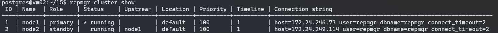
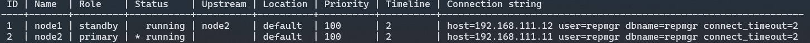
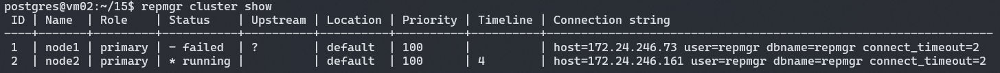
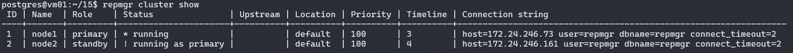

# PostgreSQL


## 安装

### 使用 Docker

```bash
docker pull postgres
docker run --name some-postgres -p 5432:5432 -e POSTGRES_PASSWORD=<your-pw> -d postgres
```

<br>

## 数据库系统命令

```bash
psql -U <username> -h <host> -d <dbname>
\? # PostgreSQL 【系统级别】命令帮助文档
\h # PostgreSQL 中 SQL 命令帮助文档

\dg # list roles, role defualt is [postgres]

\l # list databases
\dt # list tables
\dx # list extensions

\db <tablename> # list tablespaces

\c <dbname> # connect databae
\conninfo # display information about current connection

# after connected to a database
SELECT version(); # Show postgreSQL's version
```


## 数据库操作

```bash
create database <dbname>
drop database <dbname> # can not drop your current db

psql <dbname> # same as \c, connect databaes
```


## 数据表操作

### 创建/删除

创建/删除表的语句和 MySQL 一致：

* create table
* drop table

从文件装载数据

```bash
# 使用 COPY 从文本文件中装载大量数据
COPY weather FROM '/path/weather.txt';
```

 表查询操作

```bash
\d+ <tablename> # 查看表的详情信息，表结构，字段等
```


**创建测试表**

```sql
CREATE TABLE employees (
  depname VARCHAR(20),
  empno INT,
  salary INT
);
```

```sql
INSERT INTO employees VALUES ('develop', 11, 5200);
INSERT INTO employees VALUES ('develop', 7, 4200); 
INSERT INTO employees VALUES ('develop', 9, 4500);
INSERT INTO employees VALUES ('develop', 8, 6000);
INSERT INTO employees VALUES ('develop', 10, 5200);
INSERT INTO employees VALUES ('personnel', 5, 3500);
INSERT INTO employees VALUES ('personnel', 2, 3900);  
INSERT INTO employees VALUES ('sales', 3, 4800);
INSERT INTO employees VALUES ('sales', 1, 5000);
INSERT INTO employees VALUES ('sales', 4, 4800);
```


### 修改表

- 增加列
- 移除列
- 增加约束
- 移除约束
- 修改默认值
- 修改列数据类型
- 重命名列
- 重命名表


## 数据类型

### 几何类型

| 类型    | 大小        | 描述                     | 备注                            |
| ------- | ----------- | ------------------------ | ------------------------------- |
| point   | 16 字节     | 平面上的点               | (x,y)                           |
| line    | 32 字节     | 无限长的线               | {A,B,C}                         |
| lseg    | 32 字节     | 有限线段                 | ((x1,y1),(x2,y2))，A 点到 B 点  |
| box     | 32 字节     | 矩形框                   | ((x1,y1),(x2,y2))，斜对角线端点 |
| path    | 16+16n 字节 | 封闭路径（类似于多边形） | ((x1,y1),...)                   |
| path    | 16+16n 字节 | 开放路径                 | [(x1,y1),...]                   |
| polygon | 40+16n 字节 | 多边形（类似于封闭路径） | ((x1,y1),...)                   |
| circle  | 24 字节     | 圆                       | <(x,y),r>（中心点和半径）       |


### 数组

#### 数组操作

```postgresql
CREATE TABLE user_hobbies (
  id serial not null,
  name VARCHAR(50),
  hobbies TEXT[]
);

-- 可以使用 array 关键字来表示数组
INSERT INTO user_hobbies (name, hobbies)
VALUES ('Tom', ARRAY['Football', 'Basketball']);

-- 也可以使用 {}
INSERT INTO user_hobbies (name, hobbies)
VALUES ('Tom', "{'Football', 'Basketball'}");

-- 查询操作
SELECT
    name,
    hobbies
FROM
    user_hobbies;
    
-- PostgreSQL 中的数组下标是从 1 开始的
SELECT
  name,
  hobbies[1]
FROM
  user_hobbies;
  
-- 使用 any() 过滤数组
SELECT
  name,
  hobbies
FROM
  user_hobbies
WHERE
  'Football' = ANY (hobbies);
  
-- 更新数组中的元素
UPDATE user_hobbies
SET hobbies[2] = 'Baseball'
WHERE ID = 1;

-- 更新整个数组
UPDATE user_hobbies
SET hobbies = '{"Baseball"}'
WHERE ID = 1*;
```


#### 数组类型对照

|         JAVA TYPE         | SUPPORTED BINARY POSTGRESQL TYPES | DEFAULT POSTGRESQL TYPE |
| :-----------------------: | :-------------------------------: | :---------------------: |
|   `short[] `, `Short[]`   |             `int2[]`              |        `int2[]`         |
|   `int[] `, `Integer[]`   |             `int4[]`              |        `int4[]`         |
|    `long[] `, `Long[]`    |             `int8[]`              |        `int8[]`         |
|   `float[] `, `Float[]`   |            `float4[]`             |       `float4[]`        |
|  `double[] `, `Double[]`  |            `float8[]`             |       `float8[]`        |
| `boolean[] `, `Boolean[]` |             `bool[]`              |        `bool[]`         |
|        `String[]`         |      `varchar[] `, `text[]`       |       `varchar[]`       |
|        `byte[][]`         |             `bytea[]`             |        `bytea[]`        |


## 数据操作

### 从修改行中返回数据

```postgresql
CREATE TABLE users (firstname text, lastname text, id serial primary key);

INSERT INTO users (firstname, lastname) VALUES ('Joe', 'Cool') RETURNING id;

UPDATE products SET price = price * 1.10
  WHERE price <= 99.99
  RETURNING name, price AS new_price; -- RETURNING 的数据是被修改行的新内容
  
DELETE FROM products
  WHERE obsoletion_date = 'today'
  RETURNING *; -- RETURNING 的数据是被删除行的内容
```


## 列特性


### 生成列

生成的列是一个特殊的列，生成列的数据总是从其他列计算而来。生成列有两种：存储列和虚拟列。 

* 存储生成列在写入(插入或更新)时计算，并且像普通列一样占用存储空间。
* 虚拟生成列不占用存储空间并且在读取时进行计算。

PostgreSQL 目前只实现了存储生成列。

```sql
CREATE TABLE people (
    ...,
    height_cm numeric,
    height_in numeric GENERATED ALWAYS AS (height_cm / 2.54) STORED --必须指定关键字 STORED 以指定存储生成列
);
```

> 生成列不能在`INSERT` 或 `UPDATE`命令中被直接写入, 不能为生成列指定值, 但是可以指定关键字`DEFAULT`。


**使用限制**

* 生成表达式不能引用另一个生成列。
* 生成表达式不能引用系统表。
* 生成列不能是分区键的一部分。


### 约束

#### 使用

话不多说，上代码：

```postgresql
CREATE TABLE products (
    product_no integer,
    name text,
    price numeric CHECK (price > 0)
);
```

为了清晰一点， 也可以加上 `CONSTRAINT` 关键字：

```postgresql
CREATE TABLE products (
    product_no integer,
    name text,
    price numeric CONSTRAINT positive_price CHECK (price > 0)
);
```

一个检查约束也可以引用多个列

```postgresql
CREATE TABLE products (
    product_no integer,
    name text,
    price numeric CHECK (price > 0),
    discounted_price numeric CHECK (discounted_price > 0),
    CHECK (price > discounted_price)
);

-- 也可以写成
CREATE TABLE products (
    product_no integer,
    name text,
    price numeric,
    CHECK (price > 0),
    discounted_price numeric,
    CHECK (discounted_price > 0),
    CHECK (price > discounted_price) --或者同一行 CHECK (discounted_price > 0 AND price > discounted_price)
);
```

<br>

#### 约束类型

* **非空约束**：NOT NULL（很常见，不展开）。

* **唯一约束**：UNIQUE。

  ```postgresql
  -- 同一行语法
  CREATE TABLE products (
      product_no integer UNIQUE
  );
  
  -- 表约束语法
  CREATE TABLE products (
      product_no integer,
      UNIQUE (product_no)
  );
  -- 定义一组唯一约束
  CREATE TABLE example (
      a integer,
      b integer,
      c integer,
      UNIQUE (a, c)
  );
  ```

* **主键约束**：PRIMARY KEY。

  ```postgresql
  -- 单列主键
  CREATE TABLE products (
      product_no integer PRIMARY KEY
  );
  
  -- 多列主键
  CREATE TABLE example (
      a integer,
      b integer,
      c integer,
      PRIMARY KEY (a, c)
  );
  ```

* **外键约束**：REFERENCES。

  ```postgresql
  -- 产品表
  CREATE TABLE products (
      product_no integer PRIMARY KEY,
      name text,
      price numeric
  );
  -- 订单表
  CREATE TABLE orders (
      order_id integer PRIMARY KEY,
      product_no integer REFERENCES products (product_no),
      quantity integer
  );
  
  -- 可以将外键约束的列省略，默认使用被引用表的主键作为外键。
  CREATE TABLE orders (
      order_id integer PRIMARY KEY,
      product_no integer REFERENCES products,
      quantity integer
  );
  
  -- 也可以使用 mysql-like 方式
  CREATE TABLE t1 (
    a integer PRIMARY KEY,
    b integer,
    c integer,
    FOREIGN KEY (b, c) REFERENCES other_table (c1, c2)
  );
  
  -- 外键约束相关操作
  CREATE TABLE products (
      product_no integer PRIMARY KEY,
      name text,
      price numeric
  );
  CREATE TABLE orders (
      order_id integer PRIMARY KEY,
      shipping_address text,
      ...
  );
  CREATE TABLE order_items (
      product_no integer REFERENCES products ON DELETE RESTRICT, -- 限制删除
      order_id integer REFERENCES orders ON DELETE CASCADE, -- 级联删除
      quantity integer,
      PRIMARY KEY (product_no, order_id)
  );
  ```

* **排他约束**：EXCLUDE。

  下面实例创建了一张 COMPANY7 表，添加 5 个字段，并且使用了 EXCLUDE 约束。

  ```postgresql
  CREATE TABLE COMPANY7(
     ID INT PRIMARY KEY     NOT NULL,
     NAME           TEXT,
     AGE            INT  ,
     ADDRESS        CHAR(50),
     SALARY         REAL,
     EXCLUDE USING gist
     (NAME WITH =,  -- 如果满足 NAME 相同，AGE 不相同则不允许插入，否则允许插入
     AGE WITH <>)   -- 其比较的结果是如果整个表达式返回 true，则不允许插入，否则允许
  );
  ```

  > 其中 `USING gist` 是用于构建和执行的索引一种类型。*需要为每个数据库执行一次 `CREATE EXTENSION btree_gist` 命令安装 btree_gist 扩展，它定义了对纯标量数据类型的 EXCLUDE 约束。*

  由于我们已经强制执行了年龄必须相同，让我们通过向表插入记录来查看这一点：

  ```postgresql
  INSERT INTO COMPANY7 VALUES(1, 'Paul', 32, 'California', 20000.00 );
  INSERT INTO COMPANY7 VALUES(2, 'Paul', 32, 'Texas', 20000.00 );
  -- 此条数据的 NAME 与第一条相同，且 AGE 与第一条也相同，故满足插入条件
  INSERT INTO COMPANY7 VALUES(3, 'Allen', 42, 'California', 20000.00 );
  -- 此数据与上面数据的 NAME 相同，但 AGE 不相同，故不允许插入
  ```

<br>

### 系统列

每一个表都拥有一些由系统隐式定义的系统列。事实上用户不需要关心这些列，只需要知道它们存在即可。

| 列名         | 备注            | 描述                                                         |
| ------------ | --------------- | ------------------------------------------------------------ |
| oid/tableiod | table object id | 包含这一行的表的 OID                                         |
| xmin         |                 | 插入该行版本的事务身份（事务ID）                             |
| xmax         |                 | 删除事务的身份（事务ID）                                     |
| cmin         |                 | 插入事务中的命令标识符（从0开始）                            |
| cmax         |                 | 删除事务中的命令标识符                                       |
| ctid         |                 | 行版本在其表中的物理位置。尽管 ctid 可以被用来非常快速地定位行版本，但是一个行的 ctid 会在被更新或者被 `VACUUM FULL` 移动时改变。因此，`ctid` 不能作为一个长期行标识符。 |


<br>

## 表特性

### 表继承

直接上 SQL 代码：

```sql
CREATE TABLE cities (
  name       text,
  population real,
  elevation  int     -- (in ft)
);

CREATE TABLE capitals (
  state      char(2) UNIQUE NOT NULL
) INHERITS (cities);
```

上面这段代码中 capitals 表继承 cities，同时还新增了一个 state 字段。

如果执行：

```sql
select ... from cities;
```

会同时查询 cities 和 capitals 两个表。如果只想查询 cities 表，不查询它的子表，可以使用 ONLY 关键字。例如：

```sql
select ... from ONLY cities;
```

除了 Select，Update 和 Delete 关键字也都支持 ONLY。


### 表分区

表分区指的是将逻辑上的一个大表分成一些小的物理上的片。分区的好处：

* 在某些情况下查询性能能够显著提升。
* 当查询或更新访问单个分区中的某一部分数据时，可以通过使用该分区的顺序扫描来提高性能（索引是在整个表中的随机访问读取）。


**PostgreSQL 分区形式**

* 范围分区，表被根据一个关键列或一组列划分为“范围”，不同的分区的范围之间没有重叠。相邻分区可以共享一个边界值，范围上限被视为不包含的边界。
* 列表分区，通过显式地列出每一个分区中出现的键值来划分表。
* 哈希分区，通过为每个分区指定模数和余数来对表进行分区。


**自定义分区创建**

```postgresql
CREATE TABLE measurement (
    id int not null,
    logdate date not null
) PARTITION BY RANGE (logdate);
```


<br>

## 高级特性

### 窗口函数

窗口函数是 SQL 函数，可以对当前行或当前行周围的若干行执行计算。一个窗口函数调用总是包含一个 OVER 子句，OVER 关键字可以指定窗口函数的范围，包括分区和排序顺序。

* `PARTITION BY` 对具有相同值的字段进行分区。对于每一行，窗口函数都会在当前行同一分区的行上进行计算。

  看下面的例子：

  ```sql
  SELECT depname, empno, salary, 
  avg(salary) OVER (PARTITION BY depname) 
  FROM employees;
  ```

  将相同部门的员工分为一个区，每次执行 avg() 都只是针对一个区进行的。看一下输出结果：

  ```bash
    depname  | empno | salary |          avg
  -----------+-------+--------+-----------------------
   develop   |    11 |   5200 | 5020.0000000000000000
   develop   |     7 |   4200 | 5020.0000000000000000
   develop   |     9 |   4500 | 5020.0000000000000000
   develop   |     8 |   6000 | 5020.0000000000000000
   develop   |    10 |   5200 | 5020.0000000000000000
   personnel |     5 |   3500 | 3700.0000000000000000
   personnel |     2 |   3900 | 3700.0000000000000000
   sales     |     3 |   4800 | 4866.6666666666666667
   sales     |     1 |   5000 | 4866.6666666666666667
   sales     |     4 |   4800 | 4866.6666666666666667
  (10 rows)
  ```

  结果和预期一样，先将部门分区，然后求每个部门的平均薪资。

* `ORDER BY` 控制窗口函数处理行的顺序。

  将上面的语句稍作修改：

  ```sql
  # rank 不需要显式的参数，因为它的行为完全决定于 OVER 子句。
  SELECT depname, empno, salary,
  rank() OVER (PARTITION BY depname ORDER BY salary DESC) FROM employees;
  ```

  输出结果如下：

  ```bash
    depname  | empno | salary | rank
  -----------+-------+--------+------
   develop   |     8 |   6000 |    1
   develop   |    10 |   5200 |    2
   develop   |    11 |   5200 |    2
   develop   |     9 |   4500 |    4
   develop   |     7 |   4200 |    5
   personnel |     2 |   3900 |    1
   personnel |     5 |   3500 |    2
   sales     |     1 |   5000 |    1
   sales     |     4 |   4800 |    2
   sales     |     3 |   4800 |    2
  (10 rows)
  ```

  先将部门分区，再对部门中员工的薪水进行排序。

* …


## 索引

### 索引类型

#### B-tree 索引

涉及到以下操作可以考虑使用 B-tree 索引：

* `<` 、 `<=`  、 `=` 、 `>=`  、 `>`

* BETWEEN 和 IN

* 在索引列上的 IS NULL 或 IS NOT NULL 条件

* LIKE 和 `~`

  但是 B-tree 索引只使用下面的情况

  ```postgresql
  column_name LIKE 'foo%'
  column_name LKE 'bar%'
  column_name  ~ '^foo'
  ```

  而不适用于下面的情况：

  ```postgresql
  col LIKE '%bar'
  ```


#### 哈希索引

每当索引列使用 `=` 运算符进行比较时，查询计划器将考虑使用哈希索引。

创建哈希索引，需要指定 `USING HASH`：

```postgresql
CREATE INDEX index_name
ON table_name USING HASH (indexed_column);
```


#### GIN 索引

> 通用倒排索引，Generalized Inverted Index。

正排索引查找时扫描表中每个文档，直到找出所有包含查询关键字的文档。倒排表以*字*或*词*为关键字作为索引，对应记录表中出现这个字或词的所有文档。由于每个字或词对应的文档数量是动态变化的，所以倒排表的建立和维护都较为复杂，但是在查询的时候效率高于正排表。


#### BRIN 索引

> 块范围索引，Block Range Indexes。


#### GiST 索引

GiST 索引不是单独一种索引类型，而是一种架构，可以在这种架构上实现很多不同的索引策略。

GiST 代表广义搜索树。GiST 索引允许构建通用的树结构。GiST 索引可用于索引几何数据类型和全文搜索。


#### SP-GiST 索引

> SP-GiST 代表空间分区的 GiST。


### 创建索引

```postgresql
CREATE [ UNIQUE ] INDEX [ [ IF NOT EXISTS ] index_name ] -- 自定义索引名称
    ON table_name [ USING method ] -- method 是索引方法名称，包括 btree, hash, gist, spgist, gin, 和 brin。默认使用 btree。
(
    column_name [ ASC | DESC ] [ NULLS { FIRST | LAST } ] -- column_name 表示需要创建索引的列名
    [, ...]
);

create index on table_name(colum_name);
create index my_hash_idx on tb_test using hash(colum_name); -- 创建 hash 索引

-- 多列索引，和 MySQL 一样遵循最左匹配原则
CREATE INDEX index_name
ON table_name(a, b, c);
```


### 部分索引

> 按照条件创建索引

```postgresql
-- 对 customer 表中 active = 0 的列创建索引
CREATE INDEX idx_customer_inactive
ON customer(active)
WHERE active = 0;
```


### 重建索引

* 重建单个索引

  ```postgresql
  REINDEX INDEX index_name;
  ```

* 重建表中的所有索引

  ```postgresql
  REINDEX TABLE table_name;
  ```

* 重建数据库中的所有索引

  ```postgresql
  REINDEX DATABASE database_name;
  ```

* …


## 执行分析

> * 来自 [polardb 数据库内核月报](http://mysql.taobao.org/monthly/)：http://mysql.taobao.org/monthly/2018/11/06/
> * https://www.modb.pro/db/101529


## 高可用架构

### 主从流复制

#### 安装

> Docker/K8s 环境下部署不好控制，选择直接安装再服务器上。

1、[Ubuntu install](https://www.postgresql.org/download/linux/ubuntu/)

2、`psql -V` 查看版本

3、切换用户，并登录

```shell
sudo -u postgres psql
```

* 配置路径：`/etc/postgresql/16/main/`
* 数据路径：`/var/lib/postgresql/16/main/`
* 配置模板路径：`/usr/share/postgresql/16/main/`
* pg 命令行工具：`/usr/lib/postgresql/16/bin`

> 可能会遇到 `/var/lib/postgresql/` 目录下 *operation not permitted* 的问题，解决方法：
> * 一次性修改：`chown -R postgres:postgres /var/lib/postgresql/`
> * 先修改 owner：`chown -R postgres /var/lib/postgresql/`，再修改 group：`chown -R postgres /var/lib/postgresql/`

4、创建用户
```postgresql
CREATE USER root superuser login PASSWORD '123456';
```

5、开启远程访问

5.1、修改 pg_hba.conf
```text
# TYPE DATABASE USER ADDRESS METHOD
host all all 0.0.0.0/0 trust
```
> trust 表示不需要密码，如果需要密码则改为 md5

5.2、修改 postgresql.conf

```text
listen_addresses = '*'
```

5.3、重启服务
```shell
sudo service postgresql restart
# or
sudo /etc/init.d/postgresql restart
# or
sudo systemctl restart postgresql
```

> 现在就可以通过远程访问数据库了

6、创建测试数据
```postgresql
CREATE DATABASE test OWNER root;

create table myuser (
    id serial primary key,
    name varchar(20) not null,
    age int not null
);

insert into myuser (name, age) values ('zhangsan', 20);
insert into myuser (name, age) values ('lisi', 21);
insert into myuser (name, age) values ('wangwu', 22);
```

…

---

#### 主从复制部署

7、主节点创建同步账号

```postgresql
CREATE USER repl REPLICATION LOGIN ENCRYPTED PASSWORD '123456';
```

8、修改 pg_hba.conf
```text
# TYPE DATABASE USER ADDRESS METHOD
host all repl 0.0.0.0/0 trust
```

9、修改 postgresql.conf
> [按照 Cc 的说法](https://www.net-cc.com/posts/linux-software/postgresql/02-postgresql-master_slave-replication/)：主从服务器都要设置, 万一那天从服务器提升为主了呢
```text
listen_addresses = '*'
wal_level = replica
archive_mode = off
max_wal_senders = 32
wal_sender_timeout = 60s
wal_keep_segments = 64

max_replication_slots = 10 # (修改) 设置支持的复制槽数量
max_slot_wal_keep_size = 1GB # (修改) 设置复制槽保留的 wal 最大值,默认单位是 M

hot_standby = on
hot_standby_feedback = on # 如果有错误的数据复制向主进行反馈
# synchronous_commit = on  # 开启同步复制
```

10、重启主节点

11、从节点同步主节点数据
11.1、停止从节点

```shell
sudo service postgresql stop
```

11.2、在从节点上备份主节点数据

```shell
pg_basebackup -h <master-host> -U repl -p 5432 -F p  -X stream -v -P -R -D /data/pgsql -C -S slave01 -l slave01

# -D 指定备份数据存放的目录
# -F, --format=p|t 输出格式 (纯文本 (缺省值), tar压缩格式)
# -X, --wal-method=none|fetch|stream 按指定的模式包含必需的WAL日志文件
# -v, --verbose 输出详细的消息
# -P, --progress 显示进度信息
# -R, --write-recovery-conf 为复制写配置文件
# -C, --create-slot 创建复制槽
# -S, --slot=SLOTNAME 用于复制的槽名
# -l, --label=LABEL 设置备份标签

# 备份从节点原先的数据
mv /var/lib/postgresql/16/main /var/lib/postgresql/16/main.bak

# 使用主节点同步过来的数据代替从节点原先的数据
mv /data/pgsql /var/lib/postgresql/16/main

chown -R postgres:postgres -R /var/lib/postgresql/16/main
```

```postgresql
-- 复制槽状态检查
select * from pg_replication_slots;

-- 创建复制槽
select * from pg_create_physical_replication_slot('slave01');

-- 删除复制槽
select * from pg_drop_replication_slot('slave01');
```

11.2、启动从节点，并检查从节点状态

```shell
sudo service postgresql start
```

```postgresql
-- 节点状态检查
-- 查询结果为"f"表示主库, 't'表示从库
select pg_is_in_recovery();
```

```postgresql
-- 在主节点检查同步状态
select * from pg_stat_replication;
```

输出内容大概如下：
```shell
postgres=# select * from pg_stat_replication \g
-[ RECORD 1 ]----+------------------------------
pid              | 2299
usesysid         | 16388
usename          | repl
application_name | 16/main
client_addr      | 192.168.111.14
client_hostname  |
client_port      | 48412
backend_start    | 2023-10-13 03:11:24.319331+00
backend_xmin     |
state            | streaming
sent_lsn         | 0/3000148
write_lsn        | 0/3000148
flush_lsn        | 0/3000148
replay_lsn       | 0/3000148
write_lag        |
flush_lag        |
replay_lag       |
sync_priority    | 0
sync_state       | async
reply_time       | 2023-10-13 03:12:24.342696+00
```

12、尝试在主库插入数据，在从库查询。从库有记录表示主从复制配置完成。多配置几个从节点就是一主多从架构了。

---

**主节点宕机会发生什么？**

1、假设现在为一主二从的状态

```shell
postgres=# select * from pg_replication_slots;
-[ RECORD 1 ]-------+----------
slot_name           | slave01
plugin              |
slot_type           | physical
datoid              |
database            |
temporary           | f
active              | t
active_pid          | 2739
xmin                |
catalog_xmin        |
restart_lsn         | 0/7000330
confirmed_flush_lsn |
wal_status          | reserved
safe_wal_size       |
two_phase           | f
conflicting         |
-[ RECORD 2 ]-------+----------
slot_name           | slave02
plugin              |
slot_type           | physical
datoid              |
database            |
temporary           | f
active              | t
active_pid          | 3553
xmin                |
catalog_xmin        |
restart_lsn         | 0/7000330
confirmed_flush_lsn |
wal_status          | reserved
safe_wal_size       |
two_phase           | f
conflicting         |
```

2、让主节点下线

3、主节点下线后查看从节点状态

```shell
postgres=# select pg_is_in_recovery();
-[ RECORD 1 ]-----+--
pg_is_in_recovery | t
```

可以看到依然是从库，需要手动选择某一个从库提升为主库
```shell
cd /usr/lib/postgresql/16/bin
./pg_ctl promote -D /var/lib/postgresql/16/main
```

输出内容大概如下：
```shell
waiting for server to promote.... done
server promoted
```

再次检查该从节点状态
```shell
postgres=# select pg_is_in_recovery();
 pg_is_in_recovery
-------------------
 f
(1 row)
```

理论上来说可以这样子操作：

> 该从节点已经变成主节点了，接下来为对应的从节点创建复制槽
>
> ```postgresql
> select * from pg_create_physical_replication_slot('slave0X');
> 
> -- 查看复制槽状态
> select * from pg_replication_slots;
> ```
>
> 最后编辑其他从节点的 `postgresql.auto.conf` 文件，修改 `primary_conninfo` 为新的主节点地址，重启从节点即可。

但是我操作一番并未成功，可能需要再走一遍之前的步骤 11。

---

#### 总结

主从流复制不需要借助其他第三方工具，直接配置即可。但是配置稍繁琐，而且如果主节点宕机了从节点不会自动切换，需要手动切换。

---

### 主从流复制 + Replication Manager

> 简称 *repmgr*。

#### repmgr 配置

1、首先查看 repmgr 与 PostgreSQL 的[版本对应关系](https://www.repmgr.org/docs/current/install-requirements.html)，并[安装](https://www.repmgr.org/docs/current/installation-packages.html#INSTALLATION-PACKAGES-DEBIAN)。

此处以 pg-15 为例：

```shell
sudo apt install postgresql-15

curl https://dl.enterprisedb.com/default/release/get/deb | sudo bash
sudo apt install install postgresql-15-repmgr
```

2、修改 `/etc/postgresql/15/main/postgresql.conf` 和 `/etc/postgresql/15/main/pg_hba.conf`，允许外部 IP 访问。并重启服务。

3、每个节点  `/etc/postgresql/15/main/postgresql.conf` 配置修改

> 因为不确定故障转移的时候谁会是下一个主节点，全部修改比较保险。

```text
# Ensure WAL files contain enough information to enable read-only queries
# on the standby.
#
#  PostgreSQL 9.5 and earlier: one of 'hot_standby' or 'logical'
#  PostgreSQL 9.6 and later: one of 'replica' or 'logical'
#    ('hot_standby' will still be accepted as an alias for 'replica')
#
# See: https://www.postgresql.org/docs/current/runtime-config-wal.html#GUC-WAL-LEVEL

wal_level = 'replica'

# Enable WAL file archiving
#
# See: https://www.postgresql.org/docs/current/runtime-config-wal.html#GUC-ARCHIVE-MODE

archive_mode = on

# Set archive command to a dummy command; this can later be changed without
# needing to restart the PostgreSQL instance.
#
# See: https://www.postgresql.org/docs/current/runtime-config-wal.html#GUC-ARCHIVE-COMMAND

archive_command = '/bin/true'

# Enable replication connections; set this value to at least one more
# than the number of standbys which will connect to this server
# (note that repmgr will execute "pg_basebackup" in WAL streaming mode,
# which requires two free WAL senders).
#
# See: https://www.postgresql.org/docs/current/runtime-config-replication.html#GUC-MAX-WAL-SENDERS

max_wal_senders = 10

# If using replication slots, set this value to at least one more
# than the number of standbys which will connect to this server.
# Note that repmgr will only make use of replication slots if
# "use_replication_slots" is set to "true" in "repmgr.conf".
# (If you are not intending to use replication slots, this value
# can be set to "0").
#
# See: https://www.postgresql.org/docs/current/runtime-config-replication.html#GUC-MAX-REPLICATION-SLOTS

max_replication_slots = 10

# Enable read-only queries on a standby
# (Note: this will be ignored on a primary but we recommend including
# it anyway, in case the primary later becomes a standby)
#
# See: https://www.postgresql.org/docs/current/runtime-config-replication.html#GUC-HOT-STANDBY

hot_standby = on
```

4、主节点创建 repmgr 用户以及数据库来保存集群元数据

```shell
# 先切换到 postgres 用户
sudo su -- postgres
cd ~
# 再创建用户
createuser -s repmgr

createdb repmgr -O repmgr
```

5、编辑 `/etc/postgresql/15/main/pg_hba.conf`，为 repmgr 用户添加访问权限

> 主从节点都需要，因为从节点克隆主节点的数据会将 repmgr 用户和库一同克隆。

```text
local repmgr repmgr trust
host repmgr repmgr 127.0.0.1/32 trust
host repmgr repmgr 0.0.0.0/0 trust
```

> 上述配置是在测试环境下的，如果生产环境配置最好限制可远程访问的 IP 段，例如 `192.168.1.0/24`。

6、在主节点下创建 `repmgr.conf` 配置 `/etc/repmgr.conf`

```
node_id=1
node_name='node1'
conninfo='host=192.168.111.12 user=repmgr dbname=repmgr connect_timeout=2'
data_directory='/var/lib/postgresql/15/main'
```

> `repmgr.conf` should ***not*** be stored inside the PostgreSQL data directory, as it could be overwritten when setting up or reinitialising the PostgreSQL server. 

7、主节点注册到 repmgr

```shell
$ repmgr -f /etc/repmgr.conf primary register
INFO: connecting to primary database...
NOTICE: attempting to install extension "repmgr"
NOTICE: "repmgr" extension successfully installed
NOTICE: primary node record (ID: 1) registered

# 检查节点信息
$ repmgr -f /etc/repmgr.conf cluster show
```

9、从节点准备

9.1、安装 PG-15 和 postgresql-15-repmgr

9.2、停止 PG-15，编辑 `postgresql.conf` 开启远程监听，编辑 `pg_hba.conf` 允许用于远程访问

9.3、将数据目录 `/var/lib/postgresql/15/main` 备份到  `/var/lib/postgresql/15/backup` ，新建 main 文件夹，存放从主节点 clone 的数据。注意新建的 main 文件夹的用户和用户组设置为 `postgres`

> **Note**
>
> On the standby, do ***not*** create a PostgreSQL instance (i.e. do not execute initdb or any database creation scripts provided by packages), but do ensure the destination data directory (and any other directories which you want PostgreSQL to use) exist and are owned by the `postgres` system user. Permissions must be set to `0700` (`drwx------`).
>
> **Because**
>
> repmgr will place a copy of the primary's database files in this directory. It will however refuse to run if a PostgreSQL instance has already been created there.

使用 psql 命令检查从节点是否可访问到主节点

```shell
 psql 'host=<node1-host> user=repmgr dbname=repmgr connect_timeout=2'
```

9.4、创建配置 `/etc/repmgr.conf`

```
node_id=2
node_name='node2'
conninfo='host=192.168.111.12 user=repmgr dbname=repmgr connect_timeout=2'
data_directory='/var/lib/postgresql/15/main'
```

9.5、使用 `--dry-run` 参数检查是否可以从主节点复制

```shell
$ repmgr -h <node1-host> -U repmgr -d repmgr -f /etc/repmgr.conf standby clone --dry-run

NOTICE: destination directory "/var/lib/postgresql/15/main" provided
INFO: connecting to source node
DETAIL: connection string is: host=192.168.111.12 user=repmgr dbname=repmgr
DETAIL: current installation size is 37 MB
INFO: "repmgr" extension is installed in database "repmgr"
INFO: replication slot usage not requested;  no replication slot will be set up for this standby
INFO: parameter "max_wal_senders" set to 10
NOTICE: checking for available walsenders on the source node (2 required)
INFO: sufficient walsenders available on the source node
DETAIL: 2 required, 10 available
NOTICE: checking replication connections can be made to the source server (2 required)
INFO: required number of replication connections could be made to the source server
DETAIL: 2 replication connections required
WARNING: data checksums are not enabled and "wal_log_hints" is "off"
DETAIL: pg_rewind requires "wal_log_hints" to be enabled
NOTICE: standby will attach to upstream node 1
HINT: consider using the -c/--fast-checkpoint option
INFO: would execute:
  pg_basebackup -l "repmgr base backup"  -D /var/lib/postgresql/15/main -h 192.168.111.12 -p 5432 -U repmgr -X stream
INFO: all prerequisites for "standby clone" are met
```

> 可能会提示：`no pg_hba.conf entry for replication connection from host ...`，配置 `pg_hba.conf`：
>
> ```text
> host replication all 0.0.0.0/0 trust
> ```
>
> 同样的，生产环境下注意缩小 IP 访问范围。

9.6、如果上述步骤无误，则直接从主节点克隆数据

```shell
$ repmgr -h <node1-host> -U repmgr -d repmgr -f /etc/repmgr.conf standby clone

NOTICE: destination directory "/var/lib/postgresql/15/main" provided
INFO: connecting to source node
DETAIL: connection string is: host=192.168.111.12 user=repmgr dbname=repmgr
DETAIL: current installation size is 37 MB
INFO: replication slot usage not requested;  no replication slot will be set up for this standby
NOTICE: checking for available walsenders on the source node (2 required)
NOTICE: checking replication connections can be made to the source server (2 required)
WARNING: data checksums are not enabled and "wal_log_hints" is "off"
DETAIL: pg_rewind requires "wal_log_hints" to be enabled
INFO: creating directory "/var/lib/postgresql/15/main"...
NOTICE: starting backup (using pg_basebackup)...
HINT: this may take some time; consider using the -c/--fast-checkpoint option
INFO: executing:
  pg_basebackup -l "repmgr base backup"  -D /var/lib/postgresql/15/main -h 192.168.111.12 -p 5432 -U repmgr -X stream
could not change directory to "/home/gnl": Permission denied
NOTICE: standby clone (using pg_basebackup) complete
NOTICE: you can now start your PostgreSQL server
HINT: for example: pg_ctl -D /var/lib/postgresql/15/main start
HINT: after starting the server, you need to register this standby with "repmgr standby register"
```

> 1. 可以看到熟悉的 `pg_basebackup` 命令，实际上 repmgr 底层就是使用 `pg_basebackup` 命令来帮助从节点克隆数据的。
> 2. 从提示可以看到 `NOTICE: you can now start your PostgreSQL server`
> 3. 从提示可以看到 `HINT: after starting the server, you need to register this standby with "repmgr standby register"`

9.7、从节点编辑 repmgr 用户远程访问权限

> 主从节点切换会使用到，如果前面编辑过了可以跳过这一步。

```shell
local repmgr repmgr trust
host repmgr repmgr 127.0.0.1/32 trust
host repmgr repmgr 0.0.0.0/0 trust
```

9.8、启动从节点上的 PG

10、主从节点状态查询

启动完成后在主节点查询

```postgresql
postgres=# \x
Expanded display is on.
postgres=# SELECT * FROM pg_stat_replication;
-[ RECORD 1 ]----+------------------------------
pid              | 6011
usesysid         | 16388
usename          | repmgr
application_name | node2
client_addr      | 192.168.111.11
client_hostname  |
client_port      | 56912
backend_start    | 2023-10-16 14:02:30.04542+08
backend_xmin     |
state            | streaming
sent_lsn         | 0/B000368
write_lsn        | 0/B000368
flush_lsn        | 0/B000368
replay_lsn       | 0/B000368
write_lag        |
flush_lag        |
replay_lag       |
sync_priority    | 0
sync_state       | async
reply_time       | 2023-10-16 14:03:05.786353+08
```

可以看到有一个 node2 节点已经连接上来了。

在从库查询 wal receiver 状态：

```postgresql
postgres=# SELECT * FROM pg_stat_wal_receiver;

-[ RECORD 1 ]---------+
pid                   | 21444
status                | streaming
receive_start_lsn     | 0/B000000
receive_start_tli     | 1
written_lsn           | 0/B000368
flushed_lsn           | 0/B000368
received_tli          | 1
last_msg_send_time    | 2023-10-16 14:04:35.904542+08
last_msg_receipt_time | 2023-10-16 14:04:35.880378+08
latest_end_lsn        | 0/B000368
latest_end_time       | 2023-10-16 14:02:30.053889+08
slot_name             |
sender_host           | 192.168.111.12
sender_port           | 5432
conninfo              | user=repmgr passfile=/var/lib/postgresql/.pgpass 
```

11、将从节点注册到 repmgr 上

```shell
$ repmgr -f /etc/repmgr.conf standby register

INFO: connecting to local node "node2" (ID: 2)
INFO: connecting to primary database
WARNING: --upstream-node-id not supplied, assuming upstream node is primary (node ID: 1)
INFO: standby registration complete
NOTICE: standby node "node2" (ID: 2) successfully registered
```

12、检查集群状态

主节点或者从节点

```shell
$ repmgr -f /etc/repmgr.conf cluster show
```



可以看到现在我们的集群中有两个节点了。

---

#### 主从切换

> **repmgr 集群正确的启动方式**
>
> 如果使用 `syetmctl {start|stop|restart} postgresql` 或者 `service postgresql {start|stop|restart}` 在进行集群操作切换到 postrges 用户之后会无权限控制 PostgreSQL 的状态，需要改成使用 `pg_ctlcluster 15 main {start|stop|restart|status}` 来控制 PostgreSQL。

14、编辑 `/etc/repmgr.conf`，添加配置

```text
service_start_command='sudo pg_ctlcluster 15 main start'
service_stop_command='sudo pg_ctlcluster 15 main stop'
service_restart_command='sudo pg_ctlcluster 15 main restart'
service_reload_command  = 'sudo pg_ctlcluster 15 main reload'
```

为 postgres 用户添加权限，`sudo vim /etc/sudoers`

```text
Defaults:postgres !requiretty
postgres ALL= NOPASSWD: /usr/bin/pg_ctlcluster 15 main start
postgres ALL= NOPASSWD: /usr/bin/pg_ctlcluster 15 main stop
postgres ALL= NOPASSWD: /usr/bin/pg_ctlcluster 15 main restart
postgres ALL= NOPASSWD: /usr/bin/pg_ctlcluster 15 main reload
```

停止所有的 PG 实例，该用 `pg_ctlcluster` 来启动。

15、主从节点无密码 SSH 连接配置

> root 和 postgres 用户都需要设置，主从节点需要双向配置（主节点 SSH 无密码连接从节点，从节点 SSH 无密码连接主节点）

15.1、生成 SSH

```shell
# root
ssh-keygen -t rsa
cd /root/.ssh
cat id_dsa.pub >> root_authorized_keys

# postgres
ssh-keygen -t rsa
cd /var/lib/postgresql/.ssh
cat id_dsa.pub >> pg_authorized_keys
```


15.2、传输到服务器上（传输到需要无密码登录的机器上）

```shell
scp /root/.ssh/root_authorized_keys user@server_addr:/home/user

# 目标服务器
mv /home/user/root_authorized_keys /root/.ssh/authorized_keys
mv /home/user/pg_authorized_keys /var/lib/postgresql/.ssh/authorized_keys
```

> 如果知道登录用户的密码
>
> ```shell
> ssh-keygen -t rsa
> ssh-copy-id user@server_address 
> # 会传输保存到到对应账户的 `~/.ssh/authorized_keys` 中。
> ```


15.3、配置服务器 SSH 允许无密码登录

```shell
sudo vim /etc/ssh/sshd_config 
```

修改

```text
PasswordAuthentication no
```

15.4、重启 SSH 服务

```shell
sudo systemctl restart sshd
```

15.5、登录测试

```shell
ssh user@server_address 
```

如果有两台服务器192.168.111.11 和 192.168.111.12，两台服务器都需要能成功执行以下命令

```shell
# 192.168.111.11
root:~ ssh root@192.168.111.12
postgres:~ ssh postgres@192.168.111.12

# 192.168.111.12
root:~ ssh root@192.168.111.11
postgres:~ ssh postgres@192.168.111.11
```

无需密码证明配置成功。

16、停止 PG node1，模拟宕机

17、使用 `–dry-run` 尝试将 node2 迁移为 primary

```shell
$ repmgr -f /etc/repmgr.conf standby switchover --dry-run

NOTICE: checking switchover on node "node1" (ID: 1) in --dry-run mode
INFO: SSH connection to host "192.168.111.11" succeeded
INFO: able to execute "repmgr" on remote host "192.168.111.11"
INFO: 1 walsenders required, 10 available
INFO: demotion candidate is able to make replication connection to promotion candidate
INFO: 0 pending archive files
INFO: replication lag on this standby is 0 seconds
NOTICE: attempting to pause repmgrd on 2 nodes
NOTICE: local node "node1" (ID: 1) would be promoted to primary; current primary "node2" (ID: 2) would be demoted to standby
INFO: following shutdown command would be run on node "node2":
  "sudo pg_ctlcluster 15 main stop"
INFO: parameter "shutdown_check_timeout" is set to 60 seconds
INFO: prerequisites for executing STANDBY SWITCHOVER are met
```

18、standby 切换为 primary（需要在 standby 机器上操作）

```shell
$ repmgr -f /etc/repmgr.conf standby switchover
```

报提示 `NOTICE: waiting up to 30 seconds (parameter "wal_receive_check_timeout") for received WAL to flush to disk`

```
NOTICE: waiting up to 30 seconds (parameter "wal_receive_check_timeout") for received WAL to flush to disk
INFO: sleeping 1 of maximum 30 seconds waiting for standby to flush received WAL to disk
INFO: sleeping 2 of maximum 30 seconds waiting for standby to flush received WAL to disk
INFO: sleeping 3 of maximum 30 seconds waiting for standby to flush received WAL to disk
INFO: sleeping 4 of maximum 30 seconds waiting for standby to flush received WAL to disk
INFO: sleeping 5 of maximum 30 seconds waiting for standby to flush received WAL to disk
INFO: sleeping 6 of maximum 30 seconds waiting for standby to flush received WAL to disk
INFO: sleeping 7 of maximum 30 seconds waiting for standby to flush received WAL to disk
INFO: sleeping 8 of maximum 30 seconds waiting for standby to flush received WAL to disk
INFO: sleeping 9 of maximum 30 seconds waiting for standby to flush received WAL to disk
INFO: sleeping 10 of maximum 30 seconds waiting for standby to flush received WAL to disk
INFO: sleeping 11 of maximum 30 seconds waiting for standby to flush received WAL to disk
INFO: sleeping 12 of maximum 30 seconds waiting for standby to flush received WAL to disk
INFO: sleeping 13 of maximum 30 seconds waiting for standby to flush received WAL to disk
INFO: sleeping 14 of maximum 30 seconds waiting for standby to flush received WAL to disk
INFO: sleeping 15 of maximum 30 seconds waiting for standby to flush received WAL to disk
INFO: sleeping 16 of maximum 30 seconds waiting for standby to flush received WAL to disk
INFO: sleeping 17 of maximum 30 seconds waiting for standby to flush received WAL to disk
INFO: sleeping 18 of maximum 30 seconds waiting for standby to flush received WAL to disk
INFO: sleeping 19 of maximum 30 seconds waiting for standby to flush received WAL to disk
INFO: sleeping 20 of maximum 30 seconds waiting for standby to flush received WAL to disk
INFO: sleeping 21 of maximum 30 seconds waiting for standby to flush received WAL to disk
INFO: sleeping 22 of maximum 30 seconds waiting for standby to flush received WAL to disk
INFO: sleeping 23 of maximum 30 seconds waiting for standby to flush received WAL to disk
INFO: sleeping 24 of maximum 30 seconds waiting for standby to flush received WAL to disk
INFO: sleeping 25 of maximum 30 seconds waiting for standby to flush received WAL to disk
INFO: sleeping 26 of maximum 30 seconds waiting for standby to flush received WAL to disk
INFO: sleeping 27 of maximum 30 seconds waiting for standby to flush received WAL to disk
INFO: sleeping 28 of maximum 30 seconds waiting for standby to flush received WAL to disk
INFO: sleeping 29 of maximum 30 seconds waiting for standby to flush received WAL to disk
INFO: sleeping 30 of maximum 30 seconds waiting for standby to flush received WAL to disk
WARNING: local node "node2" is behind shutdown primary "node1"
DETAIL: local node last receive LSN is 0/5BA0000, primary shutdown checkpoint LSN is 0/6000028
NOTICE: aborting switchover
HINT: use --always-promote to force promotion of standby
```

主从节点修改 `postgresql.conf`

```
archive_command = '{ sleep 5; true; }'
```

`pg_ctlcluster` 重启主从节点，再次尝试

```shell
$ repmgr -f /etc/repmgr.conf standby switchover

NOTICE: executing switchover on node "node1" (ID: 1)
NOTICE: attempting to pause repmgrd on 2 nodes
NOTICE: local node "node1" (ID: 1) will be promoted to primary; current primary "node2" (ID: 2) will be demoted to standby
NOTICE: stopping current primary node "node2" (ID: 2)
NOTICE: issuing CHECKPOINT on node "node2" (ID: 2)
DETAIL: executing server command "sudo pg_ctlcluster 15 main stop"
INFO: checking for primary shutdown; 1 of 60 attempts ("shutdown_check_timeout")
NOTICE: current primary has been cleanly shut down at location 0/13000028
NOTICE: promoting standby to primary
DETAIL: promoting server "node1" (ID: 1) using pg_promote()
NOTICE: waiting up to 60 seconds (parameter "promote_check_timeout") for promotion to complete
NOTICE: STANDBY PROMOTE successful
DETAIL: server "node1" (ID: 1) was successfully promoted to primary
NOTICE: node "node1" (ID: 1) promoted to primary, node "node2" (ID: 2) demoted to standby
NOTICE: switchover was successful
DETAIL: node "node1" is now primary and node "node2" is attached as standby
NOTICE: STANDBY SWITCHOVER has completed successfully
```

19、切换成功，查看集群状态



20、如果显示  `primary | ! running as standby` 

```shell
$ repmgr -f /etc/repmgr.conf cluster show
 ID | Name  | Role    | Status               | Upstream | Location | Priority | Timeline | Connection string
----+-------+---------+----------------------+----------+----------+----------+----------+-----------------------------------------------------------------
 1  | node1 | primary | ! running as standby |          | default  | 100      | 2        | host=192.168.111.12 user=repmgr dbname=repmgr connect_timeout=2
 2  | node2 | primary | * running            |          | default  | 100      | 2        | host=192.168.111.11 user=repmgr dbname=repmgr connect_timeout=2
```

则需要将 node1 以 standby 的身份重新加入集群

```shell
repmgr -f /etc/repmgr.conf standby register --force
```

如果加入失败，则说明可能 node1 和 node 2 的数据不同步

1. 停止 node2，将 node2 的数据备份，重新从 node1 克隆。
2. 启动 node2，以 standby 的身份重新加入集群。

…

---

#### 自动切换

> 上面展示的主从切换需要人为干预，通常情况下我们不一定能在主节点宕机的第一时间就感知到，并完成迅速切换，此时就需要配置自动切换。

> repmgrd（*replication manager daemon*） 是一个管理和监控守护进程，运行在 PostgreSQL 集群的每个节点上,可以自动执行故障转移和更新备用节点等操作以跟上新的主节点，并提供关于每个备用服务器状态的监视信息。

21、在每个节点上创建 repmgrd 的 systemd 配置文件 `/etc/systemd/system/repmgrd.service`

> 有两个位置需要注意：
>
> * PIDFile 的位置
> * REPMGRDCONF 的位置
> * ExecStart 中定义的 repmgrd 命令的位置

```
[Unit]
Description=repmgrd
After=syslog.target
After=network.target
After=pgserver.service

[Service]
Type=forking

User=postgres
Group=postgres

# PID file
PIDFile=/var/lib/postgresql/repmgrd.pid

# Location of repmgr conf file:
Environment=REPMGRDCONF=/etc/repmgr.conf
Environment=PIDFILE=/var/lib/postgresql/repmgrd.pid

# Where to send early-startup messages from the server
# This is normally controlled by the global default set by systemd
# StandardOutput=syslog
ExecStart=/usr/bin/repmgrd -f ${REPMGRDCONF} -p ${PIDFILE} -d --verbose
ExecStop=/usr/bin/kill -TERM $MAINPID
ExecReload=/usr/bin/kill -HUP $MAINPID

# Give a reasonable amount of time for the server to start up/shut down
TimeoutSec=300

[Install]
WantedBy=multi-user.target
```

22、

22.1、修改 `postgresql.conf`

```
shared_preload_libraries = 'repmgr'
```

22.2 修改 `repmgr.conf`

```
failover='automatic'

promote_command='/usr/bin/repmgr standby promote -f /etc/repmgr.conf --log-to-file'
follow_command='/usr/bin/repmgr standby follow -f /etc/repmgr.conf --log-to-file --upstream-node-id=%n'
```


23、启动 repmgrd 服务

```shell
# root 用户
# enable 表示开启开机自启
systemctl enable repmgrd --now
# 启动 repmgrd
repmgrd -d

postgres$ repmgrd -d
[2023-10-17 14:25:09] [NOTICE] repmgrd (repmgrd 5.4dev) starting up
[2023-10-17 14:25:09] [INFO] connecting to database "host=172.24.246.73 user=repmgr dbname=repmgr connect_timeout=2"
postgres@vm01:/home/ubuntu$ INFO:  set_repmgrd_pid(): provided pidfile is /tmp/repmgrd.pid
[2023-10-17 14:25:09] [NOTICE] starting monitoring of node "node1" (ID: 1)
[2023-10-17 14:25:09] [INFO] "connection_check_type" set to "ping"
[2023-10-17 14:25:09] [INFO] monitoring connection to upstream node "node2" (ID: 2)
```

24、查看当前集群状态

> 每个节点的 repmgrd 都要处于 running 状态。

```shell
postgres$ repmgr service status
 ID | Name  | Role    | Status    | Upstream | repmgrd | PID   | Paused? | Upstream last seen
----+-------+---------+-----------+----------+---------+-------+---------+--------------------
 1  | node1 | primary |   running |     | running | 15374 | no      | 0 second(s) ago
 2  | node2 | standby | * running | node1    | running | 12854 | no      | n/a
```

```shell
# 或者查看 postgres 用户启动的进程状态
ps f -u postgres
```

25、停止主节点模拟宕机

```shell
postgres@vm01:~/15$ pg_ctlcluster 15 main stop
```

一分钟后 node2 变成主节点

```shell
[2023-10-17 16:30:37] [INFO] 0 active sibling nodes registered
[2023-10-17 16:30:37] [INFO] 2 total nodes registered
[2023-10-17 16:30:37] [INFO] primary node  "node1" (ID: 1) and this node have the same location ("default")
[2023-10-17 16:30:37] [INFO] no other sibling nodes - we win by default
[2023-10-17 16:30:37] [NOTICE] this node is the only available candidate and will now promote itself
[2023-10-17 16:30:37] [INFO] promote_command is:
  "/usr/bin/repmgr standby promote -f /etc/repmgr.conf --log-to-file"
[2023-10-17 16:30:37] [NOTICE] promoting standby to primary
[2023-10-17 16:30:37] [DETAIL] promoting server "node2" (ID: 2) using pg_promote()
[2023-10-17 16:30:37] [NOTICE] waiting up to 60 seconds (parameter "promote_check_timeout") for promotion to complete
[2023-10-17 16:30:39] [NOTICE] STANDBY PROMOTE successful
[2023-10-17 16:30:39] [DETAIL] server "node2" (ID: 2) was successfully promoted to primary
[2023-10-17 16:30:39] [INFO] checking state of node 2, 1 of 6 attempts
[2023-10-17 16:30:39] [NOTICE] node 2 has recovered, reconnecting
[2023-10-17 16:30:39] [INFO] connection to node 2 succeeded
[2023-10-17 16:30:39] [INFO] original connection is still available
[2023-10-17 16:30:39] [INFO] 0 followers to notify
[2023-10-17 16:30:39] [INFO] switching to primary monitoring mode
[2023-10-17 16:30:39] [NOTICE] monitoring cluster primary "node2" (ID: 2)
```

node1 的状态变成 failed



26、node1 重新加入集群（服务未启动的情况下）

```shell
repmgr -f /etc/repmgr.conf node rejoin -d'host=172.24.246.161 port=5432 user=repmgr dbname=repmgr connect_timeout=2'
```

重新启动 node1



> 如果在执行 rejoin 之前启动了 node1，那么可能会出现 node1 和 node2 时间线不一致的情况，导致无法 rejoin。因此注意要在故障的节点未启动的情况下先进行 rejoin，再启动节点。
>
> 如果不小心先于 rejoin 之前启动了 node1，就需要将 node1 的数据清空，重新从 node2 克隆，再重新以 standby 的身份加入集群。

…

---

#### 总结

主从流复制 + repmgr 的方式带来了两点优化：0、借助 repmgr 命令能很直观的看到集群的状态；1、从节点配置更加方便，直接 clone 主节点的数据即可；2、借助 repmgrd 能实现自动故障转移。

需要注意：1、出故障的节点在恢复之后仍然需要人为的 rejoin 和 restart；2、检查好 repmgrd 的状态，否则无法实现自动故障转移。

---

<br>

## 参考

* http://postgres.cn/docs
* https://www.sjkjc.com/postgresql
* https://www.cnblogs.com/flying-tiger/p/6704931.html

**数组类型对应**

* https://access.crunchydata.com/documentation/pgjdbc/42.3.2/arrays.html

**repmgr**

* https://www.repmgr.org/docs/current/repmgr-administration-manual.html
* https://blog.frognew.com/2021/11/repmgr-postgresql-ha.html
* https://blog.51cto.com/u_10930585/5805207
* https://www.modb.pro/db/15359
