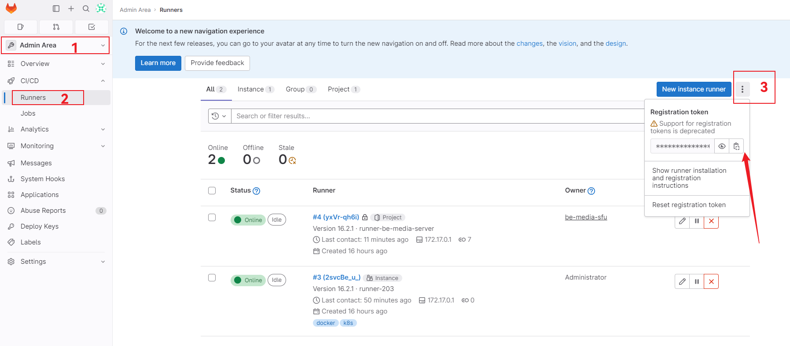

# GitLab

## GitLab 私服

### 安装部署

> 使用 Docker 部署 GitLan 私服。

1、[Ubuntu 安装 Docker](https://docs.docker.com/engine/install/ubuntu/)

2、[Docker 安装 GitLab](https://docs.gitlab.com/ee/install/docker.html)

3、启动 GitLab

```shell
# 将 gitlab 数据映射到外部目录
export GITLAB_HOME=/srv/gitlab # 也可以写入 .bashrc 或者 .zshrc

docker run -d \
  --hostname <your-host>\
  -p 4430:443 -p 8000:80 -p 2200:22 \
  --name gitlab \
  --restart always \
  --volume $GITLAB_HOME/config:/etc/gitlab \
  --volume $GITLAB_HOME/logs:/var/log/gitlab \
  --volume $GITLAB_HOME/data:/var/opt/gitlab \
  --shm-size 256m \ # 共享内存（SHM），默认为 64，在使用 gitlab 时建议至少 256
  gitlab/gitlab-ce:latest

# docker-gitlab shm size: https://juejin.cn/s/docker%20shm%20size%20gitlab
```

获取 `root` 账号初始密码：

```shell
docker exec **-it** gitlab grep 'Password:' /etc/gitlab/initial_root_password
```

接下来就可以使用 `<your-host>:<exposeIP>` 访问 GitLab。


### 自定义端口配置

如果对 http 和 ssh 端口进行了修改，必须要修改配置文件中相应的内容。

```shell
vim /etc/gitlab/gitlab.rb

editor /etc/gitlab/gitlab.rb # 如果是 docker 镜像内部
```

1、external_url 修改 `external_url 'http://host:port'`

2、ssh 端口修改 `gitlab_rails['gitlab_shell_ssh_port']=port`

> 如果只做 external_url 端口的修改，会发现无法访问 webui，因为 GitLab 容器内部的 nginx 会默认监听 external_url 的端口号，因此还需要进一步修改 nginx 监听的端口。

3、修改 `nginx['listen_port']=80`


### SSH 配置

> 参考：https://docs.gitlab.com/ee/user/ssh.html

```shell
# windows 下使用 git-bash
ssh-keygen -t ed25519 -C "<comment>"
# or
ssh-keygen -t rsa -b 2048 -C "<comment>"

# 测试
ssh -T ssh://git@127.0.0.1:2200 # 假设将默认 22 端口修改成了 2200
```


### 头像显示配置

1、打开 `/etc/gitlab/gitlab.rb`

2、复制 https://docs.gitlab.com/ee/administration/libravatar.html 中 gravatar 部分的链接，如果没有使用 https 协议只需要复制 http 部分即可。

3、重启 GitLab。


### GitLab 内存占用大

编辑 `/etc/gitlab/gitlab.rb`，修改：

* postgresql worker
* puma worker and memory limit


**参考**

* https://docs.gitlab.com/ee/administration/operations/puma.html
* https://developer.aliyun.com/article/760745


## 使用 GitLab CI


### 部署 Docker GitLab Runner

**步骤**

* 启动 Runner

* 获取 *registration token*

* 注册 Runner

<br/>

1、Docker 启动

```shell
docker run -d --name gitlab-runner \
	--restart always \
	-v /srv/gitlab-runner/config:/etc/gitlab-runner \
    -v /var/run/docker.sock:/var/run/docker.sock gitlab/gitlab-runner:latest
```

2、获取 *registration token*

2.1、如果是在项目中单独配置 Runner


2.2、如果是配置共享的 Runner



3、注册 Runner

```shell
docker exec -it gitlab-runner bash
gitlab-runner register # 接下来按照步骤填写即可。
```


### 部署 Kubernetes GitLab Runner

> 此处使用 K3s 来代替。

**使用 Helm 部署 GitLab Runner**

> 参考：https://docs.gitlab.com/runner/install/kubernetes.html

1、添加仓库

```shell
# k3s 使用 helm 需要先 export KUBECONFIG
export KUBECONFIG=/etc/rancher/k3s/k3s.yaml

helm repo add gitlab https://charts.gitlab.io
helm repo update gitlab
helm search repo -l gitlab/gitlab-runner # 尽量和 gitlab app 版本对应
```

2、拉取 helm release

```shell
helm pull gitlab/gitlab-runner
```

3、解压文件，编辑 `values.yaml`，主要编辑三个配置：

* gitlabUrl
* runnerToken
* rbac

其中 rbac 配置可以参考：[_Configure runner API permissions_](https://docs.gitlab.com/runner/executors/kubernetes.html#configure-runner-api-permissions)。在写这篇文章的时候使用的 gitlab 版本是 v16.1.1，rbac 配置内容大概如下：
```yaml
rbac:
  create: true
  rules:
    - apiGroups: [""]
      resources: ["pods/exec"]
      verbs: ["create", "patch", "delete"]
    - apiGroups: [""]
      resources: ["pods/attach"]
      verbs: ["create", "patch", "delete"]
    - apiGroups: [""]
      resources: ["pods"]
      verbs: ["get", "list", "watch", "create", "patch", "delete"]
    - apiGroups: [""]
      resources: ["services"]
      verbs: ["get", "list", "watch", "create", "patch", "delete"]
    - apiGroups: [""]
      resources: ["secrets"]
      verbs: ["get", "list", "watch", "create", "update", "patch", "delete"]
```

4、安装 gitlab-runner

```shell
kubectl create namespace cicd
helm install gitlab-runner --namespace=cicd -f values.yaml gitlab/gitlab-runner
```


### Executor

常用的 executor 有下面几个：

* shell
* docker
* kubernetes

> executor 是什么意思？
>
> 假设 `.gitlab-ci.yml` 的内容如下：
>
> ```yaml
> # 定义一个 job
> build-job:
>   stage: build
>   only:
>     - dev
>     - master
>   script:
>     - echo "build job"
>     - java --version
>     - mvn --version
> ```
>
> 拿 shell execotor 来说，在执行 build-job 的脚本命令时 GitLab Runner 会使用它所在的机器上的 shell 来执行。如果部署了 GitLab Runner 的机器上同时安装了 JDK 和 Maven，那么 build-job 就能执行成功。
>
> 如果 GitLab CI 中的某些 job 涉及到 Docker 镜像的 build/push/run 就需要使用到 docker executor。比如说：
>
> ```yaml
> build-image-job:
>   stage: build
>   image: docker:latest
>   services:
>     - docker:dind
>   script:
>     - docker info
>     - docker build -t $CI_PROJECT_NAME:$CI_COMMIT_TAG .
>     - echo "docker 镜像 $CI_PROJECT_NAME:$CI_COMMIT_TAG 打包完成。"
>     - docker images
>     - echo "docker 镜像上传"
>     - docker tag $CI_PROJECT_NAME:$CI_COMMIT_TAG $DOCKER_REGISTRY/$CI_PROJECT_NAME:$CI_COMMIT_TAG
>     - docker push $DOCKER_REGISTRY/$CI_PROJECT_NAME:$CI_COMMIT_TAG
> ```
>
> 同理，如果某些 job 涉及到 K8s 操作就需要使用 kubernetes executor。


### Docker Executor 踩坑

在使用 docker executor 的时候踩了一个坑，执行到 docker 相关命令的时候报错：*error during connect: Post http://docker:2375/: dial tcp: lookup docker on x.x.x.x:53: no such host*。

排查许久，解决方法如下：

修改 GitLab Runner 的配置文件 `/etc/gitlab-runner/config.toml`：

```toml
[runners.docker] # 在此部分添加下面的内容
  privileged = true
  volumes = ["/var/run/docker.sock:/var/run/docker.sock"]
```

> 很奇怪，在启动 GitLab Runner 的时候分明已经添加了 `/var/run/docker.sock` 映射。


### Kubernetes Executor

#### 踩坑 1

在使用 kubernetes executor 使用 docker-in-docker 镜像执行相关命令时也踩坑了，报错：

*ERROR: Cannot connect to the Docker daemon at unix:///var/run/docker.sock.*

解决办法：

1、宿主机安装 Docker

2、修改 GitLab Runner 的 `values.yaml` ：

```yaml
runners:
  config: |
    [[runners]]
      [runners.kubernetes]
        namespace = "{{.Release.Namespace}}"
        image = "ubuntu:22.04"
        [[runners.kubernetes.volumes.host_path]] # 添加这部分内容
          name = "docker"
          mount_path = "/var/run/docker.sock"
          host_path = "/var/run/docker.sock"
        privileged = true # 添加这部分内容
```

3、编辑配置后重启 GitLab Runner（或者重新部署 GitLab Runner）。


#### 踩坑 2

提示：*docker buildx: git was not found*，只需要更换镜像即可：

```yaml
build-image-job:
  stage: build
  image: docker:24.0.6-git
```
