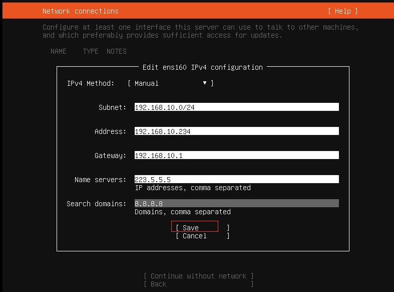
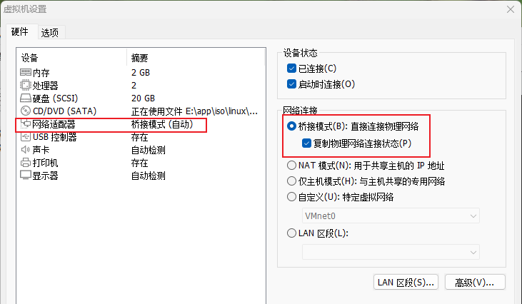

## 前言

使用 Docker 时可能会出现这样几个问题：

* 如何协调和调度在 Docker 容器内以及不同容器之间运行的服务？
* 如何保证在升级应用程序时不会中断服务？
* 如何监视应用程序的运行状况？
* 如何批量重启容器里的程序？
* …

我们需要对容器内的应用服务进行编排、管理和调度，由此催生出 K8s。K8s 主要围绕 Pod 进行工作，Pod 是 K8s 中的最小调度单位，可以包含一个或多个容器。


## 架构

K8s 一般都是以集群的形式出现的，一个 K8s 集群主要包括两部分：Master 节点和 Node 节点。前者又称为主节点；后者又被称为计算节点。

> K8s 架构可以看看这篇文章：http://docs.kubernetes.org.cn/251.html


### 节点


Master 节点包括以下内容：

* API Server，整个 K8s 服务对外的接口，供客户端和其他组件调用。
* Controller Manager，负责维护集群的状态，比如副本数量、故障检测、自动扩展、滚动更新等。
* Scheduler，负责对集群内部的资源进行调度，按照调度策略将 Pod 调度到对应的机器上。
* etcd，键值数据库，负责保存 K8s 集群的所有数据。


Node 节点包括以下内容：


* Kubelet，负责维护 Node 状态并和 Master 节点通信。

* Kube Proxy，负责实现集群网络服务，为 Service 提供 cluster 内部的服务发现和负载均衡。

* Pod，K8s 中部署的最小单位，可以包含一个或多个 Docker 容器。

  > 除非容器之间的服务紧密耦合，否则通常都是一个 Pod 中只有一个容器，方便管理不同服务、并易于各自独立服务的扩展。

<br/>


除了以上核心组件还有其他插件：

* CoreDNS，负责未整个集群提供 DNS 服务。
* Ingress Controller，可以认为是类似 nginx 的代理服务，主要为 K8s 内的服务提供外网入口。
* Prometheus，提供资源监控。
* Federation，提供跨区可用的集群。


### 集群

K8s 的 Master 节点和多个 Node 工作节点组成 K8s 集群。


Master 负责集群的管理，协调集群中的所有行为/活动，例如应用的运行、修改、更新等。Node 节点作为工作节点，可以是 VM 虚拟机、物理机。


## 安装

**前置**

使用 K8s 需要安装下面这些东西：

* 先安装 Docker；
* K8s 的命令行客户端 kubectl；
* K8s 运行环境，比如 minikube；


**开始**

1、下载 kubectl

```bash
curl -Lo kubectl https://storage.googleapis.com/kubernetes-release/release/v1.6.4/bin/linux/amd64/kubectl

chmod +x kubectl
```

2、安装 minikube（以 Linux 为例）

> 参考：https://minikube.sigs.K8s.io/docs/start/

```bash
curl -LO https://storage.googleapis.com/minikube/releases/latest/minikube-linux-amd64
sudo install minikube-linux-amd64 /usr/local/bin/minikube
```

3、启动 minicube

```bash
minikube start
```


## 上手

> 这里有一个快速指南还不错：https://zhuanlan.zhihu.com/p/39937913

1、使用 Kubectl 创建 Deployment

```bash
kubectl create deployment kubernetes-bootcamp --image=gcr.io/google-samples/kubernetes-bootcamp:v1
```

当你创建了一个 Deployment，K8s 会创建一个 Pod 实例。Deployment 可以看成是 pod 的部署、管理工具，可以进行 pod 更新，控制副本数量，回滚，重启等操作。

2.1、查看所有的 Deployment

```bash
kubectl get deployments
```

2.2、查看所有 pod

```bash
kubectl get pods
```

> 使用 `kubectl get pods -A` 会把 K8s 系统级 Pods 也显示出来。

3、将 K8s 内网的服务暴露给外网访问

> Pods that are running inside Kubernetes are running on a private, isolated network. By default they are visible from other pods and services within the same kubernetes cluster, but not outside that network. 

运行在 K8s 内部的 Pod 是使用的是 K8s 私有的、与外部环境相互隔离的网络。默认情况下，Pod 的网络服务只对同一个 K8s 集群环境中的其他 Pod 可见，对外部环境不可见。

因此我们需要使用 `kubectl` 命令来创建代理，将网络请求代理到 K8s 集群内部的、私有的网络里面。

打开新的终端窗口，运行下面的命令，即可完成对 K8s 内部网络的代理。

```bash
kubectl proxy
```

> In order for the new Deployment to be accessible without using the proxy, a Service is required.
>
> 后续讲到 Service 的时候会介绍别的办法来暴露服务。

4、访问测试，现在可以在 K8s 外部测试能够访问到 K8s 内部的服务了

```bash
curl http://localhost:8001/version
```

返回类似下面的结果：

```json
{
  "major": "1",
  "minor": "27",
  "gitVersion": "v1.27.3",
  "gitCommit": "25b4e43193bcda6c7328a6d147b1fb73a33f1598",
  "gitTreeState": "clean",
  "buildDate": "2023-06-14T09:47:40Z",
  "goVersion": "go1.20.5",
  "compiler": "gc",
  "platform": "linux/amd64"
}
```

至此，一个简单的上手 demo 就完成了。


### Kubectl

Kubectl 命令管理工具常见的命令如下：

- `kubectl get <deployments | pods | services | rs>`，列出资源；
- `kubectl describe <pods | nodes | services>`，显示资源的详细信息；
- `kubectl logs`，打印 pod 中的容器日志；
- `kubectl exec`，运行 pod 中容器内部的命令。

<br/>


### 什么是 Pod


Pod 是 K8s 上的最小的可操作单元。当我们在 K8s 上创建 Deployment 的时候，Deployment 会创建具有一个或多个容器的 Pod。由此可以将 Deployment 看成是 Pod 的控制器/管理器，用来管理 Pod 的创建、扩展、销毁。

Pod 是一个抽象（逻辑）概念，可以包括一个或者多个容器（Docker 容器或者其他容器），比如，一个 Pod 中可以有 Web 后端服务和前端服务。

同时还 Pod 包含了容器之间共享资源，共享资源包括：

* 共享的存储，以 Volume 的形式表示；
* 网络，同一个 Pod 中的容器 IP 地址相同，共享同一片端口区域；
* 每个容器的运行信息，比如容器镜像版本、容器使用的端口等信息。

> Pod 是 K8s 集群中所有业务类型的基础，可以看作运行在 K8s 集群中的小机器人，不同类型的业务就需要不同类型的小机器人去执行。目前 K8s 中的业务主要可以分为长期伺服型（long-running）、批处理型（batch）、节点后台支撑型（node-daemon）和有状态应用型（stateful application）；分别对应的小机器人控制器为 Deployment、Job、DaemonSet 和 PetSet。


### Pod 如何运行


Pod 总是运行在 Node 上的。每个 Pod 都会被绑定到 Node 节点上，直到被终止或删除。Node 是 K8s 上的*工作节点*，Node 可以是虚拟机或者物理机。Node 由 K8s 的控制面板（*Control Panel*）进行管理。

> *Control Panel* 实际上就是 Master 节点。

一个 Node 可以包含多个 Pod，K8s 通过 Master 中的 Scheduler 组件来自动管理和调度 Node 中的 Pod。

每个 Node 上至少运行以下内容：

* Kubelet，管理 Master 和 Node 节点之间的通信；管理机器上运行的 Pod 和 Container 容器。
* Container runtime，负责镜像管理以及 Pod 和容器的运行，例如 Docker。

> Pod 是有生命周期的。当一个 Node 工作节点销毁时，节点上运行的 Pod 也会销毁。

<br/>

## 服务访问暴露


> A Service in Kubernetes is an abstraction which defines a logical set of Pods and a policy by which to access them. 

Service 是一个抽象的概念，它定义了 Pod 的逻辑分组和访问策略。尽管每个 Pod 都有唯一的 IP，但是没有 Service 的控制， Pod 的 IP 地址都不会从 K8s 内部暴露出去。

可以指定不同的 type 字段，通过不同的方式将内部服务暴露：

* ClusterIP，默认值，IP 只暴露在集群内部。
* NodePort，将 Node 中的对应端口暴露，外部可以通过 `<NodeIP>:<NodePort>` 来访问集群内的服务。
* LoadBalancer，通过云服务提供商的负载均衡器（如果支持）像外部暴露服务。
* ExternalName，通过返回 CNAME 和它的值，将服务映射到 ExternalName 字段。没有任何类型代理被创建。

<br/>

Service  通过 *label selector* 匹配一组 Pod 集合，以对 K8s 中的一组对象进行逻辑分组。Label 是一个 key/value 键值对，主要用来描述以下几个内容的对象：

* 区分生产、开发、测试环境；
* 对 Pod 进行分类；
* 对 Pod 版本进行标记。


Label 可以在 Pod 创建时指定，也可以在任何时间进行修改。


### 创建 Service

1、检查是否存在 Service 

```bash
kubectl get services
```

2、将之前 [Deploment](#上手) 的服务通过 Service 暴露

```bash
# 将 deployment/kubernetes-bootcamp 服务从 K8s 内部暴露
# --type="NodePort" 暴露的方式时 NodePort
# --port 8080 指定服务端口为 8080，表示外部请求通过公开端口进入 K8s 内部后被转发到 Pod 的 8080 端口
kubectl expose deployment/kubernetes-bootcamp --type="NodePort" --port 8080
```

再次执行

```bash
kubectl get services
```

结果如下：

```
NAME                  TYPE        CLUSTER-IP       EXTERNAL-IP   PORT(S)          AGE
kubernetes-bootcamp   NodePort    10.100.174.206   <none>        8080:30201/TCP   5m59s
```

可以看到现在有了一个 Service，名叫 kubernetes-bootcamp，并将 30201 端口暴露了出去。

此外还可以通过下面的命令，查看 Pod 描述，查看哪个端口被暴露

```bash
kubectl describe services/kubernetes-bootcamp
```

得到以下结果：

```bash
Name:                     kubernetes-bootcamp
Namespace:                default
Labels:                   app=kubernetes-bootcamp
Annotations:              <none>
Selector:                 app=kubernetes-bootcamp
Type:                     NodePort
IP Family Policy:         SingleStack
IP Families:              IPv4
IP:                       10.100.174.206
IPs:                      10.100.174.206
Port:                     <unset>  8080/TCP
TargetPort:               8080/TCP
NodePort:                 <unset>  30201/TCP
Endpoints:                10.244.0.5:8080
Session Affinity:         None
External Traffic Policy:  Cluster
Events:                   <none>
```

可以看到，30201 端口被暴露出去了。

3、获取 Minukube 的 IP

```
minikube ip
```

4、接下来只要通过 `<Minikube IP>:<暴露出来的端口>` 即可访问目标服务

```bash
# 也可以先把 NodePort 和 minikube-ip 先保存起来，再访问
export NODE_PORT="$(kubectl get services/kubernetes-bootcamp -o go-template='{{(index .spec.ports 0).nodePort}}')"
# 查看 export 的端口是否正确
echo "NODE_PORT=$NODE_PORT"
# 访问目标服务
curl http://"$(minikube ip):$NODE_PORT"
```

5、按理来说到这里就完了，但是在这里<mark>踩 Minikube 的坑</mark>：通过 `minikube ip` 获取到 IP 后发现无法 ping 通该 IP。

查看 Minikube 文档，发现在 Minikube 中创建一个 service 并暴露网络的流程如下：

> The easiest way to access this service is to let minikube launch a web browser for you:
>
> ```shell
> minikube service hello-minikube
> ```
>
> Alternatively, use kubectl to forward the port:
>
> ```shell
> kubectl port-forward service/hello-minikube 7080:8080
> ```
>
> Tada! Your application is now available at http://localhost:7080/.


执行命令：

```shell
minikube service kubernetes-bootcamp
```

显示内容大概长这样：

```
|-----------|---------------------|-------------|---------------------------|
| NAMESPACE |        NAME         | TARGET PORT |            URL            |
|-----------|---------------------|-------------|---------------------------|
| default   | kubernetes-bootcamp |        8080 | http://192.168.49.2:30201 |
|-----------|---------------------|-------------|---------------------------|
🏃  Starting tunnel for service kubernetes-bootcamp.
|-----------|---------------------|-------------|------------------------|
| NAMESPACE |        NAME         | TARGET PORT |          URL           |
|-----------|---------------------|-------------|------------------------|
| default   | kubernetes-bootcamp |             | http://127.0.0.1:38451 |
|-----------|---------------------|-------------|------------------------|
🎉  Opening service default/kubernetes-bootcamp in default browser...
👉  http://127.0.0.1:38451
❗  Because you are using a Docker driver on linux, the terminal needs to be open to run it.
```

Minikube 会开启一个 Tunel 将外部的请求转发到对应的端口上。然后就可以通过 http://127.0.0.1:38451 来访问内部服务了。


### 使用 Label

1、查看 Label

在我们使用 `kubectl create deploment` 创建服务的时候，Deploment 会帮我们的 Pod 自动创建一个 Label，可以通过下面的命令查看：

```bash
kubectl describe deployment
```

 显示内容大概如下：

```
Name:                   kubernetes-bootcamp
Namespace:              default
CreationTimestamp:      Thu, 20 Jul 2023 11:58:00 +0800
Labels:                 app=kubernetes-bootcamp
```

2、使用 Label，接下来就可以使用 Label 来过滤信息：

```bash
kubectl get pods -l app=kubernetes-bootcamp
# or
kubectl get services -l app=kubernetes-bootcamp
# or
kubectl get pods -l 'environment in (production),tier in (frontend)'
```

3、创建 Label

```bash
# 在 <your-pod-name>  这个 pod 上创建一个 label：version=v1
kubectl label pods <your-pod-name> version=v1
```

4、查看创建的 Label

```
kubectl describe pods <your-pod-name>
```

返回结果如下：

```shell
Name:             kubernetes-bootcamp-855d5cc575-w7xxs
Namespace:        default
Priority:         0
Service Account:  default
Node:             minikube/192.168.49.2
Start Time:       Thu, 20 Jul 2023 11:58:00 +0800
Labels:           app=kubernetes-bootcamp
                  pod-template-hash=855d5cc575
                  version=v1
```

可以看到新创建的 Label 生效了。接下来就可以使用这个 Label 了：

```bash
kubectl get pods -l version=v1
```


### 删除 Service

> To delete Services you can use the `delete service` subcommand. Labels can be used also here:
>
> ```bash
> kubectl delete service -l app=kubernetes-bootcamp
> ```
>
> Confirm that the Service is gone:
>
> ```
> kubectl get services
> ```
>
> This confirms that our Service was removed. To confirm that route is not exposed anymore you can `curl` the previously exposed IP and port:
>
> ```bash
> curl http://"$(minikube ip):$NODE_PORT"
> ```
>
> This proves that the application is not reachable anymore from outside of the cluster. You can confirm that the app is still running with a `curl` from inside the pod:
>
> ```bash
> kubectl exec -ti $POD_NAME -- curl http://localhost:8080
> ```
>
> We see here that the application is up. This is because the Deployment is managing the application. To shut down the application, you would need to delete the Deployment as well.


## RC/RS

**复制控制器**（*Replication Controller*， RC）通过监控运行中的 Pod 来保证集群中运行指定数目的 Pod 副本。指定的数目可以是多个也可以是 1 个；少于指定数目，RC 就会启动运行新的 Pod 副本；多于指定数目，RC 就会销毁多余的 Pod 副本。

> 即使在指定数目为 1 的情况下，通过 RC 运行 Pod 也比直接运行 Pod 更明智，因为 RC 也可以发挥它高可用的能力，保证永远有 1 个 Pod 在运行。

**副本集**（Replica Set，RS）是新一代 RC，提供同样的高可用能力，但是 RS 能支持更多种类的匹配模式。RS 对象一般不单独使用，而是作为 Deployment 的理想状态参数使用。


## Deployment

Deployment 表示对 K8s 集群的一次更新操作。作用范围比 RS 更广，可以是创建一个新的服务，更新一个新的服务，也可以是滚动升级一个服务。

> 滚动升级一个服务，实际是创建一个新的 RS，然后逐渐将新 RS 中副本数增加到理想状态，将旧 RS 中的副本数减小到 0 的复合操作；这样一个复合操作用一个 RS 是不太好描述的，所以用一个更通用的 Deployment 来描述。


## Service

RC、RS 和 Deployment 只是保证了支撑服务的微服务 Pod 的数量，但是没有解决如何访问这些服务的问题。一个 Pod 只是一个运行服务的实例，随时可能在一个节点上停止，在另一个节点以一个新的 IP 启动一个新的 Pod，因此不能以确定的 IP 和端口号提供服务。

要稳定地提供服务需要服务发现和负载均衡能力，K8s 提供了 Service 对象。每个 Service 会对应一个集群内部有效的虚拟 IP，集群内部通过虚拟 IP 访问该 Service。


## Label/Selector

> https://kubernetes.io/docs/concepts/overview/working-with-objects/labels/


## 应用伸缩/多实例部署

### 实例扩张

**应用伸缩之前**


**应用伸缩之后**


> *Scaling* is accomplished by changing the number of replicas in a Deployment.

在创建 Deploment 的时候只需要修改 `replicas` 参数的值就可以实现应用伸缩。伸缩/扩展 Deployment 能确保新的 Pod 在具有可用资源的 Node 上被创建，并且能减少 Pod 的数量到理想状态。

> K8s 可以实现应用的自动伸缩扩展，同时也能实现将 Pod 的数量减少到 0。

运行应用的多个实例需要一个方法将网络请求分发给它们，很巧，Service 中的 LoadBalancer 暴露模式正好能完成。Service 将使用端点持续监控正在运行的 Pod，以确保流量仅发送到可用的 Pod。

**实现应用伸缩/扩展**

1、查看已经创建的 ReplicaSet 

```bash
kubectl get rs
```

输出类似下面的内容：

```
NAME                             DESIRED   CURRENT   READY   AGE
kubernetes-bootcamp-855d5cc575   1         1         1       5h28m
```

我们需要关注的字段有 2 个：

* *DESIRED*，显示当前应用期望的副本数，可以在创建 Deployment 的时候指定。
* *CURRENT*，表示当前有多少副本数正在运行。

 2、扩展副本数，使用 `kubectl scale` 命令

```
# 将期望副本数增加到 4 个
kubectl scale deployments/kubernetes-bootcamp --replicas=4
```

再次通过下面的命令查看，发现应用实例已经变成了 4 个。

```bash
kubectl get deployments
```

通过下面的命令查看当前 Pod 数量：

```
kubectl get pods -o wide
```

输出内容如下：

```
NAME                                   READY   STATUS    RESTARTS      AGE   IP           NODE       NOMINATED NODE   READINESS GATES
kubernetes-bootcamp-855d5cc575-gr922   1/1     Running   1 (15h ago)   15h   10.244.0.9   minikube   <none>           <none>
kubernetes-bootcamp-855d5cc575-ngsp2   1/1     Running   1 (15h ago)   15h   10.244.0.5   minikube   <none>           <none>
kubernetes-bootcamp-855d5cc575-nzsbl   1/1     Running   1 (15h ago)   15h   10.244.0.2   minikube   <none>           <none>
kubernetes-bootcamp-855d5cc575-w7xxs   1/1     Running   3 (15h ago)   21h   10.244.0.4   minikube   <none>           <none>
```

可以看到，每个 Pod 的 IP 地址都是不同的。

3、创建针对多个实例的 service，命令还是和之前的一样

```bash
kubectl expose deployment/kubernetes-bootcamp --type="NodePort" --port 8080
```

4、使用 `minikube service <service-name>` 将 minikube 网络暴露出来

```bash
🎉  Opening service default/kubernetes-bootcamp in default browser...
👉  http://127.0.0.1:44013
❗  Because you are using a Docker driver on linux, the terminal needs to be open to run it.
```

6、打开另一个终端窗口，`curl http://127.0.0.1:44013`，请求几次就可以看到，K8s 会将请求以 LoadBalance 的形式分发到各个可用的 Pod 上。

```bash
> curl http://127.0.0.1:44013
Hello Kubernetes bootcamp! | Running on: kubernetes-bootcamp-855d5cc575-ngsp2 | v=1
> curl http://127.0.0.1:44013
Hello Kubernetes bootcamp! | Running on: kubernetes-bootcamp-855d5cc575-gr922 | v=1
> curl http://127.0.0.1:44013
Hello Kubernetes bootcamp! | Running on: kubernetes-bootcamp-855d5cc575-w7xxs | v=1
```


### 实例缩减

除了扩张应用实例，K8s 同样支持缩减应用实例，命令和扩张一致，只是参数 `replicas` 的值不同

```bash
kubectl scale deployments/kubernetes-bootcamp --replicas=2
```


## 应用滚动更新

更新之前


更新第一个实例


更新第二个实例


更新第三、四个实例


K8s 中的滚动更新通过 Deployments 实现应用实例在不中断、不停机情况下更新，新的 Pod 会逐步调度到有可用的资源 Node 节点上。

K8s 的滚动更新支持以下功能：

* 应用升级；
* 版本回退；
* 不停机实现持续集成和分发。

<br/>

### 应用升级

1、首先获取一个新版本的镜像

```bash
# kubectl set image 更新一个或多个 Pod 镜像
# deployments/kubernetes-bootcamp 指定要更新的 Deployment
# kubernetes-bootcamp=jocatalin/kubernetes-bootcamp:v2 指定新的镜像
kubectl set image deployments/kubernetes-bootcamp kubernetes-bootcamp=jocatalin/kubernetes-bootcamp:v2
```

2、查看 Pod 变更状态

```bash
> kubectl get pods
NAME                                   READY   STATUS              RESTARTS      AGE
kubernetes-bootcamp-69b6f9fbb9-jzdkl   0/1     ContainerCreating   0             1s
kubernetes-bootcamp-69b6f9fbb9-n8w8x   0/1     ContainerCreating   0             8s
kubernetes-bootcamp-69b6f9fbb9-xx9s6   1/1     Running             0             8s
kubernetes-bootcamp-855d5cc575-gr922   1/1     Running             1 (15h ago)   15h
kubernetes-bootcamp-855d5cc575-ngsp2   1/1     Terminating         1 (15h ago)   15h
kubernetes-bootcamp-855d5cc575-nzsbl   1/1     Terminating         1 (15h ago)   15h
kubernetes-bootcamp-855d5cc575-w7xxs   1/1     Running             3 (15h ago)   21h
```

3、等到 Pod 状态都重新变成 Running 时继续将网络暴露，发送请求验证更新

```bash
> curl http://127.0.0.1:37417
Hello Kubernetes bootcamp! | Running on: kubernetes-bootcamp-69b6f9fbb9-wwkvx | v=2
> curl http://127.0.0.1:37417
Hello Kubernetes bootcamp! | Running on: kubernetes-bootcamp-69b6f9fbb9-n8w8x | v=2
> curl http://127.0.0.1:37417
Hello Kubernetes bootcamp! | Running on: kubernetes-bootcamp-69b6f9fbb9-xx9s6 | v=2
```

从结果可以看到，应用负载均衡状态正常，版本更新状态正常，从 v1 升级到了 v2。

4、还可以使用 `kubectl rollout status deployments/<deployment-name>` 命令检查更新状态

```bash
> kubectl rollout status deployments/kubernetes-bootcamp
deployment "kubernetes-bootcamp" successfully rolled out
```

输出类似的结果表示应用滚动更新成功。

5、此外，还可以通过检查 Pod 镜像查看滚动更新结果

```bash
$ kubectl describe pods
Name:             kubernetes-bootcamp-69b6f9fbb9-jzdkl
Namespace:        default
Priority:         0
Service Account:  default
Node:             minikube/192.168.49.2
Start Time:       Fri, 21 Jul 2023 09:30:38 +0800
Labels:           app=kubernetes-bootcamp
                  pod-template-hash=69b6f9fbb9
Annotations:      <none>
Status:           Running
IP:               10.244.0.12
IPs:
  IP:           10.244.0.12
Controlled By:  ReplicaSet/kubernetes-bootcamp-69b6f9fbb9
Containers:
  kubernetes-bootcamp:
    Container ID:   docker://e63f22e3bb9082ff462859f4c37ce1898e5e38bc1c0960f442ad8af033195ecf
    Image:          jocatalin/kubernetes-bootcamp:v2
    Image ID:       docker-pullable://jocatalin/kubernetes-bootcamp@sha256:fb1a3ced00cecfc1f83f18ab5cd14199e30adc1b49aa4244f5d65ad3f5feb2a5
```

从输出结果可以看到，Image 已经变成了新指定的镜像。


### 版本回退

该命令会撤销更新操作，默认回退到上一个已知版本。更新是有版本控制的，可以恢复到任何以前已知的部署状态。

1、可以使用 `kubectl rollout undo` 命令来进行版本回退，默认回退到上一个版本

```bash
kubectl rollout undo deployments/kubernetes-bootcamp
```

2、查询历史发布的 Deployment

```bash
kubectl rollout history deployments/<deployment-name>
```

输出内容大概如下：

```bash
deployment.apps/node-hello
REVISION  CHANGE-CAUSE
1         <none>
2         <none>
3         <none>
```

3、回退到指定版本

```bash
kubectl rollout undo deployments/<roll-back-name> --to-revision=<revision-number>
```


## 自定义服务部署

1、编写一个 Node.js 应用，命名为 server.js

```js
const http = require('http');

const handleRequest = function(request, response) {
  console.log('Received request for URL: ' + request.url);
  response.writeHead(200);
  response.end('Hello World! V1');
};
const www = http.createServer(handleRequest);
www.listen(8080);
```

2、编写 Dockerfile

```dockerfile
FROM node:latest
EXPOSE 8080
COPY server.js .
CMD node server.js
```

3、构建镜像，有两种方式：

3.1、使用 `minikube build`，进入 Dockerfile 所在的目录

```bash
minikube image build -t <image-name>:<build-version> .
```

3.2、使用与 Minikube VM 相同的 Docker 主机构建镜像

```bash
eval $(minikube docker-env)
docker build -t <image-name>:<build-version> .

# 退出 VM 主机
eval $(minikube docker-env -u)
```

4、查看镜像构建结果

```bash
minikube image ls
```

输出结果大概如下：

```bash
$ minikube image ls
docker.io/library/node-hello:v1
docker.io/library/hello-node:v11
```

说明镜像构建成功

5、创建 Deployment

```bash
kubectl create deployment --image=<image-name>:<version>
```

6、修改代码，发布 V2

7、重新构建镜像，使用 `kubectl set image deployments` 滚动更新应用

8、修改代码，发布 V3

9、重新构建，滚动更新应用

10、从 V3 回滚 V1

```bash
kubectl rollout undo deployments/ndoe-hello --to-revision=1
```


## K8s 中的对象

### 对象概念

API 对象是 K8s 集群中的管理操作单元，K8s 集群系统每支持一项新功能，引入一项新技术，一定会新引入对应的 API 对象，支持对该功能的管理操作。例如副本集 *Replica Set* 对应的 API 对象是 RS。

K8s 对象的表现行为是 *record of intent* 的，一旦创建了对象，K8s 系统就会确保对象存在。通过创建对象，可以告诉 K8s 系统你希望集群的工作负载是什么样的。比如：

* 应用如何运行，在哪些节点上运行；
* 应用可用资源；
* 应用运行策略、重启策略、升级和容错策略。


每个 API 对象都有 3 大类属性：

* 元数据 metadata；
* 规范 spec；
* 状态 status。

元数据是用来标识 API 对象的，每个对象都至少有 3 个元数据：namespace，name 和 uid。除此以外还有各种各样的标签 labels 用来标识和匹配不同的对象，例如用户可以用标签 env 来标识区分不同的服务部署环境，分别用 env=dev、env=testing、env=production 来标识开发、测试、生产的不同服务。

规范描述了用户期望 K8s 集群中的分布式系统达到的理想状态（*Desired State*），例如用户可以通过复制控制器 *Replication Controller* 设置期望的 Pod 副本数为 3。

Status 描述了系统实际当前达到的状态，例如系统当前实际的 Pod 副本数为 2；那么复制控制器当前的程序逻辑就是自动启动新的 Pod，争取达到副本数为 3。

K8s 中所有的配置都是通过 API 对象的 spec 去设置的，也就是用户通过配置系统的理想状态来改变系统。这是 K8s 重要设计理念之一，即所有的操作都是声明式（Declarative）的而不是命令式（Imperative）的。


### 常见的对象

* RC 是 K8s 集群中最早的保证 Pod 高可用的 API 对象。

* RS，是新一代 RC。

* Deployment

* Namespace，名字空间，为 K8s 集群提供虚拟的隔离作用。K8s 集群初始有两个名字空间，分别是默认名字空间 default 和系统名字空间 kube-system，除此以外，还可以创建新的名字空间来满足开发/测试/部署需要。

* Job，Job 是 K8s 用来控制批处理型任务的 API 对象。批处理业务与长期伺服业务的主要区别是批处理业务的运行有头有尾，而长期伺服业务在用户不停止的情况下永远运行；Job 管理的 Pod 根据用户的设置把任务成功完成就自动退出了。

* DaemonSet，长期伺服型服务（后台支撑服务）集合，典型的后台支撑型服务包括，存储，日志和监控等。

* PetSet，有状态服务集。

  在云原生应用的体系里，有下面两组近义词；第一组是无状态（stateless）、牲畜（cattle）、无名（nameless）、可丢弃（disposable）；第二组是有状态（stateful）、宠物（pet）、有名（having name）、不可丢弃（non-disposable）。

  RC/RS 主要是控制提供无状态服务的，其所控制的 Pod 的名字是随机设置的，一个 Pod 出故障了就被丢弃掉，在另一个地方重启一个新的 Pod，名字变了、名字和启动在哪儿都不重要，重要的只是 Pod 总数；而 PetSet 是用来控制有状态服务，PetSet 中的每个 Pod 的名字都是事先确定的，不能更改。

  此外，对于 RC/RS 中的 Pod，一般不挂载存储或者挂载共享存储，保存的是所有 Pod 共享的状态；对于 PetSet 中的 Pod，每个 Pod 挂载自己独立的存储，如果一个 Pod 出现故障，从其他节点启动一个同样名字的 Pod，要挂载上原来 Pod 的存储继续以它的状态提供服务。

  > **应用场景**：
  >
  > 1、适合于 PetSet 的业务包括数据库服务 MySQL/PostgreSQL，集群化管理服务 Zookeeper、etcd 等有状态服务。
  >
  > 2、PetSet 的另一种典型应用场景是作为一种比普通容器更稳定可靠的模拟虚拟机的机制。传统的虚拟机正是一种有状态的宠物，运维人员需要不断地维护它，容器刚开始流行时，我们用容器来模拟虚拟机使用，所有状态都保存在容器里，而这已被证明是非常不安全、不可靠的。使用 PetSet，Pod 仍然可以通过漂移到不同节点提供高可用，而存储也可以通过外挂的存储来提供高可靠性，PetSet 做的只是将确定的 Pod 与确定的存储关联起来保证状态的连续性。

* Federation，集群联邦。

  在云计算环境中，服务的作用距离范围从近到远一般可以有：同主机（Host，Node）、跨主机同可用区（Available Zone）、跨可用区同地区（Region）、跨地区同服务商（Cloud Service Provider）、跨云平台。

  K8s 的设计定位是单一集群在同一个地域内，因为同一个地区的网络性能才能满足 K8s 的调度和计算存储连接要求。而联合集群服务就是为提供跨 Region 跨服务商 K8s 集群服务而设计的。

* Volume，存储卷。K8s 集群中的存储卷跟 Docker 的存储卷有些类似，只不过 Docker 的存储卷作用范围为一个容器，而 K8s 的存储卷的生命周期和作用范围是一个 Pod。每个 Pod 中声明的存储卷由 Pod 中的所有容器共享。

* Secret，密钥对象是用来保存和传递密码、密钥、认证凭证这些敏感信息的对象。

  使用 Secret 的好处是可以避免把敏感信息明文写在配置文件里。在 K8s 集群中配置和使用服务不可避免的要用到各种敏感信息实现登录、认证等功能，例如访问 AWS 存储的用户名密码。为了避免将类似的敏感信息明文写在所有需要使用的配置文件中，可以将这些信息存入一个 Secret 对象，而在配置文件中通过 Secret 对象引用这些敏感信息。

* …


### 创建对象

1、在创建 K8s 中的一个对象时，需要提供对象的 metadata 信息以及指定对象的 spec 信息。可以通过 `yaml` 文件来描述对象信息：

```yaml
apiVersion: apps/v1 # Which version of the Kubernetes API you're using to create this object
kind: Deployment # What kind of object you want to create
metadata: # Data that helps uniquely identify the object, including a name string, UID, and optional namespace
  name: nginx-deployment
spec: # What state you desire for the object
  selector:
    matchLabels:
      app: nginx
  replicas: 2 # tells deployment to run 2 pods matching the template
  template: # 创建副本的时候按照模板内描述的内容来创建
    metadata:
      labels:
        app: nginx
    spec:
      containers:
      - name: nginx
        image: nginx:1.14.2
        ports:
        - containerPort: 80
```

> The precise format of the object `spec` is different for every Kubernetes object, and contains nested fields specific to that object. The [Kubernetes API Reference](https://kubernetes.io/docs/reference/kubernetes-api/) can help you find the spec format for all of the objects you can create using Kubernetes.

2、使用 kubectl 来创建对象

```shell
kubectl apply -f ./deployment.yaml
```


### 对象创建/管理方式

> https://kubernetes.io/zh-cn/docs/tasks/manage-kubernetes-objects/

| 创建/管理方式  | 适用对象     | 推荐场景 |
| -------------- | ------------ | -------- |
| 指令式         | 对象         | 开发     |
| 指令式对象配置 | 独立文件     | 生产     |
| 声明式对象配置 | 路径中的文件 | 生产     |

> 对象管理应该自始至终都使用同一种方式，交叉使用产生的结果可能和预期会不一致。


#### 指令方式

```shell
# 使用 kubectl 创建一个 live object
kubectl create deployment nginx --image nginx
```

优点：

* 单一动作；
* 只需要一步操作就可以管理对象。

缺点：

* 后面的命令无法与前面的命令产生交互；
* 不提供与更改相关的审计跟踪；
* 不提供用以创建新对象的模板。


#### 指令配置方式

```shell
kubectl create -f nginx.yaml # create

kubectl replace -f nginx.yaml # update

kubectl delete -f nginx.yaml -f redis.yaml # delete
```

优点：

* 对象配置可以保存在远程；
* 对象配置执行前可以进行推送前审查更改等流程；
* 对象配置提供模板用以创建新对象。

缺点：

* 需要对配置文件结构有大致的了解；
* 需要编写 yaml 文件。

与声明式对象配置相比具有以下*优点*：

* 更加易于学习和理解；
* 随着 K8s 1.5 版本的到来，命令行配置变得更加成熟。

与声明式对象配置相比具有以下*缺点*：

* Imperative object configuration works best on files, not directories.
* Updates to live objects must be reflected in configuration files, or they will be lost during the next replacement.


#### 声明式配置

> 了解即可…

> When using declarative object configuration, a user operates on object configuration files stored locally, however the user does not define the operations to be taken on the files. Create, update, and delete operations are automatically detected per-object by `kubectl`. This enables working on directories, where different operations might be needed for different objects.

```shell
kubectl diff -f configs/
kubectl apply -f configs/
```

支持目录递归：

```shell
kubectl diff -R -f configs/
kubectl apply -R -f configs/
```


## Namespace

当存在大量不同类型的应用时，可以使用 namespace 来区分；还能隔离资源的使用。在 K8s 中，相同 namespace 下的应用具有相同的资源访问控制策略。


1、查看当前的 namespace

```bash
kubectl get namespace
```

输出内容大概如下：

```bash
NAME                   STATUS   AGE
default                Active   29h
kube-node-lease        Active   29h
kube-public            Active   29h
kube-system            Active   29h
kubernetes-dashboard   Active   29h
```

可以看到 K8s 默认存在多个 namesapce，我们创建的应用若未指定 namespace，那就会被分配到 default 这个命名空间中。

2、创建 namespace

2.1、命令行创建

```
kubectl create namespace new-namespace
```

2.2、通过文件创建

```yaml
apiVersion: v1
kind: Namespace
metadata:
  name: new-namespace
```

3、删除 namespace

```
kubectl delete namespaces new-namespace
```

> 注意：
>
> * 删除一个 namespace 会自动删除该 namespace 下的所有资源。
> * default 和 kube-system 命名空间不可删除。


### 配置 Pod 限额

1、创建 namespace

```bash
kubectl create namespace quota-pod
```


### 配置 CPU 限额

### 配置内存限额


## 微服务配置外部化


## Ingress

> https://www.v2ex.com/t/968820 二楼回复解释得很清楚


## Kubenetes Dashboard

> 参考：https://docs.rancher.cn/docs/k3s/installation/kube-dashboard/_index

1、下载 yaml 配置，https://github.com/kubernetes/dashboard/releases

```shell
# 以 2.7.0 为例
curl -O https://raw.githubusercontent.com/kubernetes/dashboard/v2.7.0/aio/deploy/recommended.yaml
```

2、运行创建 deployment

```shell
kubectl apply -f recommended.yaml
# 也可以直接
kubectl apply -f https://raw.githubusercontent.com/kubernetes/dashboard/v2.7.0/aio/deploy/recommended.yaml
```

3、配置用户

3.1、创建 `dashboard.admin-user.yml`

```yaml
apiVersion: v1
kind: ServiceAccount
metadata:
  name: admin-user
  namespace: kubernetes-dashboard
```

3.2、创建 `dashboard.admin-user-role.yml`

```yaml
apiVersion: rbac.authorization.k8s.io/v1
kind: ClusterRoleBinding
metadata:
  name: admin-user
roleRef:
  apiGroup: rbac.authorization.k8s.io
  kind: ClusterRole
  name: cluster-admin
subjects:
  - kind: ServiceAccount
    name: admin-user
    namespace: kubernetes-dashboard
```

4、部署 admin-user

```shell
kubectl create -f dashboard.admin-user.yml -f dashboard.admin-user-role.yml
```

5、获取 token

```shell
kubectl -n kubernetes-dashboard create token admin-user
```

6、开启代理

> 参考：https://github.com/kubernetes/dashboard/blob/master/docs/user/accessing-dashboard/README.md#login-not-available

从外部访问有以下几种方式

> **方法一：端口转发**
>
> ```shell
> # 监听 8080，并转发至 443
> kubectl port-forward -n kubernetes-dashboard --address 0.0.0.0 service/kubernetes-dashboard 8080:443
> ```
>
> * 访问地址：`https://<your-ip>:8080/`
> * 使用 `admin-user/token` 登录
>
> <br>
>
> **方法二：NodePort**
>
> 编辑 kubernetes-dashboard 命名空间中的 kubernetes-dashboard 服务
>
> ```shell
> kubectl -n kubernetes-dashboard edit service kubernetes-dashboard
> ```
>
> ```yaml
> apiVersion: v1
> kind: Service
> ...
> ...
>   ports:
>   - nodePort: 30169
>     port: 443
>     protocol: TCP
>     targetPort: 8443
>   selector:
>     k8s-app: kubernetes-dashboard
>   sessionAffinity: None
>   type: NodePort # 修改这一行即可，原为 ClusterIP
> status:
>   loadBalancer: {}
> ```
>
> 重新查看 kubernetes-dashboard 服务的端口地址
>
> ```shell
> kubectl -n kubernetes-dashboard get service kubernetes-dashboard
> ```
>
> 显示大概如下：
>
> ```shell
> > kubectl -n kubernetes-dashboard get service kubernetes-dashboard
> NAME                   TYPE       CLUSTER-IP      EXTERNAL-IP   PORT(S)         AGE
> kubernetes-dashboard   NodePort   10.43.191.193   <none>        443:30511/TCP   32m
> ```
>
> 现在就可以通过 `https://<your-server-ip>:30511/` 访问到控制台。


## Rancher

> 参考：https://ranchermanager.docs.rancher.com/pages-for-subheaders/rancher-on-a-single-node-with-docker

K8s 的配置、使用、集群管理方面基本上都是基于 yml 文件，并且字段对于开发人员来说比较难以理解。因此可以使用 Rancher 来管理 K8s 集群，进行项目部署等工作。

> Rancher 和 K8s 有什么区别？
>
> Rancher 和 K8s 都是用来作为容器的调度与编排系统。但是 Rancher 不仅能够管理应用容器，更重要的一点是能够管理 K8s 集群。Rancher 2.x 底层基于 K8s 调度引擎，通过 Rancher 的封装，用户可以在不熟悉 K8s 概念的情况下轻松的通过 Rancher 来部署容器到 K8s 集群当中。
>
> 为实现上述的功能，Rancher 自身提供了一套完整的用于管理 K8s 的组件，包括 Rancher API Server, Cluster Controller, Cluster Agent, Node Agent 等等。组件相互协作使得 Rancher 能够掌控每个 K8s 集群，从而将多集群的管理和使用整合在统一的 Rancher 平台中。Rancher 增强了一些 K8s 的功能，并提供了面向用户友好的使用方式。
>
> 参考：https://www.zhihu.com/question/309076492。

1、通过 docker 启动

```shell
docker run -d --restart=unless-stopped \
  -p 80:80 -p 443:443 \
  --privileged \
  rancher/rancher:latest
```

2、通过 `https://<host>:443` 访问


## kubesphere

> https://www.kubesphere.io/zh/
>
> https://zhuanlan.zhihu.com/p/467174069


## 衍生产品

* k0s: https://github.com/k0sproject/k0s，槽点：相比于 microk8s 和 k3s/k3d 体积稍大
* microk8s: https://github.com/canonical/microk8s，槽点：通过 snap 独家分发
* k3s: https://github.com/k3s-io/k3s/
* k3d: https://github.com/k3d-io/k3d，在 Docker 容器中运行 k3s
* minikube: https://github.com/kubernetes/minikube，槽点：不支持多节点


## K3S/K8s/K9S

> https://juejin.cn/post/6955368911705473060


## MICROK8S/K3s/Minikube

> MicroK8s vs K3s vs minikube: https://microk8s.io/compare


## K3s 部署

> 记录安装多节点 Microk8s 的过程。

### 虚拟机配置

> 由于 Windows 下 WSL 系统的 ip 设置比较繁杂，选择 VMware 虚拟机来进行操作。

1、分配虚拟机 IP。

本次使用的系统是 ubuntu-server-22.04，安装过程中唯一需要注意的点就是为虚拟机分配 ip，以保证各个节点之间的通讯。首先查看本机的 IP：`ipconfig /all`

```powershell
PS C:\Users\Somebody> ipconfig
Windows IP 配置
以太网适配器 以太网:
   连接特定的 DNS 后缀 . . . . . . . :
   本地链接 IPv6 地址. . . . . . . . : fe80::2f6a:b646:500a:6e99%17
   IPv4 地址 . . . . . . . . . . . . : 192.168.2.30
   子网掩码  . . . . . . . . . . . . : 255.255.255.0
   默认网关. . . . . . . . . . . . . : 192.168.2.1
```

2、在配置虚拟机的过程中会遇到类似下面这样一个界面：



* subnet，子网，对着 Windows 下的默认网关修改，将最后一位改为 0/24
* address，为此虚拟机分配的 IP，跟 Windows 保持在同一网段下。
* gateway，网关，与 Windows 一致。
* name server 和 search dominas 这两个和 dns 相关的按需填。

2、修改网络适配器，选择桥接模式



3、接下来就可以启动虚拟机了。

4、后续还想扩充其他节点的话可以使用 VMware 的克隆功能。选择对应的虚拟机，右键 => 管理 => 克隆。

5、克隆后的虚拟机 IP 和 hostname 都和被克隆的虚拟机一致，需要做一些修改。

5.1、修改主机名，编辑 `/etc/hostname`；

5.2 修改 IP，编辑 `/etc/netplan`。

保存，重启虚拟机。

### 部署

> 参考：https://github.com/k3s-io/k3s

1、master 节点部署。

```shell
# 下载并安装
curl -sfL https://get.k3s.io | sh -
```

```shell
# 节点查询
sudo kubectl get nodes
```

> `K3S_TOKEN` is created at `/var/lib/rancher/k3s/server/node-token` on your server.

2、worker 节点部署。

```shell
export NODE_TOKEN=<your-node-token>
curl -sfL https://get.k3s.io | K3S_URL=https://<your-server-ip>:6443 K3S_TOKEN=${NODE_TOKEN} sh -
```

3、或者手动配置 worker 节点。

```shell
export NODE_TOKEN=<your-node-token>
sudo k3s agent --server https://<your-server-ip>:6443 --node-label worker --token ${NODE_TOKEN}
```


## 参考

### 概念

* https://kubernetes.io/docs
* http://docs.kubernetes.org.cn/
* https://zhuanlan.zhihu.com/p/345798544
* https://zhuanlan.zhihu.com/p/53260098
* https://zhuanlan.zhihu.com/p/39937913
* https://blog.csdn.net/lly337/article/details/110917930

### K8s 落地方式

* https://zhuanlan.zhihu.com/p/82666719

### 上手

* https://zhuanlan.zhihu.com/p/39937913

### VMware

* https://www.cnblogs.com/yeyouqing/articles/17021253.html
* https://blog.csdn.net/cal_room2032/article/details/124629068
* https://developer.aliyun.com/article/12321

### Dashboard

* https://docs.rancher.cn/docs/k3s/installation/kube-dashboard/_index
* https://www.ywbj.cc/?p=684