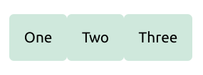
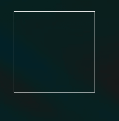
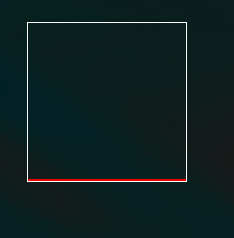

# CSS

## 布局

### Flex

> 专门设计出来用于创建横向或是纵向的一维页面布局

**使用**

在想要进行 flex 布局的父元素上应用`display: flex` ，所有直接子元素都将会按照 flex 进行布局：

* 所有子元素排成一行，因为父元素上`flex-direction`的默认值是`row`。
* 它们全都被拉伸至和最高的元素高度相同，是因为父元素上`align-items`属性的初值是`stretch`。这就意味着所有的子元素都会被拉伸到它们的 flex 容器的高度，在这个案例里就是所有 flex 项中最高的一项。
* 所有项目都从容器的开始位置进行排列，排列成一行后，在尾部留下一片空白。

```css
.wrapper {
  display: flex;
}
```

```html
<div class="wrapper">
  <div class="box1">One</div>
  <div class="box2">Two</div>
  <div class="box3">Three</div>
</div>
```



…

---

## 动画

动画包括两个部分：描述**动画的样式规则**和用于指定动画开始、结束以及中间点样式的**关键帧**。

### 配置动画

需要使用 [`animation`](https://developer.mozilla.org/zh-CN/docs/Web/CSS/animation) 属性或其子属性，该属性允许配置动画时间、时长以及其他动画细节，但该属性不能配置动画的实际表现，动画的实际表现是由 [`@keyframes`](https://developer.mozilla.org/zh-CN/docs/Web/CSS/@keyframes) 规则实现。

先了解下面几个属性：

* `animation-name` 动画名
* `animation-duration` 动画持续时间
* …

以电池充电为例子。创建两个 div，一个 outer、一个 inner。将 inner 的初始高度设置为 0，通过不断增加 inner 的高度同时改变 inner 的背景达到充电效果。

> 我太机智了👍

…

```tsx
<div id={'cssAnimation'}>
  <div id={'outer'}>
    <div id={'inner'}></div>
  </div>
</div>
```

```scss
#cssAnimation {
  width: 100%;
  color: white;
  display: flex;
  justify-content: center;
  align-items: center;
}

#outer {
  width: 200px;
  height: 200px;
  border: 1px solid white;
}

#inner {
  width: 100%;
  
  animation-name: upscale; // 设置动画名
  animation-duration: 3s; // 动画持续时间
}

@keyframes upscale {
  0% {
    height: 0;
    background-color: red;
  }
  
  50% {
    height: 50%; // 不断增加 inner 的高
    background-color: orange; // 同时改变背景颜色
  }
  
  100% {
    height: 100%;
    background-color: green;
  }
}
```

现在查看一下动画效果



动画动起来了，和我们的想法基本一致。但是出现了一点状况外的情况：动画倒过来了；并且动画显得不够流畅，进行到中间的时候变慢了；动画的最终状态被清空了。

**问题一**：动画倒过来了。

问题不大，将最外层的 div 倒转 180°，动画不就向上增长了吗？

> 我真棒😊

```scss
#outer {
  // ...
  transform: rotate(180deg); // div 倒转 180° 动画才会向上，否则表现为向下
}
```

**问题二**：动画不够流畅。

可以使用 CSS 动画的 `animation-timing-function` 属性。

> 设置动画速度，即通过建立加速度曲线，设置动画在关键帧之间是如何变化。[官方文档](https://developer.mozilla.org/zh-CN/docs/Web/CSS/animation-timing-function)

```scss
#inner {
  // ...
  animation-timing-function: linear; // 动画加速方法，使用线性动画
}
```

**问题三**：最终状态未被保存。

可以使用 CSS 动画的 `animation-fill-mode` 属性。

> 置 CSS 动画在执行之前和之后如何将样式应用于其目标。[官方文档](https://developer.mozilla.org/zh-CN/docs/Web/CSS/animation-fill-mode)

```scss
#inner {
  // ...
  animation-fill-mode: forwards; // 保留动画最后的状态
}
```

…

再来观察一下结果



现在的结果跟我们的要求相差不多了。

如果想要让动画重复，可以使用 `animation-iteration-count` 属性，设置动画序列在停止前应播放的次数。设置为 infinite 表示无限重复。

如果想要让动画在某个地方停止，比如在 80% 的地方停止，可以将 `animation-iteration-count` 设置为 0.8，动画不完全播放即可达到要求。

…

最终版本

```scss
#cssAnimation {
  width: 100%;
  color: white;
  display: flex;
  justify-content: center;
  align-items: center;
}

#outer {
  width: 200px;
  height: 200px;
  border: 1px solid white;
  transform: rotate(180deg); // div 倒转 180° 动画才会向上，否则表现为向下
}

#inner {
  width: 100%;
  
  animation-name: upscale; // 设置动画名
  animation-duration: 3s; // 动画持续时间
  animation-timing-function: linear; // 动画加速方法
  animation-fill-mode: forwards; // 保留动画最后的状态
  // animation-iteration-count: infinite; // 无限重复播放
  animation-iteration-count: 0.8; // 动画会在 80% 的地方停下来
}

@keyframes upscale {
  0% {
    height: 0;
    background-color: red;
  }
  
  50% {
    height: 50%;
    background-color: orange;
  }
  
  100% {
    height: 100%;
    background-color: green;
  }
}
```

…

---

## 参考

**CSS 动画**

* https://developer.mozilla.org/zh-CN/docs/Web/CSS/CSS_animations/Using_CSS_animations
