# ActiveMQ


## 关于MQ

### MQ的定义

面向消息的中间件（Message-Oriented Middleware，MOM），能够很好的解决微服务架构下产生的各个服务之间发送信息同步等待、相互调用产生的耦合、以及高峰时期产生的流量洪峰等问题

MQ利用高效可靠的消息传递机制与平台无关的数据交流，并基于数据通信来进行分布式系统的集成。通过提供消息传递和消息排队模型在分布式环境下提供应用解耦，弹性伸缩，荣誉存储，流量削峰，异步通信，数据同步等功能。


### MQ的作用

1. **异步**，调用者无需等待
2. **解耦**，解决了系统直接拿耦合调用的问题
3. **削峰**，抵御了洪峰流量，保护主业务


### MQ的特点

1. 采用异步处理模式

   - 消息发送者可以发送一个消息而无需等待响应。消息发送者将消息发送到一个**主题或者队列**上
   - 消息接收者则订阅或者监听该主题/队列，一条消息可能最终转发给一个或者多个消息接收者。这些消息接收者都无需对消息发送者做出同步回应，整个过程都是异步的

2. 应用系统之间解耦

   - 消息发送者和接收者不必了解对方，只需要确认消息
   - 发送者和接收者不必同时在线

3. 整体架构

   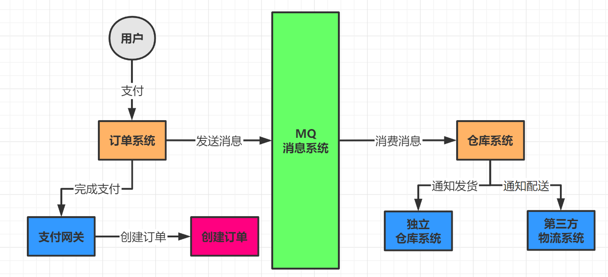

4. MQ缺点

   两个系统之间**不能同步调用**，**不能实时回复**，**不能响应某个调用的回复**


## MQ启动

1. Docker容器方式启动

   ```shell
   # 将启动日志挂载出来，8161为访问界面端口，61616为消息发送接收端口
   docker run --name activemq-test -itd -p 8161:8161 -p 61616:61616 -v /MQ安装目录/data:/usr/local/activemq/data
   ```

2. Linux启动

   ```shell
   # 将启动日志挂载出来
   ./activemq start > /usr/local/activemq/data
   ```


## MQ使用


### Destination

> 目的地，即消息发往的地方，分别有Queue消息（队列，一对一）和Topic消息（主题，一对多）

**两种Destination对比**

|            | Queue                                                        | Topic                                                        |
| ---------- | ------------------------------------------------------------ | ------------------------------------------------------------ |
| 工作模式   | 负载均衡模式，如果当前没有消费者，消息也不会丢弃；如果有多个消费者，一条消息也只会发送给其中一个消费者，并且要求消费者返回应答（ack） | 订阅发布模式，如果当前没有订阅者，消息将会倍丢弃，如果有多个消费者，这些订阅者都会受到消息 |
| 有无状态   | Queue数据默认会在MQ服务器上以文件形式保存，ActiveMQ一般保存在`$ActiveMQ_HOME/data/kr_store/data`目录下，也可配置生数据库存储 | 无状态                                                       |
| 传递完整性 | 消息不会丢弃                                                 | 如果没有订阅者，消息将会被丢弃                               |
| 处理效率   | 由于一条消息只发送给一个消费者，所以消费者再多，性能也不会有明显降低。当然不同消息协议自身的性能也是有差异的 | 由于消息要按照订阅者数量进行复制，所以处理性能会随着订阅者的增加而明显降低，并且还要加上不同消息协议自身的性能差异 |


### Queue消息

**导入依赖**

```xml
<dependency>
    <groupId>org.apache.activemq</groupId>
    <artifactId>activemq-all</artifactId>
    <version>5.16.1</version>
</dependency>
```


#### 生产者

```java
/**
 * JmsProducer
 * @author gnl
 */

public class JmsProducer {

    // ACTIVEMQ_URL
    private final static String ACTIVEMQ_URL = "tcp://localhost:61616";

    // QUEUE_NAME
    private final static String QUEUE_NAME = "queue_jms";

    public static void main(String[] args) throws JMSException {

        // 1. 按照给定的url创建连接工厂，默认用户名和密码都为admin，可使用其它构造方法自定义用户名和密码
        ActiveMQConnectionFactory mqConnectionFactory = new ActiveMQConnectionFactory(ACTIVEMQ_URL);

        // 2. 通过连接工厂，获取连接，并开启访问
        Connection connection = mqConnectionFactory.createConnection();
        connection.start();

        /**
         * 3. 创建会话
         * @param transacted 是否开启事务
         * @param acknowledgeMode 消息签收方式
         *
         * @author gnl
         */
        Session session = connection.createSession(false, Session.AUTO_ACKNOWLEDGE);

        // 4. 创建目的地（Destination）。目的地有两种：主题（Topic）和队列（Queue），Destination是Topic和Queue的父类
        Queue queue = session.createQueue(QUEUE_NAME);

        // 5. 创建消息的生产者
        MessageProducer producer = session.createProducer(queue);

        TextMessage textMessage = null;
        for (int i = 1; i <= 5; i++) {

            // 7. 创建消息
            textMessage = session.createTextMessage("msg from producer -- " + i);

            // 8. 发送消息
            producer.send(textMessage);
        }

        // 9. 关闭资源
        producer.close();
        session.close();
        connection.close();

        System.out.println("=== 消息发送完毕 ===");

    }
}

```

执行完毕后，查看ActiveMQ界面

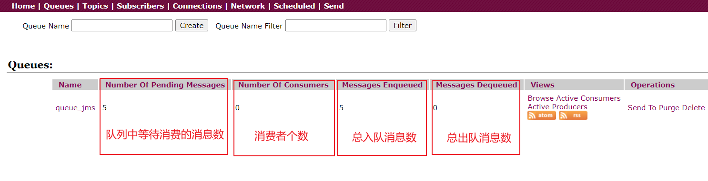


#### 消费者

1. **同步阻塞消费者**

   ```java
   /**
    * JmsConsumer 同步阻塞消费者
    * @author gnl
    */
   
   public class JmsConsumer {
   
       private final static String ACTIVEMQ_URL = "tcp://localhost:61616";
   
       private final static String QUEUE_NAME = "queue_jms";
   
       public static void main(String[] args) throws JMSException {
           ActiveMQConnectionFactory mqConnectionFactory = new ActiveMQConnectionFactory(ACTIVEMQ_URL);
   
           Connection connection = mqConnectionFactory.createConnection();
           connection.start();
   
           Session session = connection.createSession(false, Session.AUTO_ACKNOWLEDGE);
           Queue queue = session.createQueue(QUEUE_NAME);
   
           // 创建消费者
           MessageConsumer consumer = session.createConsumer(queue);
   
           while (true) {
   
               /**
                * receive() 方法一直等待接收消息，在能够接收到消息之前将一直阻塞，是同步阻塞方法。
                * receive(timeout) 方法等到指定毫秒后还没接收到消息就结束阻塞
                * TextMessage 因为消息的消息类型是TextMessage，所以还需要用TextMessage来接收消息
                */
               TextMessage message = (TextMessage) consumer.receive();
               // TextMessage message = (TextMessage) consumer.receive(5000);
   
               if ( null != message) {
                   System.out.println("consumer received ===> " + message.getText());
               } else {
                   break;
               }
   
           }
           consumer.close();
           session.close();
           connection.close();
       }
   }
   ```

   

2. **异步非阻塞消费者**

   ```java
   /**
    * JmsAsyncConsumer 异步非阻塞消费者
    * @author gnl
    */
   
   public class JmsAsyncConsumer {
   
       private final static String ACTIVEMQ_URL = "tcp://localhost:61616";
   
       private final static String QUEUE_NAME = "queue_jms";
   
       public static void main(String[] args) throws JMSException, IOException {
   
           ActiveMQConnectionFactory mqConnectionFactory = new ActiveMQConnectionFactory(ACTIVEMQ_URL);
   
           Connection connection = mqConnectionFactory.createConnection();
           connection.start();
   
           Session session = connection.createSession(false, Session.AUTO_ACKNOWLEDGE);
           Queue queue = session.createQueue(QUEUE_NAME);
           MessageConsumer consumer = session.createConsumer(queue);
   
           /**
            * 注册一个监听器，当有消息发送来时，系统自动调用MessageListener的onMessage() 方法处理消息
            */
           consumer.setMessageListener(message -> {
               if (null != message && message instanceof TextMessage) {
                   TextMessage textMessage = (TextMessage) message;
                   try {
                       System.out.println("async consumer received ===> " + textMessage.getText());
                   } catch (JMSException e) {
                       e.printStackTrace();
                   }
               }
           });
   
           // 让主线程不要结束，一直接收消息
           System.in.read();
   
           consumer.close();
           session.close();
           connection.close();
       }
   }
   ```

   

#### 队列消息总结

**消费方式**

1. 同步阻塞方式（receive）

   接收者使用`MessageConsumer`的`receive()`方法来接收消息，`receive()`方法能在接收到消息之前或超时之前一直处于阻塞状态

2. 异步非阻塞方式（监听器）

   接收者通过`MessageConsumer`的`setMessageListener()`方法注册一个消息监听器，当消息到达之后，系统会自动调用监听器的`onMessage()`方法


**队列特点**

1. 每条消息==只能有一个消费者==
2. 消息的生产者和消费者之间==没有时间上的相关性==。无论消费者在生产者发送消息的时候是否处于运行状态，消费者都可以消费消息。
3. 消息被消费后队列中不会再存储，所以消费者==不会消费到已经被消费掉的消息==


**消息消费情况**

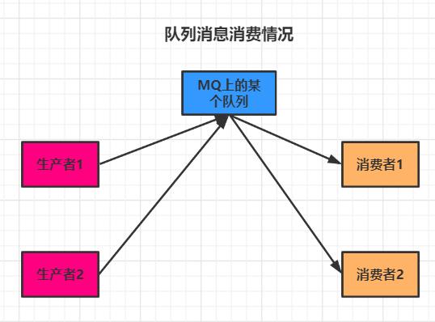

1. 生产者发布消息，只启动消费者1。消费者1会消费所有消息
2. 生产者发布消息，先启动消费者1，再启动消费者2。消费者1会消费所有消息，消费者2不会消费到任何消息
3. 先启动消费者1和消费者2，发布者发布6条消息。消费者1和2分别消费3条消息


### Topic消息

**特点**

- 生产者先将消息发布到`topic`中，==每个消息有多个消费者==，消息与消费者成一对多的关系
- ==生产者和消费者之间有时间上的相关性==。订阅某一个主题的消费者==只能消费从它订阅之后发布的消息==
- 生产者生产时，`topic`无状态，不保存消息，假如没有消费者订阅就去生产，那么该消息就是一条废消息。所以，一般==先启动消费者再启动生产者==
- 特别的，JMS规范允许生产者创建持久订阅，即允许消费者消费主题中它未订阅之前的消息，这在一定程度上放松了时间上的相关性要求


#### 生产者

```java
public class JmsTopicProducer {

    private final static String ACTIVEMQ_URL = "tcp://localhost:61616";
    private final static String TOPIC_NAME = "topic_jms";

    public static void main(String[] args) throws JMSException {

        ActiveMQConnectionFactory mqConnectionFactory = new ActiveMQConnectionFactory(ACTIVEMQ_URL);

        Connection connection = mqConnectionFactory.createConnection();
        connection.start();

        Session session = connection.createSession(false, Session.AUTO_ACKNOWLEDGE);

        // 创建主题
        Topic topic = session.createTopic(TOPIC_NAME);

        // 创建消息的生产者
        MessageProducer producer = session.createProducer(topic);

        TextMessage textMessage = null;
        for (int i = 1; i <= 5; i++) {

            textMessage = session.createTextMessage("msg from producer -- " + i);
            producer.send(textMessage);
        }

        producer.close();
        session.close();
        connection.close();

        System.out.println("=== 消息发布完毕 ===");

    }
}
```

执行完毕后，界面显示结果

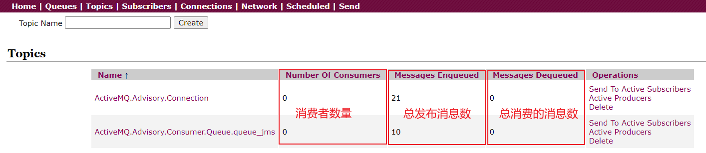


#### 消费者

```java
/**
 * JmsAsyncTopicConsumer 异步非阻塞消费者
 * @author gnl
 */

public class JmsAsyncTopicConsumer {

    private final static String ACTIVEMQ_URL = "tcp://localhost:61616";

    private final static String TOPIC_NAME = "topic_jms";

    public static void main(String[] args) throws JMSException, IOException {

        ActiveMQConnectionFactory mqConnectionFactory = new ActiveMQConnectionFactory(ACTIVEMQ_URL);

        Connection connection = mqConnectionFactory.createConnection();
        connection.start();

        Session session = connection.createSession(false, Session.AUTO_ACKNOWLEDGE);

        // 创建主题
        Topic topic = session.createTopic(TOPIC_NAME);
        // 创建接收主题消息的消费者
        MessageConsumer consumer = session.createConsumer(topic);

        consumer.setMessageListener(message -> {
            if (null != message && message instanceof TextMessage) {
                TextMessage textMessage = (TextMessage) message;
                try {
                    System.out.println("async consumer111 received ===> " + textMessage.getText());
                } catch (JMSException e) {
                    e.printStackTrace();
                }
            }
        });

        System.in.read();

        consumer.close();
        session.close();
        connection.close();
    }
}
```


## JMS规范


### JMS是什么

Java消息服务（Java Message Service），指的是**两个Java应用程序之间进行异步通信的API**，它为标准协议和消息服务提供了一组通用的接口，包括消息的创建、发送、读取等，用于支持Java应用程序开发。在JavaEE中，当两个应用程序使用JMS进行通信时，它们之间不是直接相连的，而是通过一个共同的消息收发服务组件关联起来，以达到异步、解耦、削峰的效果。


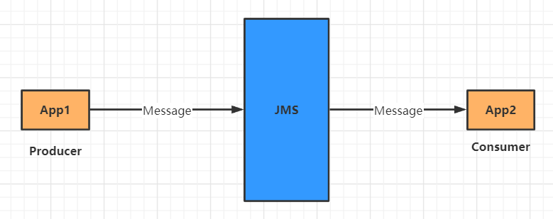


### JMS组成结构

- JMS Provider，实现JMS接口和规范的消息中间件，也就是所说的MQ服务器
- JMS Producer，消息生产者，创建和发送JMS消息的的客户端应用
- JMS Consumer，消息消费者，接收和处理JMS消息的客户端应用
- JMS Message，JMS消息
  - 消息头
  - 消息属性
  - 消息体


**消息头**

```java
// 设置消息头的各种属性

// 可在消息头中指定每一条消息的目的地
textMessage.setJMSDestination(topic);

// 消息的持久化模式
// DeliveryMode.NON_PERSISTENT
// DeliveryMode.PERSISTENT
textMessage.setJMSDeliveryMode(0);

// 设置消息过期时间，默认为永不过期
// 过期时间 = send() 方法中的timeToLive + 发送时刻的GMT时间值
// 如果消息在发送过程中过期，则该消息将会被清除
textMessage.setJMSExpiration(5000);

// 设置消息优先级。0-9总共10个级别，0-4为普通消息，5-9为加急消息。默认是4级
// JMS不要求MQ严格按照这10个优先级发送消息，但必须保证加急消息要优于普通消息
textMessage.setJMSPriority(5);

// 为消息设置唯一标识，MQ会默认生成，也可以自定义
textMessage.setJMSMessageID("AAAAA");

// 消息头中的属性也可在send()方法中设置
```


**消息体**

> 封装具体数据消息，有5种消息体格式


消息格式

1. `TextMessage`，普通字符串消息
2. `MapMessage`，一个`Map`类型的消息，key为`String`类型，value为Java的基本类型
3. `BytesMessage`，二进制数组消息，包含一个`byte[]`
4. `StreamMessage`，Java数据流消息，用标准流操作来顺序的填充和读取
5. `ObjectMessage`，对象消息，包含一个可序列化的Java对象


**消息属性**

> 识别、去重、重点标注


```java
// 设置消息属性
textMessage.setStringProperty("key", "values");

// 获取消息属性
textMessage.getStringProperty("key");
```


### 消息的持久化

> 保证消息只被传送一次和成功使用一次。在持久性消息传送至目标时，消息服务将其放入持久性数据存储。如果消息服务由于某种原因导致失败，它可以恢复此消息并将此消息传送至相应的消费者。虽然增加了消息传送的开销，但也增加了可靠性


#### Queue消息

- 持久化，当服务器宕机，消息依然存在。**queue消息默认是持久化的**

  ```java
  // 将queue消息设置为持久化
  producer.setDeliveryMode(DeliveryMode.PERSISTENT);
  ```

- 非持久化，当服务器宕机，消息就会丢失

  ```java
  // 将queue消息设置为非持久化
  producer.setDeliveryMode(DeliveryMode.NON_PERSISTENT);
  ```


#### Topic消息

- 持久化，只要消费者向MQ服务器注册过后，不管是服务器宕机或是消费者不在线，生产者生产的消息都能被消费者消费

  1. 需要注意的是，使用发布订阅模式时，必须要先运行一遍消费者，向MQ注册，订阅某个topic
  2. 然后再运行消息生产者发送消息
  3. 之后无论消费者是否在线，都会收到生产者生产的消息。若是不在线，消费者会在下次连接的时候，把所有的消息都接收过来

  ```java
  public class TopicProducer {
      public static void main(String[] agrs) {
          // 将topic消息设置为持久化
          producer.setDeliveryMode(DeliveryMode.PERSISTENT);
          // 设置持久化之后再启动连接
          connection.start();
      }
  }
  
  public class TopicConsumer {
      public static void main(String[] agrs) {
          // 设置客户端ID，向MQ服务器注册ID
          connection.setClientID("gnl-pers-client");
          
          /**
           * 创建一个topic订阅者对象
           * @param topic 要订阅的topic
           * @param name 订阅者名
           * @author gnl
           */
          TopicSubscriber subscriber = session.createDurableSubscriber(topic, "topic-subscriber");
  
          // 开启连接
          connection.start();
  
          /**
           * receive() 方法一直等待接收消息，在能够接收到消息之前将一直阻塞，是同步阻塞方法。
           * receive(timeout) 方法等到指定毫秒后还没接收到消息就结束阻塞
           * TextMessage 因为消息的消息类型是TextMessage，所以还需要用TextMessage来接收消息
           */
          Message message = subscriber.receive();
  
          while ( null != message) {
              TextMessage textMessage = (TextMessage) message;
              System.out.println("topic consumer received ===> " + textMessage.getText());
  
              // 等待接收消息
              message = subscriber.receive();
          }
      }
  }
  ```

  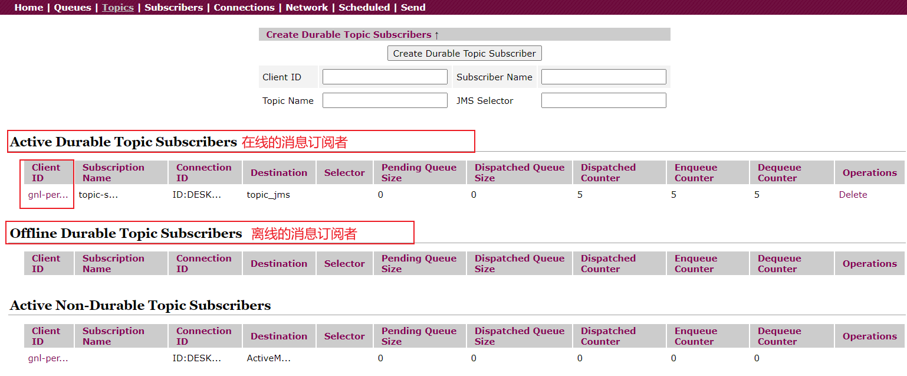

- 非持久化，**topic消息默认非持久化**。由于使用发布订阅机制，生产者生产消息时，消费者也要在线，这样消费者才能接收到消息


### 消息的事务性

> 事务偏向生产者。生产者和消费者的事务完全没有关联，各自分别管理自己的事务


#### 生产者

**细节**

1. 生产者开启事务之后，执行`commit()`方法完成，消息才算发送成功。`commit()`方法执行失败或者不执行，消息就不会提交到队列/主题中。
2. 生产者执行`rollback()`方法，之前发送到队列/主题中的消息都会回滚
3. ==生产者的事务机制，要高于签收机制，当生产者开启事务，签收机制不再重要==


```java
// 1. 开启事务，将 transacted 设为true
Session session = connection.createSession(true, Session.AUTO_ACKNOWLEDGE);

Queue queue = session.createQueue(ACTIVEMQ_QUEUE_NAME);

MessageProducer producer = session.createProducer(queue);

try {
    for (int i = 1; i <= 3; i++) {

        TextMessage message = session.createTextMessage("producer send tx msg --- " + i);

        producer.send(message);
    }
    System.out.println("producer 发送");

    // 2. 提交事务，消息才会被真正发送
    session.commit();

} catch (JMSException e) {
    System.out.println(e.getMessage());

    // 3. 出现异常回滚
    session.rollback();

} finally {

    // 4. 关闭资源
    producer.close();
    session.close();
    connection.close();

}
```


#### 消费者

**细节**

1. 消费者开启事务后，执行`commit()`方法，消息才算真正的被消费，不执行`commit()`方法，即使是消费过的消息也不会标记已消费，下次还会被消费
2. 执行`rollback()`方法，是==不能回滚之前执行过的业务逻辑，但是能回滚之前消费过的消息。回滚后的消息，下次还会被消费==
3. 消费者利用`commit()`和`rollback()`方法，甚至能违反一个消费者只能消费一次消息的原则


```java
// 1. 开启事务
Session session = connection.createSession(true, Session.AUTO_ACKNOWLEDGE);

Queue queue = session.createQueue(ACTIVEMQ_QUEUE_NAME);

MessageConsumer consumer = session.createConsumer(queue);

consumer.setMessageListener((message) -> {

    if (message instanceof TextMessage) {

        try {

            TextMessage textMessage = (TextMessage) message;

            System.out.println("consumer receive tx msg --- " + textMessage.getText());

            // 2. 出现异常，消息消费失败，会重复消费
            // int i = 10/0;

            // 2. 消费者成功执行commit() 方法才算事务消息消费成功。否则会一直重复消费该消息
            session.commit();

        } catch (JMSException e) {
            System.out.println("出现异常，rollback。。。");

            try {
                session.rollback();
            } catch (JMSException jmsException) {
                jmsException.printStackTrace();
            }

        }

    }

});
```


### 消息的签收机制


#### 签收方式

1. 自动签收（`Session.AUTO_ACKNOWLEDGE`），默认签收方式，会自动签收消息
2. 手动签收（`Session.CLIENT_ACKNOWLEDGE`），需要手动调用`Message.acknowledge()`来签收消息。如果不签收消息，该消息会被反复消费，直到被签收
3. 允许重复签收（`Session.DUPS_OK_ACKNOWLEDGE`），多线程或多个消费者同时消费同一条消息，因为线程不安全，可能会重复消费
4. 事务签收（`Session.SESSION_TRANSACTED`），开启事务的情况下，可以使用此种方式签收。


#### 事务和签收的关系

1. 事务优先于签收，开启事务后，签收机制不再起任何作用
2. 非事务性会话中，消息何时被确认取决于创建会话时的签收机制
3. 生产者开启事务，只有在消费者的`commit()`方法执行之后，才能将全部消息变为已消费
4. ==事务偏向生产者，签收偏向消费者==。即生产者使用事务更好点，而消费者使用签收机制更好点


```java
// Consumer

// 1. 修改签收机制
Session session = connection.createSession(false, Session.CLIENT_ACKNOWLEDGE);

Queue queue = session.createQueue(ACTIVEMQ_QUEUE_NAME);

MessageConsumer consumer = session.createConsumer(queue);

consumer.setMessageListener((message) -> {

    if (message instanceof TextMessage) {

        try {

            TextMessage textMessage = (TextMessage) message;

            System.out.println("consumer receive tx msg --- " + textMessage.getText());

            // 2. 手动签收消息，只有将消息标记为已签收，该消息才算消费完成，才不会重复消费
            textMessage.acknowledge();

        } catch (JMSException e) {
            System.out.println("出现异常");
        }

    }

});
```


### JMS总结

**点对点**

- 点对点模型**基于队列**，生产者发送消息到队列，消费者从队列接收消息，队列的存在使得消息的**异步传输**成为可能。
- 如果Session关闭时，有部分消息已被接收但是还未被签收，则消费者下一次连接到相同的队列时，还会重复消费这些消息，知道它们被签收
- 队列可以长久的保存消息，直到消费者收到消息。消费者不需要为了接收消息而时刻保持激活状态，充分体现了余部传输模式的优势


**发布订阅**

- 发布订阅模型定义了如何向一个内容节点发布和订阅消息。这些节点被称作Topic
- Topic可以认为是**消息传输的中介**，发布者发布消息到主题上，订阅者从主题订阅消息。主题将发布者和订阅者解耦，不需要接触即可保证消息的传送
- 订阅模式
  1. **持久订阅**，只有当客户端处于激活状态，即和MQ保持连接状态才能接收到某个主题的消息。如果消费者处于离线状态，生产者发送的消息将会丢失而作废，消费者永远不会收到。也就是说，先订阅注册才能接收到发布的消息，只给订阅者分发消息
  2. **非持久订阅**，客户端首先向MQ注册一个自己的身份ID，当这个客户端处于离线状态时，生产者会为这个ID保存所有发送到主题的消息，当客户端再次连接上MQ的时候，会根据消费者的ID得到所有处于离线状态时发送到主题的消息
  3. 订阅模式如何选择？==当所有消息必须被接收，则用持久化订阅。当消息丢失额能够被容忍，则采用非持久订阅==


## ActiveMQ的Broker

> 相当于一个MQ服务器实例，将MQ嵌入Java代码中，使用代码的形式启动MQ。了解即可


## 整合Spring Boot

### 生产者

配置文件

```yaml
spring:
  activemq:
    broker-url: tcp://localhost:61616
    user: admin
    password: admin
  jms:
    # false为队列模式，true为发布订阅模式
    pub-sub-domain: false

myactivemq:
  queue: queue_boot_jms
  topic: topic_boot_jms
```

配置类

```java
@Configuration
@EnableJms
public class MQConfig {

    @Value("${myactivemq.queue}")
    private String queueName;
    
    @Value("${myactivemq.topic}")
    private String topicName;

    @Bean
    public ActiveMQQueue queue() {
        return new ActiveMQQueue(queueName);
    }
    
    public Topic topic() {
        return new ActiveMQTopic(topicName);
    }

}
```

生产者

```java
@Component
public class BootProducer {

    @Autowired
    private JmsMessagingTemplate jmsTemplate;

    @Autowired
    private Queue queue;

    public void sendMsg() {
        jmsTemplate.convertAndSend(queue, "msg ===> " + System.currentTimeMillis());
        System.out.println("send msg...");
    }

    @Scheduled(fixedDelay = 2000)
    public void scheduleSend() {
        sendMsg();
    }

}
```

启动类

```java
@EnableScheduling
@SpringBootApplication
public class MainApp {
    public static void main(String[] args) {
        SpringApplication.run(MainApp.class, args);
    }
}
```


### 消费者

消费者

```java
@Component
public class BootConsumer {
    @JmsListener(destination = "${myactivemq.queue}")
    public void receive(TextMessage message) throws JMSException {
        System.out.println("boot-consumer-get-msg ===> " + message.getText());
    }
}
```


## 传输协议


### 支持的协议

**支持的传输协议**

```xml
<!-- active安装目录/conf/activemq.xml -->
<!-- 重点掌握tpc与nio，其他做了解 -->

<transportConnectors>
    <!-- DOS protection, limit concurrent connections to 1000 and frame size to 100MB -->
    <transportConnector name="openwire" uri="tcp://0.0.0.0:61616?maximumConnections=1000&amp;wireFormat.maxFrameSize=104857600"/>
    <transportConnector name="amqp" uri="amqp://0.0.0.0:5672?maximumConnections=1000&amp;wireFormat.maxFrameSize=104857600"/>
    <transportConnector name="stomp" uri="stomp://0.0.0.0:61613?maximumConnections=1000&amp;wireFormat.maxFrameSize=104857600"/>
    <transportConnector name="mqtt" uri="mqtt://0.0.0.0:1883?maximumConnections=1000&amp;wireFormat.maxFrameSize=104857600"/>
    <transportConnector name="ws" uri="ws://0.0.0.0:61614?maximumConnections=1000&amp;wireFormat.maxFrameSize=104857600"/>
    <!-- 上面为官方定义的，还可自行添加nio和auto+nio协议 -->
    <transportConnector name="nio" uri="nio://0.0.0.0:61617?trace=true"/>
    <transportConnector name="auto+nio" uri="auto+nio://0.0.0.0:61618?maximumConnections=1000&amp;wireFormat.maxFrameSize=104857600&amp;org.apache.activemq.transport.nio.SelectorManager.corePoolSize=20&amp;org.apache.activemq.transport.nio.Se1ectorManager.maximumPoo1Size=50"/>
</transportConnectors>
```


**支持的网络协议**

| 协议       | 描述                                                         |
| ---------- | ------------------------------------------------------------ |
| TCP        | ACtiveMQ默认协议，性能比UDP差，可靠                          |
| NIO        | 基于TPC，并进行了扩展和优化，具有更好的扩展性                |
| UDP        | 性能比TCP好，不可靠                                          |
| SSL        | 安全链接                                                     |
| HTTP/HTTPS | 基于HTTP或HTTPS                                              |
| VM         | VM本身不是一种协议，当客户端和代理在同一个Java虚拟机中运行时，它们可以使用VM进行直接通信 |


#### TCP协议

> TCP（Transmission Control Protocol），传输控制协议，activemq默认协议，监听61616端口

**细节**

1. 在网络传输数据前，必须要先序列化数据，通过`Wire Protocol`协议来将消息序列化成字节流

2. TCP连接的URI形式，`tcp://hostname:port?k1=v1&k2=v2`，携带的参数可选

3. TPC优点

   ① 高可靠，稳定，字节流方式传递，高效率

   ② 有效性，可用性，应用广泛，支持任何平台


#### NIO协议

> NIO（New I/O API Protocol），ActiveMQ的传输协议底层默认都是使用BIO网络的IO模型，只有指定使用NIO才会使用NIO的IO模型

**细节**

1. NIO和TCp协议类似，但NIO更测试终于底层的访问操作。允许开发人员对同一资源有更多的客户端调用，以及服务器端有更多的负载

2. NIO连接的URI形式，`nio://hostname:port?k1=v1&k2=v2`

3. 适合使用NIO的场景有

   ① 可能有大量的客户端连接到Broker上，一般情况下，连接Broker的客户端数量会被操作系统的线程数量所限制

   ② 在网络传输比较迟钝的情况下，NIO比TCP具有更好的性能


**使用NIO**

1. 修改`activemq.xml`配置文件

   ```xml
   <!-- 添加nio协议支持 -->
   <transportConnector name="nio" uri="nio://0.0.0.0:61617?trace=true"/>
   ```

   重启ActiveMQ，刷新connections界面，出现nio

   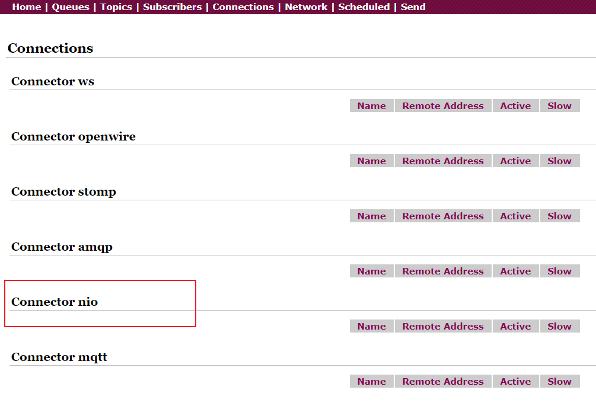

2. 修改代码中使用的协议

   ```java
   private final static String ACTIVEMQ_URL = "nio://localhost:61617";
   ```


**问题**

1. URI以`nio`开头，表示这个端口使用以TCP协议为基础的NIO网络IO模型，但是此种设置方式只有指定的端口支持NIO
2. 上面是Openwire协议底层传输使用NIO网络IO模型，可使用`auto+nio`使得其他协议传输底层也使用NIO网络IO模型


**使用NIO增强**

1. 修改`activemq.xml`配置文件

   ```xml
   <transportConnector name="auto+nio" uri="auto+nio://0.0.0.0:61618?maximumConnections=1000&amp;wireFormat.maxFrameSize=104857600&amp;org.apache.activemq.transport.nio.SelectorManager.corePoolSize=20&amp;org.apache.activemq.transport.nio.Se1ectorManager.maximumPoo1Size=50"/>
   ```

   

2. 修改代码

   ```java
   private final static String ACTIVEMQ_URL = "nio://localhost:61618";
   private final static String ACTIVEMQ_URL = "tcp://localhost:61618";
   ```


#### 其他协议

**AMQP协议**

**STOMP协议**

**MQTT协议**


## 消息存储和持久化

> 与前面Queue和Topic的持久化不同，之前讲的持久化是MQ的外部表现，此处的持久化由外部插件实现


**持久化存储逻辑**

在发送者将消息发送出去后，消息中心==首先将消息存储==到本地数据库问文件、内存数据库或者远程数据库等。==再尝试将消息发送==给接收者，==成功则将消息存储媒介中删除，失败则继续尝试发送==。MQ启动后，要先检查指定的存储位置是否有未成功发送的消息，如果有，则会先把存储位置中的消息发出去


### 存储和持久化方式


#### AMQ Message Store

> 基于为念的存储机制，是以前的默认机制（ActiveMQ 5.3以前的版本），现在不再使用

AMQ是一种文件存储形式。它具有写入速度快和容易恢复的特点。消息存储在一个个文件中，文件的默认大小为32M，当一个文件中的消息已经全部被消费，就将文件标记为可删除，在下一个清楚阶段，标识了可删除的文件将会被删除

[AMQ Message Store](https://activemq.apache.org/amq-message-store)


#### KahaDB

> 从ActiveMQ5.4开始默认使用，基于日志文件


配置文件`activemq.xml`中的配置

```xml
<persistenceAdapter>
    <!-- 日志文件存储目录为 activemq安装目录/data/kahadb/ -->
    <kahaDB directory="${activemq.data}/kahadb"/>
</persistenceAdapter>
```


**细节**

- KahaDB是目前默认的存储方式，可用于任何场景，提高了性能和恢复能力

- 消息存储使用==一个事务日==志和==一个索引文件==来**存储它所有的地址**

- KahaDB是一个专门针对消息持久化的解决方案，它对典型的消息使用模式进行了优化

- 将需要持久化的消息追加到`data logs`中，当不再需要日志文件中的数据的时候，日志文件将会被丢弃

  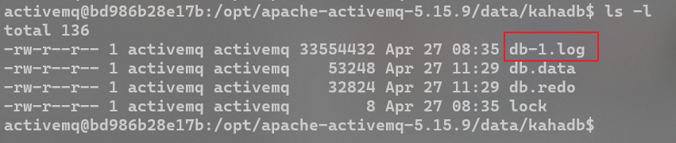


**存储原理**

1. `bd-*.log`，将消息数据存储到预先定义好大小的日志文件中。当文件大小达到预定义，就会创建一个新的文件。当再引用到数据文件中的任何消息时，文件将会被删除或归档
2. `db.data`文件包含了持久化的BTree索引，索引指向存储文件中的消息
3. `db.free`文件记录当前`db.data`文件中哪些页面是空闲的，此文件中的内容是所有空闲页的ID
4. `db.redo`，用来进行消息恢复，如果消息在MQ强制退出时进行存储操作，可用此文件恢复BTree索引
5. `lock`文件锁，表示当前获得KahaDB读写权限的Broker


#### JDBC消息存储

> 将消息存储到数据库中


**步骤**

1. 将MySQL的Java驱动包添加到`activemq安装目录/lib`

   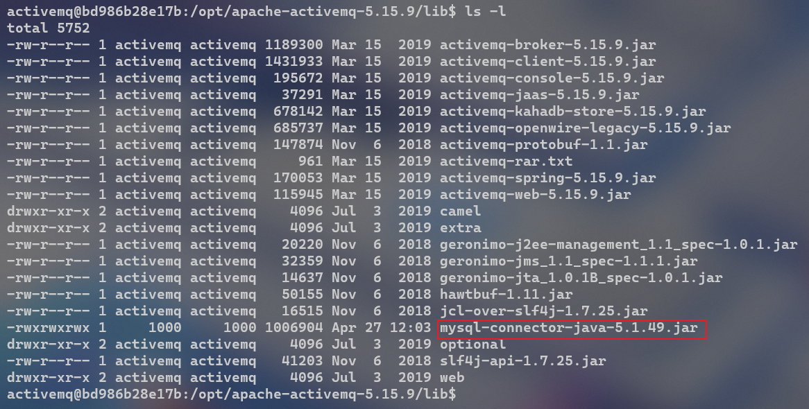

2. 将数据连接池相关`jar`包放到`activemq安装目录/lib`，此处使用德鲁伊数据连接池

   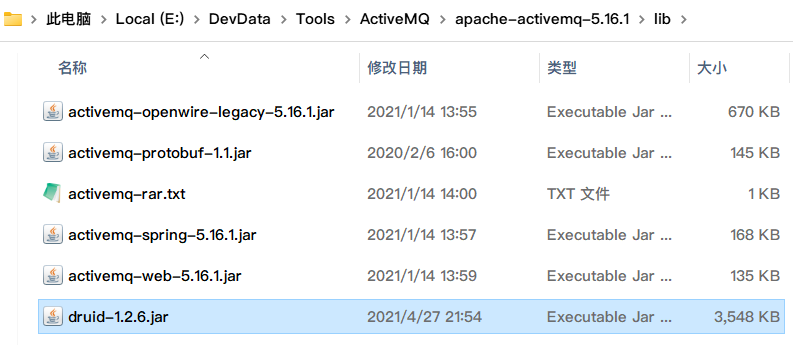

3. 修改`activemq.xml`配置文件

   ```xml
   <persistenceAdapter>
       <!--
   		dataSource：指的是要引用的持久化数据库的bean名称
   		createTableOnStartup：是否要在启动的时候创建数据表。一般是第一次启动时设置为true，后面设置为false
   
   	-->
   	<jdbcPersistenceAdapter dataSource="#activemq-ds" createTableOnStartup="true"/> 
   </persistenceAdapter>
   ```

4. 配置数据库连接参数，将数据库连接配置添加到`activemq.xml`文件中<broker>标签后面

   ```xml
   <bean id="activemq-ds" class="com.alibaba.druid.pool.DruidDataSource" destroy-method="close">
       <property name="driverClassName" value="com.mysql.jdbc.Driver"/>
       <property name="url" value="jdbc:mysql:///activemq_db?useSSL=false&relaxAutoCommit=true"/>
       <property name="username" value="root"/>
       <property name="password" value="root"/>
       <property name="poolPreparedStatements" value="true"/>
   </bean>
   ```

5. 在MySQL中创建数据库，注意要采用`latin1`或`ASCII`编码

6. 启动成功，数据库中会出现三个表

   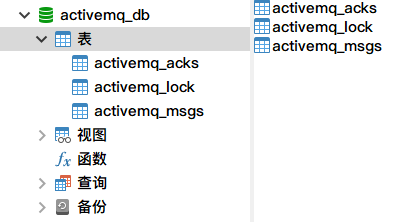

   1. `activemq_acks`，用于存储持久订阅的消息和最后一个持久订阅消息的ID
      - Container，消息的Destination
      - Sub_Dest，如果使用的是Static集群，这个字段就会有集群其他系统的消息
      - Client_Id，每个订阅者都必须有一个唯一的客户端Id用以区分
      - Sub_Name，订阅者名称
      - Selector，选择器，可以选择只消费满足条件的消息，条件可以用自定义的属性实现，可支持多属性AND和OR操作
      - Last_Acked_Id，记录消费过消息的Id
      - Priority，优先级，默认5
      - XID
   2. `activemq_msgs`，消息表
      - Id，自增的数据库主键
      - Container，消息的Destination
      - MsgId_Prod，消息发送者的主键
      - Msg_Seq，消息发送的顺序，MsgId_Prod+Msg_Seq可以组成Jms的MessageId
      - Expiration，消息过期时间，存储的是从1970-1-1到现在的毫秒数
      - Msg，消息本体的Java序列化对象的二进制数据
      - Priority，消息优先级，从0-9，数值越大优先级也越高
   3. `activemq_lock`，用于记录哪个Broker是`Master Broker`。在集群环境中才有用，只有一个Broker可以获得消息，称为`Master Bloke`r，其他的只能作为备份，等待`Master Broker`不可用，才可能成为下一个`Master Broker`

7. 启动生产者，生产消息，消息会存储在数据库的`activemq_msgs`表中

   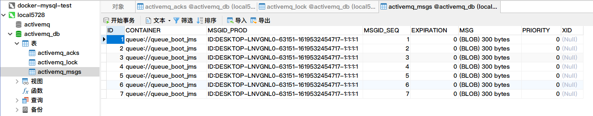

8. 启动消费者消息消费，表中已被消费的消息就会被删除


**利用JDBC持久化存储消息**

1. queue
   - 非持久化模式下，会将未消费的消息存储到==内存==中
   - 持久化模式下，会将未消费的消息存储到==数据库==中
2. topic模式
   - 启动消费者，ACTIVEMQ_ACKS数据表，多了一个Topic消费者的身份信息
   - 启动生产者发送消息，ACTIVEMQ_MSGS数据表新增数据，消费者消费所有的数据后，ACTIVEMQ_MSGS数据表的数据并没有消失，==持久化Topic的消息不管是否被消费，是否有消费者，产生的数据永远都存在==


#### JDBC Message Store With ActiveMQ Journal 


**细节**

- JDBC方式是实时写入MySQL，在使用了journal后，数据会被journal处理，如果在一定时间内journal处理（消费）完了，就不写入MySQL，如果没消费完，就写入MySQL，起到一个缓存的作用
- 为了高性能，这种方式使用日志文件存储+数据库存储。先将消息持久到日志文件，等待一段时间再将未消费的消息持久到数据库。比JDBC性能要高


**配置**

修改`activemq.xml`配置文件

```xml
<!-- 将persistenceAdapter修改为persistenceFactory -->
<persistenceFactory>
	<journalPersistenceAdapterFactory 
	journalLogFiles="4"
	journalLogFileSize="32768"
	useJournal="true"
	useQuickJournal="true"
	dataSource="#activemq-ds"
	dataDirectory="activemq-data"/>         
</persistenceFactory>
```


#### LevelDB消息存储

> 稍后再做补充


#### 持久化存储总结

JDBC效率低，JDBC+Journal效率较高，KahaDB效率高


## 多节点集群

> 稍后再做补充


## 高级特性


### 异步投递

> ActiveMQ支持同步、异步两种消息发送模式，模式的选择对发送延时有巨大的影响。生产者能达到什么样的产出率（产出率=发送数据总量/时间），主要受发送延时的影响，使用异步发送可以显著提高消息发送的性能


**细节**

- ActiveMQ==默认使用异步投递==，除非==明确指定使用同步发送的方式==，或者是==在未使用事务的前提下发送持久化消息==，这两种情况都是同步发送
- 如果没有使用事务，且发送的四持久化的消息，每一次发送都是同步发送的，且会阻塞生产者，直到Broker返回一个确认消息，表示消息已经被安全的持久化到磁盘。确认机制提供了消息安全的保障但同时也会阻塞客户端，带来很大的延时。
- 很多高性能的应用允许在失败的情况下有少量的数据丢失，如果应用满足这个特点，就可以使用异步发送来提高生产率
- 异步投递可以最大化生产者的发送效率，通常在消息发送量较密集的情况下使用异步发送，可以较大的提升生产者的性能
- 异步投递的缺点
  1. 需要消耗较多的客户端内存，同时也会导致Broker端性能消耗增加
  2. 此外，它不能有效确保消息发送成功，在异步投递的情况下，客户端需要容忍消息丢失的可能


**开启异步投递**

1. 在ActiveMQ的URL加上参数

   ```java
   activemq_url = "tcp://localhost:61616?jms.useAsyncSend=true"
   ```

   

2. 在`ConnectionFactory`连接工厂处设置

   ```java
   activemqConnectionFactory.setUseAsyncSend(true);
   ```

   

3. 在`Connection`连接设置

   ```java
   ((activemqConnectionFactory)connection).setUseAsyncSend(true);
   ```


#### 异步回调

> 异步发送可能会造成消息丢失，此时需要接收异步回调，确保消息发送成功。

同步和异步发送的区别在于，同步发送消息等到`send()`不阻塞了说明消息发送成功；异步发送需要接受回调，并由客户端再次判断是否发送成功


**使用**

```java
ActiveMQMessageProducer activemqProducer = (ActiveMQMessageProducer) session.createProducer(queue);

TextMessage textMessage = null;

for (int i = 1; i <= 5; i++) {

    textMessage = session.createTextMessage("msg from producer -- " + i);

    int finalI = i;

    // 发送消息
    activemqProducer.send(textMessage, new AsyncCallback() {

        @Override
        public void onSuccess() {
            // 成功回调方法
            
            System.out.println("消息发送成功 " + finalI);
        }

        @Override
        public void onException(JMSException e) {
            // 失败回调方法
            
            System.out.println("消息发送失败 " + finalI);
        }
    });
}
```


### 延迟投递和定时投递


**使用步骤**

1. 修改配置文件

   ```xml
   <broker xmlns="http://activemq.apache.org/schema/core" brokerName="localhost" dataDirectory="${activemq.data}" schedulerSupport="true" >
       <!-- ...... -->
   </broker>

2. 重启mq

3. 修改代码

   ```java
   // 延迟时间
   long delay = 3*1000;
   
   // 重复投递间隔
   long period = 2*1000;
   
   // 重复投递次数
   int repeat = 3;
   
   for (int i = 1; i <= 5; i++) {
   
       // 创建消息
       textMessage = session.createTextMessage("msg from producer -- " + i);
   
       textMessage.setLongProperty(ScheduledMessage.AMQ_SCHEDULED_DELAY, delay);
       textMessage.setLongProperty(ScheduledMessage.AMQ_SCHEDULED_PERIOD, period);
       textMessage.setIntProperty(ScheduledMessage.AMQ_SCHEDULED_REPEAT, repeat);
   
       // 发送消息
       producer.send(textMessage);
   
   
   }
   
   System.out.println("=== 消息发送完毕 ===");
   ```

   


### 消息消费的重试机制


**消息发送重试**

消费者收到消息，之后出现异常了，没有确认收到该消息，Broker会尝试再将该消息发送给消费者。尝试n次，如果消费者还是没有确认收到该消息，那么该消息将被放到死信队列，之后Broker不会再将该消息发送给消费者


**引起重试的情况**

1. 客户端开启了事务，且调用了`session.rollback()`

2. 客户端开启事务，且在调用`session.commit()`之前关闭事务，或者没有commit

3. 消费者在手动确认的情况下，调用了`session.recover()`

   ```java
   /**
    * Stops message delivery in this session, and restarts message delivery with the oldest unacknowledged message.
    *
    * <p>
    * All consumers deliver messages in a serial order. Acknowledging a received message automatically acknowledges all
    * messages that have been delivered to the client.
    *
    * <p>
    * Restarting a session causes it to take the following actions:
    *
    * <ul>
    * <li>Stop message delivery
    * <li>Mark all messages that might have been delivered but not acknowledged as "redelivered"
    * <li>Restart the delivery sequence including all unacknowledged messages that had been previously delivered.
    * Redelivered messages do not have to be delivered in exactly their original delivery order.
    * </ul>
    *
    * @exception JMSException if the Jakarta Messaging provider fails to stop and restart message delivery due to some internal error.
    * @exception IllegalStateException if the method is called by a transacted session.
    */
   void recover() throws JMSException;
   ```

   

**重发间隔和次数**

间隔1秒，重发6次


**有毒消息Poison ACK**

一个消息被重发超过默认的最大重发次数（6次）时，消费者返回给MQ一个`poison ack`，表示消息是有毒消息，让Broker不要再发送，此时Broker就会把消息放到==死信队列==


**验证**

1. 启动生产者，发送消息
2. 消费者开启事务，不执行`commit()`，接受消息。重启消费者，前6次都能收到消息，第七次不会再收到消息
3. MQ的队列中多出一个队列`AvtiveMQ.DLQ`，即死信队列


**自定义重发策略**

- useCollisionAvoidance，启用防止冲突功能，默认为false
- useExponentialBackOff，启用指数倍递增的方式增加延迟时间，默认为false
- collisionAvoidanceFactor，设置防止冲突范围的正负百分比，只有启用`useCollisionAvoidance`参数时才生效。也就是在延迟时间上再加一个时间波动范围，默认是0.15
- maximumRedeliveries，==最大重传次数==，达到最大重传次数后抛出异常。默认为6次，-1表示不限制次数，0表示不进行重传
- maximumRedeliveryDelay，最大传送延时，只有在`useExponentialBackOff=true`时才有效
- initialRedeliveryDelay，==初始重发延迟时间==，默认1000L，单位ms
- backOffMultiplier，重连时间间隔递增倍数，只有值大于1和启用`useExponentialBackOff`参数时才生效。默认为5
- redeliveryDelay，重发延迟时间，当`initialRedeliveryDelay=0`时生效，默认1000L，单位是ms
- preDispatchCheck，发送前检查

```java
ActiveMQConnectionFactory mqConnectionFactory = new ActiveMQConnectionFactory(ACTIVEMQ_URL);

// 设置重发策略
RedeliveryPolicy redeliveryPolicy = new RedeliveryPolicy();
redeliveryPolicy.setMaximumRedeliveries(8);
redeliveryPolicy.setInitialRedeliveryDelay(3000L);

mqConnectionFactory.setRedeliveryPolicy(redeliveryPolicy);
```


### 死信队列

> 异常消息规避处理的集合，主要处理失败的消息


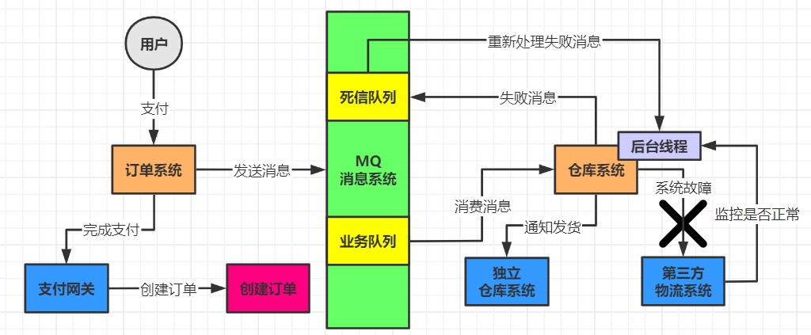


**细节**

- 一般生产环境中在使用MQ的时候设计两个队列，一个是**核心业务队列**，一个是**死信队列**
- 核心业务队列，用来处理系统中的正常业务消息；死信队列用来处理异常情况
- 假如第三方物流系统出故障，此时无法请求，仓库系统每次收到到一条消息，尝试通知发货和配送都会遇到物流系统的接口报错，仓库系统就可以把这条消息==标记失败==，一旦标记这条消息处理失败，MQ就会把这条消息转入提前设置好的死信队列中。第三方物流系统故障期间，所有订单消息全部处理失败，全部都会转入死信队列，此时仓库需要有一个专门的后台线程，监控第三方物流系统是否正常，是否能够正常请求。若是发现恢复正常，这个后台线程就会从死信队列消费处理失败的消息。


**死信队列配置**

> 一般采用默认配置即可

1. 修改队列名
2. 将queue消息和topic消息分别放到不同的死信队列
3. 自动删除过期消息
4. 存放非持久消息到死信队列


### 重复消费和幂等性问题


**保证不被重复消费**

1、给消息设置一个唯一的主键，插入数据库的时候，若是有重复消息，就会导致主键冲突

2、用 Redis 来做消息消费记录，给消息分配唯一的全局 ID，只要消费过该消息，就将其写入 Redis。在下一次消费之前，先查看 Redis 中是否有消费记录


**幂等性问题**

根据消息的 ID 去查看这个消息是否已被消费


