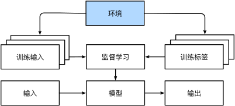
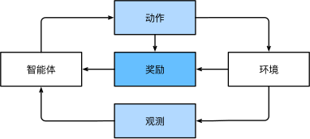

# 深度学习


## 环境安装

### Conda

1、安装并配置好 Python 环境

2、安装 MiniConda/AnaConda

1）下载：`https://mirrors.tuna.tsinghua.edu.cn/anaconda/miniconda/`

2）配置 conda 源 `~/.condarc`

```yaml
show_channel_urls: true
channels:
  - https://mirrors.tuna.tsinghua.edu.cn/anaconda/cloud/pytorch/
  - https://mirrors.tuna.tsinghua.edu.cn/anaconda/cloud/menpo/
  - https://mirrors.tuna.tsinghua.edu.cn/anaconda/cloud/bioconda/
  - https://mirrors.tuna.tsinghua.edu.cn/anaconda/cloud/msys2/
  - http://mirror.tuna.tsinghua.edu.cn/anaconda/pkgs/free/
  - http://mirror.tuna.tsinghua.edu.cn/anaconda/pkgs/main/
  - defaults
```

3）conda 操作

```shell
# 初始化
conda init

# 查看环境
conda env list

# 创建环境
conda create -n test python=3.7

# 切换环境，切换到其他环境必须是在 base 环境下
source activate test

# 安装包
conda install [packge-name]

# 退出环境
conda deactivate test

# 删除环境
conda remove -n test --all
```

3、安装 pytorch：`https://pytorch.org/`

```shell
# 记得去掉 -c pytorch，否则不走自定义镜像地址
conda install pytorch torchvision torchaudio cudatoolkit=11.3
```

4、测试是否支持使用 GPU 进行模型训练（Nvidia GPU软件版本需要高于392）

```python
import torch
torch.cuda.is_available()

// 返回True说明支持
```

5、conda 安装 JupyterNoteBook

```shell
conda install nb_conda
```

6、常用命令

```python
# dir() 输出 torch.cuda 下包含的内容
dir(torch.cuda)
# 
help(torch.cuda.is_available)
```

---

### Jupyter NoteBook

1、安装

```shell
conda install jupyter
```

2、启动

```shell
jupyter notebook
# 后台启动
nohup jupyter notebook &
```

3、访问 `http://127.0.0.1:8888` （一般来说启动之后会自动跳转）


---

## 基本概念

> 传统的机器学 –> 现代的深度学习。
>
> 深度学习关注的功能更为强大的模型，这些模型由神经网络错综复杂的交织在一起，包含层层数据转换，因此被称为*深度学习*（deep learning）。


**传统软件的缺陷/深度学习的应用**

* 自然语言对话
* 预测
* 图像识别
* 推荐系统
* …


**模型训练过程**

1. 从一个随机初始化参数的模型开始，这个模型基本没有“智能”；
2. 获取一些数据样本（例如，音频片段以及对应的是或否标签）；
3. 调整参数，使模型在这些样本中表现得更好；
4. 重复第（2）步和第（3）步，直到模型在任务中的表现令人满意。


---

### 关键组件

* 可以用来学习的*数据*（data）；
* 如何转换数据的*模型*（model）；
* 一个*目标函数*（objective function），用来量化模型的有效性；
* 调整模型参数以优化目标函数的*算法*（algorithm）。


---

### 数据集

数据集中的每个数据样本需要遵循**独立同分布**。

> "独立同分布"是统计学中常用的概念，用于描述随机变量之间的关系。它由两个部分组成：独立性和同分布性。
>
> "独立性"指的是两个或多个随机变量之间的独立关系。如果两个随机变量（或更多）是独立的，那么它们的取值之间没有相互依赖的关系。换句话说，一个随机变量的取值不会提供关于另一个随机变量取值的任何信息。
>
> "同分布性"指的是两个或多个随机变量具有相同的概率分布。换句话说，它们的取值在统计上是从相同的分布中独立地抽取的。

数据样本也被称为*数据点*（data point）或者*数据实例*（data instance）。

通常每个样本由一组称为*特征*（features）或*协变量*（covariates）的属性组成。

当每个样本的特征类别数量都是相同的时候，其特征向量是固定长度的，这个长度被称为数据的*维数*（dimensionality）。 固定长度的特征向量是一个方便的属性，它可以用来量化学习大量样本。

> 一般来说，拥有越多数据的时候，工作就越容易。 更多的数据可以被用来训练出更强大的模型，从而减少对预先设想假设的依赖。 数据集的由小变大为现代深度学习的成功奠定基础。 在没有大数据集的情况下，许多令人兴奋的深度学习模型黯然失色。 就算一些深度学习模型在小数据集上能够工作，但其效能并不比传统方法高。
>
> 但是，仅仅拥有海量的数据是不够的，我们还需要正确的数据。 如果数据中充满了错误，或者如果数据的特征不能预测任务目标，那么模型很可能无效。 “输入的是垃圾，输出的也是垃圾。
>
> 比如：
>
> * 不均衡的数据集
> * 过时的数据集

<br>

可用数据集通常可以分成两部分：训练数据集用于拟合模型参数，测试数据集用于评估拟合的模型。


---

### 模型

如何转换数据的模型，大多数机器学习会涉及到数据的转换。 


---

### 目标函数/损失函数

“机器学习”这里所说的“学习”，是指自主提高模型完成某些任务的效能。

什么才算真正的提高呢？ 

在机器学习中，我们需要定义模型的优劣程度的度量，这个度量在大多数情况是“可优化”的，这被称之为*目标函数*（objective function）。 

我们通常定义一个目标函数，并希望优化它到最低点。 因为越低越好，所以这些函数有时被称为*损失函数*（loss function，或 cost function）。 

> 但这只是一个惯例，我们也可以取一个新的函数，优化到它的最高点。 这两个函数本质上是相同的，只是翻转一下符号。

* 预测任务：最常见的损失函数是*平方误差*（squared error），即预测值与实际值之差的平方。 
* 分类问题：最常见的目标函数是*最小化错误率*，即预测与实际情况不符的样本比例。

 有些目标函数（如平方误差）很容易被优化，有些目标（如错误率）由于不可微性或其他复杂性难以直接优化（ 在这些情况下，通常会优化*替代目标*）。

<br>

通常，损失函数是根据模型参数定义的，并取决于数据集。 

在一个数据集上，我们可以通过*最小化总损失*来学习模型参数的最佳值。 该数据集由一些为训练而收集的样本组成，称为*训练数据集*（training dataset）或称为*训练集*（training set）。

然而，在训练数据上表现良好的模型，并不一定在“新数据集”上有同样的性能，这里的“新数据集”通常称为*测试数据集*（test dataset）或称为*测试集*（test set）。

可用数据集通常可以分成两部分：训练数据集用于拟合模型参数，测试数据集用于评估拟合的模型。 当一个模型在训练集上表现良好，但不能推广到测试集时，这个模型被称为*过拟合*（overfitting）的。 


---

### 优化函数

当我们拥有了数据集，模型和一个合适的损失函数之后，接下来就需要一种算法，它能够搜索出最佳参数，以最小化损失函数。 

深度学习中，大多流行的优化算法通常基于一种基本方法：*梯度下降*（gradient descent）。

简而言之：在每个步骤中，梯度下降法都会检查每个参数，对该参数进行少量变动，看看训练集损失会朝哪个方向移动。 然后，它就在可以减少损失的方向上优化参数。


---

## 机器学习方法

各种机器学习方法包括：

* 监督学习
* 无监督学习
* 互动学习（与环境互动）
* 强化学习


---

### 监督学习

*监督学习*（supervised learning）擅长在“给定输入特征”的情况下预测标签。  每个“特征-标签”对都称为一个*样本*（example）。

举一个具体的例子： 假设我们需要预测患者的心脏病是否会发作，那么观察结果“心脏病发作”或“心脏病没有发作”将是样本的标签。 输入特征可能是生命体征，如心率、舒张压和收缩压等

监督学习之所以能发挥作用，是因为在训练参数时，我们为模型提供了一个数据集，其中每个样本都有真实的标签。 我们希望预测“估计给定输入特征的标签”的条件概率。

使用了监督学习的机器学习应用例子：

* 根据计算机断层扫描（Computed Tomography，CT）肿瘤图像，预测是否为癌症；
* 给出一个英语句子，预测正确的法语翻译；
* 根据本月的财务报告数据，预测下个月股票的价格；

<br>

监督学习的学习过程一般可以分为三大步骤：

1. 从已知大量数据样本中随机选取一个子集，为每个样本获取真实标签。这些样本可能已有标签（例如，患者是否在下一年内康复？）；这些样本也可能需要被人工标记（例如，图像分类）。这些输入和相应的标签一起构成了训练数据集；
2. 选择有监督的学习算法，它将训练数据集作为输入，并输出一个“已完成学习的模型”；
3. 将之前没有见过的样本特征放到这个“已完成学习的模型”中，使用模型的输出作为相应标签的预测。


就算是使用简单的描述给定输入特征的预测标签，监督学习也可以采取多种形式的模型，并且需要大量不同的建模决策，这取决于输入和输出的类型、大小和数量。 


监督学习可以帮助我们解决以下深度学习任务（问题）/或者说利用监督学习方法可以创建以下模型（函数）：

* 回归
* 分类
* 搜索
* 推荐系统
* 序列学习
* 标记问题


---

#### 回归

*回归*（regression）是最简单的监督学习任务之一。 

假设有一组房屋销售数据表格，其中每行对应一个房子，每列对应一个相关的属性，例如房屋的面积、卧室的数量、浴室的数量以及到镇中心的步行距离，等等。每一行的属性构成了一个房子样本的特征向量。

如果一个人住在纽约或旧金山，那么他家的特征向量（房屋面积，卧室数量，浴室数量，步行到市中心的时间）可能类似于： [600,1,1,60]。 如果一个人住在匹兹堡，这个特征向量可能更接近 [3000,4,3,10]。

当人们在市场上寻找新房子时，可能需要估计一栋房子的公平市场价值。

为什么这个任务可以归类为回归问题呢？

本质上是输出决定的。 我们通过房子的特征向量（房屋面积，卧室数量，浴室数量，市区距离KM）得到的销售价格（即标签）是一个数值。

当标签取任意数值时，我们称之为*回归*问题。我们需要训练的模型是一个生成模型，根据输入的房子特征向量，输出房子价格，需要使它的预测非常接近实际标签值。

<br>

生活中的许多问题都可归类为回归问题：

* 预测用户对一部电影的评分；
* 预测病人在医院的住院时间；
* 未来一天的降雨量。


---

#### 分类

虽然回归模型可以很好地解决“结果是多少”的问题，但是很多问题并非如此。

例如手写识别功能，应用程序能够自动理解从图像中看到的文本，并将手写字符映射到对应的已知字符之上。这种“哪一个”的问题叫做*分类*（classification）问题。

*分类*问题希望模型能够预测样本属于哪个*类别*（category）正式称为*类*（class）。

例如，手写数字可能有 10 类，标签被设置为数字 0～9。 最简单的分类问题是只有两类，这被称之为*二项分类*（binomial classification）。例如，数据集可能由动物图像组成，标签可能是猫狗`{猫,狗}`两类。

<p style="color: skyblue">回归是训练一个回归函数来输出一个数值； 分类是训练一个分类器来输出预测的类别。</p>

分类问题的常见损失函数被称为*交叉熵*（cross-entropy）。

<br>

然而模型怎么判断得出这种“是”或“不是”的硬分类预测呢？ 

我们可以试着用概率语言来理解模型。 

给定一个样本特征，模型为每个可能的类分配一个概率。比如，之前的猫狗分类例子中，分类器可能会输出图像是猫的概率为 0.9。 0.9 这个数字表达什么意思呢？ 可以这样理解：分类器 90% 确定图像描绘的是一只猫。

当有两个以上的类别时，我们把这个问题称为*多项分类*（multiclass classification）问题。常见的例子包括手写字符识别 `{0,1,2,...9,a,b,c,...}`。

<br>

<p style="color: orangered">最常见的类别不一定是最终用于决策的类别。</p>

比如，我们想要训练一个毒蘑菇检测分类器，根据照片预测蘑菇是否有毒。 

假设输入[毒蘑菇A]，分类器输出包含[毒蘑菇A]的概率是的概率是 0.2。 换句话说，分类器 80% 确定图中的蘑菇不是[毒蘑菇A]。

尽管如此，我们也不会吃它，因为不值得冒 20% 的死亡风险。不确定风险的影响远远大于收益。

因此，我们需要将“预期风险”作为损失函数，即需要将结果的概率乘以与之相关的收益（或伤害）。 在这种情况下，食用蘑菇造成的损失为`0.2×∞+0.8×0=∞`，而丢弃蘑菇的损失为`0.2×0+0.8×1=0.8`。 

<br>

分类可能变得比二项分类、多项分类复杂得多。有些时候人们宁愿错误地分入一个相关的类别，也不愿错误地分入一个遥远的类别，这通常被称为*层次分类*(hierarchical classification)。 

比如动物分类应用，把一只哈士奇误认为金毛犬可能不会太糟糕。 但如果模型将哈士奇与恐龙混淆，就滑稽至极了。 层次结构相关性可能取决于模型的使用者计划如何使用模型。 例如，响尾蛇和乌梢蛇血缘上可能很接近，但如果把响尾蛇误认为是乌梢蛇可能会是致命的。 因为响尾蛇是有毒的，而乌梢蛇是无毒的。


---

#### 搜索

有时，我们不仅仅希望输出一个类别或一个值。在信息检索领域，我们希望对一组项目进行排序。

以网络搜索为例，目标不是简单的“查询（query）-网页（page）”分类，而是在海量搜索结果中找到用户最需要的那部分。搜索结果的排序也十分重要，学习算法需要输出有序的元素子集。

如果要求我们输出字母表中的前5个字母，返回“A、B、C、D、E”和“C、A、B、E、D”是不同的。 即使结果集是相同的，集内的顺序有时却很重要。


---

#### 推荐系统

另一类与搜索和排名相关的问题是*推荐系统*（recommender system），它的目标是向特定用户进行“个性化”推荐。 

例如，对于电影推荐，科幻迷和喜剧爱好者的推荐结果页面可能会有很大不同。类似的应用也会出现在零售产品、音乐和新闻推荐等等。

在某些应用中，客户会提供明确反馈，表达他们对特定产品的喜爱程度。 例如，亚马逊上的产品评级和评论。在其他一些情况下，客户会提供隐性反馈。例如，某用户跳过播放列表中的某些歌曲，这可能说明这些歌曲对此用户不大合适。总的来说，推荐系统会为“给定用户和物品”的匹配性打分，这个“分数”可能是估计的评级或购买的概率。 

由此，对于任何给定的用户，推荐系统都可以检索得分最高的对象集，然后将其推荐给用户。

尽管推荐系统具有巨大的应用价值，但单纯用它作为预测模型仍存在一些缺陷。 首先，我们的数据只包含“审查后的反馈”：用户更倾向于给他们感觉强烈的事物打分。 例如，在五分制电影评分中，会有许多五星级和一星级评分，但三星级却明显很少。 此外，推荐系统有可能形成反馈循环：推荐系统首先会优先推送一个购买量较大（可能被认为更好）的商品，然而目前用户的购买习惯往往是遵循推荐算法，但学习算法并不总是考虑到这一细节，进而更频繁地被推荐。


---

#### 序列学习

以上大多数问题都具有固定大小的输入和产生固定大小的输出。

* 在预测房价的问题中，固定的特征：房屋面积、卧室数量、浴室数量、步行到市中心的时间；
* 图像分类问题中，输入为固定尺寸的图像，输出则为固定数量（有关每一个类别）的预测概率；

在这些情况下，模型只会将输入作为生成输出的“原料”，而不会“记住”输入的具体内容。

如果输入的样本之间没有任何关系，以上模型可能完美无缺。 但是如果输入是连续的，模型可能就需要拥有“记忆”功能。 

比如，我们该如何处理视频片段呢？

在这种情况下，每个视频片段可能由不同数量的帧组成。 通过前一帧的图像，我们可能对后一帧中发生的事情更有把握。语言也是如此，机器翻译的输入和输出都为文字序列。

序列学习需要摄取输入序列或预测输出序列，或两者兼而有之。 具体来说，输入和输出都是可变长度的序列，例如机器翻译和从语音中转录文本。


---

### 无监督学习

到目前为止，所有的例子都与监督学习有关，需要向模型提供巨大数据集：每个样本包含特征和相应标签值。有明确的标签和目标。

相反，给我们一大堆数据，要求用它做一些数据科学研究，却没有对结果有要求。这类数据中不含有“目标”的机器学习问题通常被为*无监督学习*（unsupervised learning） 。


无监督学习可以回答什么样的问题呢？

* *聚类*（clustering）问题：没有标签的情况下，我们是否能给数据分类呢？比如，给定一组照片，我们能把它们分成风景照片、狗、婴儿、猫和山峰的照片吗？
* *主成分分析*（principal component analysis）问题：我们能否找到少量的参数来准确地捕捉数据的线性相关属性？比如，一个球的运动轨迹可以用球的速度、直径和质量来描述。再比如，裁缝们已经开发出了一小部分参数，这些参数相当准确地描述了人体的形状，以适应衣服的需要。
* *因果关系*（causality）和*概率图模型*（probabilistic graphical models）问题：我们能否描述观察到的许多数据的根本原因？例如，如果我们有关于房价、污染、犯罪、地理位置、教育和工资的人口统计数据，我们能否简单地根据经验数据发现它们之间的关系？
* *生成对抗性网络*（generative adversarial networks，GAN）：为我们提供一种合成数据的方法，甚至像图像和音频这样复杂的非结构化数据。潜在的统计机制是检查真实和虚假数据是否相同的测试，它是无监督学习的另一个重要而令人兴奋的领域。


---

### 与环境互动

到目前为止，不管是监督学习还是无监督学习，我们都会预先获取大量数据，然后启动模型，不再与环境交互。 这里所有学习都是在算法与环境断开后进行的，被称为*离线学习*（offline learning）。

对于监督学习，从环境中收集数据的过程类似于



简单的离线学习有它的魅力。 好的一面是，我们可以孤立地进行模式识别，而不必分心于其他问题。 缺点是，解决的问题相当有限。

这时我们可能会期望人工智能不仅能够做出预测，而且能够与真实环境互动。与预测不同，“与真实环境互动”实际上会影响环境。这里的人工智能是“智能代理”，而不仅是“预测模型”。

> 智能代理（Intelligent Agent）是一种能够感知环境、进行决策和执行动作的计算系统。它可以收集来自环境的信息，利用内部的智能算法进行推理和决策，并采取适当的行动以实现既定的目标。智能代理通常是为了解决特定的问题或完成特定任务而设计和构建的，它们可以具备自主性、学习能力和适应性，能够根据环境的变化进行调整和改进。
>
> 预测模型（Prediction Model）用于根据输入的数据和特征进行预测或估计。预测模型的目标是通过对已有数据的学习和分析，构建一个模型来预测未来的结果或估计未知的变量。预测模型可以基于各种算法和技术，例如线性回归、决策树、神经网络等。它们通常用于数据分析、机器学习和预测分析等领域，用于解决数据相关的问题，如分类、回归、聚类等。


---

### 强化学习

在强化学习问题中，智能体/智能代理（agent）在一系列的时间步骤上与环境交互。在每个特定时间点，智能代理从环境接收一些*观察*（observation），并且必须选择一个*动作*（action），然后通过某种机制（有时称为执行器）将其传输回环境，最后智能代理从环境中获得*奖励*（reward）。此后新一轮循环开始，智能代理接收后续观察，并选择后续操作，依此类推。

强化学习的目标是产生一个好的*策略*（policy）。智能代理选择的“动作”受策略控制，即一个从环境观察映射到行动的功能。



强化学习框架的通用性十分强大。我们可以将任何监督学习问题转化为强化学习问题。

假设我们有一个分类问题，可以创建一个强化学习智能体，每个分类对应一个“动作”。然后创建一个环境，该环境给予智能体的奖励。这个奖励与原始监督学习问题的损失函数是一致的。

当然，强化学习还可以解决许多监督学习无法解决的问题。

例如，在监督学习中，我们总是希望输入与正确的标签相关联。但在强化学习中，我们并不假设环境告诉智能体每个观测的最优动作。一般来说，智能体只是得到一些奖励。此外，环境甚至可能不会告诉是哪些行为导致了奖励。

以强化学习在国际象棋的应用为例。唯一真正的奖励信号出现在游戏结束时：当智能体获胜时，智能体可以得到奖励 1；当智能体失败时，智能体将得到奖励 -1。

因此，智能体必须处理*学分分配*（credit assignment）问题：决定哪些行为是值得奖励的，哪些行为是需要惩罚的。 就像一个员工升职一样，这次升职很可能反映了前一年的大量的行动。要想在未来获得更多的晋升，就需要弄清楚这一过程中哪些行为导致了晋升。

<br>

不同类别的强化学习：

* 当环境可被完全观察到时，强化学习问题被称为*马尔可夫决策过程*（markov decision process）；
* 当状态不依赖于之前的操作时，我们称该问题为*上下文赌博机*（contextual bandit problem）；
* 当没有状态，只有一组最初未知回报的可用动作时，这个问题就是经典的*多臂赌博机*（multi-armed bandit problem）。


…

---

## 参考

* [动手学习深度学习](https://zh.d2l.ai)
* [miniconda安装及使用](https://www.cnblogs.com/zhizunbao-monky/p/14052479.html)

* [conda的安装与使用](https://www.jianshu.com/p/edaa744ea47d)